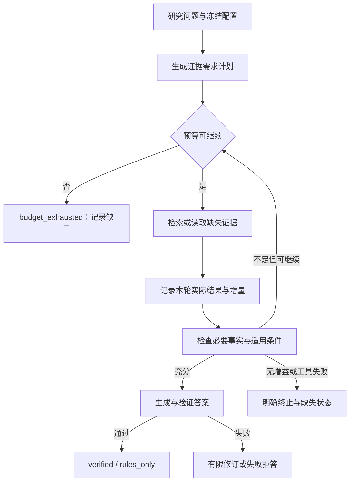

# Agentic 研究与开发计划

*RAG 基线之上的领域 Agent 与轻量 Harness 路线 · status: plan · 2026-10-04；未执行实现与实验*

## 目标与推荐路径

研究问题是：在固定语料、检索器和生成模型下，需求规划、迭代取证与停止判断能否改善证据覆盖及可信回答，其增加的成本是多少？Harness 是支撑这一研究的执行层；多 Agent 数量、工具数量与框架复杂度不作为质量指标。

推荐 **Python 原生执行主线 → 有限迭代取证 → dsh 隔离对照 → 按需要研究 DAG/多 Agent**。原生路线复用现有 EvidenceGraph 的验证节点，避免在研究 Agent 决策时同时更换检索器、答案模型与引用规则。

[模块接入评估](../../Agent/docs/harness-integration-assessment.md) 是当前事实依据；[AGI-Saber](agi-saber-design-study.md) 和 [DeepSeek Harness](deepseek-harness-design-study.md) 是参考设计。完整字段蓝图见 [配置设计](configuration-design.md)。

## Agent / Harness / 算法的归属

| 对象 | 拥有的决定 | 不应承担 |
| --- | --- | --- |
| Agent | requirement 计划、query 生成、证据充分性、继续/停止、claim 修订与拒答 | 索引维护、数值计算实现、通用进程生命周期 |
| Harness | 工具暴露与派发、调用身份、预算、超时/取消、资源收敛、配置冻结与记录 | 凭工具执行成功判断论断被证据支持 |
| Knowledge-Base | 文档/child 身份、检索、版本失效检测、parent 获取 | 最终答案与跨轮领域停止规则 |
| Video-Analysis | 单位/标定/算法参数、轨迹与数值分析、导出 | 由语言模型自由修改固定实验条件 |
| Contracts | 稳定领域结果和引用身份 | 未验证的通用框架类型提前下沉 |
| experiments | 两种运行时的适配组合与研究协议 | 正式模块可复用算法的长期复制 |

角色与能力状态另见 [用例范围图](agentic-usecases.svg)：已有检索和验证、待适配的工具入口、待新增的迭代决策分开标记。

## 阶段与交付门槛

阶段按依赖推进，不以日期或“代码文件已经创建”推定完成。RAG 可以继续独立研发；Agentic 运行只使用某次冻结快照，不自动追随正在改变的索引。

| 阶段 | 具体工作 | 落点（拟定路径） | 可以判为完成的证据 |
| --- | --- | --- | --- |
| P0：基线与输入冻结 | 选定实际 Retrieval/Layer 2 资产；记录 corpus/index/config/dataset/prompt hashes；分开发集与独立评估集 | `experiments/agentic-baseline/` | 来源可解析，无 corpus/Gold 版本错配；同题可获取固定 child 与上下文；未知项有记录 |
| P1：连接现有图 | 实验 LocalEvidenceRetriever 适配器；HybridRetrievalResult → RetrievalBatch；定向证据读取；parent pack 单独记录 | `experiments/agentic-baseline/adapters/` | 固定查询通过现有图；引用/版本/降级不丢失；无证据、失效索引、验证失败分别产生预期 outcome |
| P2：执行基础 | Registry 与 Executor 分开；输入/输出 schema；规范错误；readonly 限额重试；run JSONL 和 canonical artifacts | 先实验，稳定后 `Agent-Harness/src/ped_agent_harness/` | 非法输入不调用工具；预算准确；取消传播与资源收敛有实测；日志能离线复算，无重复写入 |
| P3：配置与模型工具协议 | 实现目标 loader、resolved snapshot；新增与原 ModelGateway 分离的 tool-chat port；解析 tool calls、finish、usage | `Agent-Harness/` 与实验 provider 适配 | inherit/override、错误字段、provider能力探测与工具调用结构均通过；无泄露 secret；不靠解析 prose 还原 ToolCall |
| P4：领域控制器 | RequirementPlan / DecisionState；missing requirement query；逐轮支持判定；停止、未知和拒答；已有验证尾链复用 | `Agent/`，组合仍在实验 | 至多配置轮数；固定无增益案例停止；不能因重复 chunk 或成功检索伪称覆盖；失败不生成 verified 答案 |
| P5：开发消融 | 开发题上的固定/迭代/充分性/验证对照；失败类型与质量成本曲线；冻结候选 | `experiments/agentic-dev/` | 同一底座、生成预算与计分口径；逐题配对结果、独立复算与评审 provenance 齐全 |
| P6：独立评估 | 对冻结候选使用独立任务集；运行前登记假设和主指标；重复运行 | `experiments/agentic-eval/` | query-only runner 不读取 Gold；评审与评分另行执行；真实输出、unknown、超限/失败均纳入分母 |
| P7：dsh 运行时对照 | 固定上游与 SDK；TS/Python 或 MCP bridge；相同领域工具、控制器、模型、预算与验证尾链 | `experiments/agentic-dsh/` | 同题 canonical outcomes 可比；记录启动/桥接/推理各自成本；有效 profile 与错误关闭路径可验证 |
| P8：可选扩展 | 预计算视频证据 → 固定轨迹分析 → 视频推理；必要时 DAG / 多 Agent | 独立新实验 | AnalysisEvidence 契约与单位/标定/哈希完备；有固定数值样例；新增复杂度带来可测收益 |

P2 的纯 executor/recording 研究可以在 P1 fixture 准备后与 RAG 算法实验并行，但 P4 的真实效果评价必须等冻结资产可用。P7 不阻塞 P4–P6。代码开发时先窄模块验证；跨共享契约时运行全套。

## 控制器的状态与停止规则



DecisionState 保存 question、requirements、每项 support 的 evidence IDs、contradictions、queries、去重后的证据身份、轮数、计量与 stop_reason。Gold requirements 只在离线评价时使用；执行时 requirement plan 来自问题和模型，不能把答案标签输入 planner。

三个停止口径需分别记录：质量停止（必要事实充分）、策略停止（连续无新证据或无法形成有意义的新 query）、硬上限停止（调用/token/deadline）。后两者不等于质量成功。错误停止与合理拒答应分开计分；支持不明的状态保留 unknown。

首版建议最多 3 个取证轮、连续 2 轮无新增身份停止；这些是开发候选，正式配置必须在开发集上选择后冻结。仅“新 chunk 数为零”不证明没有新的证据支持，应另记事实支持变化与重复来源。

## 消融设计与基线校准

E 盘 PEARL Layer 5 已给 A0–A4 的目标梯度，保持该含义：

| 编号 | 配置 | 主要归因 |
| --- | --- | --- |
| A0 | 无 RAG 参数化回答 | 知识检索增益的参照；不执行不能假称已建立 |
| A1 | 固定单次检索与冻结上下文 | 静态 RAG 基线 |
| A2 | A1 + 需求分解/迭代，固定轮数 | 规划与多轮取证的增益和成本 |
| A3 | A2 + 充分性与停止 | 正确停止、错误停止与过度检索 |
| A4 | A3 + claim 验证、有限修订/拒答 | 可信回答与验证成本 |

当前 EvidenceGraph **不严格等于 A1**：它有两次本地检索、可选外部搜索和验证/修订。给它单独编号 `G-existing`，保留原行为并统计成本，禁止改名为“单次检索基线”。A1 的实验装配需要明确固定输入与生成路径。

主消融外部检索关闭，避免研究运行期间网页变化混入迭代收益。之后另设 external-on 实验，冻结实际返回和提取文本。初次不做多 Agent 与单 Agent混合对比，以免同时改变模型次数、上下文共享和执行策略。

控制因素至少固定：语料/索引/算法指纹、检索方法、模型路由、生成与验证 prompt、最终上下文预算、候选深度、取证调用预算、seed 和采样参数。动态取证报告每轮 Top-K、最终去重集合与累计处理候选量，不能拿累计所有证据与静态 Top-K 单独比质量。

做两个互补对照：固定最终上下文 cap 的“质量上限”比较，以及匹配取证调用/候选总量的“同预算”比较。必要时给静态路线一次更深检索的匹配预算基线。报告质量–调用/token 曲线，让读者判断收益是否仅来自更多检索量。

## 指标口径（拟议预注册，不能按结果调整）

| 指标 | 定义、分母与约束 |
| --- | --- |
| Requirement Coverage | 离线将计划映射到 Gold necessary requirements，记录映射依据；按题报告覆盖数/必要项数，另报虚构需求；未知映射独列 |
| 完整证据覆盖 | 采用冻结 PEARL support-group 定义，单轮原始 child 与最终 evidence pack 分开，parent 补证不追改首轮 Layer 1 |
| Premature Stop | quality-stop 时仍缺必要支持的题数 / 全部可评价题；同时报该题数 / quality-stop 题数；budget/no-gain 终止另列 |
| Over-retrieval | 离线首次可判充分后仍取证且无新增必要支持的题数 / 达到充分的题数；另报不必要额外调用数；“首次充分”不明时列 unknown |
| Query Rewrite Gain | 同一 query 预算下，改写相对于原始用户 query 的完整证据覆盖配对差；记录两者调用，不把多条 query 与一条混比 |
| Hop Retrieval Success | 只在预先标注的多证据/多跳子集，成功 requirement-hop 数 / 可评价 requirement-hop 数；不用模型自报 hop 充当 Gold |
| Answer / Grounding / Refusal | 复用冻结 Layer 3/4 协议；没有已完成答案层就先定义并实际执行，不由证据检索分数推算 |
| Runtime integrity | 非法参数提前拦截、身份/版本保全、结果未知率、超限率、取消收敛；工程检查与算法成绩分表 |
| Efficiency | 每题输入/输出 usage、LLM 尝试、工具派发、取证轮、端到端及阶段延迟；context tokens 是 input 的组成，不重复相加 |

开发集先诊断查询改写、重复证据、错误充分、过早/过晚停止、引用无支持与失败恢复。独立评估的主指标、分层与配对分析提前写定；用题目作为配对单位，跨随机重复不得当成独立新题增大样本数。按来源/题型与难度记录依赖，报告配对差和不确定区间；数据不足时用描述性分析，不编造显著性。

已经用来选择 Retrieval 配置的 200 题，不能自动成为对新 Agentic 选择完全独立的测试集。先审查既有使用记录；若据此调 Agentic 配置，则另建/冻结新的独立集。31 问旧 Pilot、80 开发题和 200 独立评价题的用途不得混写。

## 运行记录与复现

每个 run 用新输出目录，包含 manifest、resolved-config、events.jsonl、canonical tool results、evidence pack、answer、逐轮 decision trace 和 usage。event 使用单调 seq，带 run/call/parent 身份；生成/验证的原始响应与解析结果均可追溯。研究日志不等于会话数据库或产品 observability。

manifest 记录代码 HEAD 与实际涉及源码 hash、SDK/provider/model、算法与索引指纹、数据与 query hash、seed、采样参数、执行环境和开始/结束时间。temperature=0 与 seed 不保证外部模型逐字复现，应保存实际输出并说明随机性。

离线 replay 只恢复已记录结果与状态，不重新调用模型或工具。重新运行另外命名并实际计费/计时。中断后不能把 unknown 的写入调用自动执行第二次；readonly 查询可按显式策略重试。

## 验证与验收边界

开发每项能力使用固定案例验证其含义，而非只检查模型对象能构造。重点案例包括：失效索引不伪装零命中；parent 引文未覆盖 child 支持；两篇无关文献不构成充分；重复证据不增加 coverage；预算耗尽不能标为 verified；非法 DAG 不清空依赖并行；取消后进程确已回收；canonical 数值与呈现文本一致。

实现后的仓库验证先跑所改模块，再在契约变更时运行：

```powershell
$env:PYTHONPATH = "Contracts/src;Agent/src;Knowledge-Base/src;Video-Analysis/src;Agent-Harness/src"
.\.venv\Scripts\python -m pytest Agent-Harness/tests -q
.\.venv\Scripts\python -m pytest Contracts/tests Agent/tests Knowledge-Base/tests Video-Analysis/tests Agent-Harness/tests -q
```

这两条是未来实施命令，本轮未执行；当前 C 盘没有 `.venv` 和 Harness 测试代码。实际使用 E 盘环境前先确认解释器/依赖，禁止为通过测试而隐式调用真实模型。

按 E 盘 `docs/research-review-standard.md`，完成规定评估与验证的 Agent 评估默认可成为正式项目内容；本计划不新增人工审查门槛。记录 reviewer/model、盲化、独立复算、分歧裁决与 unknown，保留 human_verified 的事实身份。开发用途与正式验收来源是两个不同维度。

本轮到“评估、参考项目研究与开发计划”为止；代码实施、dsh 启动、真实 Agentic 跑分和视频调用均属后续阶段。下一项具体工作是 P0/P1 的冻结基线与适配器，而不是建设通用团队编排系统。
