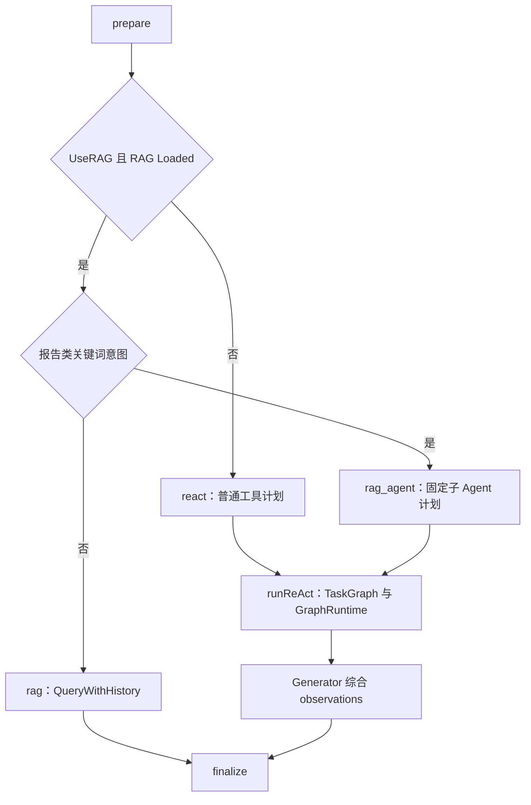

# AGI-Saber 的 RAG 与 Agent 设计研究

*本地源码核查与面向 PedRAGent 的设计借鉴 · status: current · 2026-10-04；迁移建议为 target*

## 一句话结论

AGI-Saber 把 RAG、任务规划、图调度与结果生成组织在统一聊天入口下，适合研究“任务依赖与有限重规划”。它是 Go 应用架构，不是可直接导入 Python 的独立 Harness 库。

源码根为 `E:\F_Workspace\AGI-Saber`，HEAD 为 `43df15fa77143174909eb807156fd8c9a6a5009a`。本次直接核查下表源码，未运行测试、服务或模型。历史架构图只作阅读线索，当前路由以 `routeDecide` 为准。

## 设计、算法与入口

| 层 | 入口（相对 AGI-Saber 根） | 当前职责 |
| --- | --- | --- |
| 请求生命周期 | `internal/application/chat/runtime_process.go` | prepare → routeDecide → dispatch → finalize |
| 规划执行组合 | `internal/application/chat/mode_react.go::runReAct` | 生成节点、构造 TaskGraph、创建 GraphRuntime、综合 observations |
| 节点计划 | `internal/application/chat/plan_graph.go` | LLM 图规划、规则回退、关键词报告意图、固定子 Agent 流水线 |
| 任务图算法 | `internal/domain/graph/graph.go` | 节点状态、依赖、拓扑分层、可执行节点、图验证与追加 |
| 执行运行时 | `internal/application/chat/runtime_graph.go` | 并发上限、竞速组、取消、中断快照、层间/失败重规划 |
| 知识检索 | `internal/domain/rag/rag.go::QueryWithHistory` | 查询改写、召回、父块恢复、模型合成 |
| 融合召回 | `internal/domain/rag/hybrid.go::SearchMulti` | 多 query 并发、多源 rank 融合、跨 query RRF、可选精排 |
| 运行配置 | `config/config.yaml` 的 `graph_runtime` | max_parallel、race_timeout_ms、enable_racing、replan_enabled、max_replan、replan_on_failed |

## 真实请求路由

当前 `react` 明确不允许子 Agent；`rag_agent` 强制 `research_agent → writer_agent → review_agent → doc_agent`，并非每次都由 Planner 自主选择团队。`dispatch` 虽保留 tool/chat handler，`routeDecide` 当前返回的是上述三个主模式。

报告意图由“研究、调研、总结、报告、文档、方案、分析”等中文关键词触发。它是任务分流启发式，不是证据充分性判别器，也不能直接替代 PedRAGent 的英文研究任务分类。

`doc_agent` 的计划目标包含保存报告并写入 RAG。对科研仓库不能直接复制这种反馈路径：生成答案应独立保存为运行产物，不能自动成为正式语料、Gold 或模型后续取证依据。

## GraphRuntime 算法含义

任务图（DAG，即没有环的任务依赖图）将一个任务拆成带依赖的节点。TaskGraph 找出依赖满足的节点；运行时按可执行层处理，限制同时运行的节点数。某些同组节点可竞速，以首个成功结果为胜者并取消其余工作。

重规划由执行观察触发，受 `MaxReplan` 限制；层完成与节点失败是不同触发点。配置文件启用了重规划，示例上限为 2，而 `DefaultGraphConfig()` 的开关默认值不完全相同；实际 `runReAct` 将应用配置复制进 GraphConfig，不能只读默认构造函数判断生效值。

有两个值得保留的研究性限制：

1. First-success-wins 优化的是首个成功执行的耗时，不能说明首个结果证据最充分。文献取证需要独立质量判断，不默认开启竞速丢弃其他来源。
2. `runReAct` 初始图验证失败时会清空依赖、降级为全并行。对“检索 → 写作 → 审查”的因果流程，这会改变语义。PedRAGent 应将非法图作为规划失败，回退到明确的固定基线或停止，而非静默抹去依赖。

快照和中断路径确实存在，但本轮没有验证恢复后是否保证外部副作用只执行一次。不能由“有 snapshot”推定 exactly-once。

## RAG 调用链与算法

`Engine.QueryWithHistory` 从历史辅助查询改写开始，调用 `HybridStore.SearchMulti`，之后将 child 命中恢复为 parent 文本并合成回答。无 LLM 时返回检索文本，不能将这条路径报告为模型回答质量。

多源召回使用 Milvus 语义检索、Elasticsearch 关键词检索与可用的 Neo4j 图检索；按可用性降级。RRF（根据名次而非不同系统原始分数合并）先融合检索通道，再融合多条 query。概念式为 `score(d) = Σ 1 / (k + rank(d))`；具体图路由带权重，必须随配置记录。

`SearchMulti` 的跨 query 聚合实现使用内容哈希；注释还提到 pg_id。借鉴时应读实现并明确去重键，PedRAGent 用 source/version/chunk 身份避免同文本但不同来源被误合并。LLM reranker 解析失败有回退路径，这种显式降级可复用，但应记录是否重排成功。

## 配置经验与迁移边界

| 可借鉴 | 在本项目中的落点（target） | 不应随之引入 |
| --- | --- | --- |
| 路由与执行分开 | Agent 选 research policy；Harness 执行动作 | 按泛化关键词决定证据已充分 |
| 计划节点带依赖 | 后期复杂研究任务的显式 DAG | 初期就建设通用团队平台 |
| 有限重规划 | 检索轮数、改写次数和失效重试有独立上限 | 不限额递归与错误图全并行 |
| observation 驱动追加动作 | 记录缺失 requirement、候选 query 和增量证据 | 自动把生成报告写入正式知识索引 |
| 配置映射明确 | 保存原始配置与实际解析配置 | 只保存默认配置或模糊的模型名称 |
| 显式降级与中断 | ToolOutcome 和终止理由进入 run log | 搬入用户会话数据库、SSE、长期记忆合并 |

最小移植单位是“计划状态 + 动作结果 + 有限重规划”这组概念，不是整个 UnifiedAgent。先在相同检索器上比较固定查询与有预算迭代；出现真实依赖/并行收益后才实现 DAG。执行器与领域证据验证必须分离。

## 推荐阅读顺序

先读 `runtime_process.go::routeDecide` 和 `mode_react.go::runReAct` 建立主链，再读 TaskGraph 与 GraphRuntime；研究检索时读 `QueryWithHistory` 和 `SearchMulti`。产品入口、认证和长期记忆不影响本轮接入判断，可先跳过。

与另一个参考实现的对比和开发顺序见 [研究计划](agentic-research-plan.md)。逐文件版本依据见 [来源清单](source-manifest.json)。
