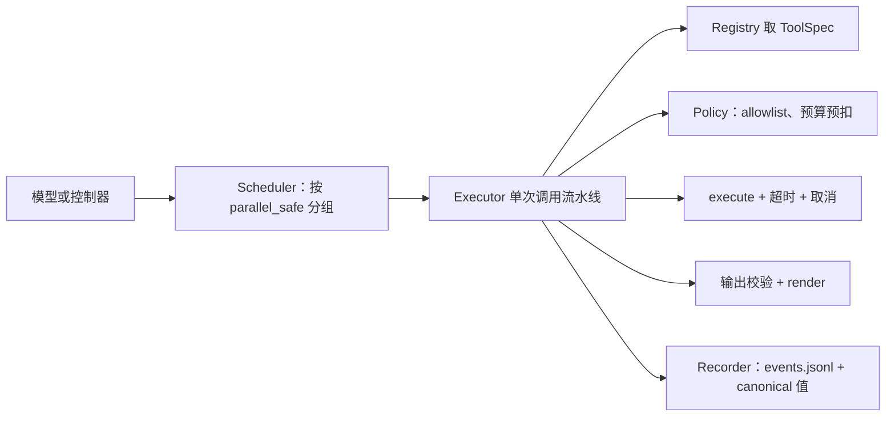
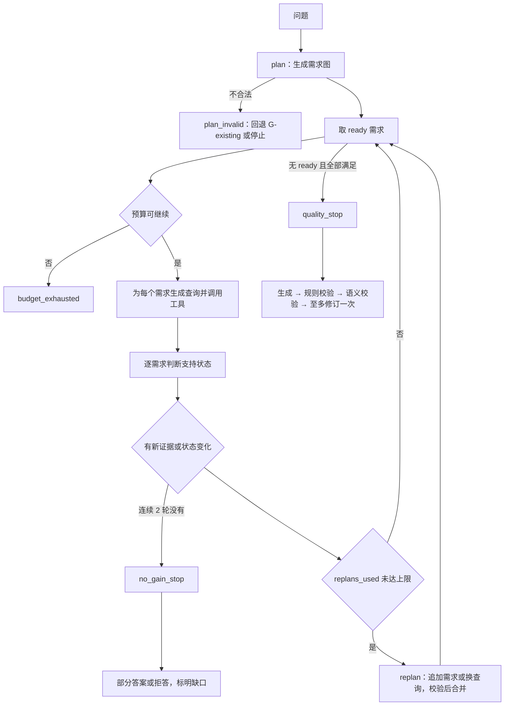

# 工具契约与 Agent 控制器设计（借鉴加深版）

*Agent-Harness 接口设计 · status: target · 2026-10-07；第 4 节步骤 1–5 已实现；运行入口与完整重放仍为 target*

2026-10-08 当前实现和离线验证见 [Agent core 开发进度](../../docs/agent-core-development.md)。
生产适配器位于 Agent 的 integrations；当前配置固定非法计划显式失败、非质量停止仅返回缺口。
下文流程图的旧回退/部分答案选项仍为设计对照，本轮没有实现这些选项。

## 0. 这份文档解决什么

2026-10-07 的决定是：**仍然自建 Python Harness，但在写代码之前，先按 DeepSeek Harness（dsh）的工具契约和 AGI-Saber 的有限重规划机制，重新设计 `protocols.py` 和 Agent 控制器。**

本文给出两部分的目标接口：

1. **Harness 工具契约**：替代现有 `Agent-Harness/src/ped_agent_harness/protocols.py`，对齐 dsh `defineTool` / `ToolExecutionResult` / 调度器。
2. **Agent 控制器**：迭代取证的状态机，对齐 AGI-Saber `GraphRuntime` + `tryReplan`。它负责 PEARL Layer 5 要评价的"需求规划、迭代检索、停止判断"。

参考依据（本次直接读了源码）：

| 来源 | 版本 | 读过的文件 |
| --- | --- | --- |
| dsh | `5badb15009ae1756c3afe0ae0cef1faafc290ccc` | `docs/cookbook/adding-a-tool.md`、`packages/core/tools/src/index.ts`、`packages/core/agent-loop/src/tool-calls.ts`、两个包 README |
| AGI-Saber | `43df15fa77143174909eb807156fd8c9a6a5009a` | `internal/domain/graph/graph.go`、`internal/application/chat/runtime_graph.go`、`replanner.go` |
| 本仓库 | 当前工作树 | `protocols.py`、`evidence_graph.py`、`ports.py`、`Contracts/.../evidence.py`、`Knowledge-Base/.../retrieval/__init__.py` |

上位文档：`Agent-Harness/docs/agentic-research-plan.md`（阶段 P0–P8）、`configuration-design.md`（配置字段）。本文不改变它们的阶段划分，只把 P2（执行基础）和 P4（领域控制器）的接口落实。

---

## 1. 工具契约（对齐 dsh）

### 1.1 现有 protocols.py 的问题

| 现有设计 | 问题 | dsh 的做法 |
| --- | --- | --- |
| `ToolResult.content: str` | 证据 ID、数值、引用身份只能塞进字符串，调用方要解析文本 | 工具返回**一个 canonical JSON 值**，由 `output.render(args, value)` 另外生成给模型看的内容 |
| `Tool.parameters` 只检查根 `type == object` | 调用参数从不校验 | 注册时声明 schema，执行前按 schema 完整校验参数，执行后再校验输出 |
| `is_error: bool` + 自由 metadata | 无法区分"工具不存在 / 参数非法 / 被拒 / 超时 / 未开始就取消 / 结果未知" | `ToolExecutionSuccess \| ToolExecutionFailure` 判别联合，失败带 `ToolErrorInfo{name, code}` |
| `ToolRegistry.register(func)` + `execute` 合在一起 | 注册、策略、执行、记录没有边界 | registry 只管定义；执行流水线是 prepare → pre-execute 策略 → dispatch（可包超时/重试）→ 输出校验 → render → post-execute → result 观察 |
| `ExecutionContext.max_tool_calls` 计数器 | 预算只有一个数，也没人执行 | 调用身份（callId、name、冻结参数、token、signal、parent）在策略之前建立且不可变；deny 是单调的，后续不能翻转 |
| 无并发、无取消 | — | `isConcurrencySafe(args)` 只有显式 `true` 才并行；独占调用形成屏障；结果按模型顺序提交；取消时已启动的等收敛，未启动的写合成错误结果 |

### 1.2 目标类型（Python 版）

用 **Pydantic 模型**表达每个工具的输入和输出（等价于 dsh 用 schema 推导 `InferArgs`），JSON Schema 从模型自动导出给 LLM。这样参数校验、输出校验和类型提示都来自同一处定义。

```python
class SideEffect(StrEnum):
    READONLY = "readonly"              # 冻结检索、按版本读证据、读已存分析 bundle
    CREATES_ARTIFACT = "creates_artifact"  # 新轨迹分析、视频推理（后期）

class ToolSpec(Generic[I, O]):
    name: str                          # 如 "knowledge.search"
    version: str                       # 工具实现版本，进入 run manifest
    description: str                   # 给模型看
    input_model: type[I]               # Pydantic，导出 JSON Schema
    output_model: type[O]              # canonical 值的 schema
    side_effect: SideEffect
    timeout_seconds: float | None      # 协作式超时，不发送给模型
    max_retries: int = 0               # 只对 READONLY 生效
    def parallel_safe(self, args: I) -> bool: return False   # 默认独占
    async def execute(self, args: I, ctx: ToolRunContext) -> O: ...
    def render(self, args: I, value: O) -> str: ...          # 纯函数，给模型的文本

class ToolCall(BaseModel):             # 冻结（frozen=True）
    run_id: str
    call_id: str
    parent_call_id: str | None
    round: int                         # 控制器取证轮
    tool_name: str
    arguments: dict[str, JsonValue]    # 校验前的原始参数快照
    arguments_sha256: str

class ToolErrorCode(StrEnum):
    UNKNOWN_TOOL = "unknown_tool"
    INVALID_ARGUMENTS = "invalid_arguments"
    DENIED = "denied"                  # 不在 allowlist / 策略拒绝
    BUDGET_EXHAUSTED = "budget_exhausted"
    ABORTED_BEFORE_DISPATCH = "aborted_before_dispatch"
    CANCELLED = "cancelled"            # 只读工具在执行中被取消（写操作则记 OUTCOME_UNKNOWN）
    TIMEOUT = "timeout"
    TOOL_ERROR = "tool_error"          # execute 抛出的基础设施错误
    INVALID_OUTPUT = "invalid_output"
    OUTCOME_UNKNOWN = "outcome_unknown"  # 已开始但无法确认完成（不可自动重试写操作）

class ToolSuccess(BaseModel):
    status: Literal["ok"] = "ok"
    call: ToolCall
    value: JsonValue                   # canonical 值，**完整落盘**
    value_sha256: str
    content: str                       # render 结果
    provenance: ToolProvenance         # 工具版本、资源/索引指纹、耗时、尝试次数
    usage: ToolUsage | None

class ToolFailure(BaseModel):
    status: Literal["error"] = "error"
    call: ToolCall
    code: ToolErrorCode
    message: str                       # 给模型的说明
    dispatched: bool                   # 是否真正进入了 execute
    provenance: ToolProvenance

ToolOutcome = Annotated[ToolSuccess | ToolFailure, Field(discriminator="status")]
```

领域结果用 canonical 值表达，不放进异常。例如"检索零命中"是 `ToolSuccess(value={"items": [], "degraded": false})`；"索引失效"是 `TOOL_ERROR`，不能伪装成零命中（接入评估文档的要求）。

### 1.3 Registry / Executor / Scheduler 分工



**Executor 单次流水线**（顺序固定，任何一步失败都产生 `ToolFailure`，不抛到控制器）：

1. 建立 `ToolCall`：冻结参数、算哈希、分配 call_id。身份在策略之前确定（dsh 同款）。
2. 查找工具：不存在 → `UNKNOWN_TOOL`。
3. 参数校验：`input_model.model_validate` 失败 → `INVALID_ARGUMENTS`，**不调用工具**。
4. 策略：不在 allowlist → `DENIED`；预算不足 → `BUDGET_EXHAUSTED`。拒绝是单调的，后续步骤不能改回允许。
5. 预扣预算（调用次数），然后派发。取消信号在这之前已触发 → `ABORTED_BEFORE_DISPATCH`。
6. `execute` 外包 `asyncio.timeout`。超时 → `TIMEOUT`；对 READONLY 按 `max_retries` 重试，每次尝试都计预算；非 READONLY 一律不自动重试，结果不明标 `OUTCOME_UNKNOWN`。
7. 输出校验：`output_model.model_validate` 失败 → `INVALID_OUTPUT`。
8. `render` 生成模型文本；render 抛错也算 `INVALID_OUTPUT`。
9. Recorder 写事件。

**Scheduler**（对应 dsh `executeToolCalls`）：

- 一批调用按模型给出的顺序处理；`parallel_safe` 为真的相邻调用进入有上限的并发池（`max_parallel`，首版为 1），独占调用是屏障。
- 结果**按原顺序提交**，即使完成顺序不同。
- 取消时停止派发新调用，等待已启动的收敛；未启动的写 `ABORTED_BEFORE_DISPATCH` 合成结果，保证日志可重放。
- 同进程的 async 超时只停止等待，不能证明 CPU/GPU 工作已停止；需要硬隔离的工具（视频推理）以后用子进程执行。

### 1.4 首批工具

| 名称 | 输入 | canonical 输出 | 底层 |
| --- | --- | --- | --- |
| `knowledge.search` | `query`、`limit` | `items[]`（保留 evidence_id、chunk_id、resource_id、version_id、quote、locator、content_hash、score）、`degraded`、`degradation_reason`、`index_fingerprint` | `HybridRetriever.retrieve`（冻结快照） |
| `knowledge.read_evidence` | `evidence_id` 或 `chunk_id`、`expand: "child" \| "parent"` | 原 child quote + 可选 parent 文本、字符区间、策略版本、token 数 | `catalog.context_for_chunk` |

两者都是 READONLY、`parallel_safe=True`，但首版 `max_parallel=1`，便于逐轮记录增量。

### 1.5 有意不照搬 dsh 的部分

| dsh 机制 | 本项目处理 | 原因 |
| --- | --- | --- |
| Cordis 插件、effect 注册/卸载 | 不做；组合入口显式构造 Registry | 研究代码不需要热插拔 |
| Profile / Bundle / patch 树 | 改为 `configuration-design.md` 的四层合并 | 合并规则自定义、可冻结 |
| PTC（模型写程序调工具）、UI 卡片 presenter | 不做 | 与研究问题无关 |
| Session 只持久化渲染内容 | **相反：canonical 值完整落盘** | 科研复算需要结构化值 |
| pre/post-execute 可扩展钩子 | 只保留 allowlist + 预算两条固定策略 | 变量少、可控 |

### 1.6 和旧 protocols.py 的对应

| 旧 | 新 |
| --- | --- |
| `Tool` | `ToolSpec`（多了 version、output_model、side_effect、timeout、parallel_safe） |
| `ToolCall.tool_call_id / tool_name / arguments` | 保留同义字段，增加 run_id、parent_call_id、round、arguments_sha256 |
| `ToolResult` | `ToolSuccess \| ToolFailure`；旧 `content` 对应 `content` 字段，仅作渲染兼容 |
| `ToolRegistry` Protocol | 拆成 `ToolRegistry`（定义）和 `ToolExecutor`（执行） |
| `Agent` / `AgentInput` / `AgentOutput` | 删除，由第 2 节控制器取代 |
| `ExecutionContext` | 由 `RunBudget` + `ToolRunContext`（run_id、取消信号、deadline）取代 |

---

## 2. Agent 控制器（对齐 AGI-Saber 有限重规划）

### 2.1 从 AGI-Saber 借什么

AGI-Saber 的 `GraphRuntime.Execute` 是：取依赖已满足的节点 → 按层执行 → 存快照 → 若 `ReplanEnabled && replanUsed < MaxReplan` 就调用 `tryReplan` → 循环到没有 pending 节点。`tryReplan` 把图状态快照交给 LLM，LLM 决定追加 0–3 个节点；追加后重新校验，有环就把新节点作废。节点失败时可以用 `node_failed` 原因触发局部重规划，优先给替代方案。

借鉴到本项目，**图里的节点从"工具调用"换成"证据需求"**：

| AGI-Saber | PedRAGent 控制器 |
| --- | --- |
| `Node{ID, Type, ToolName, Params, DependsOn, Status, Result}` | `Requirement{id, statement, depends_on, status, support_evidence_ids, queries_tried}` |
| `ReadyNodes()`：入度为 0 的 pending 节点 | `ready()`：依赖已 satisfied 的 open 需求 |
| 每层执行节点 | 每轮为每个 ready 需求生成查询并调用 `knowledge.search` / `read_evidence` |
| 层后 `tryReplan("layer_done")` | 轮后 `replan("round_done")`：可追加需求或改写查询 |
| 失败时 `tryReplan("node_failed")` | 工具失败或零增益时 `replan("action_failed" / "no_gain")` |
| `MaxReplan`（配置 2）、每次最多追加 3 节点 | `max_replans`、`max_new_requirements_per_replan=3`、`max_rounds=3` |
| `Validate()`：悬空依赖 + 环检测 | 同样校验；另外检查需求数上限和重复 |
| 快照：节点状态 + 结果截断到 200 字符 | 快照：需求状态 + 证据 ID 列表 + 支持判断理由（结构化，不截断成文本） |

### 2.2 有意不同的地方

这些都来自读源码时发现的行为，PEARL 评价需要与之相反的语义：

1. **初始计划不合法时**：AGI-Saber 的 `runReAct` 会清空依赖、改成全并行。本项目视为**规划失败**，回退到 `G-existing`（现有 EvidenceGraph）或直接停止，`stop_reason=plan_invalid`。
2. **上游失败时**：AGI-Saber 把 Failed 节点也当终态推进下游（下游照常执行）。本项目中依赖了未满足需求的下游需求标为 `blocked`，不执行。
3. **竞速**：不使用 first-success-wins，文献证据要看质量而不是谁先返回。
4. **重规划解析失败**：AGI-Saber 视为"无需重规划"。本项目记录为 `replan_parse_failed` 事件，并按"无增益"计入停止判断，不能悄悄当作计划完成。
5. **生成结果回流**：AGI-Saber 的 `doc_agent` 会把报告写回 RAG。本项目禁止，生成答案只是运行产物。

### 2.3 DecisionState 与循环

```python
class RequirementStatus(StrEnum):
    OPEN = "open"; SATISFIED = "satisfied"; PARTIAL = "partial"
    BLOCKED = "blocked"; UNSATISFIABLE = "unsatisfiable"; UNKNOWN = "unknown"

class Requirement(BaseModel):
    id: str
    statement: str                     # 回答该问题必须有证据支持的事实/条件
    depends_on: list[str] = []
    status: RequirementStatus = RequirementStatus.OPEN
    support_evidence_ids: list[str] = []
    queries_tried: list[str] = []
    rationale: str | None = None       # 支持判断的依据

class DecisionState(BaseModel):
    question: str
    requirements: dict[str, Requirement]
    evidence: dict[str, EvidenceItem]  # 以 evidence_id 去重，保留首次出现轮次
    round: int = 0
    replans_used: int = 0
    no_gain_rounds: int = 0
    stop_reason: StopReason | None = None
```



`StopReason` 分三类分别记录（研究计划的要求）：

- 质量停止：`quality_stop`
- 策略停止：`no_gain_stop`、`plan_invalid`、`all_blocked`
- 硬上限：`budget_exhausted`（调用 / token / deadline）、`cancelled`

只有质量停止可以进入"verified"答案；其余停止要么给出标明缺口的部分答案，要么拒答，由配置决定，并在结果中保留 stop_reason。

### 2.4 答案尾链复用

现有 EvidenceGraph 把检索和生成验证放在同一张图里，控制器无法只用后半段。P4 需要在 `Agent/` 新增一个只接收"已选证据"的入口，复用现有的 `_draft_prompt`、`validate_draft`、语义验证和一次修订逻辑。EvidenceGraph 本身保持不变，作为 `G-existing` 基线。

### 2.5 控制器与 Harness 的边界

- 控制器（`Agent/`）只发出 `ToolCall` 请求、读取 `ToolOutcome`，自己不计时、不计预算。
- Harness（`Agent-Harness/`）执行调用、计量预算、在超限时返回 `BUDGET_EXHAUSTED`。控制器据此停止。
- 规划、支持判断、重规划都是模型调用，同样经过 Harness 计量（`max_model_calls` 包括它们）。

首版控制器建议用普通 asyncio 循环实现，而不是 LangGraph：状态转移要精确记录，循环结构也比图简单；LangGraph 继续保留在 EvidenceGraph 基线里。

---

## 3. 运行记录

每个 run 一个新目录（`configuration-design.md` 已定义），本文补充事件类型：

| 事件 | 关键字段 |
| --- | --- |
| `run_start` / `run_end` | resolved-config 哈希、stop_reason、总 usage |
| `plan` / `replan` | trigger（initial / round_done / action_failed / no_gain）、追加的需求、校验结果、模型原始输出引用 |
| `tool_call` / `tool_outcome` | 完整 ToolCall、status、code、dispatched、canonical 值（或其文件引用 + 哈希） |
| `support_judgment` | requirement_id、前后状态、证据 ID、理由 |
| `round_end` | 新增证据 ID、状态变化数、no_gain 计数、剩余预算 |
| `answer` | 尾链结果、verification.status |

事件带单调 `seq` 和 `run_id / call_id / parent_call_id`。离线重放只读这些事件，不再调用模型或工具。

---

## 4. 落地顺序（细化 P1–P4）

| 步骤 | 内容 | 位置 | 验收 |
| --- | --- | --- | --- |
| 1 | 新增 `ped_agent_harness/contracts.py`（第 1.2 节类型），旧 `protocols.py` 暂留并标记待移除 | `Agent-Harness/src` | 模型构造、判别联合序列化往返、冻结字段不可改 |
| 2 | `registry.py`、`executor.py`、`scheduler.py`、`budget.py`、`recorder.py` | 同上 | 非法参数不进入 execute；预算在重试时递增；超时、未开始取消、输出非法各自得到正确 code；结果按模型顺序提交；事件可重放 |
| 3 | `knowledge.search` / `read_evidence` 适配工具（P1） | `experiments/agentic-baseline/adapters/` | 固定查询保留 evidence 身份与版本；索引失效不变成零命中 |
| 4 | 新的答案尾链入口 | `Agent/` | 用固定证据集得到与 EvidenceGraph 后半段一致的结果 |
| 5 | 控制器（DecisionState、plan/replan、停止规则） | `Agent/` | 非法计划不展平；上游失败下游 blocked；连续无增益停止；预算耗尽不标 verified |

步骤 1–2 不依赖 RAG 冻结资产，可以先做；步骤 3 需要 P0 选定冻结快照。

## 5. 需要确认的选择

1. **校验库**：本文选 Pydantic 模型（与仓库现有风格一致）。另一种是纯 JSON Schema + `jsonschema` 库，更接近 dsh，但要多维护一套类型。
2. **控制器实现**：本文选普通 asyncio 循环。也可以继续用 LangGraph，与 EvidenceGraph 一致。
3. **Harness 入库**：步骤 1 开始前，把 `Agent-Harness/src|tests|pyproject.toml` 加入 git 和 uv workspace，并把 Python 版本统一到 3.12。
