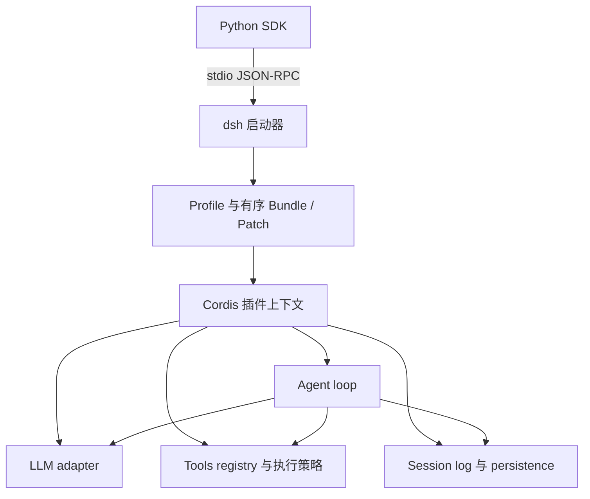

# DeepSeek Harness 的设计研究

*固定上游提交的文档与关键源码分析 · status: current · 2026-10-04；接入建议为 target*

## 核查版本与结论

项目：[deepseek-ai/deepseek-harness](https://github.com/deepseek-ai/deepseek-harness)。本次通过 GitHub API 取得 master 的提交 `5badb15009ae1756c3afe0ae0cef1faafc290ccc`，提交时间为 `2026-10-03T03:48:13Z`。下文固定到这个提交；开发者预览仍可能改变接口，本次没有安装 SDK、启动 dsh 或运行其测试。[项目说明](https://github.com/deepseek-ai/deepseek-harness/blob/5badb15009ae1756c3afe0ae0cef1faafc290ccc/README.md)

适合借鉴的是可替换能力、配置分层、类型化工具结果和可追溯执行。直接采用 dsh 仍不能获得 PedRAGent 的证据充分性判断、数值证据契约或 PEARL 评价逻辑，这些领域能力需要自己实现。

## 设计分层

Cordis 提供依赖注入、事件和随插件卸载撤销的注册效果。“Everything is a Plugin”也覆盖 Agent loop，而非只有工具是插件。能力接口、提供者与使用者分别定义，便于替换运行环境。这是 dsh 的架构机制，不要求 PedRAGent 原样实现完整插件框架。[固定架构文档](https://github.com/deepseek-ai/deepseek-harness/blob/5badb15009ae1756c3afe0ae0cef1faafc290ccc/docs/architecture.md)

## 配置如何组成运行实例

Profile 是 Harness home 中命名的组合，Bundle 是携带插件代码与配置 patch 的分发单位。最终插件树依次应用：profile 所列 bundles → profile patch → home patch → 命令行有序 `--patch`。patch 对目标 row 替换整份 config，不能按想象认为是任意字段深合并。

`web / headless / sdk / acp` 以共享 base 加入口层组合；`sdk-minimal` 是完整的独立配置树，不继承 base。组合完成后应导出实际配置，避免只记录上层 patch 却遗漏实际能力集合。[启动与 Profile 规则](https://github.com/deepseek-ai/deepseek-harness/blob/5badb15009ae1756c3afe0ae0cef1faafc290ccc/packages/boot/app-boot/README.md)

本项目可采用类似的“基础配置 + 实验 override + 冻结解析结果”，但目标 Python 配置的合并规则应自己明确定义，不能与 dsh row replacement 混用。

## Agent loop：配置实例与执行实例分开

`packages/core/agent-loop/src/index.ts` 定义 AgentLoop 服务、配置 Agent 列表、create/resume 及生命周期资源管理，实际 driver 在 `agent.ts::ReactLoopAgent`。创建过程涉及 scoped context、session 与 registry 发布，关闭时停止工作再释放作用域。配置标签不是天然稳定的 session ID；复用/恢复须显式指定相应身份。[AgentLoop 源码](https://github.com/deepseek-ai/deepseek-harness/blob/5badb15009ae1756c3afe0ae0cef1faafc290ccc/packages/core/agent-loop/src/index.ts)

driver 的主要链路是 `send / inject → inbox → kick → turn → preStep → step → prepareRequest / 模型流 → executeToolCalls`。turn 可包含多个 step，每个 step 对应模型请求及工具执行；工具结果或新输入会继续下一步。[ReactLoopAgent 源码](https://github.com/deepseek-ai/deepseek-harness/blob/5badb15009ae1756c3afe0ae0cef1faafc290ccc/packages/core/agent-loop/src/agent.ts)

预算不能从“有 loop”推定已经受控。包文档明确没有内置 turn budget；应通过生命周期政策终止。PedRAGent 需要自己的检索轮数、模型调用、token 和 deadline 上限，也要区分正常停止、证据不足与预算耗尽。[Agent loop 包说明](https://github.com/deepseek-ai/deepseek-harness/blob/5badb15009ae1756c3afe0ae0cef1faafc290ccc/packages/core/agent-loop/README.md)

## 工具定义、执行与输出

工具通过 `defineTool` 声明参数、canonical output schema、execute 和 render。canonical value 是结构化程序结果，render 是给模型看的内容；调用者不应解析一段人类说明来恢复数值或证据 ID。注册器执行输入/输出检查，部分跨字段领域约束仍由工具负责。[工具编写契约](https://github.com/deepseek-ai/deepseek-harness/blob/5badb15009ae1756c3afe0ae0cef1faafc290ccc/docs/cookbook/adding-a-tool.md)

`Tools.execute` 经 prepare、dispatch 和 finalization；调用身份与参数快照在策略处理前建立，guard 的 deny 不会被后续 force-allow 推翻。工具与监听器失败会成为错误结果。这个接口比旧骨架只有 `content: str` 更适合保留领域结果、引用身份与 provenance。[Tools 执行源码](https://github.com/deepseek-ai/deepseek-harness/blob/5badb15009ae1756c3afe0ae0cef1faafc290ccc/packages/core/tools/src/index.ts)

工具呈现有 native、ptc、both。PTC 将程序调用工具的返回值与模型渲染区分；Session 主要记录渲染内容及可选 presentation metadata，不自动持久化所有 canonical values。**PedRAGent 若要复算数值和证据状态，必须另存 canonical result 或有哈希的产物引用**，不能只保存 dsh 聊天 transcript。[Tools 包说明](https://github.com/deepseek-ai/deepseek-harness/blob/5badb15009ae1756c3afe0ae0cef1faafc290ccc/packages/core/tools/README.md)

并行工具调度区分可安全并行与独占调用，受 maxParallelToolCalls 控制；可以并行执行而按模型调用顺序提交结果。取消时处理未启动调用、等待已启动工作收敛，再封闭结果；这不构成外部副作用 exactly-once 保证。[工具调度源码](https://github.com/deepseek-ai/deepseek-harness/blob/5badb15009ae1756c3afe0ae0cef1faafc290ccc/packages/core/agent-loop/src/tool-calls.ts)

## 日志与恢复的研究价值

日志与派生模型上下文之间有明确关系，持久化事实与实时扩展事件分开。它启发本项目记录每轮实际 query、evidence IDs、prompt/config 指纹、预算与终止理由。这里“重放”应分成离线恢复状态、复放已存模型输出和重新调用模型三种，后两者成本与可重复性不同。

工具结果未知时不能自动重试可能写入的操作；已有结果与未启动结果必须区分。对固定只读检索可以明确重试，但不得把恢复研究等同于长期会话服务。[失败恢复边界](https://github.com/deepseek-ai/deepseek-harness/blob/5badb15009ae1756c3afe0ae0cef1faafc290ccc/packages/core/agent-loop/README.md)

## Python 接入边界与旧结论修正

Python SDK 通过子进程的换行 JSON-RPC 驱动 dsh，并依赖同版本 runtime-bin wheel。SDK 启动选择 `sdk` profile，要求显式 `dsh_home / DSH_HOME`；`cwd` 是 Agent 工作区，runtime_cwd 是子进程工作区。初始化超时与普通请求超时是不同参数。**运行打包 SDK 不要求系统 Node.js**；从源码开发和外部插件包管理是另一条环境路径。[固定 Python SDK README](https://github.com/deepseek-ai/deepseek-harness/blob/5badb15009ae1756c3afe0ae0cef1faafc290ccc/python/sdk/README.md)

SDK 可以发送研究任务，但不等于现有 Python 函数自动进入 dsh 工具列表。需明确桥接协议、序列化、取消、版本与 capability registration。可选桥接为 TS tool 调用受限 Python 子进程，或另做 MCP 工具实验；不能宣称这两条路径已经在本项目验证。

`sdk-minimal` 默认主要提供平台 shell 与 JSONL 会话，排除了完整技能、compaction、subagent 等配置。它默认采用 danger-full-access，**最小默认工具数不代表受限领域运行环境**。本项目对照应改成显式只读领域工具组合，使用隔离实验目录并导出实际配置，而非把此模板原样当科研 Harness。[sdk-minimal 组合说明](https://github.com/deepseek-ai/deepseek-harness/blob/5badb15009ae1756c3afe0ae0cef1faafc290ccc/packages/bundle/sdk-minimal/README.md)

## 接入方式比较（target）

| 方式 | 领域工具连接 | 成本 | 使用阶段 |
| --- | --- | --- | --- |
| 只借鉴设计，主线保留 Python | 实验组合入口注入 Python ToolProvider | 实现小型执行层，变量控制简单 | 优先 |
| dsh + SDK + 显式领域工具桥 | TypeScript registration 连接 Python 工具或 MCP | 双语言契约、进程生命周期、版本兼容 | 原生基线稳定后做小规模对照 |
| 完整 dsh 产品组合 | 自定义 profile 和全部领域桥接 | UI/会话/插件管理等额外复杂度 | 本轮边界不需要 |

首个 dsh 对照只测 `knowledge.search` 和定向读取，复用相同索引、模型、预算与答案验证器。观测运行成本和决策轨迹，再决定是否扩大采用。不将 dsh 本身作为论文算法贡献，也不把 MIT 主项目许可推定为所有依赖同许可。

## 推荐阅读顺序

先读架构的 Profile/Bundle 与能力边界，再读 AgentLoop / ReactLoopAgent / Tools 的源码入口；Python 集成看固定 SDK README。Web、Desktop、webhook、teams、后台 jobs 可先跳过。后续版本升级应重新核对上述入口和 [来源清单](source-manifest.json)。
