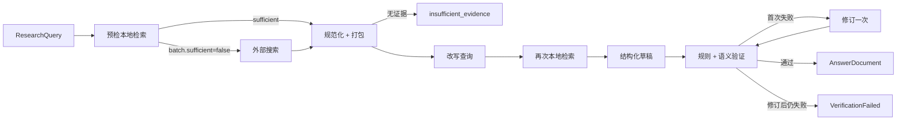

# Agent

*Evidence orchestration and research QA module · status: current · 2026-10-07*

证据约束的科研问答模块。当前实现是**固定条件 EvidenceGraph**：两次本地检索、可选外部搜索、结构化草稿、引用规则与语义验证、至多一次修订。没有动态工具选择、需求规划、跨轮预算、通用运行循环或持久化运行记录；Agentic RAG 处于开发准备阶段。

本模块面向实验调用，不提供 FastAPI、会话数据库、SSE、任务队列或多用户能力。

## 代码地图

| 文件 | 职责 | 对 Agentic RAG 的角色 | 测试 |
| --- | --- | --- | --- |
| [`context.py`](src/ped_research_agent/context.py) | `ResearchQuery`：问题、run_id、实验提供的历史 | 运行输入；需补冻结 profile 引用 | 经 `test_evidence_graph.py` |
| [`ports.py`](src/ped_research_agent/ports.py) | `ModelGateway` / `LocalEvidenceRetriever` / `ExternalEvidenceSearcher` 协议 | 适配器接入点，保持不变 | 经 `test_evidence_graph.py` |
| [`evidence_graph.py`](src/ped_research_agent/evidence_graph.py) | LangGraph 固定图：节点连线、阶段事件、预检查询 | 基线 `G-existing`，行为由快照锁定 | [`test_evidence_graph.py`](tests/test_evidence_graph.py)、[`test_evidence_graph_baseline.py`](tests/test_evidence_graph_baseline.py) |
| [`answer_chain.py`](src/ped_research_agent/answer_chain.py) | 草稿 → 规则 → 语义验证 → 有限修订 → `AnswerDocument` | 基线与迭代控制器共用的验证尾链 | 经基线快照 |
| [`evidence_pack.py`](src/ped_research_agent/evidence_pack.py) | 按 ID 去重、按来源截断（默认 8/5/5）、打包与标签 | 稳定标签与丢弃记录待在此实现 | 经基线快照 |
| [`prompts.py`](src/ped_research_agent/prompts.py) | 改写、草稿、验证、修订 prompt；`PROMPT_SET_VERSION` | 改动措辞须升版本 | 经基线快照 |
| [`structured.py`](src/ped_research_agent/structured.py) | 原生结构化输出、文本回退与一次 JSON 修复 | planner / judge 复用 | 经 `test_evidence_graph.py` |
| [`policy.py`](src/ped_research_agent/policy.py) | claim / citation / evidence 双向绑定与来源前缀规则 | 直接复用为答案规则检查 | [`test_policy.py`](tests/test_policy.py) |
| [`model_gateway.py`](src/ped_research_agent/model_gateway.py) | OpenAI 兼容 / Anthropic 直连，原生结构化输出 | 答案与验证模型；无工具调用和 usage | [`test_model_gateway.py`](tests/test_model_gateway.py) |
| [`config.py`](src/ped_research_agent/config.py) | `AgentSettings`：answer / verify 模型与继承 | 仅模型层配置；`.env` 只映射部分字段 | 无专门测试 |
| [`external_search.py`](src/ped_research_agent/external_search.py) | Semantic Scholar、OpenAlex、Parallel 搜索与网页抽取 | 主消融中关闭；external-on 需冻结返回 | [`test_external_search.py`](tests/test_external_search.py) |
| 共享契约 | [`ped_contracts.evidence`](../Contracts/src/ped_contracts/evidence.py) | EvidenceItem、RetrievalBatch、AnswerDocument 等 | [`test_contracts.py`](tests/test_contracts.py) |

`integrations/knowledge.py` 已提供 `HybridRetriever` 到 `LocalEvidenceRetriever` 的生产适配，
`integrations/runtime.py::build_baseline` 将固定图检索接入 Harness 工具执行与事件记录。
该可选集成包依赖 `Agent[integration]`，底层 KB 由调用者显式注入；无实验 runner 或动态控制器。
状态类型及严格 JSON/TOML profile 位于 `agentic/`。新组合已接通模型共享预算、usage、取消
和整图 deadline；旧网关接口不变，完整范围见
[Agent core 开发进度](../docs/agent-core-development.md)。原 EvidenceGraph 接口、行为和快照保留。

## 当前调用链



需要特别区分以下名称与实际行为：

- `load_conversation` 不读数据库，历史来自 `ResearchQuery`；`previous_evidence_ids` 写入状态但未使用。
- `final_persist` 只构造答案、发出阶段事件，不写文件。
- 取消只在阶段开始检查，不传入正在运行的模型/检索调用。
- 关闭 verifier 需显式 `allow_rules_only=True`，结果标为 `rules_only`，不等于语义验证完成。
- `batch.sufficient` 来自检索侧的启发式，不等于 PEARL Layer 2 充分性。

## 文档

| 文档 | 内容 | 状态 |
| --- | --- | --- |
| [Agentic RAG 开发准备](docs/agentic-rag-dev-prep.md) | 现有代码的复用分级、代码级缺口、拟定包结构与接口、固定案例与待决问题 | plan |
| [模块接入评估](docs/harness-integration-assessment.md) | 2026-10-04 调用链、RAG/视频契约断点与路线选择 | current |
| [Agent-Harness 研究入口](../Agent-Harness/README.md) | 参考项目、配置设计与旧内容整理 | current |
| [Agentic 研究开发计划](../Agent-Harness/docs/agentic-research-plan.md) | P0–P8 阶段、A0–A4 消融、指标与停止口径 | plan |

## 验证

```powershell
$env:PYTHONPATH = "Contracts/src;Agent/src;Knowledge-Base/src;Video-Analysis/src"
.\.venv\Scripts\python -m pytest Agent/tests -q
```

全部测试用伪造 gateway / retriever / HTTP 客户端，不调用真实模型或网络。2026-10-07 使用 E 盘 `.venv` 验证组件抽取，34 项全部通过；冻结基线快照未更新。
