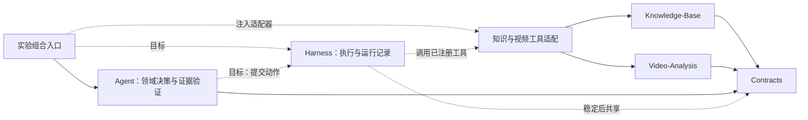
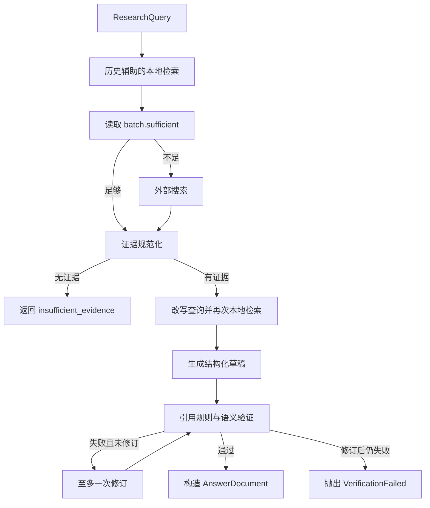

# Agentic 研究接入评估

*模块实现、接入缺口与研究边界核查 · status: current · 2026-10-04；方案段落为 target*

## 结论与核查范围

现有模块具备接入轻量研究 Harness 的基础，但尚未组成可动态选择工具、迭代取证和控制预算的完整 Agentic 系统。优先路径是：**保持检索与数值算法独立，通过实验适配器连接现有 EvidenceGraph，随后增加证据需求控制器**。

Agent 负责“缺什么证据、是否继续、如何形成可信回答”；Harness 负责“如何执行、如何限额、如何记录、如何结束”。固定流程图也是 Agent 的一种实现，不能仅凭有 LangGraph 或多个模型调用就宣称已实现自主规划。

本次读取了两份本地目录，不能将它们合并描述为同一个当前版本：

| 来源 | 本次版本标识 | 范围与限制 |
| --- | --- | --- |
| 当前 C 盘会话工作区 | `f3b4621ef5c46e27d9db351dd1c930500464261d` | Ped-Agent 较早快照，根目录虽然叫 Agent-Harness，内容实际是整个科研仓库；没有原有 Harness 子模块 |
| `E:\F_Workspace\F-Agent-Paper` | `b0e07788060c84c3dd3680ac30814f162d198761` | PedRAGent 更新工作树；Harness 是未跟踪骨架，架构与导航已有本地修改；提交号不代表这些未提交内容 |
| `E:\F_Workspace\AGI-Saber` | `43df15fa77143174909eb807156fd8c9a6a5009a` | 独立 Go 项目；核查当前路由、任务图、调度和 RAG 源码，未运行 Go 测试 |

模块源码入口以下用仓库相对链接；E 盘的特有状态另外注明。读取时的文件哈希见 [研究来源清单](../../Agent-Harness/docs/source-manifest.json)。本轮没有执行模型、重建索引或验证已有实验分数。

## 全景与依赖方向

实线是现有模块/组合原则，虚线是待实现接入。适配器先位于 `experiments/`，由组合入口注入。Knowledge-Base 和 Video-Analysis 不反向导入 Harness，也不在模块导入时自行注册全局工具。Harness 是 Agent 研究的执行支撑，不是第四或第五项产品能力。

## 模块评估与最小接入点

| 模块 | 当前代码事实 | 有效接入方式（target） | 必须补足的缺口 |
| --- | --- | --- | --- |
| Contracts | [EvidenceItem / RetrievalBatch / AnswerDocument](../../Contracts/src/ped_contracts/evidence.py) 与 [TrajectoryData](../../Contracts/src/ped_contracts/trajectory.py) | 保持领域结果契约；Harness 内部的调用身份、错误与预算先独立 | EvidenceOrigin 只有本地文献、外部学术和网页三类，没有分析产物来源；运行日志也不是共享契约 |
| Knowledge-Base | [HybridRetriever.retrieve](../../Knowledge-Base/src/ped_knowledge/retrieval/__init__.py)：FTS、向量召回、RRF、可选重排、child EvidenceItem 与 parent_contexts | 只读 `knowledge.search` 与按冻结 chunk/version 取上下文的适配工具 | HybridRetrievalResult 没有 sufficient，不能直接充当 Agent 的 RetrievalBatch；公共定向证据读取接口尚需定义 |
| Agent | [EvidenceGraph.execute](../src/ped_research_agent/evidence_graph.py)：固定条件图；[ports](../src/ped_research_agent/ports.py) 接收注入的检索与模型协议 | 保留为基线；用工具适配实现既有 ports；控制器在取证端演进 | 没有模型可见工具循环、需求计划、跨轮预算、持久化运行日志和自动恢复 |
| Video-Analysis | [公共 API](../../Video-Analysis/src/ped_video_analysis/api.py)：推理、轨迹后处理、世界坐标分析；导出由模块完成 | 先开放预计算分析产物读取，再实验轨迹分析工具，最后才研究视频推理动作 | PixelTrackSet、WorldTrackSet、ProcessedWorldTrackSet、AnalysisBundle 与通用 TrajectoryData 并非同一种结构；需要显式转换和分析证据包装 |
| E 盘 Harness 骨架 | `protocols.py` 有 Tool、ToolCall、字符串 ToolResult 与 Protocol；其余包基本为空 | 可保留字段命名作兼容参照，重新明确 registry 与 executor 边界 | Protocol 不是实现；参数只检查根 type，未验证调用参数；没有执行器、循环、预算、取消传播和结果验证 |
| experiments | 独立组合与可复现研究约定；E 盘已有 PEARL 研究资产 | 工具适配、配置解析试验、基线与消融先放独立实验 | 不能把较早 Pilot 或旧 README 状态当作当前实验发布依据 |

## 现有 Agent 的真实调用链

应特别区分以下实现与名称：

- `_load_conversation` 不读取会话数据库；历史由 ResearchQuery 提供。`previous_evidence_ids` 被写入状态，但没有用于重新加载证据。
- `_final_persist` 只构造最终答案并发出阶段事件，未写入文件。不能把它记作已经持久化。
- `_stage` 在阶段开始检查取消，未向正在执行的模型/检索调用传递取消信号，也没有自己的阶段超时。
- 规则检查验证 claim、citation、evidence 的绑定与来源前缀。语义检查判断 claim 是否 supported；二者是不同的保证。
- 关闭 verifier 时必须显式允许 rules-only，结果标为 `rules_only`，不能报告为完成语义验证。
- 现有图可提前无证据拒答；有证据并不代表每个必要事实已覆盖。不能把 `sufficient` 等同于 PEARL Layer 2 充分性标签。

## RAG 到 Agent 的具体断点

`HybridRetriever.retrieve()` 返回 `items / degraded / degradation_reason / parent_contexts`，而 `LocalEvidenceRetriever.retrieve()` 要求 `RetrievalBatch(items, sufficient, degraded, degradation_reason)`。最小实验适配应：

1. 保留原 child evidence ID、quote、locator、content_hash 及资源版本，不重新生成“更方便”的引用身份。
2. 把降级状态原样带入 batch；所有索引失效时应明确失败，不伪装成正常零命中。
3. 将充分性策略作为明确配置。现有 `retrieval_is_sufficient` 是“两份不同资源，或标题/DOI/文号精确匹配”的启发式，适合作为对照，不能证明证据完整。
4. 对 parent_contexts 做独立上下文装配记录：保留展开来源、字符区间、策略版本与 token 数。父文本不能静默取代 child quote。
5. 如果超出既有 RetrievalBatch 的字段，先用实验私有 EvidencePack 承载；经过固定案例验证后再讨论公共契约扩展。

本次在 E 盘 `experiments/` 的 Python 源码中搜索 `EvidenceGraph(`、`HybridRetriever(` 和 `RetrievalBatch(`，没有找到串联三者的现有入口。这是当前搜索范围内的缺口判断，不是证明整个工作树不存在任何其他形式的调用。

## 视频接入分三步

首先读取已经导出的 AnalysisBundle，返回结构化数值、单位、时间区间、坐标系、场景/标定引用、输入哈希与导出清单。它用于验证“文献论断 + 实测结果”的组合问答。

第二步对固定 ProcessedWorldTrackSet 运行 `analyze_trajectories`。必须显式提供 SceneProfile 与 AnalysisProfile，不能由模型猜测单位、ROI 或标定；数据无效时返回明确 domain outcome。

第三步才开放 `run_video_inference`。该动作涉及权重与 tracker 配置、GPU 时间和新增产物，使用独立进程执行、资源上限和新输出目录。取消等待不等于停止计算；完成资源回收前不应将调用记为已终止。

分析结果目前无法诚实地映射到三类文献 EvidenceOrigin。先在实验中定义 AnalysisEvidence，明确“直接观测/算法计算/模型推断”，再设计稳定的第四来源类型及引用前缀；不能伪装为 `local_official` 文献或外部网页。

## 当前研究进度的版本约束

E 盘最新导航已记录 Retrieval 阶段 D 验收与 Layer 2 进行状态；更早 PEARL README 仍有“80/200 未运行”等快照文字。本次只核对入口文档，没有重新计算这些成绩，因此不重复宣称具体性能。

Agentic 研究应衔接 E 盘 PEARL Layer 5 控制器和 Layer 6 成本定义：控制 Layer 1/2 的重复执行，最终回答由 Layer 3/4 评价。较早 C 盘 31 问 Pilot 不应直接成为新 Agentic 评价集。算法配置、语料和题集必须从对应实验冻结清单选取。

## 接入方案选择（target）

| 路线 | 收益 | 代价与限制 | 建议 |
| --- | --- | --- | --- |
| Python 轻量 Harness + 现有 EvidenceGraph | 基线改动小，保留现有算法和证据保证，便于控制研究变量 | 需要实现类型化工具执行、预算与记录 | 主线 |
| DeepSeek Harness 外部运行时 + Python 领域工具桥 | 复用插件组合和工具循环，可做运行时对照 | TypeScript/Python 双运行时、桥接和版本升级成本；仍需领域充分性判断 | 隔离实验对照 |
| 移植 AGI-Saber DAG / 多 Agent 框架 | 适合复杂依赖与并行任务 | Go/Python 迁移大，容易先引入调度复杂度而没有证据收益 | 先借鉴有限重规划；后期按需求验证 DAG |

## 后续入口

具体配置分层见 [Agent 与 Harness 配置设计](../../Agent-Harness/docs/configuration-design.md)，研究顺序与验收见 [Agentic 研究开发计划](../../Agent-Harness/docs/agentic-research-plan.md)。优先阅读两个模块 README 和本报告的 RAG 断点；产品服务、用户记忆合并与复杂团队协作暂可跳过。
