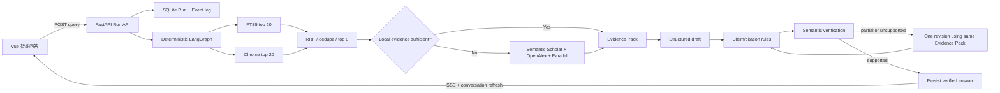

# Ped-Agent 证据问答链

## 运行边界

首版面向本机单用户，只监听 `127.0.0.1`。根发行包是 `ped-agent-core`，Python
模块仍为 `ped_agent`；`backend` 发行包是 `ped-agent-server`，Python 模块为
`ped_agent_server`，并提供仓库中唯一的 `ped-agent` CLI。

配置只从仓库根目录 `.env` 和进程环境读取，使用 `PED_AGENT_*__*` 双下划线嵌套字段。
配置修改后必须重启；Embedding 模型、Base URL 或维度变化后，还必须显式重建 Chroma。

## 请求与回答链



固定节点为：加载会话、独立问题改写、本地检索、证据判断、条件外搜、证据归一化、
草稿生成、规则校验、语义复核、条件修订、最终持久化。生成上下文只使用最近六条消息和
上一轮引用，完整历史仍保存在 SQLite。

## 证据与验证规则

- `[L]`：本地正式证据；只允许 Catalog 中 `retrieval_eligibility=official` 的片段。
- `[A]`：外部学术证据；必须获得可核验摘要。
- `[W]`：外部网页证据；必须成功抓取页面正文。
- `[I]`：单独展示的分析性推断，不伪造引用。
- 本地至少两个不同正式资源，或标题、DOI、文号精确命中时，不触发外搜。
- 每个事实 Claim 必须绑定存在的 Evidence；`partial` 必须收紧，`unsupported` 必须删除或修订。
- 只允许使用原 Evidence Pack 修订一次。二次校验仍失败时，Run 失败且草稿不展示。
- 语义复核默认失败关闭。只有 `.env` 显式设置 `PED_AGENT_VERIFY__ENABLED=false` 时，
  才允许 `rules_only`，前端会显示醒目提示。

## 本地存储

- `backend/storage/library/`：现有 Catalog、FTS5、原文与派生物，不迁移表。
- `backend/storage/agent/agent.sqlite3`：会话、消息、Run、SSE 事件、证据快照和引用。
- `backend/storage/agent/chroma/`：可重建向量索引。

SQLite 开启 WAL、外键与版本化迁移。每个会话只允许一个活动 Run，全局默认两个并发
Run。SSE 断开不取消运行；服务启动会把遗留的 `queued/running` Run 标为 `interrupted`。

## API 与 SSE

- `POST /api/conversations`
- `GET /api/conversations`
- `GET /api/conversations/{id}`
- `POST /api/conversations/{id}/runs`
- `GET /api/runs/{id}/events`，支持 `Last-Event-ID`
- `POST /api/runs/{id}/cancel`

SSE 事件为 `run.started`、`stage.started`、`stage.completed`、`evidence.summary`、
`answer.delta`、`run.completed`、`run.failed`、`run.cancelled` 和 `heartbeat`。
`stage.completed` 同时记录节点耗时、模型标识、证据 ID 或验证结果；异常只记录脱敏类型与
固定用户消息。

## 启动与索引

```powershell
Copy-Item .env.example .env
uv sync --project backend
uv run --project backend ped-agent agent doctor
uv run --project backend ped-agent library build-index
uv run --project backend ped-agent agent rebuild-vector-index
uv run --project backend ped-agent serve

cd frontend
npm ci
npm run dev
```

`.env` 修改后重启服务。Embedding 配置变化后执行 `rebuild-vector-index`。向量索引缺失、
过期或不可用时，Run 继续使用 FTS5，并通过 `evidence.summary` 标记降级。

## 故障排查

| 现象 | 检查 |
|---|---|
| `doctor` 配置无效 | 必填 model/API Key、协议拼写、Parallel/LangSmith 启用后是否有 Key |
| 本地检索报 FTS stale | 先运行 `ped-agent library build-index` |
| Run 显示向量降级 | 检查 Chroma 与 Catalog/Embedding fingerprint 后重建向量索引 |
| 浏览器断线 | EventSource 自动重连并携带 `Last-Event-ID`；Run 不会因断线取消 |
| 服务重启后旧 Run 失败 | 这是预期的 `interrupted` 恢复策略，重新提交问题 |
| Windows pytest 临时目录拒绝访问 | 使用仓库内 `--basetemp .pytest-tmp` |

CI 使用 Fake Model 和 Mock HTTP，不需要真实 Key。`doctor`、向量重建和真实端到端问答是
可选本地 Smoke Test。
