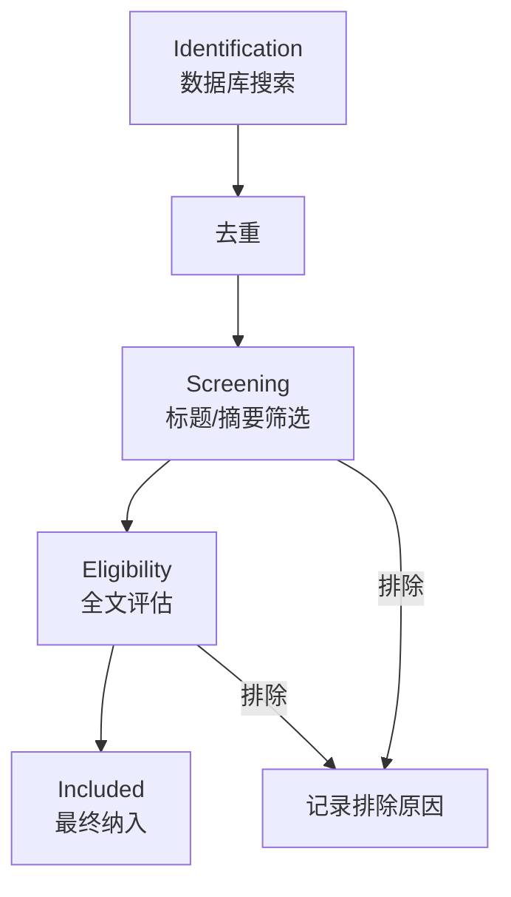
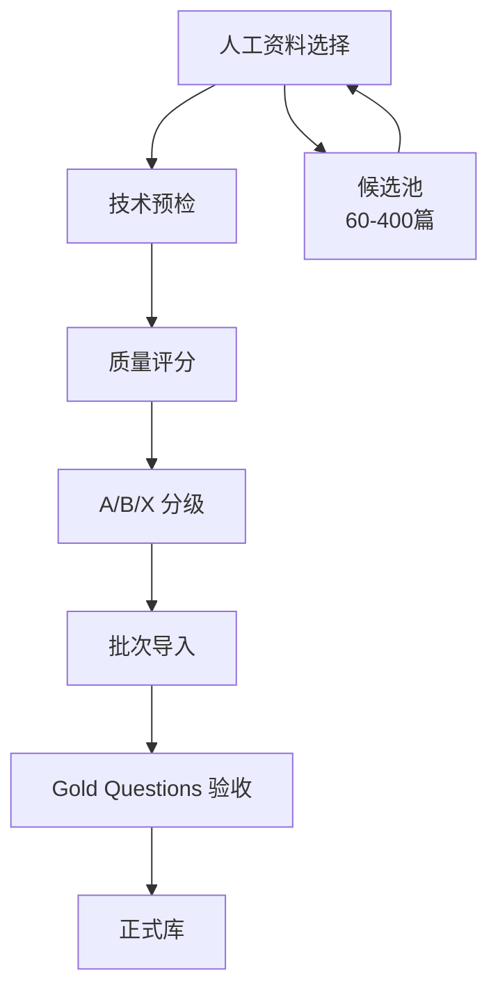

# 文献选择标准对比分析

> **status: historical** · 2026-10-07 审计标注：本文是写作当日的快照，其中“当前”“完成”等表述只指当时状态。当前 RAG 状态见 [RAG 资产与一致性审计](rag-asset-audit-2026-10-07.md)。

_PRISMA 系统性综述标准 vs Ped-Agent 现有质量标准 · 评估与建议 · status: historical（原为 analysis）_

---

## 📊 两种标准对比

### PRISMA (Preferred Reporting Items for Systematic Reviews)

**设计目的**: 医学和健康科学领域的系统性综述报告规范

**核心流程**:


**关键要素**:
- ✅ 明确的搜索策略（数据库、关键词、时间范围）
- ✅ 系统的筛选过程（双人独立筛选）
- ✅ 透明的排除记录（每一步的数量和原因）
- ✅ 纳入/排除标准的预先定义
- ✅ PRISMA 流程图和检查清单
- ✅ 高度可复现

**典型应用**: "行人流研究中的疏散模型：系统性综述"

---

### Ped-Agent 现有标准 (collection_standard.md)

**设计目的**: 为 RAG 系统构建高质量、持续更新的知识库

**核心流程**:


**关键要素**:
- ✅ 客观质量指标（中科院分区、JCI ≥ 1.0、引用量）
- ✅ 全文评分系统（主题相关性 30 + 方法严谨性 30 + RAG价值 20 + ...）
- ✅ 分级管理（A 级/B 级/X 级）
- ✅ 批次验收（每批 5 篇，Gold Questions 门禁）
- ✅ 候选池机制（试点 60-100 篇，核心 300-400 篇）
- ✅ 技术集成（与检索评测、Catalog 直接关联）

**典型应用**: "Ped-Agent 知识库 v1.0：包含 150 篇高质量行人流文献"

---

## ⚖️ 优劣势分析

| 维度 | PRISMA | Ped-Agent 现有标准 | 获胜方 |
|------|--------|-------------------|--------|
| **学术规范性** | 被广泛认可的国际标准 | 项目特定标准 | 🏆 PRISMA |
| **过程透明度** | 记录每一步筛选和排除 | 缺少详细筛选记录 | 🏆 PRISMA |
| **可复现性** | 其他研究者可完全复现 | 难以复现选择过程 | 🏆 PRISMA |
| **适合发表综述** | 系统性综述的必需标准 | 不符合综述规范 | 🏆 PRISMA |
| **RAG 系统适配** | 未考虑检索和证据价值 | 专门设计 "RAG 证据价值" | 🏆 现有标准 |
| **质量保证** | 只关注纳入/排除 | 多维度质量指标（JCI、分区、评分） | 🏆 现有标准 |
| **持续扩展** | 一次性综述，固定时间点 | 支持批次导入、候选池管理 | 🏆 现有标准 |
| **实用性** | 过程繁重，需双人筛选 | 轻量级，适合小团队 | 🏆 现有标准 |
| **技术集成** | 无技术集成 | 与 Catalog、Gold Questions 集成 | 🏆 现有标准 |
| **减少偏倚** | 明确方法减少选择偏倚 | 主观评分存在偏倚风险 | 🏆 PRISMA |

---

## 🎯 针对 Ped-Agent 的建议

### 核心判断：**项目目标决定标准选择**

#### 场景 A：如果要发表"行人流领域系统性综述"论文
→ **必须使用 PRISMA**
- 这是系统性综述的学术规范
- 期刊会要求 PRISMA 流程图和检查清单
- 重点是"全面性"和"无偏倚"

#### 场景 B：如果要发表"RAG 系统设计与实验"论文
→ **使用现有标准 + 借鉴 PRISMA 透明度原则**
- RAG 系统论文不需要遵循 PRISMA
- 但需要说明"如何构建语料库"
- 重点是"质量"和"检索效果"

#### 场景 C：如果只是构建内部研究工具
→ **使用现有标准即可**
- 实用性优先
- 快速迭代

---

## 💡 推荐方案：混合策略

**保留现有质量标准为主，补充 PRISMA 的过程透明度**

### 第 1 层：保留现有核心（不变）
- ✅ 质量门槛（分区、JCI、引用量）
- ✅ 全文评分系统（80 分门槛）
- ✅ A/B/X 分级
- ✅ 批次验收和 Gold Questions
- ✅ 候选池机制

### 第 2 层：补充 PRISMA 元素（新增）

#### 1. 文献发现过程（记录搜索策略）
在 `collection_standard.md` 或新文档中添加：

```markdown
## 文献发现策略

### 数据库
- Web of Science Core Collection
- Scopus
- IEEE Xplore（技术标准）
- 中国知网（中文文献）

### 搜索关键词
("pedestrian flow" OR "crowd dynamics" OR "pedestrian movement" OR
 "evacuation" OR "crowd safety" OR "pedestrian simulation")
AND ("fundamental diagram" OR "density" OR "speed" OR "flow rate" OR
     "bottleneck" OR "congestion")

### 时间范围
2010-01-01 至 2026-09-08

### 语言
English, 中文
```

#### 2. 筛选流程记录（记录漏斗）
```markdown
## 筛选流程（Pilot 阶段示例）

| 阶段 | 数量 | 排除数 | 主要排除原因 |
|------|------|--------|-------------|
| 初始检索 | 1,247 | - | - |
| 去重后 | 1,089 | 158 | 重复记录 |
| 标题/摘要筛选 | 312 | 777 | 主题不相关（AI/ML方法论、非行人流） |
| 分区/JCI 筛选 | 156 | 156 | 不符合分区或 JCI 要求 |
| 全文评分 | 89 | 67 | 质量评分 < 80 |
| 最终候选池 | 89 | - | - |
| 正式入库（第一批） | 5 | - | - |
```

#### 3. 排除原因分类（标准化记录）
```markdown
## 排除原因分类

| 代码 | 原因 | 示例数量 |
|------|------|---------|
| E1 | 主题不相关 | 777 |
| E2 | 分区不符（三区及以下） | 98 |
| E3 | JCI < 1.0 | 43 |
| E4 | 引用量不足 | 15 |
| E5 | 全文评分 < 80 | 67 |
| E6 | 无法获取全文 | 12 |
| E7 | 预印本/会议摘要 | 32 |
```

#### 4. 在论文中的表述
不说"遵循 PRISMA"，而说：
> "Corpus construction followed a transparent, multi-stage screening process
> inspired by systematic review principles. We searched Web of Science and
> Scopus using predefined keywords (see Appendix A), applied objective
> quality filters (journal quartile, JCI ≥ 1.0), and scored full texts
> for relevance, methodological rigor, and RAG evidence value."

---

## 📋 具体实施步骤

### 步骤 1: 补充现有文档（立即）
在 `memPed/knowledge/collection_standard.md` 中添加：
- 搜索策略章节
- 筛选流程表格模板
- 排除原因分类

### 步骤 2: 记录历史数据（回溯）
对于已入库的 5 篇文献：
- 记录它们来自哪个搜索（Web of Science？手工选择？）
- 补充筛选记录（至少记录"从 N 篇候选中选出 5 篇"）

### 步骤 3: 未来批次（前瞻）
每次批次导入记录：
- 候选数量
- 通过各阶段的数量
- 排除原因统计

### 步骤 4: 论文撰写（发表时）
- 在 Methods 部分描述搜索和筛选流程
- 提供筛选流程图（类似 PRISMA，但不必完全一致）
- 在附录提供完整的搜索字符串

---

## ✅ 最终建议

**对于 Ped-Agent 项目：现有标准 > PRISMA**

**原因**:
1. 项目目标是 RAG 系统，不是系统性综述
2. 现有标准已经包含高质量保证（分区、JCI、评分）
3. 现有标准与技术实现紧密集成
4. 持续扩展的知识库不适合 PRISMA 的"固定时间点"模式

**但应该借鉴 PRISMA 的**:
- ✅ 过程透明度（记录搜索策略和筛选流程）
- ✅ 排除原因记录（便于未来审计）
- ✅ 可复现性（其他研究者理解语料库如何构建）

**不需要采用 PRISMA 的**:
- ❌ 完整的 PRISMA 检查清单（28 项）
- ❌ 双人独立筛选（小团队不现实）
- ❌ 穷尽式搜索（RAG 重质量不重数量）
- ❌ 固定的综述时间点（知识库持续更新）

---

## 📌 结论

**Ped-Agent 应当：**
1. **保留现有质量标准**作为核心
2. **补充过程记录**（搜索策略、筛选流程、排除原因）
3. **在论文中说明**"参考系统性综述的透明度原则，但针对 RAG 系统优化"
4. **不声称遵循 PRISMA**（因为不是系统性综述）

这样既保持了实用性和技术集成，又提高了学术严谨性和可复现性。
