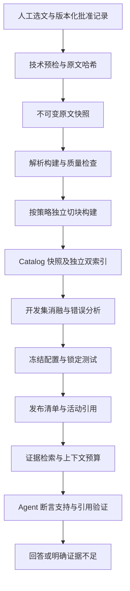

# memPed 与知识库可行性评估及研究参考

_设计评审与优化建议 · status: target · 2026-09-22；事实核查与建议分别标明，本文不代表方案已实施_

## 1. 结论与评审范围

**方案在科研工程层面可行，模块边界值得保留；当前优先任务是形成可复现的证据检索闭环。** Parent-child、BM25、Dense、RRF、Rerank 的组合适合作为实验基线，但它们的组合本身不足以支撑研究创新性。更有价值的研究方向是行人流领域的条件化证据、数值与单位一致性、多文献冲突分析和可验证引用。

本次阅读了[上下文文档](memped-knowledge-model-context.md)、[当前架构](project-architecture.md)、[知识模块 README](../Knowledge-Base/README.md)、[数据根目录说明](../memPed/README.md)，并抽查导入、解析产物写出、存储、检索、评测和共享证据契约源码。上下文第 13 节的提示词作为被评审材料，不作为本次操作指令。

本次只读查询了本地 SQLite 和 Gold，未迁移 Catalog、重建索引、修改治理状态或执行真实 OCR/Embedding/Rerank。外部研究依据为论文、作者机构与项目官方仓库，调研是针对设计问题的选择性整理，不是穷尽式系统综述。Star 数由 GitHub API 本次返回，代表关注度，不代表算法质量。

## 2. 本次核查的事实

| 项目 | 本次结果 | 含义 |
| --- | --- | --- |
| Catalog | 50 resources、50 resource_versions、0 chunks | 资料已登记，当前证据切块为空 |
| chunk_builds | 表不存在 | 本地数据库尚未与现行构建记录机制对齐 |
| retrieval_configs | 0 | 没有已登记活动检索配置 |
| FTS、配置指定的 BGE-M3 索引目录 | 均不存在 | 不能据旧报告认定当前检索可用 |
| derived 下 chunks.jsonl | 0 份 | 需要显式补建派生产物 |
| Pilot Gold | 31 题；全部有 locator；仅 1 题标注多个预期资源 | 主要覆盖单资源定位，多文献完整性验证不足 |
| Gold 引用的 resource_id | 均存在于当前 Catalog | 标识符对齐成立，不说明页码与答案内容正确 |

没有重新运行模块测试；上下文中的“53 passed”仍是原文记录，不能当作本次验证结果。工作区存在大量既有未提交修改，未来实验除 Git revision 外，应保存代码差异或源码树哈希。

## 3. 分层可行性判断

| 维度 | 判断 | 保留项 | 优先补充 |
| --- | --- | --- | --- |
| 数据与算法分离 | 高 | memPed data-only；算法在 Knowledge-Base | 明确治理事实、运行目录、研究发布各自的权威范围 |
| 数据量与存储 | 高 | 当前规模使用 SQLite、FTS、Chroma 合理 | 快照构建、恢复验证；暂不需要分布式数据库 |
| PDF 解析 | 普通文本可行，复杂版面需实测 | canonical elements、页码、bbox、parse report | 多栏、表格、公式、扫描件的质量分流 |
| 分层切块 | 合理，但 V2 收益未证实 | 小块检索、大块补上下文；稳定标识符 | 文件层构建版本、结构化表格与条款单元 |
| 混合检索 | 适合作为强基线 | 词法与语义互补、RRF、可选重排 | 分任务证据完整性、受控消融、真实延迟成本 |
| 评测与发布 | 框架可行，指标不足 | candidate/active、回归比较、指纹校验 | 纠正 Recall 语义、严格定位、冻结测试集 |
| 科研问答 | 有契约基础，尚不能证明端到端有效 | EvidenceItem、Claim、Citation 分离 | 断言支持度、适用条件、冲突与不可回答评测 |

这里的“高”指工程设计可落地，不是已经达到实验准确率。

## 4. 比新增算法更紧迫的设计问题

### 4.1 原文未变，不等于派生产物完整

[ImportService](../Knowledge-Base/src/ped_knowledge/ingestion/__init__.py) 在活动版本和源 SHA 相同时直接计为 unchanged。它不会继续检查缺失 Chunk、解析器更新或切块策略变化。因此重新导入原 Manifest，不能保证修复现有 50 篇的断点。

建议分离三个操作：原文导入、派生构建、检索发布。保留原文导入的幂等行为，新增显式的 derive/rechunk 实验入口。其构建键至少由 source hash、parser 配置/模型版本、canonical schema、chunk policy、tokenizer 指纹共同决定。

复用现有 canonical 的条件是：源哈希可验证、schema 可读取、解析器版本可追溯、元素和页码抽检合格。不满足条件的文档单独重解析。不能预先宣称旧 canonical 与新解析器输出等价。

### 4.2 Catalog 并存还不等于产物并存

[write_derived_assets](../Knowledge-Base/src/ped_knowledge/parsing/__init__.py) 将 document/elements/chunks/report 写到 resource/version 目录，使用固定文件名。source version 不变时，另一策略的 chunks.jsonl 存在覆盖风险。仅隔离 Chroma 目录不够。

建议将解析产物与切块产物分层：`source → parse build → chunk build → index build → release`。每级有独立 build id 和输入清单，报告引用具体 build；新运行使用独立目录，验证后再变更活动引用。旧数据只读保留，不要求一次性改写全部历史路径。

发布清单绑定同一份 Catalog 快照、FTS、Dense、模型、配置与 Gold。FTS 的单文件原子替换不能自动保证两路索引属于同一发布。初期采用本地批处理和单写入者即可，不需要任务队列或服务化。

### 4.3 official 混合了资料审批与来源权威

[存储层](../Knowledge-Base/src/ped_knowledge/storage/__init__.py) 将技术 Manifest 的 include 映射为 approved/official；[证据转换](../Knowledge-Base/src/ped_knowledge/retrieval/__init__.py) 又统一输出 authority="official"。这样容易让“本地已收录论文”与“官方法规来源”被下游混为一谈。

建议把三件事分开：

- 治理决定：谁在何时、依据哪个规则版本、针对哪个源版本批准收录；
- 检索资格：允许检索、待审核、已排除、已撤回；
- 来源类型：原始研究、综述、标准、法规等，并保留发布机构。

治理仍在线下进行；导入只验证 approval id、对应 source hash 和批准记录哈希，不在每次导入时重跑期刊评价。历史 50 篇应对账，未知状态不能自动补写“批准通过”。探索性实验可使用明确标记的实验语料快照，但不能据此发布为正式治理通过的库。

期刊分区和引用量可以继续作为采集策略，但我的建议是降低其对“证据价值”的代理作用：高分区不保证某个结论适用；引用阈值会压缩新研究、小领域工作和复现实验的覆盖。保留现有规则作为一个版本，再离线比较严格筛选语料与增加相关性人工特批语料的回答覆盖、错误引用和人工成本，未经实验不要直接改准入规则。另需消除 literature_quality_rules.yaml 中旧 JCI 数值门槛与当前规则的漂移。

### 4.4 当前评测可能高估证据能力

[evaluate_rankings](../Knowledge-Base/src/ped_knowledge/evaluation/__init__.py) 中 recall_at_k 是命中任意预期资源即得 1，应叫 Hit@K。对于需要 A、B、C 三篇的比较问题，只找到 A 仍会得满分。

建议保留旧字段兼容历史报告，但标注 metric schema 版本，新增：

- Resource Recall@K：命中的不同相关资源数 / 标注相关资源总数；
- Complete Evidence@K：是否找齐该问题必须的证据组；允许标注等价替代证据；
- Evidence Span Hit：是否命中具体证据段落、表格单元或条款；
- Citation Precision / Coverage：引用是否支持断言，关键断言是否都有依据；
- 不可回答问题的正确拒答率，以及可回答问题的误拒答率。

locator 当前使用子串判断，存在 `p.2` 匹配 `p.20` 的逻辑风险；资源列表与 locator 列表又未逐项绑定，多文献时可能把 A 的页码套到 B。应改为结构化证据标注：resource_id、version_id、page_index、printed_page_label、element/span 或 table/row/cell。现有无 locator 的题会被计为定位命中；本次 31 题都有 locator，尚不受这条分支影响，未来应单列未标注覆盖率。

31 题适合冒烟和开发回归，一题就对应约 3.23 个百分点，不能把少量涨分等同于稳健提升。评测数据应按论文族/近重复内容及问题模板划分开发集和锁定测试集；同一论文的改写题避免跨集合。测试论文仍在可检索语料中，这是正常 RAG 设置，泄漏问题在于用测试标签调参。扩大到 100 题仍需检查分层样本量，报告逐题差异和按问题族重采样的不确定性。

### 4.5 科研证据需要条件，不只是来源与句子

当前“至少两个资源或精确标题/DOI 即 sufficient”的规则只能作启发式路由。一篇准确的条款可能足够，两篇无关论文也可能完全不够。

建议先定义问题需要哪些证据槽位：研究对象、场景、方法、结果、适用条件，再判断覆盖情况。行人流领域尤其应保留场景几何、瓶颈宽度、单/双向流、密度定义、速度定义、比流率与总流量、单位、实验/模拟类型、样本群体和不确定性。

例如比较两个瓶颈实验时，应输出“在什么宽度、密度定义和单位下报告了什么结果”，不能直接把数值当作可比结论。由模型抽取的条件先标为候选，链接原文 span，经抽样复核后再用于自动过滤。字段缺失表示未知，不能推断成不满足条件。

Parent context 可用于理解，但若答案引用 parent 中不在 child quote 内的事实，应补发对应 EvidenceItem 或可核验 span。摘要、条件抽取和后续方法卡均是派生解释，不能替代原始引文。

## 5. 推荐流程

以下为目标流程，不代表当前已实现。

解析层采用质量驱动分流：普通数字 PDF 保留 PyMuPDF；多栏顺序混乱、表格密集、公式或扫描页进入 Docling/MinerU/VLM 对照。不能只以“有文本”判断解析成功；参考文献标题误识别、正文截断、单位丢失、表头错配均可能保留大量文本。对于 References 后的附录，优先标记章节类型并决定检索范围，避免一律截断丢失方法细节。

最低可验证闭环先选 5—10 篇覆盖不同版式的文档，证明 source → quote → page 可回溯，再扩到现有 50 篇。先建立 FTS 和 Dense 各自的结果与成本，随后混合。真实模型不可用时可以单独完成 FTS 实验，但不能宣布双路基线通过。

## 6. 值得借鉴的开源项目

Star 为本次 GitHub API 查询快照，四舍五入到 0.1k；选择重点是与当前问题的匹配度。

| 项目 | Star | 官方设计中值得关注的部分 | 对 memPed 的建议 |
| --- | ---: | --- | --- |
| [Docling](https://github.com/docling-project/docling) | 67.6k | 统一 DoclingDocument、阅读顺序、表格与布局、结构化 JSON、本地运行 | 优先评估解析适配器，映射回现有 canonical、page、bbox |
| [MinerU](https://github.com/opendatalab/MinerU) | 80.5k | 复杂文档到结构化 Markdown/JSON，公式与表格处理 | 选复杂学术页面与 Docling、PyMuPDF 同页比较，保留原始输出 |
| [RAGFlow](https://github.com/infiniflow/ragflow) | 91.1k | 文档理解、按文档类型切块、多解析器接入 | 借鉴 Paper/Laws/Table 的差异化处理；其完整部署架构不适合作为本项目直接迁移目标 |
| [PaperQA](https://github.com/Future-House/paper-qa) | 9.2k | 科学文献检索、证据汇集、相关性筛选、上下文摘要和带引文回答 | 最接近科研问答用途；在 Agent/experiments 层借鉴证据整理和缺口补检索 |
| [LightRAG](https://github.com/HKUDS/LightRAG) | 39.8k | 实体/关系图与双层检索、增量更新 | 仅在跨文献关系题上做候选实验；每条关系仍链接原文证据 |
| [GraphRAG](https://github.com/microsoft/graphrag) | 36.1k | 从文本抽取结构化图，支持面向全局信息组织的检索方法 | 作为“领域主题与研究关系综述”对照；项目官方也提示索引成本可能较高 |

建议阅读优先级：Docling/MinerU → PaperQA → RAGFlow 的解析与切块 → LightRAG/GraphRAG。项目主分支会变化，正式实验固定 release/commit、解析模型和配置。上述排序是针对本仓库的工程判断，不是通用排行榜。

## 7. 相关研究及可迁移设计

| 研究 | 时间与来源 | 适合借鉴的内容 | 当前阶段判断 |
| --- | --- | --- | --- |
| OpenScholar / ScholarQABench | [Nature，2026-02-04](https://www.nature.com/articles/s41586-025-10072-4) | 多论文科学问答、专家评分要求、引用评价、检索后反馈修订 | 高优先级：借鉴评测任务和答案评分标准；不必复刻其大规模语料与训练 |
| OmniDocBench | [论文，2024；CVPR 2025 官方项目](https://github.com/opendatalab/OmniDocBench) | 文档解析按文本、表格、公式和阅读顺序等维度评价 | 高优先级：建立本领域解析小基准，避免仅测 PDF 是否可打开 |
| MMDocRAG | [NeurIPS 2025 论文](https://proceedings.neurips.cc/paper_files/paper/2025/file/1a93178950e92fd2e7b7448f7d68fd7d-Paper-Datasets_and_Benchmarks_Track.pdf) | 跨页、跨模态证据链；包含 4,055 个专家标注问答对 | 中高优先级：设计正文+表格/图联合证据题，而非立即引入全套多模态索引 |
| PaddleOCR-VL-1.5 | [2026 技术报告](https://arxiv.org/abs/2601.21957) | 0.9B 视觉语言文档解析和真实场景稳健性 | 作为扫描/复杂页面候选；报告中的基准表现不等于本地数据表现 |
| Late Chunking | [2024，2025 修订](https://arxiv.org/abs/2409.04701) | 先做长文本 token 编码，再按 chunk 聚合向量，保留块外上下文 | P2：仅在跨段指代丢失是主要错误时实验；与检索后返回 parent 是不同机制 |
| BGE-M3 | [2024，2025 修订](https://arxiv.org/abs/2402.03216) | 同一模型支持 dense、learned sparse、multi-vector；多语与较长输入 | 先验证现有 Dense；其 learned sparse 不等于 FTS BM25，多向量还需要不同索引与成本评估 |

Late Chunking 需要 token 级表示与正确的 span pooling，不能只把现有 embedding 最大长度调大就声称实现；也不能默认 BGE-M3 当前句向量接口直接支持论文方法。

上述研究共同提示的可借鉴方向是：文档结构、证据完整性和引用可靠性应进入评测。它们没有证明 GraphRAG、VLM 或任一新模型在本项目一定更好。

## 8. 可归因实验矩阵

首先冻结语料清单、解析产物、Gold、实际代码快照、模型权重哈希和运行环境；每组写新目录。下面是实验建议，不是已经运行的结果。

| 组 | 唯一主要变化 | 回答的问题 |
| --- | --- | --- |
| A0 | V1 + 固定词法配置 + BM25 | 稀疏基线能否工作，精确术语表现如何 |
| A1 | 相同 V1 产物 + Dense | 语义和跨语言检索的收益与成本 |
| A2 | A0/A1 用固定 RRF 融合 | 混合检索是否真的互补 |
| B0 | A2 只改 V2 切块 | tokenizer/句子边界组合是否改善证据定位 |
| B1 | 固定选定切块，只改词法配置 | 领域词表、停用词对中英文检索的净效果 |
| C0 | 固定检索，仅加真实 Reranker | 重排带来的相关性收益和延迟代价 |
| C1 | 固定排序，仅改 parent 去重/上下文预算 | 答案支持度是否改善、输入 token 是否下降 |
| D0 | 固定其余条件，仅替换困难页解析器 | 解析改善是否传递到证据召回和数值准确性 |

V2 同时包含 tokenizer 与边界变化，B0 只能证明“V2 整包变化”的效果。若论文声称某项机制的独立贡献，再追加“真实 tokenizer+固定窗口”等桥接对照，避免归因过度。不要同时改切块、解析器、embedding 和重排后把全部收益归给某一个算法。

每组记录 Hit/Recall/MRR/nDCG、定位、完整证据、实际检索模式与降级原因、索引时间、磁盘、峰值显存、查询 p50/p95、rerank 时间和生成输入 token。热身与冷启动分开、固定硬件和查询顺序；正式双路实验若降级为单路，应标记为不符合该实验配置，不能悄悄比较。

`max_chunks_per_resource=2` 适合增加多样性，但可能截断单篇方法问题所需的三段证据。开发集比较固定上限与按问题类型调整；先做确定性的题型规则，无需先建复杂 Agent。

## 9. 阶段交付与验收

以下质量目标是建议起点，应在开发阶段确认并在锁定测试前冻结，不能根据测试结果事后降低。

| 阶段 | 修改或实验位置 | 最小交付 | 验收依据 | 迁移风险控制 |
| --- | --- | --- | --- | --- |
| P0：资产与治理对账 | governance/storage；实验在 experiments | 50 篇状态表、源哈希、批准证据或明确 unknown、规则差异清单 | 每个资源状态可解释；不把 include 当作批准凭据 | 只读盘点；新建快照 |
| P0：恢复基线 | ingestion/parsing/chunking/indexing 的实验入口 | 小样本贯通后扩到 50 篇的独立构建与报告 | 相同输入重建 Chunk id 一致；孤立 parent、失效 locator、跨策略混用为 0；模型实际运行有记录 | schema 迁移先在副本演练；旧 derived/索引保留 |
| P1：评测可信 | evaluation 与 Gold | 版本化新指标、资源绑定定位、开发/测试划分、逐题错误 | 旧 Pilot 门槛仅作冒烟；另测完整证据、不可回答、关键子类 | 新旧指标并报，禁止把数值直接当成同一口径历史趋势 |
| P1：证据质量 | parsing、检索上下文；跨模块在 experiments | 版式抽检集、表格/公式证据、条件化研究结果卡 | 先抽 10—15 篇、约 50 个代表页面；关键数字/单位错误逐条归因；未解决严重错误不进入高置信回答 | 对照解析写新 build，不覆盖原文或旧结果 |
| P1：端到端问答 | Agent + Contracts 实验适配 | 多文献比较、法规适用、证据不足等问题的答案评审 | 分别评价关键断言支持、条件/单位一致、引用精确、误拒答；人工抽查校准模型裁判 | 共享契约扩展先保留兼容；不把摘要当原文 |
| P2：前沿算法 | experiments | Late Chunking、图检索或视觉检索中的单项候选 | 对已发现失败类型有稳定收益，且成本可接受 | 不改变主基线，未胜出不激活 |

纯文档评审不需要新增实现测试。后续如修改跨模块 EvidenceItem，按仓库规则先跑模块测试再跑完整套件；真实模型实验与单元测试分别报告。

## 10. memPed 后续扩展及研究价值

conversations 与 methods 继续作为预留边界。会话摘要是可能出错的派生材料，不能自动成为文献事实；approved 方法应有来源、适用条件、参数、版本、批准记录与可复现实验链接。建议从轻量版本化方法卡开始，业务逻辑仍留在 Agent/Knowledge-Base/Video-Analysis 中，不急于建设通用会话记忆库。

一个更有辨识度的研究问题是：**在行人流多文献问答中，加入场景、测量定义、单位及原文定位约束，能否减少错误比较和无依据结论？**

可比较普通 Hybrid RAG、加入结构化证据约束的 RAG、再加入证据缺口补检索的系统。核心结果应是断言支持率、条件匹配正确性、单位错误率、多文献证据完整性和拒答质量，同时报告成本。需要先建立人工标注与强基线，不能仅凭工程组件组合宣称创新。

建议下一次投入聚焦四项：资产/批准对账、不可覆盖的派生构建、可信的 Gold 指标、真实 V1/V2 对照。它们完成后，才有证据决定是否值得增加图、视觉检索或长期记忆。
