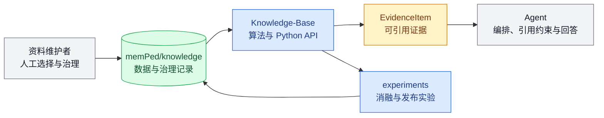
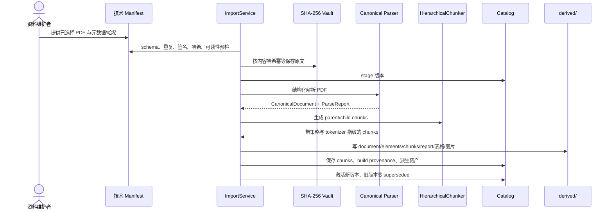
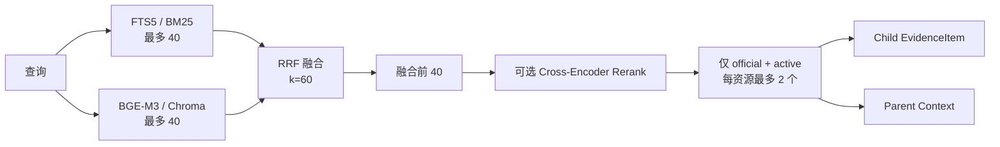
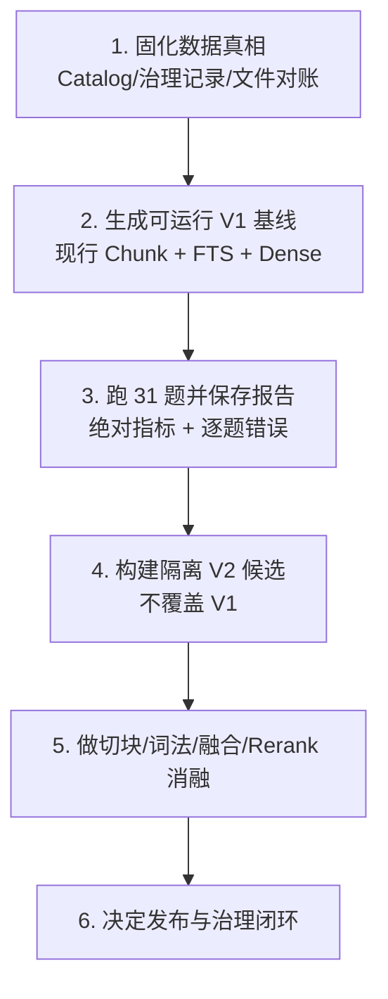

# memPed 与知识库设计上下文

_供模型理解、设计复盘与优化讨论使用的自包含上下文 · status: historical · snapshot: 2026-09-22_

---

> **历史快照：**本文中“当前”“本地已存在”和测试数量仅表示 2026-09-22 的观察结果，不能作为后续导入、解析或索引操作的依据。现行行为以 [`Knowledge-Base/README.md`](../Knowledge-Base/README.md)、[`memPed/README.md`](../memPed/README.md) 和 [`project-architecture.md`](project-architecture.md) 为准；Adobe 可选解析器及其对照入口已在这些当前文档中说明。

## 0. 使用说明

本文可整段输入给模型。它回答四个问题：

1. `memPed` 与 `Knowledge-Base` 各自负责什么；
2. 当前代码已经实现了哪些模块、算法与约束；
3. 本地数据资产目前实际处于什么状态；
4. 下一轮设计讨论应优先解决哪些断点。

本文严格区分以下状态：

| 标签 | 含义 |
| --- | --- |
| **代码已实现** | 存在代码与测试，不代表本地真实模型/索引已经运行 |
| **本地已存在** | 当前工作区确实存在对应数据或资产 |
| **已验证** | 本次快照运行了相应验证并得到结果 |
| **candidate** | 已实现的候选方案，尚未成为活动检索基线 |
| **reserved / target** | 仅约定边界或目标，不应当作现有能力 |

事实优先级为：当前代码与测试 → 模块 README → `docs/project-architecture.md` → 设计文档与历史报告。本快照保留当时的资产数字，不用于推断后续工作区状态。

## 1. 一句话概括

`memPed` 是行人流研究的本地数据与治理根目录，`Knowledge-Base` 是把经人工选择的文献/法规转换成可追溯证据的算法模块；两者共同形成“治理—导入—解析—切块—索引—混合检索—评测—证据输出”链路，但当前本地资产实际停在“50 篇文献已入 Catalog 且完成解析，现行 Chunk 与索引尚未重建”的中间状态。

## 2. 设计心智模型

可以把系统理解为一座研究图书馆：

- `memPed/knowledge/` 是书库、目录卡、加工产物和验收题库；
- `Knowledge-Base/` 是收书、编目、拆页、建索引、找资料和考试验收的方法；
- `Contracts/` 是交给其他模块的标准证据卡片；
- `Agent/` 是使用证据卡片写研究回答的人；
- `experiments/` 是比较不同检索方案的实验记录簿。



角色—能力用例图见 [`assets/memped-knowledge-use-cases.svg`](assets/memped-knowledge-use-cases.svg)，也可直接查看其 [`PNG 预览`](assets/memped-knowledge-use-cases.png)。

## 3. 边界与依赖方向

### 3.1 模块职责

| 模块 | 当前职责 | 明确不负责 |
| --- | --- | --- |
| `memPed/` | 本地研究数据、治理记录、Catalog、派生资产、模型、索引、Gold Questions | Python 业务逻辑 |
| `Knowledge-Base/` | 技术预检、解析、切块、存储、索引、检索、Rerank、评测 | 最终答案生成、视频推理、Web 服务 |
| `Contracts/` | 跨模块稳定证据与回答数据结构 | 算法和存储 |
| `Agent/` | 证据编排、外部搜索、引用规则、研究回答 | 文档导入与索引实现 |
| `experiments/` | 可复现实验定义、参数、指标与输出引用 | 可复用核心实现 |

### 3.2 依赖原则

- `Knowledge-Base` 只通过 `ped_contracts` 向外输出稳定证据，不依赖 `Agent`。
- `Agent` 通过 `LocalEvidenceRetriever` 端口消费证据，不应读取 `memPed` 内部数据库。
- `memPed` 保持 data-only；代码和脚本不能放入该目录。
- 新的跨模块行为先进入 `experiments/`，契约稳定后再下沉到公共 API。
- 当前不是 Web 产品，不引入 FastAPI、Vue、SSE、任务队列、会话数据库或产品级可观测性。

## 4. 当前本地资产快照

以下数据来自 2026-09-22 对当前工作区的只读检查。

### 4.1 已存在资产

| 项目 | 当前状态 | 解释 |
| --- | ---: | --- |
| Catalog 资源 | 50 篇 `literature`，均标记 `official` | 50 个资源、50 个版本 |
| 原文 Vault | 50 份 PDF，约 363 MB | `literature/files/` |
| 派生版本 | 50 份 | 每份有 `document.json`、`elements.jsonl`、`parse_report.json` |
| 派生文件总数 | 2961 | 大量来自抽取图片 |
| Pilot Gold | 31 个问题 | 符合当前运行时 schema |
| Core Gold | 0 个问题 | 尚未建设 |
| BGE-M3 本地模型 | 66 个文件，约 7.59 GB | `config.json`、`tokenizer.json`、`pytorch_model.bin` 存在 |
| 候选记录 | `candidates.csv` 63 行 | 不等于已正式治理通过 |
| Batch 3/4/5 incoming | 16 / 23 / 17 份 PDF | 尚不能据此认定已入正式库 |

### 4.2 当前断点

| 项目 | 当前状态 | 影响 |
| --- | --- | --- |
| Catalog `chunks` | **0** | 不能从当前 Catalog 构建或查询官方 child evidence |
| `chunk_builds` 表 | 当前本地数据库中不存在 | 说明本地 Catalog 尚未执行现行 schema 初始化/迁移 |
| 派生 `chunks.jsonl` | **0 份** | 现有 50 份派生结果来自较早流程，未包含现行 Chunk 产物 |
| `fts.sqlite3` | 不存在 | 稀疏检索当前不可运行 |
| Chroma 索引目录 | 不存在 | 稠密检索当前不可运行 |
| `retrieval_configs` | 0 条 | 没有已发布的活动检索配置 |
| 正式治理 Manifest | literature/regulation 的 pilot/core 均为 0 条 | Catalog 的 `official` 标志不能证明 50 篇均通过当前离线质量规则 |
| Core Gold | 0 条 | 无法执行核心阶段 100 题门禁 |

因此必须区分两句话：

- **代码层**：完整检索链路已实现并通过单元测试；
- **数据运行层**：当前本地库尚未形成可用的现行 Chunk、FTS、Chroma 和已发布配置。

本次验证结果：`Knowledge-Base/tests` 共 **53 passed in 3.49s**。这证明代码契约和测试样例成立，不等价于真实 OCR、BGE-M3、GPU、Chroma、Rerank 或 31 题 Gold 已实际跑通。

## 5. 数据资产设计

```text
memPed/
├─ knowledge/
│  ├─ literature/{files,records}/
│  ├─ regulations/{files,records}/
│  ├─ derived/<resource-id>/<sha>/
│  ├─ models/bge-m3/
│  ├─ indexes/bge-m3-1024/
│  ├─ reports/
│  ├─ knowledge.sqlite3
│  ├─ fts.sqlite3
│  ├─ taxonomy.yaml
│  ├─ quotas.yaml
│  ├─ literature_quality_rules.yaml
│  ├─ pilot_gold.jsonl / pilot_config.json
│  └─ core_gold.jsonl / core_config.json
├─ conversations/          # reserved，未实现稳定契约
└─ methods/                # reserved，未实现稳定数据库 schema
```

### 5.1 权威资产与可重建资产

| 类别 | 资产 | 性质 |
| --- | --- | --- |
| 治理事实 | CSV、Manifest、分类、配额、Gold、评测配置 | Git 中可追踪 |
| 原始内容 | SHA-256 Vault PDF | 本地权威，不可由其他资产重建 |
| Catalog | `knowledge.sqlite3` | 运行时权威目录，但必须与治理记录对齐 |
| 派生内容 | canonical document、elements、chunks、parse report、表格、图片 | 可由原文 + 解析器/策略版本重建 |
| 检索索引 | FTS5、Chroma | 可由 Catalog + 模型/分析器配置重建 |
| 模型 | BGE-M3 本地权重 | 权重不进 Git，配置和哈希应进 Git |
| 运行报告 | Gold 评测、审计、消融结果 | 单独命名，不覆盖旧结果 |

### 5.2 主题和规模设计

文献分为五个主题：行人流基础理论、实验与测量、设施与场景流动、疏散行为与模型、安全风险与干预。法规分为建筑消防与疏散、公共交通与公共空间、应急管理与大型活动、无障碍与步行设施、国际标准对照。

- Pilot 目标：20 篇文献 + 8 份法规；文献候选池 60—100。
- Core 目标：120 篇文献 + 40 份法规；累计候选池 300—400。
- 当前 Catalog 的 50 篇文献规模不等于 Pilot/Core 治理阶段已经验收，因为正式治理 Manifest 仍为空。

## 6. 两套 Manifest 与两类门禁

这是当前最容易混淆的设计。

### 6.1 治理 Manifest：离线资料质量审计

位置：`ped_knowledge.governance`。

它回答“这份资料值不值得进入正式研究语料”。主要规则包括：

- 文献必须有 DOI 或稳定来源，正式入库时需要作者、期刊、日期、正式发表状态和完整性状态；
- 中科院分区、JCI Quartile、JIF Quartile 取可用结果中的最佳排名；A 级要求最佳排名为 1，B 级允许 1—2；
- 数值 JCI 只作为参考元数据，不直接决定 A/B；不采集数值 JIF；
- 引用数据来自 Web of Science，必要时可用 Scopus；
- 质量分不低于 80；撤稿/关注声明不能进入官方检索；
- 按文献年龄应用 20/100/500 次引用阈值，18 个月内必须为 A 级；
- Pilot/Core 还检查主题、A/B/X 比例、年份结构、中文文献比例和法规配额。

这一套规则是**人工选择与离线审计**，不是活动导入服务的在线强制门禁。

### 6.2 技术 Manifest：活动导入链

位置：`ped_knowledge.contracts.IngestionManifest` 与 `ped_knowledge.ingestion`。

它回答“这份已经被选中的 PDF 能否可靠导入”。检查内容为：

- `resource_id`、类型、标题、语言、PDF 路径和 64 位 SHA-256；
- 同一批中的 resource id、DOI、SHA-256 去重；
- 文件存在、PDF 签名为 `%PDF-`、哈希匹配；
- PyMuPDF 可打开、非加密、至少一页、页面文本可读取；
- 导入失败时把已 staged 的版本标记为 `failed`，不激活失败版本。

### 6.3 当前风险

技术 Manifest 的 `include=true` 会让成功激活的资源成为 `official`，但活动链不会重新执行治理质量门禁。设计依赖一个外部前提：**只有人工已经审核通过的资料才会生成 `include=true` 的技术 Manifest**。当前正式治理 Manifest 为空，因此这个前提没有形成机器可验证的闭环。

## 7. 端到端导入流程



失败隔离逻辑：每份文档独立处理；已 stage 后失败则标记版本 `failed`，继续处理下一份。若同一资源的 SHA-256 与当前活动版本相同，则计为 `unchanged`。

## 8. 模块与算法细节

### 8.1 `contracts/`：内部稳定结构

主要结构包括：

- `IngestionManifest`：技术导入描述；
- `CanonicalDocument/Page`、`DocumentElement`：结构化文档；
- `ParseReport`：解析质量与降级原因；
- `ChunkingPolicy`、`KnowledgeChunk`：层次切块与 provenance；
- `EmbeddingGateway`、`VectorSearch`、`RerankGateway`、`OCRGateway`：可替换外部能力协议；
- `EvidenceHit` / 跨模块 `EvidenceItem`：检索结果和 Agent 可消费证据。

关键 provenance 字段包括资源/版本/Chunk id、源哈希、解析器版本、策略版本、tokenizer 指纹、元素 lineage、页码 locator、字符偏移和 `hard_split`。

### 8.2 `parsing/`：结构化 PDF 解析

本快照的默认解析器版本为 `pymupdf-structured-v2`，其算法流程为：

1. 用 PyMuPDF 按阅读顺序读取文本 block；
2. 统计多页顶部/底部重复行，过滤可能的页眉页脚；
3. 用正则、字号相对中位数和位置启发式分类为标题、标题层级、段落、列表、图表标题、条款等；
4. 维护 `heading_path`，为元素附加页码、bbox、顺序和 locator；
5. 用 `find_tables()` 抽表并保存 JSON/HTML；抽取 PDF 内嵌图片；
6. 文献遇到 `References/Bibliography/参考文献` 后停止继续索引；
7. 无文本页在配置 OCR gateway 时走 OCR，否则记录空页、人工复核页和降级原因；
8. 输出 canonical document、elements、parse report 和派生资产哈希。

这里的结构识别是确定性启发式，不是版面理解模型。优点是可复现和低成本，缺点是多栏排版、复杂公式、扫描件、错误字号和非标准标题可能误判。

### 8.3 `chunking/`：Parent-child 分层切块

Parent 用于给 child 提供更宽上下文，Child 用于建立索引和作为直接证据。

默认预算：

| 层级 | target | max | overlap |
| --- | ---: | ---: | ---: |
| Parent | 1200 tokens | 1800 tokens | - |
| Child | 320 tokens | 450 tokens | 48 tokens |

Parent 先按 `heading_path` 变化和 token 上限分组；达到 target 后封口。图片元素不参与文本切块。Chunk id 由资源、版本、策略、层级、父 id、tokenizer 指纹、元素 lineage 和文本哈希共同确定，因此相同输入与配置能生成相同 id。

#### V1：当前默认基线

- 策略名：`parent-child-v1`；
- 默认使用 `RegexTokenCounter`；
- 正则把英文数字串、单个汉字和其他非空白字符视为 token；
- Child 使用固定 token 窗口和 48 token overlap；
- 优点：兼容、确定性强；缺点：可能在句子中间切断，计数不等于 BGE-M3 真正 token 数。

#### V2：已实现 candidate

- 策略名：`parent-child-v2`；
- 使用固定 SHA-256 的本地 BGE-M3 `tokenizer.json`；
- 优先尊重元素、段落和中英文句子边界；
- 识别常见英文缩写，避免在 `e.g.`、`et al.`、`Fig.` 等位置误切；
- 只在单个原子句超过 450 token 时回退为 token 窗口，并标记 `hard_split=true`；
- 保存 child 在 parent 文本中的字符起止位置；
- V1/V2 可以在同一版本的 Catalog 中按 `policy_version` 并存。

V2 尚未成为活动基线；发布前必须在独立索引上执行真实 BGE-M3 与 31 题 Gold 评测，并通过绝对门槛和相对 V1 的回归门槛。

### 8.4 `storage/`：Vault、Catalog 与版本管理

#### Content Vault

- 重新计算 SHA-256，拒绝不匹配文件；
- 保存为 `<hash前2位>/<完整hash>.pdf`；
- 已存在相同内容时不重复复制。

#### Catalog

SQLite schema 主要包含：

- `resources`：资源级元数据和活动版本；
- `resource_versions`：原文版本、状态、解析器与派生路径；
- `chunks`：按策略保存 parent/child；
- `chunk_builds`：策略、tokenizer、源指纹和数量；
- `resource_relations`、`resource_identifiers`：替代关系和 DOI；
- `derived_assets`：派生文件及内容哈希；
- `retrieval_configs`：candidate/active/superseded 检索配置与评测报告。

新版本激活时旧活动版本转为 `superseded`；官方索引只读取 `official + active version + child + 指定 policy`。Catalog 指纹由有序的 chunk id 和文本计算，用来检测索引是否陈旧。

### 8.5 `tokenization/` 与词法分析

- `RegexTokenCounter`：V1 兼容计数；
- `HuggingFaceTokenCounter`：从本地 `tokenizer.json` 加载，并校验文件 SHA-256；
- `JiebaLexicalAnalyzer`：使用独立 jieba 实例，加载行人流领域词表和中英文停用词；
- 词法分析器指纹由版本、领域词表文件哈希和停用词文件哈希计算；索引与当前分析器指纹不同则拒绝查询。

### 8.6 `indexing/`：稀疏与稠密索引

#### 稀疏索引：SQLite FTS5 + BM25

- 索引字段：title、heading、body；
- 预先使用 versioned jieba 分词，再交给 FTS5 `unicode61`；
- 查询 token 使用 OR 连接，提高至少命中一个领域词的召回；
- BM25 字段权重：title 3.0、heading 1.5、body 1.0；
- 重建到临时数据库后原子替换目标文件；
- 元数据记录 Catalog、词法分析器、Chunk 策略、tokenizer、Gold 和代码版本指纹。

#### 稠密索引：BGE-M3 + Chroma

- 模型：`BAAI/bge-m3`；
- 目标配置：CUDA、FP16、1024 维、embedding batch 8、最大长度 1024、向量归一化；
- `ChromaVectorIndex` 默认写入 `ped_agent_official_evidence` collection；
- 构建批次默认 64，Embedding 实际批次由 gateway/模型配置决定；
- 距离取负数作为排序 score；
- metadata 记录 Catalog、embedding、policy、tokenizer、lexical、Gold、代码版本等指纹。

代码接口已实现，本地模型文件存在；但当前 Chroma 索引不存在，本次也没有执行 GPU embedding 冒烟测试。

### 8.7 `retrieval/`：混合检索

默认参数：

| 参数 | 默认值 | 作用 |
| --- | ---: | --- |
| `recall_limit` | 40 | 每路初召回数量 |
| `fusion_limit` | 40 | RRF 后进入后续阶段的最大数量 |
| `rrf_k` | 60 | RRF 平滑常数 |
| `max_chunks_per_resource` | 2 | 最终结果的单文献去重上限 |
| 最终 `limit` | 8 | `retrieve()` 默认调用示意值，实际由调用者指定 |

流程：



RRF 分数为各路 `1 / (60 + rank)` 之和，不依赖不同检索器原始分数的量纲。可选 Cross-Encoder 对 `(query, child text)` 重排；模型延迟加载，分数使用有界 LRU 缓存。Rerank 失败时降级回 RRF。

降级与拒绝原则：

- FTS 不可用时可以只用向量；向量缺失、陈旧或 embedding 指纹变化时可以只用 FTS；
- Reranker 失败可以回退 RRF；
- 两路都不可用时抛出 `IndexStaleError`；
- policy、tokenizer、词法、Catalog 或 embedding 指纹不匹配时拒绝/降级，避免静默混用不同实验资产。

最终证据使用 child 文本作为可引用 quote，同时单独返回 parent 全文作为生成上下文。`retrieval_is_sufficient` 的当前简单规则是：至少覆盖两个不同资源，或查询精确等于某个 title/DOI/document number。

### 8.8 `evaluation/`：Gold 与发布门禁

Gold schema：`question_id`、`query`、至少一个 `expected_resource_ids`、可选 `expected_locators`。仓库中的额外难度、问题类型和主题字段因 Pydantic 默认允许忽略额外字段而不影响运行。

指标：

- `Recall@K`：每题前 K 中是否命中任一预期资源，再对问题取均值；这里实际是 hit rate 语义；
- `MRR`：第一个相关资源排名的倒数均值；
- `nDCG@K`：同一预期资源只在最高排名计一次，避免多个 Chunk 令 nDCG > 1；
- `locator_hit_rate`：命中预期资源的同时，locator 包含预期页码/条款；
- `non_official_leakage`：非正式资源泄漏比例，门槛为 0。

Pilot 当前门槛：至少 30 题、K=5、Recall@5 ≥ 0.80、MRR ≥ 0.70、locator hit rate ≥ 0.75、非官方泄漏率 = 0。当前配置未显式提供 `minimum_ndcg_at_k`，因此使用代码默认值 0；Core 除至少 100 题外使用相同阈值。

Candidate 发布还可以与 baseline 比较 Recall、MRR 和 nDCG 回归幅度。只有绝对门槛和相对回归门槛都通过，配置才注册为 `active`，否则保留为 `candidate`，不会替换现有活动配置。

## 9. 证据如何进入 Agent

Knowledge-Base 把 child 转换成跨模块 `EvidenceItem`：

- `evidence_id = local:<chunk_id>`；
- 来源为 `LOCAL_OFFICIAL`；
- 保存 title、quote、locator、URL/DOI/文号、resource/version/chunk id；
- 保存检索时间、quote 内容哈希和 score；
- parent context 作为单独映射提供，用于回答生成时补足语境。

Agent 只依赖共享证据契约和本地检索端口，再进行外部检索决策、证据打包、草稿生成、引用规则验证、语义审查与修订。最终答案生成不属于 Knowledge-Base。

## 10. 已实现、候选、未验证矩阵

| 能力 | 代码 | 测试 | 当前本地资产/真实运行 |
| --- | --- | --- | --- |
| 技术 Manifest 预检 | 已实现 | 已通过 | 有多个导入 Manifest |
| SHA-256 Vault | 已实现 | 已通过 | 50 份 PDF |
| Canonical 解析 | 已实现 | 已通过 | 50 份旧派生解析结果 |
| OCR gateway | 协议已实现 | fake gateway 覆盖 | 未验证真实 OCR |
| Parent-child V1 | 已实现，默认 | 已通过 | 当前 Catalog 无 Chunk |
| Parent-child V2 | 已实现，candidate | 已通过边界/硬切测试 | 未对 50 篇重建 |
| versioned jieba FTS | 已实现，candidate 配置 | 已通过 | `fts.sqlite3` 不存在 |
| BGE-M3 embedding | gateway/index 已实现 | 使用替身测试 | 模型存在，未做本次 GPU 验证 |
| Chroma | 已实现 | 接口行为有覆盖 | 索引目录不存在 |
| RRF | 已实现 | 已通过 | 无可用本地索引可运行 |
| Cross-Encoder Rerank | 已实现、可选 | 已通过 | 未验证真实模型 |
| Gold 评测 | 已实现 | 已通过 | 31 题存在，未跑真实检索 |
| 检索配置发布 | 已实现 | 已通过 | 0 条已发布配置 |
| Core 评测 | 框架已实现 | 通用逻辑已通过 | Core Gold 为 0 |
| conversations/methods | reserved | 无 | 不视为已实现 |

## 11. 当前设计不一致与技术债

### P0：先恢复可运行基线

1. **本地 Catalog 与当前 schema/派生产物脱节**：50 个资源无 Chunk，旧 derived 无 `chunks.jsonl`，也没有 `chunk_builds`。
2. **当前无任何可查询索引**：FTS 与 Chroma 都缺失，旧报告中的“5624 chunks / 双索引可用”不是当前事实。
3. **没有活动检索配置**：无法说明当前生产/研究基线究竟是哪一套参数。

### P1：治理闭环

1. **`official` 与“质量审计通过”未机器绑定**：技术 Manifest 可直接激活 official，但正式治理 Manifest 为空。
2. **机器规则发生漂移**：`literature_quality_rules.yaml` 仍写有 `minimum_jci: 1.0` 和 `maximum_cas_zone: 2` 的硬门槛，而当前代码与 `collection_standard.md` 已改为 CAS/JCI/JIF 最佳分区的 OR 规则，且数值 JCI 不作为门禁。
3. **候选、incoming、Vault、Catalog 之间缺少统一状态视图**：同一 PDF 可能同时出现在候选池、incoming 和 Vault，批次状态需要显式生命周期。

### P1：实验与发布可复现性

1. V2 要求独立索引，但 `ChromaVectorIndex` collection 名固定；应明确通过独立目录隔离，或进一步把 collection 名参数化。
2. 真实索引构建入口仍主要是 Python API，没有稳定 CLI/实验脚本把 schema 初始化、重切块、双索引、评测和发布串成一次可审计运行。
3. Pilot 门槛未设置有效 nDCG 下限，排序质量主要依赖 MRR；需要讨论是否加入 nDCG 和按问题类型分层门槛。
4. 当前 Gold 主要评估资源级命中与 locator 子串命中，缺少 hard negative、多相关文档完整召回、跨语言查询、表格/条款和不可回答问题。

### P2：算法质量

1. PDF 解析依赖字号与正则启发式，需要在多栏、扫描件、复杂表格/公式上建立人工抽检集。
2. FTS 查询固定 OR，有利于召回但可能降低精度；可实验 AND/OR、自适应 query、短语与字段 boost。
3. RRF 当前等权；可通过消融比较稀疏/稠密权重、召回深度、`rrf_k` 和每资源 Chunk 上限。
4. Parent context 直接返回整个 parent，需评估上下文预算、重复率和引用定位是否仍清晰。
5. `retrieval_is_sufficient` 规则较粗，只看两资源或精确标识符，尚未利用分数、来源多样性、query 类型和 evidence coverage。

## 12. 推荐的优化讨论顺序



建议优先回答：

1. 50 篇 Catalog 资源中，哪些已经通过当前期刊分区与内容质量规则？
2. 是否把“治理批准 id/记录哈希”写入技术 Manifest 和 Catalog，作为 official 激活前置条件？
3. 恢复 V1 基线时，是从现有 Vault 全量重解析，还是复用 canonical elements 只重切块？如何证明两者等价？
4. V1/V2 实验的固定数据集、Gold 版本、代码 revision、tokenizer/lexical/embedding 指纹分别是什么？
5. 哪些指标决定 V2 发布：总体 Recall/MRR/nDCG，还是还需要按中文/英文、事实/比较、文献/法规、表格/正文分层？
6. Dense 与 Rerank 的真实模型、显存、吞吐和失败回退是否纳入实验成本指标？

## 13. 可直接交给模型的讨论任务

将本文作为上下文后，可以追加下面的提示词：

> 你是 Ped-Agent 的知识库架构评审者。请只依据这份上下文讨论，不把 target、candidate、旧报告或“代码存在”当作“本地已运行”。先复述你理解的当前事实与最大断点，再从数据治理、导入与版本、解析切块、稀疏/稠密检索、Rerank、评测发布、与 Agent 的证据契约七个维度提出优化方案。每条建议必须说明：要解决的问题、修改位置、实验设计、验收指标、迁移风险、是否会覆盖现有研究资产。优先给出最小可验证闭环，不建议引入 Web 服务或产品级基础设施。

适合继续深入的专题：

1. **治理闭环设计**：统一治理 Manifest、技术 Manifest 与 Catalog official 状态；
2. **V1/V2 消融实验**：设计 Chunk、词法、Dense、RRF、Rerank 的可归因实验矩阵；
3. **Gold 重构**：建立开发集/锁定测试集、hard negatives、分层指标和不可回答问题；
4. **恢复运行基线**：为 50 篇现有 Vault 设计无覆盖、可回滚的重建流程；
5. **证据质量优化**：Child quote、Parent context、locator 与 Agent 引用规则的联合设计。

## 14. 关键文件阅读顺序

| 顺序 | 文件 | 阅读目的 |
| ---: | --- | --- |
| 1 | `memPed/README.md` | 数据边界、权威/可重建资产 |
| 2 | `Knowledge-Base/README.md` | 当前模块状态与 V1/V2 边界 |
| 3 | `Knowledge-Base/src/ped_knowledge/contracts/__init__.py` | 理解内部数据契约 |
| 4 | `ingestion/__init__.py` | 导入事务与失败隔离 |
| 5 | `parsing/__init__.py` | PDF 如何变为 canonical elements |
| 6 | `chunking/__init__.py` | V1/V2 的核心差异 |
| 7 | `storage/__init__.py` | Catalog schema、版本与指纹 |
| 8 | `tokenization/` + `indexing/` | 分词、FTS5、Chroma |
| 9 | `retrieval/` + `reranking/` | RRF、降级、Parent context |
| 10 | `evaluation/__init__.py` | Gold 指标与发布门禁 |
| 11 | `memPed/knowledge/collection_standard.md` | 人工筛选和离线治理标准 |
| 12 | `Knowledge-Base/tests/` | 用可执行样例校验上述理解 |

## 15. 来源

本整理以以下当前来源为主：

- [`../README.md`](../README.md)
- [`project-architecture.md`](project-architecture.md)
- [`../memPed/README.md`](../memPed/README.md)
- [`../Knowledge-Base/README.md`](../Knowledge-Base/README.md)
- [`../Knowledge-Base/src/ped_knowledge/`](../Knowledge-Base/src/ped_knowledge/)
- [`../Knowledge-Base/tests/`](../Knowledge-Base/tests/)
- [`../memPed/knowledge/collection_standard.md`](../memPed/knowledge/collection_standard.md)
- [`../Knowledge-Base/config/retrieval/`](../Knowledge-Base/config/retrieval/)
- [`../Knowledge-Base/config/embeddings/bge-m3/`](../Knowledge-Base/config/embeddings/bge-m3/)

历史报告仅用于发现差异，没有用它们覆盖当前代码与本地资产快照。
