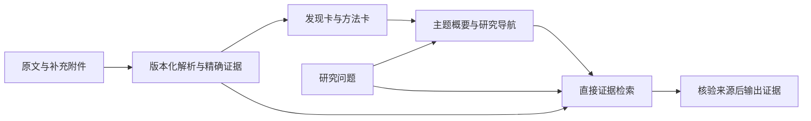

# memPed 文献存储与记忆组织：memU 等开源项目评估

_开源设计调研与目标建议 · status: target · 2026-09-22；未安装相关项目，未迁移现有资料_

## 1. 结论

**建议保留 memPed 的原文 Vault、SQLite Catalog 和独立检索索引，增加可追溯的研究记忆视图。** 最适合借鉴的组合是 Zotero 的书目与附件管理、memU 的可阅读记忆文件、OpenViking 的分层加载，以及 Graphiti 的时间与来源关系。

文献系统要保存“作者实际说了什么”，记忆系统常保存“Agent 从材料中归纳出了什么”。两者可以组合，但语义、更新与可信度不能混用。主题摘要可以帮助找资料，最终学术断言必须回到具体原文证据。

本报告补充[上一轮可行性评审](memped-knowledge-feasibility-review-2026-09-22.md)，聚焦存储、身份、版本、派生依赖与研究记忆，而非再次比较解析或检索模型。

## 2. 调研范围与版本事实

阅读官方 README、存储文档及部分源码；属于设计审查，不是实际安装、性能测试或完整代码审计。Star 使用本次 GitHub 页面显示约数，API 请求遇到限流，因此不提供伪精确计数。

| 项目 | Star 约数 | 主要用途 | 对 memPed 的匹配点 |
| --- | ---: | --- | --- |
| [memU](https://github.com/NevaMind-AI/memU) | 14.4k | 跨任务的个人/Agent 记忆 | 可阅读记忆、技能、分层检索 |
| [OpenViking](https://github.com/volcengine/OpenViking) | 38.4k | 统一管理资源、记忆与技能的上下文数据库 | 内容与索引分离、目录语义、按需加载 |
| [Mem0](https://github.com/mem0ai/mem0) | 65.8k | 从交互中抽取与维护记忆 | 记忆修订历史、作用域、可替换后端 |
| [Graphiti](https://github.com/getzep/graphiti) | 31.1k | 带来源与时间的上下文图 | 新旧关系、有效时间、来源追踪 |
| [Zotero](https://github.com/zotero/zotero) | 15.4k | 研究资料收集、组织、批注和引用 | 文献、附件、笔记的独立身份与人工整理 |

memU 的版本变化尤其重要。本次用 `git ls-remote` 固定了两个对照点：

- v1.5.1：`357aefc8012705bfde723f141d52f675fe712bed`，用于核查 Resource / MemoryItem / MemoryCategory 设计。
- 本次 main：`2c050bc9681a4c0aff1af211a000e73d14f33356`，用于核查 Resource / RecallFile / RecallFileSegment 与 SQLite schema。

不能把 v1.5.1 的三层表、当前 main 的 Wiki 工作流及 ADR 中尚为 Proposed 的设想拼成一个“已实现系统”。其他项目主要核查本次可访问的 main 文档；正式实验还需固定各自 commit。

## 3. memU：值得借鉴什么

### 3.1 旧版：资源、条目、分类分层

v1.5.1 中 Resource 保存 URL、local_path、modality 等；MemoryItem 保存 summary、memory_type 和可选 resource_id；MemoryCategory 保存分类描述/摘要；CategoryItem 连接分类与条目。资源文件通过 LocalFS 管理，业务记录经数据库抽象保存，不能将“文件系统式记忆”理解为所有数据只存在 Markdown 目录中。依据：[固定版模型](https://github.com/NevaMind-AI/memU/blob/357aefc8012705bfde723f141d52f675fe712bed/src/memu/database/models.py)、[服务初始化](https://github.com/NevaMind-AI/memU/blob/357aefc8012705bfde723f141d52f675fe712bed/src/memu/app/service.py)。

对 memPed 的合理映射是：

| memU 概念 | 可借鉴到 memPed | 必须补充的科研约束 |
| --- | --- | --- |
| Resource | 文献、标准、补充附件、网页快照 | 文件哈希、来源版本、采集时间、许可信息 |
| MemoryItem | 研究发现卡、方法摘要、参数说明 | 原文 span、页码、条件、单位、抽取版本与审核状态 |
| Category | 主题综述与导航 | 成员版本清单、生成依据、过期状态 |
| CategoryItem | 主题与发现之间的多对多关系 | 保留多主题归属，不依赖物理文件夹唯一分类 |

其 summary 去重在该版本按归一化摘要和类型计算内容哈希。这对记忆压缩有用，但不能替代原文 SHA-256，也不能把同一表述的两篇独立研究合成一份来源。科研库应去重文件字节、关联论文身份、保留各自证据。

### 3.2 当前版：可阅读记忆与数据库记录

当前 README 描述由 Agent 从历史整理 Markdown 记忆/技能，再由 MemoryService 存储、嵌入和检索；它不在 MemoryService 内完成 LLM 内容判断。当前模型有 Resource、RecallFile、RecallFileSegment，RecallFile 用 track 区分 memory/skill，segment 指向 recall_file_id。SQLite 表对应 resources、recall_files、recall_file_segments；README 列出 SQLite 暴力余弦检索及 Postgres/pgvector 后端。依据：[固定版 README](https://github.com/NevaMind-AI/memU/blob/2c050bc9681a4c0aff1af211a000e73d14f33356/README.md)、[模型](https://github.com/NevaMind-AI/memU/blob/2c050bc9681a4c0aff1af211a000e73d14f33356/src/memu/database/models.py)、[SQLite schema](https://github.com/NevaMind-AI/memU/blob/2c050bc9681a4c0aff1af211a000e73d14f33356/src/memu/database/sqlite/schema.py)。

可借鉴之处是“人能读的记忆 + 机器可查询的记录 + 可重建检索单元”。但上述基础模型没有为论文证据强制规定 source SHA、页码、bbox、原文字符范围和多来源断言关系；segment 明确不保证顺序。若用于科研引用，仍须在 memPed 侧建立这些约束，不能直接把 RecallFileSegment 等同于可引用证据。

[ADR 0006](https://github.com/NevaMind-AI/memU/blob/2c050bc9681a4c0aff1af211a000e73d14f33356/docs/adr/0006-from-memory-item-category-to-tracked-workspace-memorization.md) 曾记录技能脱离来源链后难以随源删除失效的问题。它是历史设计教训，不足以证明当前版本仍存在完全相同缺陷。对 memPed 的启示是：**派生总结必须从一开始记录依赖，不能事后仅靠搜索摘要来找影响范围。**

当前 main 面向跨 Agent 个人记忆，和文献归档的主问题存在距离。适合优先借鉴记忆表达与作用域，再以旁路方式验证复用；暂不建议用其核心数据库替换 Catalog。

## 4. 其他项目的存储设计及取舍

### 4.1 OpenViking：统一逻辑入口，内容与索引分离

官方架构区分 AGFS 内容层与向量索引层，索引保存 URI、向量和元数据，内容从内容层读取。其资源、记忆、技能具有虚拟 URI。当前文档中 L0 是快速筛选摘要，L1 是概览，L2 是完整内容；L0/L1 是目录侧文件，是否存在取决于处理状态与配置，并非每个文件天然拥有完整三层。依据：[架构](https://github.com/volcengine/OpenViking/blob/main/docs/en/concepts/01-architecture.md)、[上下文层](https://github.com/volcengine/OpenViking/blob/main/docs/en/concepts/03-context-layers.md)。

建议借鉴逻辑导航与分层加载：先看主题概要，再读取研究卡，最后取精确证据。先用本地文件、Catalog 关系及明确 resolver 实现即可；不必同时引入其队列、服务器、会话管理及 AGFS 依赖。

特别注意：OpenViking 与 memU 某些 ADR 对 L0/L1/L2 的命名方向不同。memPed 直接使用“原文、证据、摘要、导航”等语义名称，避免照搬层编号后混淆数据职责。

### 4.2 Mem0：记忆更新历史可借鉴，不能作为文献事实覆盖规则

Mem0 官方文档区分库模式的向量存储与 SQLite history；服务部署又使用不同默认组合。[history 源码](https://github.com/mem0ai/mem0/blob/main/mem0/memory/storage.py) 保留 old_memory、new_memory、event、时间及删除状态。因此 SQLite history 并不等于完整文献库或全部向量存储。依据：[开源概览](https://github.com/mem0ai/mem0/blob/main/docs/open-source/overview.mdx)。

对 memPed 可借鉴“研究笔记修订有前后版本和原因”，以及按项目/任务区分个人记忆。科学结论冲突时新增并列发现、条件和关系；只有证据明确表明勘误、撤稿或版本替换，才变更适用状态。个人偏好可以更新，论文中的历史陈述不能被另一篇论文自动改写。

### 4.3 Graphiti：时间关系与来源链

Graphiti 将实体、带有效时间的关系和来源 episode 关联，支持历史查询与增量更新；开源框架与 Zep 托管产品需要区分。依据：[官方仓库说明](https://github.com/getzep/graphiti)。

memPed 可先在 SQLite 关系中引入 recorded_at 与 valid_from/valid_to：前者表示系统何时记录，后者表示资料或规则何时适用。法规生效与废止适合显式时间；普通科研结论通常没有确定“失效日期”，不能把论文发表时间当作结论开始为真的时间。图数据库应等关系查询确实成为瓶颈后再评估。

### 4.4 Zotero：最接近文献收集与人工管理

Zotero 将库数据保存在 SQLite，将附件保存在 storage；官方区分 managed stored files 和 linked files。[数据目录](https://www.zotero.org/support/zotero_data)、[附件说明](https://www.zotero.org/support/attaching_files)。

memPed 最值得借鉴的是书目条目与附件分离：一篇论文可以有主 PDF、补充 PDF、数据表、代码版本链接和阅读笔记。若以后接 Zotero，建议通过导出/API 做单向摄取并保存 Zotero key，而非共享可写数据库或让两个系统同时修改一份 managed attachment。Zotero 管理编辑中的书目，memPed 保存用于实验的冻结版本；同步变化应生成新候选版本。

## 5. 三种方案比较

| 方案 | 优点 | 代价与适用范围 | 建议 |
| --- | --- | --- | --- |
| A. 现有 Vault/Catalog + 研究卡/主题视图 | 保留现有证据与契约；增量工作可控；无需服务 | 需要自己明确记忆 schema、派生关系和导出机制 | **优先采用** |
| B. memU 或 OpenViking 旁路 | 可较快试验摘要导航、跨任务经验复用 | 双系统 ID 映射、失效传播、重复索引与版本固定成本 | 主链稳定后做隔离实验 |
| C. 整体迁移到通用记忆框架 | 统一部分接口，直接复用框架功能 | 仍须补文献、版本、原文定位及科研审批；可能扩大部署边界 | 当前不推荐，缺乏净收益证据 |

A 可以吸收项目思想而不成为其 fork。B 的输出应先作为候选导航/经验，按 source/version/span 回查 memPed，再转为共享 EvidenceItem；框架内部 ID 不直接成为跨模块永久身份。

## 6. 建议的身份与存储分工

### 6.1 分开“论文是谁”和“文件是哪份”

建议从现有 resource_id/version_id 渐进扩展，逻辑上区分：

| 对象 | 身份与用途 | 示例 |
| --- | --- | --- |
| 研究条目/作品 | 稳定逻辑 ID；DOI、标题等是可修订元数据或外部标识 | 某篇行人流实验论文 |
| 出版/资料版本 | 预印本、正式版、修订版的版本关系 | 同一工作 preprint 与 version of record |
| 文件资产 | SHA-256 定位精确字节；另存 MIME、来源与角色 | 正文 PDF、supplement.pdf、CSV、网页快照 |
| 派生构建 | 输入哈希 + 解析/切块/模型/配置指纹 | 某解析器输出及其证据块 |
| 研究记忆 | 独立 ID 与 revision，引用具体证据 | 方法卡、发现卡、跨论文比较 |

同 DOI 的两个不同 PDF 不能仅按 DOI 丢弃；相同文件也可能被多个书目条目引用。当前源码将 resource_versions.version_id 作为全局主键，导入时赋源 SHA，因此扩展到多附件/别名资源前，应先明确版本与 blob 的多对多/一对多关系，避免让一个哈希同时承担论文身份和文件身份。

### 6.2 各种格式各司其职

| 存储形态 | 保存什么 | 权威性及更新原则 |
| --- | --- | --- |
| 文件 Vault | 原文与附件字节 | 不原地修改；新字节新哈希；当前 PDF Vault 路径先保留 |
| SQLite Catalog | 资源/版本/附件关系、审核与活动状态、派生登记 | 运行时状态权威；单写入者事务；结构化导出用于恢复 |
| JSON/JSONL | canonical elements、证据记录、构建 manifest、版本化研究卡 | 显式 schema；保留不可变构建快照；便于检查与交换 |
| Markdown | 阅读视图、主题概览、人工笔记 | 自动视图可重建；人工原稿独立保存，禁止生成器覆盖 |
| FTS/向量索引 | 检索加速与引用 ID | 可重建；不是原文/批准事实的唯一保存位置 |
| 运行输出目录 | 逐次实验结果、失败记录、指标 | outputs 下独立 run id；不自动成为批准知识 |

研究卡初期可采用版本化 JSON 作为规范内容，Catalog 登记 revision、路径和哈希；Markdown 从 JSON 渲染，搜索内容是投影。人工编辑单独保存为 authored note，再通过导入生成新卡版本。这样可避免“数据库和 Markdown 都可随意改，但不知道哪个有效”。

只要保存 LLM 生成产物，就必须保存当次结果及输入、prompt/model/config 指纹；相同配置重新调用模型未必得到逐字相同输出，因此不能仅凭“理论可重建”丢掉已用于论文实验的总结快照。

### 6.3 最小目录增量示意

以下目录是建议，不代表当前存在；新实验先在 outputs 的独立 run 中验证布局，再决定正式路径。

```text
memPed/knowledge/
  literature/files/                  # 保留既有 PDF Vault
  regulations/files/                 # 保留既有法规 Vault
  assets/<sha-prefix>/<sha>           # 可选：后续非 PDF/补充材料的字节存储
  derived/<resource>/<source-sha>/
    parses/<parse-build>/             # document、elements、图表、parse report
    chunks/<chunk-build>/             # 关联 parse-build 的 chunks 与 manifest
  research/
    cards/<card-id>/<revision>.json   # 有依据的候选/审核研究卡
    notes/<note-id>/<revision>.md     # 人工笔记原稿
    views/<view-build>/               # 自动生成的 Markdown/主题导航
  releases/<release-id>/manifest.json # 固定成员版本、build、索引与评测
  indexes/<index-build>/              # 可重建索引
  knowledge.sqlite3
```

JSON/Markdown 不是自动允许提交 Git：含受限原文、长摘录、私有笔记或大量生成内容的资产仍保留本地。只提交可公开的 schema、配置、精简 manifest 和经审核可分享的内容。研究数据与算法代码的边界保持不变。

## 7. 研究卡与主题记忆怎么组织

建议先做三类卡：单论文阅读卡、方法卡、发现/结果卡；跨论文主题概览由卡及证据生成。卡至少保存：

- card id、revision、类型、标题、状态（candidate/reviewed/stale/withdrawn）；
- 结构化内容和适用条件，数值项保留数值、单位与定义；
- evidence refs：resource/version/parse build、页码、element/span、quote hash；
- authored/generated 来源类型；生成人、模型、prompt hash、配置及审核记录；
- depends_on、supersedes、created_at、reviewed_at。

一个比较结论可引用多篇论文，一篇论文可属于多个主题。主题目录只保存引用和生成视图，PDF 不因分类在多个目录反复复制。人类分类保持稳定主分类，自动聚类标签另存，避免模型每次总结都重排物理目录。



查询可从主题视图逐层深入，也必须保留原始证据直接检索通道。摘要可能漏掉少数研究或被错误分类，不能让摘要成为唯一的召回入口。比较两条通道对低频主题召回、证据精度、token 和延迟的影响。

## 8. 更新、撤回、失败与恢复规则

| 情形 | 建议行为 |
| --- | --- |
| DOI 相同但 PDF 字节变化 | 保存新资产；识别版本关系；复核引用映射，不自动替换旧引文 |
| 同一 PDF 重复进入不同批次 | 字节去重；保留采集与审核记录，不重复算独立证据 |
| 解析器/切块策略升级 | 新 build；旧 build 保留供原实验复现 |
| 正文或附件被替换 | 依赖卡及主题视图标 stale；只重建受影响产物 |
| 论文勘误/撤稿 | 保存事件与依据；当前检索按策略过滤/提示；历史 release 保留原成员并附后续状态 |
| 两论文结论不一致 | 保留两个 claim 与场景条件；记录争议，不按新旧直接覆盖 |
| 生成摘要中断或文件/DB 部分写入 | 使用 staged build；仅当文件哈希与登记完整才标 complete；下次运行对账孤立项 |
| 删除一个分类或主题 | 只删除逻辑关联/视图，不级联删除原文 |
| 资料物理清理 | 单独清理流程；先检查 release/证据引用，不能等同于检索排除 |

不要照搬个人记忆的“越常提及越可信”策略。频率可作导航热度，不能增加科学断言可信度；一项独立复现实验也不能因低频而被遗忘。

建议备份原文/附件、人工记录、已使用的生成卡/摘要、Catalog 一致性快照、release 清单和配置。运行中的 SQLite 用一致性备份机制；本地单进程也可暂停写入后备份。不能只复制一个可能仍在写入的 .sqlite3 文件并认为备份完整。索引可重建，受限原文和人工笔记不可据此省略备份。

恢复验收在新目录完成：核对文件哈希与成员版本、检查悬空引用、用冻结模型配置重建索引，再重复固定查询。摘要与模型输出的恢复以保存快照为准；向量重建的数值比较需考虑硬件/推理精度差异。

## 9. 最小验证实验与采用条件

采用 10—15 篇有代表性的资料，另准备明确标注的测试变体：同文件重复、同 DOI 不同 PDF、补充 CSV、勘误/替代事件、同主题结论冲突、分类变化。测试变体只能存在实验副本，不能污染正式语料。

| 对照 | 目的 | 核心指标 |
| --- | --- | --- |
| 现有证据检索 | 固定基线 | 原文定位、证据完整性、延迟/token |
| 基线 + 版本化研究卡 | 验证结构化组织的价值 | 方法查找与条件比较正确率、人工维护成本 |
| 上组 + 主题摘要导航，并保留直接召回 | 验证 memU/OpenViking 风格分层阅读 | 完整证据召回、低频研究漏检、token 节省 |
| 可选：memU 固定版旁路 | 判断复用是否比小范围自建划算 | 接入成本、来源回查成功率、更新后残留旧知识、模型成本 |

硬性验收建议：原文被覆盖 0 次；版本错误引用 0 次；所有测试卡可解析到已保存依据；更新/撤回测试的全部依赖可定位；备份在新目录恢复成功。质量指标采用逐题对比，不能只用记忆检索的通用 benchmark 替代领域证据评测。

采用 memU 旁路前，先证明其输出能够稳定映射到 memPed 的证据与构建身份。若主要收益只是 Markdown 导航，而适配和失效维护成本更高，就只借鉴设计。图数据库、统一云记忆服务和自动采集会话不属于这次文献存储的前置条件。

## 10. 推荐下一步

第一步明确条目—版本—附件—派生构建的身份关系与恢复路径；第二步选单论文阅读卡作为最小记忆单元，保留精确来源；第三步在冻结的小语料上比较直接检索与主题导航；最后才决定是否接入 memU/OpenViking。

这些建议沿用[当前架构](project-architecture.md)、[memPed 数据边界](../memPed/README.md)和[知识模块](../Knowledge-Base/README.md)。研究卡、主题视图及附件扩展均为目标设计，当前 conversations/methods 的 reserved 状态没有因本报告而改变。
