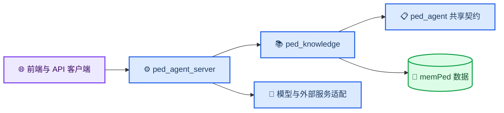
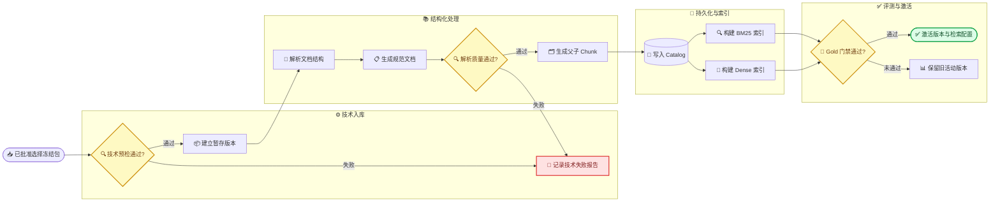
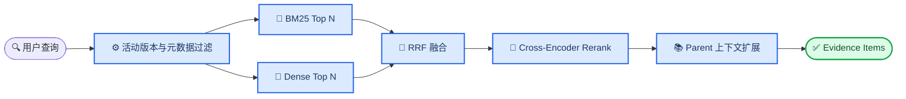

# Ped-Agent 知识与证据模块设计

_面向 `memPed` 数据根目录与 `Knowledge-Base` 程序模块的当前设计基线 · 2026-08-07_

---

## 📋 设计结论

Ped-Agent 的知识能力应拆成两个清晰边界：

- `memPed/` 只保存资料、元数据、解析产物、数据库、索引和评测报告
- `Knowledge-Base/` 保存解析、Chunking、索引、检索、Rerank 和评测程序

资料在上传前已经通过 PRISMA-informed 选择链、Ped-Agent 质量审计和选择冻结。
知识模块从“收到批准的选择冻结包及其 Manifest”开始，只进行文件、版本、元数据、
可解析性和数据一致性等技术校验，不重复执行内容准入审批。上游阶段、门禁和产物见
[`PRISMA 文献治理与入库方案`](prisma-literature-governance.md)。

当前优先级为：结构化解析、层次化 Chunking、BM25 + Dense + RRF、
Cross-Encoder Rerank 和端到端 Gold 评测。GraphRAG 暂缓，不进入近期实施范围。

> ✅ **状态说明：** `Knowledge-Base/` 与 `ped_knowledge` 已完成程序实现，活动 API、CLI
> 和 EvidenceGraph 检索装配已切换到新包。正式语料、真实 OCR/Rerank 模型与非空 Gold
> 的科研验收仍是独立后续阶段，本文不会把程序测试描述成真实科研结果。

## 📦 模块与目录边界

### 目标仓库结构

```text
Ped-Agent/
├── Knowledge-Base/                         # 知识程序；已实现
│   ├── README.md
│   ├── src/
│   │   └── ped_knowledge/
│   │       ├── __init__.py
│   │       ├── contracts/                  # 文档、Chunk、检索结果和网关协议
│   │       ├── ingestion/                  # 技术预检、导入编排和版本激活
│   │       ├── parsing/                    # 解析路由、OCR、表格和规范化
│   │       ├── chunking/                   # Parent-child 与结构边界策略
│   │       ├── storage/                    # Catalog、Vault 和派生资产登记
│   │       ├── indexing/                   # FTS、Dense 和指纹
│   │       ├── retrieval/                  # 过滤、召回和 RRF
│   │       ├── reranking/                  # Cross-Encoder Rerank
│   │       └── evaluation/                 # Gold、指标和发布门禁
│   └── tests/
├── backend/
│   └── src/ped_agent_server/               # HTTP、CLI、设置、运行装配和供应商适配
├── src/ped_agent/                          # 共享契约、EvidenceGraph 和领域策略
├── Video-Analysis/                         # 检测追踪与流动分析程序
└── memPed/                                 # 纯数据根目录
```

`Knowledge-Base/` 沿用仓库根 `pyproject.toml` 的工作区打包方式，
将 `Knowledge-Base/src/ped_knowledge` 加入包与测试路径。是否后续拆成独立发布包，
等模块边界稳定后再决定，不作为本轮前置条件。

### 依赖方向



依赖约束如下：

- `ped_agent_server` 可以导入并装配 `ped_knowledge`
- `ped_knowledge` 不得反向导入 `ped_agent_server`
- Embedding、Rerank 和外部解析服务使用 `ped_knowledge` 定义的协议，由后端注入实现
- 默认 Embedding 实现由 `ped_agent_server` 在本机装配 `BAAI/bge-m3`，使用 CUDA + FP16；
  模型权重写入 Git-ignored `backend/storage/models/embeddings/`，不进入 `memPed/`
- `memPed/` 不出现 Python、TypeScript、JavaScript 或 Shell 业务代码
- 旧 `src/ped_agent/knowledge/` 不再新增实现，待调用方迁移完成后逐步退役

### memPed 目标数据结构

```text
memPed/knowledge/
├── literature/
│   ├── files/                              # 文献原文和按哈希寻址的 Vault 文件
│   ├── records/                            # 跨批次主表、来源元数据和 Manifest
│   └── reviews/<review_id>/                # PRISMA 阶段快照、决定与选择冻结包
├── regulations/
│   ├── files/
│   └── records/
├── derived/
│   └── <resource_id>/<version_id>/
│       ├── document.json                   # Canonical Document
│       ├── elements.jsonl                  # 标题、段落、表格、图片等结构元素
│       ├── chunks.jsonl                    # Parent-child Chunk 派生产物
│       ├── tables/                         # 表格 HTML/JSON
│       ├── images/                         # 可追溯的图片或图注产物
│       └── parse_report.json               # 解析质量与降级路径
├── knowledge.sqlite3                       # 资源、版本、活动版本和 Chunk Catalog
├── fts.sqlite3                             # 可重建稀疏索引
├── vectors/                                # 可重建向量索引
└── reports/                                # 导入、解析、检索、Rerank 和评测报告
```

`derived/`、活动版本字段和上述结构化产物已经由程序实现；目录内容仅在真实导入时生成，
并受 `.gitignore` 保护。

## 🔍 当前实现与真实数据

截至 2026-08-07，当前仓库事实如下：

| 范围 | 当前状态 | 证据或限制 |
| --- | --- | --- |
| 程序目录 | 已实现 | `Knowledge-Base/src/ped_knowledge/` 已加入打包、测试、Ruff 和 mypy |
| 代码位置 | 已迁移 | 活动运行时直接装配 `ped_knowledge`；后端旧模块仅为兼容导出 |
| PDF 解析 | 已实现结构化基础版 | Canonical Document、页面元素、表格/图片登记、OCR 协议与降级报告 |
| Chunking | 已实现 | 稳定 ID 的 Parent-child Chunk、标题路径、策略版本与父级上下文 |
| 稀疏检索 | 已实现 | SQLite FTS5/BM25 和 Catalog 指纹检查 |
| Dense 检索 | 已实现但依赖配置 | 可选 Chroma 与 Embedding 网关；可降级到 FTS |
| 融合 | 已实现 | BM25 与 Dense 使用 RRF，默认 `rrf_k=60` |
| Rerank | 已实现可选适配 | FlagEmbedding Cross-Encoder 延迟加载、缓存与 RRF 降级；默认关闭 |
| Gold 指标 | 已实现程序链 | CLI 默认 Hybrid 评测，支持 FTS 基线、回归比较和配置发布/回退 |
| 版本管理 | 已实现 | staged/active/superseded/failed、显式活动版本和旧 Chunk 隔离 |
| GraphRAG | 暂缓 | 活跃链路没有图检索；旧图存储代码仅为未实现占位 |

当前数据快照：

| 数据项 | 数量或状态 |
| --- | ---: |
| 候选记录 | 60 |
| 本地 PDF | 14 |
| Manifest 非空记录 | 0 |
| Gold Questions | 0 |
| Catalog 资源 | 0 |
| Catalog Chunk | 0 |
| FTS 文档 | 0 |
| 向量数据 | 空目录 |

这 60 条候选记录和 14 份 PDF 是旧资料准备阶段资产，尚未进入本文定义的新入库流程。

## 🔄 修订后的入库流程

### 流程定义



### 技术预检范围

技术预检负责：

- 检查文件存在、文件头、扩展名、大小和可读性
- 检查加密、损坏、空页、页数异常和是否需要 OCR
- 计算 SHA-256，识别完全重复文件和已有版本
- 校验 `resource_id`、来源、标题、语言和资源类型等最小元数据
- 校验版本关系，避免同一哈希绑定到不同资源
- 记录解析策略、依赖版本和可复现参数

技术预检不负责：

- 判断论文研究价值、主题相关性或学术质量
- 以 JCI、CAS、引用量或人工评分决定是否允许上传
- 在入库阶段重复判断资料是否值得纳入

当前 `ResourceManifest`、`manifest.py` 和 `governance.py` 仍把技术校验与内容准入混合，
这是明确的待重构项。旧质量字段可以保留为上游元数据和离线审计信息，
但不应继续作为运行时导入的强制门禁。

### 失败与恢复

- 技术失败写入 `reports/`，不删除原始资料
- 解析失败保留暂存版本和失败原因，修复解析器后可重试
- 单文档失败不阻断同批次其他文档
- 新索引或配置未通过 Gold 门禁时，继续使用旧活动版本
- 所有派生数据可从原文、元数据和解析配置重建

## 📄 结构化解析与规范文档

代表性的文档处理系统会先把原文解析成带类型和元数据的元素，再基于这些元素进行
Chunking，而不是直接在整段纯文本上按字符截断。Unstructured 的公开文档明确将
Partitioning、Chunking、Embedding 组织为连续处理步骤，并让 Chunking 使用解析阶段识别的
文档元素与元数据。[^1] LlamaIndex 的 Ingestion Pipeline 同样把解析、切分、元数据提取和
Embedding 组织为可组合 Transformations。[^2]

### 解析路由

目标解析顺序为：

1. 对可抽取文本 PDF 执行版面感知解析
2. 识别标题、章节、段落、列表、表格、图片、图注、公式和参考文献
3. 对缺少文本层的页面局部启用 OCR，不默认整篇 OCR
4. 对表格保存结构化 HTML/JSON，并保留页码和边界框
5. 对解析器失败或依赖不可用的文档降级到 PyMuPDF 纯文本
6. 输出 `parse_report.json`，记录覆盖率、降级原因和需要人工复核的页码

### Canonical Document

规范文档是解析与 Chunking 之间的稳定契约：

| 对象 | 关键字段 | 作用 |
| --- | --- | --- |
| `CanonicalDocument` | `resource_id`、`version_id`、`source_hash`、`parser_version` | 固定资源版本与解析器身份 |
| `Page` | `page_number`、尺寸、OCR 状态 | 保留原始页面坐标系 |
| `Element` | `element_id`、类型、文本、页码、`bbox`、顺序 | 表达标题、段落、表格等原子结构 |
| `HeadingPath` | 章节层级与父级标题 | 支持结构化 Chunking 与展示 |
| `AssetRef` | 表格、图片、公式或附件路径 | 关联非纯文本内容 |
| `Provenance` | 源元素、字符偏移、内容哈希 | 支持引用回查与重新解析 |

解析完成不等于内容被重新审批。解析质量门禁只判断“能否稳定检索和定位”，
例如正文覆盖率、页码覆盖率、空元素比例、乱码率和表格结构完整度。

## 🗂️ 层次化 Chunking 设计

LlamaIndex 的 `HierarchicalNodeParser` 是一种代表性实现：同一文档按多个粒度递归切分，
较大 Parent Node 与较小 Child Node 形成层级关系。[^3] Ped-Agent 采用同类思想，
但 Chunk ID、定位和活动版本规则由自身 Catalog 管理。

### Parent 与 Child

| 层级 | 建议初始范围 | 用途 | 边界规则 |
| --- | ---: | --- | --- |
| Parent Chunk | 800–1800 tokens | 回答上下文、摘要和引用展示 | 以章节或子章节为主，不跨一级主题 |
| Child Chunk | 180–450 tokens | BM25、Dense 和 Rerank 候选 | 以段落、列表或语义单元为主 |
| Overlap | Parent 内 10%–15% | 缓解语义断裂 | 不跨章节、表格或版本边界 |

这些数值是首轮实验参数，不是固定标准；最终由 Gold Question 结果决定。

### 特殊内容规则

- 标题路径写入每个 Child 的检索文本或元数据
- 表格优先保持完整；超长表格按行组切分，并重复表头
- 图片与图注绑定，图片 OCR 文本不得替代原始图注
- 公式与解释段尽量保持在同一 Parent 中
- 参考文献列表默认不进入正文检索，可单独保留为关系元数据
- 法规按章、节、条形成层级，条款编号进入稳定 Locator
- Chunk ID 由 `resource_id + version_id + element lineage + policy_version` 派生

### 检索与展示

检索在 Child 粒度召回和 Rerank；最终向 EvidenceGraph 返回命中的 Child、
相邻 Child 和对应 Parent 的受控上下文。这样既保留精确匹配，也避免把孤立短片段直接交给 LLM。

## 🔍 混合检索、Rerank 与评测

### 目标检索链



Azure AI Search 的 Hybrid Search 会并行执行全文与向量检索，再通过 RRF 合并结果；[^4]
Elastic 也将 RRF 定义为把不同相关性指标的多个结果集合并为单一排序的方式。[^5]
这与当前 Ped-Agent 的 BM25 + Dense + RRF 方向一致，因此该部分应保留并迁移，而不是重写成单路向量检索。

### Cross-Encoder Rerank

Rerank 放在 RRF 之后，只处理有限候选集：

- BM25 与 Dense 各召回建议 `Top 40–60`
- RRF 去重并保留建议 `Top 30–50`
- Cross-Encoder 对查询与 Child 文本重新打分
- 每个资源限制最大命中数，避免单篇文档垄断结果
- 最终选择建议 `Top 8–12`，再扩展 Parent 上下文
- Rerank 服务不可用时降级到 RRF，不让问答链完全失败

Azure 的 Semantic Ranker 会对初始 BM25 或 RRF 结果进行语义重排；[^6]
Pinecone 也把 Reranking 说明为“先召回、再重排”的两阶段检索。[^7]
Ped-Agent 已在 `ped_knowledge.reranking` 实现 FlagEmbedding Cross-Encoder 适配、缓存和
失败降级；默认关闭，尚未用真实模型与正式语料做科研验收。旧
`src/ped_agent/knowledge/reranker.py` 仍只是冻结的早期占位。

### Gold 评测定位

Gold 评测用于检索算法、Chunk 策略、Embedding、Rerank 模型和参数配置的发布门禁，
不用于判断单份资料是否允许入库。

目标评测至少包含：

- `Recall@K`、MRR、nDCG@K 和 Locator Hit Rate
- BM25、Dense、RRF 与 Rerank 的分阶段增益
- Parent 扩展后的证据覆盖率和上下文冗余率
- 不同资源类型、语言、主题和文档长度的分组结果
- 解析器、Chunk Policy、Embedding 与 Rerank 模型版本
- 候选配置相对当前活动配置的回归比较

当前评测代码已覆盖 Hybrid + 可选 Rerank、FTS 基线、阈值、基线回归比较与活动配置回退；
`ped-agent evaluate` 默认走 Hybrid，`--pipeline fts` 保留兼容基线。Gold 文件仍为空，
因此尚未产生真实发布结论。

## 📊 代表性主流 RAG 对比

下表比较的是代表性公开实现的共通流程，而不是产品功能数量：

| 环节 | 代表性主流做法 | Ped-Agent 当前 | Ped-Agent 目标 |
| --- | --- | --- | --- |
| 资料进入 | 连接器或上传后进入 Ingestion Pipeline | 已拆为上游选择 + 运行时技术预检 | 用正式资料验证批次隔离和失败恢复 |
| 文档解析 | 先 Partition/Parse 为结构元素，再 Chunk[^1][^2] | Canonical Document、元素、OCR 协议、表格/图片和报告 | 用复杂真实 PDF 量化解析质量 |
| Chunking | 按文档结构或层次建立多粒度节点[^3] | Parent-child、策略版本、稳定 ID 与 Locator | 用 Gold 调参并验证不同文档类型 |
| 稀疏检索 | BM25/倒排索引保留精确词项能力 | FTS5/BM25、字段权重、活动版本过滤 | 用正式语料建立基线 |
| Dense 检索 | Embedding 召回语义相近内容 | Chroma 批处理、版本元数据与失效降级 | 验证真实 Embedding 模型与规模 |
| 融合 | Sparse 与 Dense 并行，通过 RRF 合并[^4][^5] | 已实现并进入端到端评测 | 用 Gold 验证分阶段增益 |
| Rerank | 对初始候选做第二阶段语义重排[^6][^7] | Cross-Encoder 适配、缓存和 RRF 降级 | 配置真实模型并量化收益/时延 |
| 评测 | 用固定数据集比较检索配置 | Hybrid/FTS、阈值、回归比较和发布回退已实现，Gold 为空 | 建立非空 Gold 并执行真实发布门禁 |
| Knowledge Graph | 作为关系增强或复杂查询扩展 | 占位代码，无活跃实现 | 暂缓，待基础检索稳定后再评估 |

因此，近期不需要引入更复杂的 Agentic Retrieval 或 GraphRAG。当前差距已经从程序结构
转向真实资料下的解析质量、模型效果、Gold 覆盖和运行成本，而不是召回框架重新选型。

## ⚠️ 实施状态与迁移清单

### 状态矩阵

| 能力 | 状态 | 下一步 |
| --- | --- | --- |
| `memPed/` 纯数据边界 | 已实现 | 增加 `derived/` 结构并持续禁止业务代码 |
| `Knowledge-Base/` 目录 | 已实现 | 保持独立模块边界和 README |
| `ped_knowledge` 包 | 已实现 | 已加入根工作区打包、测试、Ruff 和 mypy |
| 技术预检 | 已实现 | 文件、PDF 头、哈希、重复、元数据和可解析性校验 |
| PRISMA 选择冻结与 Manifest Release | 已实现 | 上游产物哈希、数量守恒、资源集合绑定和 CLI 正式导入门禁 |
| 内容准入移出运行时 | 已实现 | 活动导入不要求 JCI/CAS/引用量；旧门禁仅离线兼容 |
| Content Vault | 已迁移 | 位于 `ped_knowledge.storage` |
| Catalog | 已迁移增强 | 活动版本、版本状态、派生资产与检索配置表 |
| 结构化解析 | 已实现基础版 | Canonical Document、元素、表格/图片登记和报告 |
| OCR 与表格恢复 | 已实现可插拔基础 | 按页 OCR 协议；PyMuPDF 表格/图片提取，真实 OCR 服务待配置验收 |
| Parent-child Chunking | 已实现 | 稳定 Chunk ID、标题路径、策略版本与父级上下文 |
| FTS5/BM25 | 已迁移 | 保留指纹与失效检测，增加标题/Heading 权重 |
| Chroma Dense | 已迁移增强 | 批处理、版本与策略元数据、可降级设计 |
| RRF | 已迁移 | 纳入统一 Hybrid 检索与评测 |
| Cross-Encoder Rerank | 已实现可选 | FlagEmbedding 适配、缓存和失败降级；真实模型待验收 |
| Gold 指标与阈值 | 已重构 | Hybrid/Rerank 端到端门禁、基线回归比较 |
| 自动活动版本回退 | 已实现程序语义 | 失败候选不替换活动版本或检索配置 |
| GraphRAG | 暂缓 | 基础 RAG 达标后再单独立项 |

### 当前文件迁移映射

| 当前文件 | 目标位置或处理方式 |
| --- | --- |
| `backend/src/ped_agent_server/importer.py` | 业务编排已迁入 `ped_knowledge.ingestion`；旧入口保留严格兼容适配 |
| `manifest.py`、`models.py` 的 Manifest 逻辑 | 拆成技术预检契约与上游元数据，不整体照搬质量门禁 |
| `governance.py` | 不进入运行时导入链；如仍需要，保留为离线资料审计工具 |
| `parsing.py` | 已迁入 `ped_knowledge.parsing`，后端文件为兼容导出 |
| `catalog.py`、`vault.py` | 已迁入 `ped_knowledge.storage`，后端文件为兼容导出 |
| `index.py`、`vector_index.py` | 已迁入 `ped_knowledge.indexing`，后端文件为兼容导出 |
| `retrieval.py`、`hybrid_retrieval.py` | 已合并到 `ped_knowledge.retrieval` |
| `evaluation.py` | 已迁入 `ped_knowledge.evaluation`，覆盖 Hybrid、Rerank 与发布回退 |
| `backend/src/ped_agent_server/api.py`、`cli.py` | 保留 HTTP/CLI，并直接调用 `ped_knowledge` 公共接口 |
| `src/ped_agent/knowledge/` | 不新增实现；确认无活跃依赖后分阶段退役 |

## 📈 实施路线与验收

### Phase 1：建立程序边界（已完成）

- 创建 `Knowledge-Base/src/ped_knowledge/` 与测试目录
- 将根工作区配置加入新包路径
- 定义文档、Chunk、检索、Embedding 和 Rerank 协议
- 增加依赖方向测试，禁止 `ped_knowledge -> ped_agent_server`

验收：包可独立导入，后端可装配空实现，`memPed/` 无业务代码。

### Phase 2：拆分技术预检与版本模型（已完成）

- 把文件、哈希、重复、元数据和可解析性校验迁入新包
- 移除运行时对 JCI、CAS、引用量和内容评分的强制要求
- 增加 `active_version_id`、版本状态和回退语义
- 保留旧治理记录作为上游资料和兼容资产

验收：已选资料无需再次填写学术评分即可完成技术预检；重复和损坏文件仍会被阻断。

### Phase 3：强化解析与 Canonical Document（程序完成，真实 OCR 夹具待补）

- 建立结构化 PDF 解析路由和 PyMuPDF 降级
- 增加按页 OCR、表格、图片、图注和标题层级
- 写入 `derived/` 与解析报告
- 使用真实文献、法规和扫描 PDF 建立解析夹具

验收：引用可回到页码与元素；降级路径可观测；解析失败可重试。

### Phase 4：替换 Chunking（已完成）

- 实现 Parent-child Chunk 与稳定 Chunk ID
- 增加表格、法规条款、标题路径和参考文献规则
- 允许通过配置切换 Chunk Policy

验收：同一版本和策略重复运行得到相同 Chunk；不同策略可并行评测。

### Phase 5：加入 Rerank 与端到端评测（程序完成，真实 Gold/模型待验收）

- 保留 BM25 + Dense + RRF
- 接入 Cross-Encoder Rerank 和失败降级
- 让 `ped-agent evaluate` 覆盖真实 Hybrid + Rerank 链路
- 建立基线配置、候选配置、发布和回退流程

验收：Gold 不为空；候选配置只有在无显著回归且达到阈值时才能激活。

### Phase 6：迁移与清理（活动链已迁移，兼容导出保留）

- 后端仅保留 API、CLI、设置、装配和供应商适配
- 删除或冻结重复实现，更新导入路径和运行文档
- 完成 Catalog 与索引兼容迁移
- 单独评审是否需要 GraphRAG

验收：知识业务逻辑只存在于 `ped_knowledge`；现有 API 和 EvidenceGraph 行为保持兼容。

程序开发完成后仍需独立验收的内容包括：真实扫描 PDF 的 OCR 服务效果、复杂表格恢复率、
真实 Embedding 与 Cross-Encoder 模型、非空 Gold Questions、候选检索配置发布，以及正式
语料下的科研指标。GraphRAG 继续明确暂缓，不因本轮程序完成而自动启动。

---

[^1]: Unstructured. “Chunking.” https://docs.unstructured.io/open-source/core-functionality/chunking

[^2]: LlamaIndex. “Ingestion Pipeline.” https://developers.llamaindex.ai/python/framework/module_guides/loading/ingestion_pipeline/

[^3]: LlamaIndex. “Hierarchical Node Parsers.” https://developers.llamaindex.ai/python/framework-api-reference/node_parsers/hierarchical/

[^4]: Microsoft. “Hybrid Search Overview - Azure AI Search.” https://learn.microsoft.com/en-us/azure/search/hybrid-search-overview

[^5]: Elastic. “Reciprocal Rank Fusion.” https://www.elastic.co/docs/reference/elasticsearch/rest-apis/reciprocal-rank-fusion

[^6]: Microsoft. “Semantic Ranking Overview - Azure AI Search.” https://learn.microsoft.com/en-us/azure/search/semantic-search-overview

[^7]: Pinecone. “Rerank Results.” https://docs.pinecone.io/guides/search/rerank-results
