# Ped-Agent PRISMA 文献治理与入库方案

_将 PRISMA 2020 与 PRISMA-S 转化为 Ped-Agent 可审计、可冻结、可入库的阶段产物契约 · 2026-08-11_

---

## 📋 方案结论

Ped-Agent 采用 **PRISMA-informed** 文献治理，而不是把 PRISMA 当作导入工具或论文质量评分方法。PRISMA 2020 负责确保系统综述为什么开展、如何检索和筛选、最终纳入什么以及排除什么能够被完整报告；它本身不负责指导全部综述实施，也不用于评价综述的方法学质量。[^1]

增强后的方案由三条连续但不混合的链组成：

1. PRISMA 选择链：方案、检索、去重、标题摘要筛选、全文获取、全文资格判断和纳入集合冻结
2. Ped-Agent 质量链：期刊指标、引用快照、完整性、全文证据价值、主题配额和例外审批
3. 工程入库链：Manifest、技术预检、解析、Chunk、Catalog、索引、Gold 评测和发布

> 📌 **边界：** PRISMA 中“纳入研究”只表示进入本次综述或语料候选集合，不等于 Ped-Agent 已正式入库。只有通过质量审计、选择冻结、Manifest 技术预检和 Gold 发布门禁后，资源才进入正式检索。

机器可读的阶段、门禁和产物目录位于 [`prisma_governance.yaml`](../../memPed/knowledge/prisma_governance.yaml)。

## 🎯 设计原则与治理对象

### 五项原则

- 先冻结方案，再开始检索，任何中途修改都写入 amendment 记录
- 原始记录、文档报告、底层研究和知识资源分别建模，避免错误去重
- 每一次筛选决定保留决策人、时间、阶段、理由和自动化辅助信息
- Git 只保存小型治理记录、哈希、Manifest 和发布摘要，原文与运行数据留在本地
- 每个阶段通过显式门禁后才能进入下一阶段，不因文件已下载而自动推进

### 核心对象

PRISMA 2020 区分数据库记录、可获取报告和底层研究；一个研究可能对应协议、预印本、会议摘要和正式论文等多个报告。[^1]

| 对象 | 稳定标识 | 含义 | 主要用途 |
| --- | --- | --- | --- |
| 综述批次 | `review_id` | 一次治理周期 | 串联全部产物 |
| 检索执行 | `search_id` | 一次来源查询 | 复现检索结果 |
| 数据库记录 | `record_id` | 去重前的一条索引记录 | PRISMA 识别计数 |
| 文档报告 | `report_id` | 一份可获取文档 | 全文查找与筛选 |
| 底层研究 | `study_id` | 一项实际研究 | 多报告合并与最终纳入 |
| 知识资源 | `resource_id` | Ped-Agent 中的论文资源 | Manifest 与 Catalog |
| 资源版本 | `version_id` | 不可变文件版本 | 哈希、解析与回退 |
| 筛选决定 | `decision_id` | 一次人工或裁决决定 | 冲突处理与审计 |

## 🔄 端到端阶段流程

```mermaid
flowchart LR
    accTitle: PRISMA Governed Ingestion Flow
    accDescr: Literature moves from a frozen protocol through PRISMA identification and screening, Ped-Agent quality approval, selection freeze, technical ingestion, and retrieval release without conflating inclusion with import.

    start([📋 建立治理批次])

    subgraph plan_identify ["🔍 方案与识别"]
        protocol[📋 冻结方案与标准]
        search[🔍 执行并记录检索]
        deduplicate[🗂️ 规范化与去重]
    end

    subgraph screen ["📚 分级筛选"]
        title_abstract[🔍 标题与摘要筛选]
        retrieve[📥 查找合法全文]
        fulltext[📄 全文资格筛选]
        exclusions[(📝 排除理由台账)]
    end

    subgraph approve ["✅ 内容准入"]
        quality[📊 质量与语料审计]
        freeze[🔒 冻结纳入集合]
    end

    subgraph engineer ["⚙️ 工程入库"]
        manifest[📦 Manifest 与预检]
        ingest[⚙️ 解析、导入与索引]
        release([✅ Gold 评测与发布])
    end

    start --> protocol --> search --> deduplicate --> title_abstract
    title_abstract -->|保留| retrieve --> fulltext
    title_abstract -->|排除| exclusions
    fulltext -->|排除| exclusions
    fulltext -->|纳入| quality --> freeze --> manifest --> ingest --> release

    classDef process fill:#dbeafe,stroke:#2563eb,stroke-width:2px,color:#1e3a5f
    classDef decision fill:#fef9c3,stroke:#ca8a04,stroke-width:2px,color:#713f12
    classDef success fill:#dcfce7,stroke:#16a34a,stroke-width:2px,color:#14532d
    classDef record fill:#f3f4f6,stroke:#6b7280,stroke-width:2px,color:#1f2937

    class protocol,search,deduplicate,retrieve,manifest,ingest process
    class title_abstract,fulltext,quality decision
    class start,freeze,release success
    class exclusions record
```



PRISMA 流程图要求报告各阶段记录、报告和研究的识别、排除及纳入数量，并保存全文排除理由。[^2] Ped-Agent 在这条流程之后增加质量、技术入库和检索发布门禁。

## 📚 PRISMA 选择阶段

### 阶段 0：范围与方案冻结

开始检索前必须建立 `review_id`，明确研究问题、综述类型、主题范围、时间范围、语言、数据库、纳排标准、筛选人员和自动化使用方式。

| 产物 | 保留级别 | 作用 |
| --- | --- | --- |
| `protocol.md` | Git | 记录目标、问题和职责 |
| `eligibility_criteria.yaml` | Git | 提供机器可读纳排标准 |
| `search_strategy.yaml` | Git | 冻结来源、字段、过滤条件和查询式 |
| `amendments.csv` | Git | 记录方案修改、原因和批准人 |

**进入条件：** 方案状态为 `approved`，纳排标准不存在待定项；此后任何修改必须追加 amendment，不能覆盖历史版本。需要正式协议报告时参考 PRISMA-P。[^3]

### 阶段 1：检索与候选识别

PRISMA-S 要求完整报告数据库、平台、检索式、过滤条件、检索日期和检索结果，并提供足以复现的检索策略。[^4]

| 产物 | 保留级别 | 作用 |
| --- | --- | --- |
| `search_log.csv` | Git | 一次检索一行，保留完整执行信息 |
| `candidates.csv` | Git | 维护跨批次候选主表 |
| `search_snapshot.csv` | Git | 冻结本批次识别记录 |
| 原始检索响应 | 本地 | 保存供应商原始结果与追踪 ID |

**进入条件：** 所有预定来源均已执行，失败来源有原因和补救记录，结果数量能与原始响应核对。

### 阶段 2：规范化与去重

去重同时检查 DOI、标题、作者、年份、来源标识和文件哈希。数据库中的重复记录应合并为 canonical record，但同一研究的不同报告不能仅因标题相似而删除。

| 产物 | 保留级别 | 作用 |
| --- | --- | --- |
| `deduplication.csv` | Git | 记录保留、合并和删除决定 |
| `record_aliases.csv` | Git | 保存原始记录到 canonical record 的映射 |
| `canonical_records.csv` | Git | 形成标题摘要筛选输入快照 |

**进入条件：** 每条原始记录都有处置结果，重复规则和人工覆盖均可解释，canonical snapshot 已计算哈希。

### 阶段 3：标题与摘要筛选

PRISMA 2020 要求说明每条记录由多少名人员筛选、是否独立工作，以及是否使用自动化工具。[^1]

| 产物 | 保留级别 | 作用 |
| --- | --- | --- |
| `screening_decisions.csv` | Git | 一名筛选者一次决定一行 |
| `screening_consensus.csv` | Git | 保存最终决定和冲突裁决 |
| `automation_log.csv` | Git | 保存工具、版本、规则或 Prompt 哈希和人工覆盖 |
| `exclusions.csv` | Git | 保存受控排除理由 |

AI 可以排序、标记或提出建议，但不能成为最终排除者。最终排除必须绑定人工 `reviewed_by`；存在冲突时必须记录 adjudicator。

**进入条件：** 所有 canonical records 均为 `include`、`exclude` 或 `uncertain`，不允许空状态进入全文获取阶段。

### 阶段 4：全文查找与合法获取

该阶段把“需要获取的报告”和“已经取得的文件”分开计数，避免把找不到全文误写成内容不相关。

| 产物 | 保留级别 | 作用 |
| --- | --- | --- |
| `fulltext_retrieval.csv` | Git | 记录 sought、retrieved、unavailable 和原因 |
| `fulltext_inventory.csv` | Git | 记录来源、获取日期、合法性、路径和 SHA-256 |
| PDF 原文 | 本地 | 保存在 `literature/files/`，不提交 Git |

**进入条件：** 每个待获取 `report_id` 均有检索状态；无法获取必须使用独立原因码，不能直接归为全文排除。

## 🔍 资格、质量与选择冻结

### 阶段 5：全文资格筛选

全文筛选按预先冻结的标准执行。被排除的报告必须保留一个主要原因码和必要说明；同一底层研究的多份报告通过 `study_report_map.csv` 聚合。

| 产物 | 保留级别 | 作用 |
| --- | --- | --- |
| `screening_decisions.csv` | Git | 保存全文层逐人决定 |
| `study_report_map.csv` | Git | 建立 report、study 与 resource 映射 |
| `eligibility_snapshot.csv` | Git | 冻结合格报告集合 |
| `exclusions.csv` | Git | 保存全文排除理由和裁决信息 |

**进入条件：** 每个已获取报告都有最终资格决定；全文排除必须由第二人确认或由裁决人批准。

### 阶段 6：质量、完整性与语料结构审计

该阶段属于 Ped-Agent 自有质量治理，不是 PRISMA 的替代品。它继续使用现有 JCI、CAS、引用量、正式版本、全文评分、主题配额和例外比例规则。

| 产物 | 保留级别 | 作用 |
| --- | --- | --- |
| `journal_metrics.csv` | Git | 保存期刊指标快照 |
| `citation_snapshots.csv` | Git | 保存引用来源和核验时间 |
| `integrity_checks.csv` | Git | 保存撤稿、勘误和关注声明检查 |
| `screening.csv` | Git | 保存综合评分、质量等级和最终内容决定 |
| `exceptions.csv` | Git | 保存未过硬规则的例外审批 |
| `corpus_audit.json` | Git | 检查主题、年代、语言和质量结构 |

**进入条件：** 单篇硬门禁、批次配额和例外比例均通过；失败项必须排除或完成显式例外审批。

### 阶段 7：纳入集合冻结与 PRISMA 报告

该阶段把全部上游决定冻结成可复现的选择包，是内容治理链和工程入库链的唯一交接点。

| 产物 | 保留级别 | 作用 |
| --- | --- | --- |
| `included_studies.csv` | Git | 保存最终纳入的 study、report 和 resource |
| `prisma_counts.json` | Git | 保存各阶段数量和一致性检查 |
| `prisma_flow.md` | Git | 生成可维护的 PRISMA 流程图 |
| `prisma_checklist.md` | Git | 标明清单条目对应的证据位置 |
| `selection_freeze.json` | Git | 保存协议、输入快照、决定表和纳入表哈希 |

**进入条件：** 流程数量守恒、全部排除有理由、纳入资源均能回溯到记录和报告，冻结包由内容负责人批准。

## ⚙️ 工程入库与检索发布

### 阶段 8：Manifest 生成与技术预检

Manifest 只能从通过批准的 `selection_freeze.json` 生成，不允许直接从 PDF 目录或候选表生成。

| 产物 | 保留级别 | 作用 |
| --- | --- | --- |
| `pilot_manifest.jsonl` 或 `core_manifest.jsonl` | Git | 描述准备入库的不可变资源版本 |
| `manifest_release.json` | Git | 绑定 selection freeze 与 Manifest 哈希 |
| `manifest_preflight_report.json` | 本地 | 保存文件、哈希、重复、版本和可解析性检查 |

**进入条件：** Manifest 与选择冻结包一一对应，技术预检无错误。活动导入链在此处开始，不重新执行论文价值或期刊质量判断。

### 阶段 9：导入、解析与索引

| 产物 | 保留级别 | 作用 |
| --- | --- | --- |
| `import_report.json` | 本地 | 保存逐资源导入状态 |
| `parse_report.json` | 可重建 | 保存解析器、OCR、表格和降级信息 |
| Canonical Document 与 Chunk | 可重建 | 支持可定位检索 |
| Catalog、FTS 与向量索引 | 可重建 | 提供正式检索能力 |

**进入条件：** 资源版本成功写入 Catalog，解析质量门禁通过，索引指纹与活动资源一致；单文档失败不掩盖，必须形成失败报告。

### 阶段 10：Gold 评测与检索发布

| 产物 | 保留级别 | 作用 |
| --- | --- | --- |
| `pilot_gold.jsonl` 或 `core_gold.jsonl` | Git | 固定问题、期望资源和定位 |
| `pilot_config.json` 或 `core_config.json` | Git | 固定评测指标和阈值 |
| `evaluation_report.json` | 本地 | 保存 Recall、MRR、定位和泄漏结果 |
| `retrieval_release.md` | Git | 记录发布、拒绝或回退决定 |

**完成条件：** Gold 门禁达到阈值且无非正式资料泄漏，才允许激活新的资源版本和检索配置；否则保留旧活动版本。

## 🗂️ 目录与保留策略

```text
memPed/knowledge/literature/
├── records/                              # 跨批次主表与 Manifest
├── reviews/
│   └── <review_id>/
│       ├── 00-protocol/
│       ├── 01-identification/
│       ├── 02-deduplication/
│       ├── 03-title-abstract/
│       ├── 04-fulltext-retrieval/
│       ├── 05-fulltext-eligibility/
│       ├── 06-quality/
│       ├── 07-selection-freeze/
│       ├── 08-manifest/
│       └── 10-release/
└── files/                                # 本地全文，不提交 Git
```

| 保留类别 | 内容 | Git 策略 |
| --- | --- | --- |
| 治理记录 | 标准、决定、理由、计数、哈希、Manifest、发布摘要 | 提交 |
| 受限原始资料 | PDF、供应商原始响应、授权材料 | 本地保存 |
| 可重建产物 | 解析正文、Chunk、SQLite、FTS、向量索引 | 本地生成 |

## 🔐 跨阶段一致性与审计

### 冻结哈希链

每个阶段完成后计算输入和输出快照哈希，形成以下关系：

`protocol_hash → search_snapshot_hash → canonical_records_hash → eligibility_hash → selection_freeze_hash → manifest_hash → index_fingerprint → evaluation_config_hash`

任何上游产物变化都会使下游发布失效，必须重新生成而不能原地覆盖。

### 最小决策字段

所有筛选和审批表至少包含：

- `review_id`、`decision_id`、目标对象 ID 和阶段
- `decision`、`reason_code`、`reason_detail`
- `decided_at`、`decided_by`、`reviewer_role`
- `automation_used`、`tool_name`、`tool_version`、`ruleset_or_prompt_hash`
- `supersedes_decision_id` 和 `adjudicated_by`

### 数量守恒

`prisma_counts.json` 必须检查：

- 识别记录 = 去重删除 + 标题摘要筛选输入
- 标题摘要筛选输入 = 标题摘要排除 + 全文查找目标
- 全文查找目标 = 未获取报告 + 全文筛选输入
- 全文筛选输入 = 全文排除报告 + 纳入报告
- 纳入报告可完整映射到纳入研究与 Ped-Agent `resource_id`

### 角色与阶段门禁

| 角色 | 主要责任 | 不得兼任的最终决定 |
| --- | --- | --- |
| 方案负责人 | 冻结范围、纳排标准和修订 | 不能静默改写历史方案 |
| 检索执行人 | 执行查询并保存原始响应 | 不能删除失败检索记录 |
| 筛选者 | 独立完成标题摘要或全文判断 | AI 不能作为最终筛选者 |
| 裁决人 | 处理冲突和全文排除确认 | 不能覆盖原决定而不留痕 |
| 质量审核人 | 核验指标、完整性和语料结构 | 不能绕过例外比例限制 |
| Manifest 操作人 | 从冻结包生成 Manifest | 不能从 PDF 目录直接入库 |
| 发布批准人 | 审核 Gold 报告并激活版本 | 未达门禁不能强制发布 |

## 🔄 现有资产迁移方式

当前 60 条候选记录、检索日志和 14 份本地 PDF 保持原状，不因本方案落地而自动进入筛选或导入。

- `search_log.csv` 和 `candidates.csv` 继续作为跨批次主表
- 现有 `screening.csv` 用作质量评分与最终内容决定汇总，不承担逐筛选者日志
- 现有 `exclusions.csv` 保存最终排除台账，逐筛选者决定进入 review 目录
- 现有 `journal_metrics.csv`、`citation_snapshots.csv` 和 `exceptions.csv` 继续沿用
- 空的 pilot/core Manifest 继续保持为空，直到首次 `selection_freeze` 获批
- 后续首次正式执行时新建 `review_id`，按阶段逐项生成产物，不回填虚构历史决定

当前程序已实现评审目录初始化、PRISMA 数量守恒、选择冻结哈希链、Manifest Release 绑定和
正式文献 CLI 导入门禁。它不会自动生成筛选决定，也不会把当前候选记录、PDF 或空 Manifest
推进到下一阶段；候选筛选、指标核验、全文处理、Manifest 内容生成和正式导入仍需逐阶段单独确认。

### 程序入口

```powershell
uv run --project backend ped-agent research init <review_id>
uv run --project backend ped-agent research freeze-selection <review_id> --approved-by <name>
uv run --project backend ped-agent research release-manifest <review_id> <manifest> --approved-by <name>
uv run --project backend ped-agent research validate-release <manifest_release.json> --manifest <manifest>
uv run --project backend ped-agent library import-manifest <manifest> --release <manifest_release.json>
```

`library import-manifest` 对文献默认失败关闭：没有有效 `--release` 不允许正式导入。显式
`--technical-only` 只保留底层工程验证能力；它与 `--release` 互斥。法规和标准暂不纳入
PRISMA Release，但混合资源类型 Manifest 会被拒绝，必须拆分执行。

## 🔗 References

[^1]: Page, M. J., et al. (2021). “The PRISMA 2020 statement: An updated guideline for reporting systematic reviews.” *PLOS Medicine*. https://doi.org/10.1371/journal.pmed.1003583

[^2]: PRISMA Executive. “PRISMA 2020 flow diagram.” https://www.prisma-statement.org/prisma-2020-flow-diagram

[^3]: Moher, D., et al. (2015). “Preferred reporting items for systematic review and meta-analysis protocols (PRISMA-P) 2015 statement.” *Systematic Reviews*. https://doi.org/10.1186/2046-4053-4-1

[^4]: Rethlefsen, M. L., et al. (2021). “PRISMA-S: an extension to the PRISMA Statement for Reporting Literature Searches in Systematic Reviews.” *Systematic Reviews*. https://doi.org/10.1186/s13643-020-01542-z
