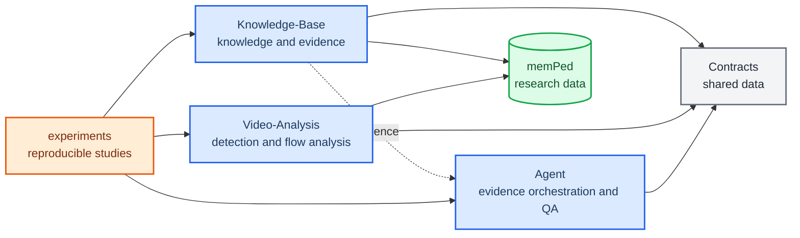

# Ped-Agent current project architecture

_Current architecture and maturity map · authoritative overview for the modular research project_

---

## 📋 Project position

Ped-Agent is a modular research engineering repository for pedestrian-flow studies. Its current
goal is to make knowledge retrieval, video/trajectory analysis, and evidence-based research QA
independently testable and reproducible. It is not currently organized as a Web product or a
long-running service.

## 🧩 Module map

## 🧭 Engineering principles

- Facts belong to `Knowledge-Base`; calculations belong to `Video-Analysis`; orchestration and
  explanation belong to `Agent`.
- Modules communicate through `Contracts`, not through each other's internal storage or code.
- Research data, configuration, model versions, input hashes, random seeds, and provenance stay
  visible in experiments.
- Product concerns such as FastAPI, Vue, SSE, task queues, sessions, and long-running services are
  outside the current scope.

## 📚 Module responsibilities

| Area | Authoritative code/docs | Main responsibility | Does not own |
| --- | --- | --- | --- |
| Shared contracts | `Contracts/`, `Contracts/README.md` | Evidence, answer, and trajectory data shapes | Algorithms, storage, HTTP |
| Knowledge and evidence | `Knowledge-Base/`, `Knowledge-Base/README.md` | Technical preflight, parsing, chunking, indexing, retrieval, rerank, evaluation | Final answer generation, video inference |
| Detection and flow analysis | `Video-Analysis/`, `Video-Analysis/README.md` | Detection, tracking, calibration, trajectories, density/speed/flow/OD analysis | Document admission, natural-language QA |
| Evidence orchestration and QA | `Agent/`, `Agent/README.md` | Evidence graph, citation rules, model adapters, research answers | FastAPI, SSE, sessions, task queues |
| Reproducible studies | `experiments/`, `experiments/README.md` | Inputs, hypotheses, versions, seeds, commands, metrics, outputs | Core reusable module implementation |

## 💾 Data boundaries

[`memPed/README.md`](../memPed/README.md) is the data-root guide. In short:

- `memPed/knowledge/` stores governed literature/regulation assets, catalogs, derived documents,
  indexes, and reports
- `memPed/conversations/` stores conversation artifacts when a research workflow needs them
- `memPed/methods/` stores method candidates and approved methods
- `outputs/` stores local experiment outputs; it is not the source of truth for code or methods
- `paper/` stores manuscript sources and build artifacts

## 📊 Current maturity language

Use these labels consistently:

| Label | Meaning |
| --- | --- |
| `current` | Implemented repository behavior or active engineering rule |
| `target` | Intended research depth; implementation may be partial |
| `historical` | Retained for design traceability; not an instruction for current code |
| `plan` | Step-by-step proposal or implementation record |

The module READMEs describe the current boundaries. The larger design documents describe desired
depth and should be checked against code and tests before being treated as implemented capability.

## 🧭 Extension rule

New cross-module behavior starts as an experiment. Only move it into a public module API after its
data contract, reproducibility requirements, and tests are stable. If a future change needs a
Web/API integration layer, record that as a new architecture decision instead of reviving the
archived product-integration tree implicitly.
