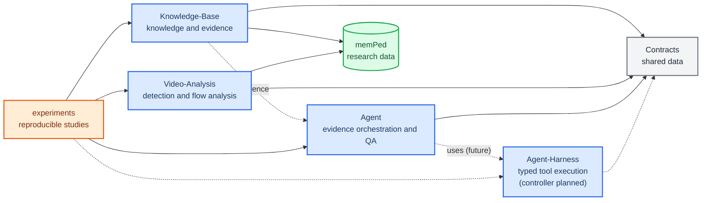
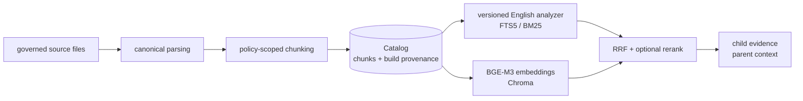

# PedRAGent current project architecture

_Current architecture and maturity map · authoritative overview for the modular research project_

---

## 📋 Project position

PedRAGent is a modular research engineering repository for pedestrian-flow and evacuation-transport
studies. Its main research line is Agent/RAG: document parsing, chunking, retrieval, reranking,
evidence orchestration, and answer evaluation on domain questions. Video/trajectory analysis
supplies complementary evidence. It is not organized as a Web product or long-running service.

## 🧩 Module map

```mermaid
flowchart LR
    accTitle: Current module map
    accDescr: Contracts defines shared data structures. Knowledge Base, Video Analysis, and Agent depend on those contracts and can be combined through experiments.

    contracts["Contracts\nshared data"]
    knowledge["Knowledge-Base\nknowledge and evidence"]
    video["Video-Analysis\ndetection and flow analysis"]
    agent["Agent\nevidence orchestration and QA"]
    harness["Agent-Harness\ntyped tool execution\n(controller planned)"]
    experiments["experiments\nreproducible studies"]
    data[("memPed\nresearch data")]

    knowledge --> contracts
    video --> contracts
    agent --> contracts
    harness -.-> contracts
    knowledge --> data
    video --> data
    knowledge -. "evidence" .-> agent
    agent -. "uses (future)" .-> harness
    experiments --> knowledge
    experiments --> video
    experiments --> agent
    experiments -.-> harness

    classDef shared fill:#f3f4f6,stroke:#6b7280,stroke-width:2px,color:#1f2937
    classDef module fill:#dbeafe,stroke:#2563eb,stroke-width:2px,color:#1e3a5f
    classDef data fill:#dcfce7,stroke:#16a34a,stroke-width:2px,color:#14532d
    classDef experiment fill:#ffedd5,stroke:#ea580c,stroke-width:2px,color:#7c2d12

    class contracts shared
    class knowledge,video,agent,harness module
    class data data
    class experiments experiment
```

## 🧭 Engineering principles

- Facts belong to `Knowledge-Base`; calculations belong to `Video-Analysis`; orchestration and
  explanation belong to `Agent`.
- Modules communicate through `Contracts`, not through each other's internal storage or code.
- Research data, configuration, model versions, input hashes, random seeds, and provenance stay
  visible in experiments.
- Product concerns such as FastAPI, Vue, SSE, task queues, sessions, and long-running services are
  outside the current scope.

## 📚 Module responsibilities

| Area | Authoritative code/docs | Main responsibility | Does not own |
| --- | --- | --- | --- |
| Shared contracts | `Contracts/`, `Contracts/README.md` | Evidence, answer, and trajectory data shapes | Algorithms, storage, HTTP |
| Knowledge and evidence | `Knowledge-Base/`, `Knowledge-Base/README.md` | Technical preflight, parsing, chunking, indexing, retrieval, rerank, evaluation | Final answer generation, video inference |
| Detection and flow analysis | `Video-Analysis/`, `Video-Analysis/README.md` | Detection, tracking, calibration, trajectories, density/speed/flow/OD analysis | Document admission, natural-language QA |
| Evidence orchestration and QA | `Agent/`, `Agent/README.md` | Evidence graph, citation rules, model adapters, research answers | FastAPI, SSE, sessions, task queues |
| Agent execution support | `Agent-Harness/`, `Agent-Harness/README.md` | Typed tool execution, scheduling, budgets and event recording; model tool port and controller planned | Domain logic, evidence collection |
| Reproducible studies | `experiments/`, `experiments/README.md` | Inputs, hypotheses, versions, seeds, commands, metrics, outputs | Core reusable module implementation |

### Knowledge retrieval pipeline

```mermaid
flowchart LR
    source["governed source files"] --> parse["canonical parsing"]
    parse --> chunk["policy-scoped chunking"]
    chunk --> catalog[("Catalog\nchunks + build provenance")]
    catalog --> sparse["versioned English analyzer\nFTS5 / BM25"]
    catalog --> dense["BGE-M3 embeddings\nChroma"]
    sparse --> hybrid["RRF + optional rerank"]
    dense --> hybrid
    hybrid --> evidence["child evidence\nparent context"]
```

PDF 解析默认调用 Adobe PDF Extract（`ImportService(paths)`），所选 PDF 会上传至
Adobe，并转换为 `CanonicalDocument` 契约。完全本地解析需显式选择
`ImportService(paths, parser_backend="pymupdf")`。Catalog 与派生文件记录原文
SHA-256、解析器版本和资产哈希。Adobe 失败时导入报错，不会自动改用 PyMuPDF。
独立对照命令只生成新的 `outputs/` 目录，不修改 Catalog 或索引；配置和操作方式见
[`Knowledge-Base/README.md`](../Knowledge-Base/README.md)。

`parent-child-v1` remains the default policy. `parent-child-v2` is an implemented candidate that
uses the pinned BGE-M3 tokenizer for token accounting, preserves bilingual sentence boundaries,
and falls back to token windows only for oversized atomic units. The Catalog keeps policies side by
side and records tokenizer, source, and chunk-build provenance. Sparse indexes also record their
lexical analyzer fingerprint; retrieval rejects or degrades stale policy, tokenizer, lexical, Catalog,
or embedding combinations.

An independently named V2 index and a corpus-compatible Gold v5 candidate development comparison
were completed on 2026-09-26. V2 remains inactive because its Chinese complete-evidence@5 was
lower than V1 (17/20 versus 19/20), not because human Gold review is required for development
research. The 2026-09-27 Stage 2 subagent review produced a separate development-only package:
all 20 intents are usable for research, 18 have agent candidate answers, and 2 retain dispute
caveats. It does not assert human Gold or alter the P1 runs. Any baseline release still requires
declared metric and baseline-comparison gates.
The legacy 31-question Pilot currently references resource IDs absent from the 104-resource Catalog;
it cannot validate that corpus without a separately versioned mapping or evaluation set. Current
implementation and configuration paths are listed in [`Knowledge-Base/README.md`](../Knowledge-Base/README.md).

The V1/V2 and Gold v5 comparisons above are historical. Current RAG evaluation follows
[PEARL](../paper/pearl-framework/README.md) on a separate 106-paper Adobe-only corpus
(`outputs/pearl-index-106-adobe-20260929-01/`, 6,433 children) with an 80-question development
set and a sealed 200-question evaluation set, stored canonically under
`memPed/knowledge/gold/pearl-adobe106/` and governed by
[`experiments/EVALUATION-STANDARD.md`](../experiments/EVALUATION-STANDARD.md). The evaluated retrieval baseline is R4
(BM25 + BGE-M3, RRF, bge-reranker-v2-m3); chunking variants are studied in
[`experiments/pearl-chunking-dev80-20261005/`](../experiments/pearl-chunking-dev80-20261005/README.md)
and are development selections, not a released module default. Directory-level status of all RAG
experiments and outputs is recorded in [`rag-asset-audit-2026-10-07.md`](rag-asset-audit-2026-10-07.md).

## 💾 Data boundaries

[`memPed/README.md`](../memPed/README.md) is the data-root guide. In short:

- `memPed/knowledge/` stores governed literature/regulation assets, catalogs, derived documents,
  local model weights, policy-scoped indexes, Gold questions, chunk-build records, and reports.
  Tracked configuration stays in Git;
  source PDFs, databases, derived assets, weights, and indexes stay local
- `memPed/conversations/` is a reserved boundary for conversation artifacts; no stable storage
  contract is currently implemented
- `memPed/methods/` reserves candidate and approved method storage; no stable database schema is
  currently defined
- `outputs/` stores local experiment outputs; it is not the source of truth for code or methods
- `paper/` stores manuscript sources and build artifacts

The active knowledge-ingestion path starts from an experiment-selected source manifest. It performs
technical preflight, content-addressed storage, parsing, hierarchical chunking, Catalog updates,
and rebuildable indexing. `include=true` maps to `approved/official` retrieval status after
activation. Experiments freeze their corpus, chunk policy, model and index fingerprints, then
compare retrieval and evidence metrics; offline journal-quality metadata can be used for corpus
stratification.

## 📊 Current maturity language

Use these labels consistently:

| Label | Meaning |
| --- | --- |
| `current` | Implemented repository behavior or active engineering rule |
| `target` | Intended research depth; implementation may be partial |
| `historical` | Retained for design traceability; not an instruction for current code |
| `plan` | Step-by-step proposal or implementation record |

The module READMEs describe the current boundaries. The larger design documents describe desired
depth and should be checked against code and tests before being treated as implemented capability.

## 🧭 Extension rule

New cross-module behavior starts as an experiment. Only move it into a public module API after its
data contract, reproducibility requirements, and tests are stable. If a future change needs a
Web/API integration layer, record that as a new architecture decision instead of reviving the
archived product-integration tree implicitly.

## Agentic research extension status — 2026-10-08

Agent-Harness is execution support for the Agent research capability, not an additional product capability. Since 2026-10-07 its source implements typed tool contracts, a registry, executor, scheduler, run budgets and JSONL event recording. The legacy Protocol definitions remain for compatibility. A model tool-call port, configuration loader, retrieval adapters and dynamic Agent controller are still planned. Agent does not currently invoke Harness. The current EvidenceGraph remains a fixed conditional workflow; `final_persist` constructs an answer without filesystem persistence. Current interfaces and cloud validation are recorded in the [Agent core cloud baseline](agent-core-cloud-baseline-2026-10-08.md).

The [module integration assessment](../Agent/docs/harness-integration-assessment.md) records current contracts and gaps. The [configuration design](../Agent-Harness/docs/configuration-design.md) is a target, and the [Agentic research plan](../Agent-Harness/docs/agentic-research-plan.md) is unexecuted. Initial adapters and cross-module combinations belong in experiments; reusable interfaces move to modules only after validation. Neither knowledge nor video modules should import Harness internals.
