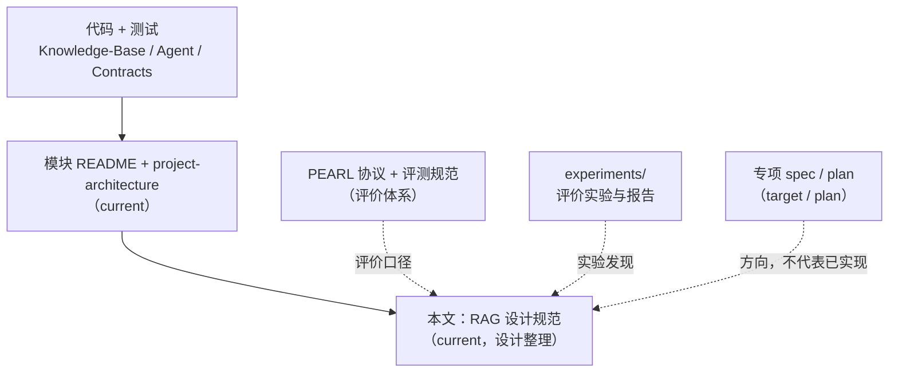
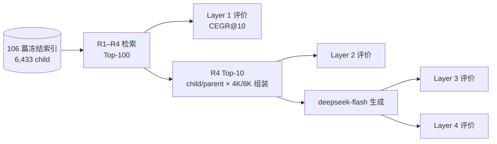
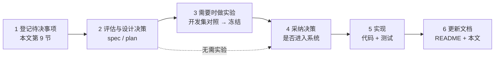

# RAG 设计规范

*PedRAGent 检索增强链路的当前设计整理：环节定义、系统流程与评价实验的关系、版本与溯源规则、变更流程和设计待决事项 · status: current · 2026-10-07*

本文整理 RAG **当前的设计**，把分散在模块 README、架构文档、专项 spec 和 PEARL 协议里的规则汇总到一处，并标明每条规则的权威来源。
本文只做设计整理和调整说明，**不规定具体的代码修改**；第 9 节列出的待决事项都需要先单独评估、形成设计决策，才能进入实现。
本文与代码不一致时以代码为准，并在第 9 节登记差异。

## 1. 文档身份与优先级

| 优先级 | 来源 | 决定什么 |
| --- | --- | --- |
| 1 | 代码与测试（`Knowledge-Base/src/ped_knowledge/`、`Agent/src/ped_research_agent/`、`Contracts/src/ped_contracts/`） | 系统实际行为 |
| 2 | [`Knowledge-Base/README.md`](../Knowledge-Base/README.md)、[`Agent/README.md`](../Agent/README.md)、[`project-architecture.md`](project-architecture.md) | 当前模块边界、默认配置、依赖方向 |
| 3 | 本文 | 跨模块设计整理、设计规则、变更流程、待决事项 |
| 评价 | [PEARL 协议](../paper/pearl-framework/README.md)、[评测问题集与实验规范](../experiments/EVALUATION-STANDARD.md) | 评价对象、指标、问题集身份与实验管理；**不决定系统配置** |
| 实验 | `experiments/<实验>/` 的协议与报告 | 某次评价实验使用的配置与发现 |
| 参考 | `docs/superpowers/specs/`、`plans/` 与 target 设计 | 设计方向，不代表已实现 |

## 2. 当前流程

### 2.1 系统流程（模块代码）

```mermaid
flowchart LR
    accTitle: RAG 系统流程
    accDescr: 离线建库从 PDF 到双索引；在线检索经 RRF 和可选重排、每篇上限后输出 child 证据；Agent 打包证据、生成并验证答案。parent 上下文在检索侧计算但未进入 Agent。

    subgraph offline["离线建库（Knowledge-Base）"]
        pdf["PDF\n+ IngestionManifest"] --> parse["Adobe 解析\nCanonicalDocument"]
        parse --> chunk["parent-child-v1 切块"]
        chunk --> cat[("Catalog\nknowledge.sqlite3")]
        cat --> fts["FTS5 / BM25\n英文分析器"]
        cat --> vec["BGE-M3 / Chroma"]
    end
    subgraph online["在线检索（Knowledge-Base）"]
        fts --> rrf["RRF k=60\n每通道 40"]
        vec --> rrf
        rrf --> rr["可选 Rerank"]
        rr --> cap["每篇 ≤2 条\n取前 8 条"]
        cap --> hit["EvidenceItem\n（child 文本）"]
        cap -. "parent_contexts\n未进入契约" .-> drop["（丢弃）"]
    end
    subgraph agent["证据编排与答案（Agent）"]
        hit --> pre["预检检索\n启发式充分性"]
        pre --> rw["改写 + 再检索"]
        rw --> pack["按条数截断\n整条 JSON 打包"]
        pack --> draft["结构化草稿"]
        draft --> verify["引用规则 + 语义验证\n≤1 次修订"]
        verify --> ans["AnswerDocument"]
    end
```

模块依赖方向：Knowledge-Base 和 Agent 只依赖 `Contracts`，彼此不导入内部实现。Agent 通过 `ports.py` 中的
`LocalEvidenceRetriever` 协议接入检索；**目前仓库里还没有把 `HybridRetriever` 适配为该协议的代码**，也没有调用
`EvidenceGraph` 的实验入口（见 [`Agent/README.md`](../Agent/README.md)）。

### 2.2 评价实验流程（PEARL 实验脚本）

PEARL 各层实验由 `experiments/pearl-*` 下的脚本串联：复用模块里的 `FTSIndex`、`EnglishLexicalAnalyzer`、
`HuggingFaceTokenCounter` 和 Catalog 中的 `parent-child-v1` child，但检索、融合、重排、上下文组装和生成都由实验脚本
自行实现，不经过 `HybridRetriever` 和 `EvidenceGraph`。

## 3. 系统流程与评价实验的关系

**PEARL 是评价体系，不是系统配置。** 它规定怎样评价、用什么指标和问题集，不规定系统应该用哪种检索或组装方式。
PEARL 实验为了评价而选定的配置（下表右列）是实验条件；这些配置和实验发现是否、以及以什么方式反馈到系统设计，
**尚待评估**（见第 9 节 D1），本文不预设答案。

当前两者在以下环节不同：

| 环节 | 系统流程（模块默认） | PEARL 评价实验 | 依据 |
| --- | --- | --- | --- |
| 语料 | Catalog 中 `approved/official` 的全部资源 | 106 篇 Adobe-only 英文文献，6,433 个 child | [106 篇索引实验](../experiments/pearl-index-106-adobe-20260929/README.md) |
| 解析 | `adobe-pdf-extract-v1` | 同左 | 同上 |
| 切块 | `parent-child-v1`（正则计数，child target 320 / max 450 / overlap 48） | 同左（实验中记为 B0）；切片研究另有候选，见 4.2 | 同上 |
| 词法分析 | `EnglishLexicalAnalyzer` / `english-lexical-v1` | 同左 | [`lexical-english-v1.yaml`](../Knowledge-Base/config/retrieval/lexical-english-v1.yaml) |
| BM25 字段 | 标题 ×3.0、章节标题 ×1.5、正文 ×1.0 | 只检索正文 | `indexing/__init__.py`；106 篇索引实验 |
| 稠密索引 | Chroma 默认（L2、未固定线程） | cosine、单线程 HNSW | 同上 |
| 召回深度 | 每通道 40，融合后 40 | 每通道 Top-100，union 至多 200，融合后 Top-100 | [Layer 1 实验协议](../paper/pearl-framework/layer-1-retrieval/experiments.md) |
| 每篇上限 | `max_chunks_per_resource=2` | 不设上限 | 同上 |
| 融合 | RRF，`k=60` | 同左 | 同上 |
| 重排 | 可选 `CrossEncoderReranker`，失败降级为 RRF | R4：R3 Top-100 + `bge-reranker-v2-m3` | [`reranker-config.json`](../experiments/pearl-index-106-adobe-20260929/reranker-config.json) |
| 上下文组装 | 按来源条数截断（8/5/5），无 token 预算 | 固定 R4 Top-10，child/parent × 4K/8K，按 token 预算组装 | [Layer 2 实验](../experiments/pearl-evidence-dev80-20261004/README.md) |
| 生成与验证 | `EvidenceGraph`：改写、两次检索、引用规则与语义验证 | `deepseek-flash` 单次生成，无验证与修订 | [Layer 3 实验](../experiments/pearl-answer-dev80-20261004/README.md) |

规则：

- 报告效果数字时，写明出自哪个实验目录及其配置；不能把评价实验的成绩表述为“系统当前效果”，除非两者配置一致。
- 新实验必须声明它评价的是系统流程本身，还是实验自定义的配置，以及与对照相比改了哪些因素。

## 4. 各环节当前设计

每个环节分“当前设计”和“设计观察”两部分。设计观察来自 2026-10-07 对代码的流程检查，只记录现状，处理方式见第 9 节。

### 4.1 解析

| 项 | 当前设计 |
| --- | --- |
| 默认解析器 | `ImportService(paths)` 使用 `adobe-pdf-extract-v1`，PDF 会上传到 Adobe 云端；只导入允许上传的文献 |
| 本地解析 | 必须显式指定 `parser_backend="pymupdf"`（`pymupdf-structured-v2`） |
| 失败处理 | Adobe 失败即导入失败，**不自动回退** PyMuPDF |
| 输出契约 | `CanonicalDocument`（`ped_knowledge.contracts`） |
| 表格 | Adobe 表格按行拍平为 `单元格 \| 单元格` 文本 |
| 留存 | Adobe 原始 ZIP 和图表附件保存在 `memPed/knowledge/derived/<resource-id>/<sha>/adobe/`；Catalog 记录解析器版本和派生文件哈希 |
| 对照 | `python -m ped_knowledge.parsing.compare`，输出目录必须是新的，不修改 Catalog 或索引 |

设计观察：表格拍平后，切块可能把表头和数值行分到不同 child（Layer 1 中“平均年龄”一题的失败与此有关）。

细节见 [`Knowledge-Base/README.md`](../Knowledge-Base/README.md#pdf-默认解析adobe-pdf-extract)；
原始设计见 [Adobe 解析 spec](superpowers/specs/2026-09-23-adobe-pdf-extract-design.md)（历史设计）；
解析器影响见 [解析器敏感性实验](../experiments/benchmark-parser-sensitivity-20260927/README.md)。

### 4.2 切块

| 策略 | 身份 | 状态 |
| --- | --- | --- |
| `parent-child-v1` | 系统默认；PEARL 实验中的 B0 | current |
| `parent-child-v2`（BGE-M3 tokenizer 计数，元素/段落/句子边界） | [`chunking-v2.yaml`](../Knowledge-Base/config/retrieval/chunking-v2.yaml) | candidate；2026-09-26 Gold v5 对照中未优于 V1，未激活（historical 依据） |
| `C2-L384-O0-M0`、`C3-L256-O0-M0`、`B0-regex320-overlap48-M0`（P0、4K） | PEARL 切片研究冻结的三套 E5 配置 | 开发入选，**不代表显著优胜**；实现位于 `experiments/pearl-chunking-dev80-20261005/chunkers.py`，未进入模块 |

当前设计：

- parent 按章节标题切换或达到 1,200 token 分组（上限 1,800）；v1 的 child 在 parent 内按正则 token 固定窗口切分。
- Chunk 记录带 `policy_version`、tokenizer 指纹、token 数和父文本偏移；Catalog 按 `policy_version` 并存不同策略。
- 切块策略改变后，评价用的来源锚点到 child 的映射必须重新核验，PEARL 的命中定义不变。

设计观察：

- v1 固定窗口会在句中断开。
- child 直接继承 parent 的页码范围和 locator，无法精确定位 child 所在页。

切片研究的结论以 [切片实验入口](../experiments/pearl-chunking-dev80-20261005/README.md) 为准；6B 评价进行中，不得提前写结论。

### 4.3 词法检索

| 分析器 | 用途 | 配置 |
| --- | --- | --- |
| `EnglishLexicalAnalyzer` | 系统默认，PEARL 实验也使用 | [`lexical-english-v1.yaml`](../Knowledge-Base/config/retrieval/lexical-english-v1.yaml)（NFKC、小写、`[a-z]+\|[0-9]+`，不去停用词、不做词干） |

当前设计：

- 查询与文档使用同一分析器，查询词之间为 OR；`FTSIndex` 不传分析器时默认用它，其他分析器须实现 `ped_knowledge.tokenization.LexicalAnalyzer` 协议。
- FTS 索引记录分析器指纹，读取时指纹不匹配就拒绝。
- jieba 分析器、中英领域词表和停用词已于 2026-10-07 移除。旧的 `benchmark-*` 实验脚本依赖它，现已无法直接运行，只作历史记录；需要复现时从 Git 历史取回。

设计观察：系统 BM25 对标题和章节标题加权，同一篇文献的所有 child 共享标题，这个加权没有经过评价；PEARL 实验只检索正文。

### 4.4 稠密检索

| 项 | 当前设计 |
| --- | --- |
| 模型 | `BAAI/bge-m3`，权重在 `memPed/knowledge/models/bge-m3/`（不提交 Git） |
| 参数 | 1024 维、`normalize_embeddings=true`、CUDA/FP16、`max_length=1024`；见 [`model.yaml`](../Knowledge-Base/config/embeddings/bge-m3/model.yaml) 与 [复现说明](../Knowledge-Base/config/embeddings/bge-m3/README.md) |
| 通道 | 只用 dense 通道；不启用 BGE-M3 的 sparse / multi-vector 通道 |
| 索引位置 | `outputs/knowledge-index-<corpus>-<version>-<date>-<seq>/chroma/`（由 `Knowledge-Base/build_indexes.py --output-dir` 指定，目录必须不存在），或实验自己的输出目录；不在 `memPed/knowledge/indexes/` 常驻 |

设计观察：系统 Chroma collection 未指定距离与线程数（归一化向量下 L2 与 cosine 排序一致，但多线程 HNSW 建库不可复现）；`ChromaVectorIndex.rebuild` 会就地删除并重建同名 collection。

### 4.5 融合、重排与结果筛选

当前设计：

- 融合：RRF，$\mathrm{RRF}(c)=\sum_m 1/(60+\mathrm{rank}_m(c))$，按 chunk ID 合并。
- 重排：可选 Cross-Encoder；失败时降级为 RRF，结果带 `retrieval_degraded` 标记。
- 筛选：只保留 active official 版本；每篇最多 2 条，取前 8 条。

设计观察：

- 每篇最多 2 条，可能挤掉同一篇文献里的多条必要证据；PEARL 残余失败中有同篇多证据的情况。
- 重排后，个别取不到重排分的候选会回退到 RRF 分参与排序，两种分数尺度不同。
- 每次检索都对全部 child 重新计算 Catalog 指纹，用于判断索引是否过期。

PEARL 实验中的重排约束（只对 R3 同一 Top-100 重排、R3 与 R4 的 CEGR@100 必须相等）属于评价协议，见
[Layer 1 实验协议](../paper/pearl-framework/layer-1-retrieval/experiments.md)。

### 4.6 证据输出与契约

| 契约 | 位置 | 用途 |
| --- | --- | --- |
| `KnowledgeChunk`、`EvidenceHit`、`CanonicalDocument`、`IngestionManifest` | `ped_knowledge.contracts` | 模块内部 |
| `EvidenceItem`、`RetrievalBatch`、`AnswerDocument`、`CitationRef`、`VerificationSummary` | [`ped_contracts/evidence.py`](../Contracts/src/ped_contracts/evidence.py) | 跨模块 |

当前设计：

- 每条证据可定位：带 `resource_id`、`version_id`、`chunk_id`、`locator`，以及 64 位 `content_hash`。
- `approved/official` 只表示有检索资格，不代表证据质量。
- `retrieval_is_sufficient()` 是检索侧的启发式判断（结果覆盖 ≥2 篇文献，或标题、DOI 精确匹配），**不等于** PEARL Layer 2 的充分性。

设计观察：

- `HybridRetriever` 计算了 parent 上下文，但 `RetrievalBatch` 契约里没有对应字段，parent 上下文到不了 Agent。
- 在默认“每篇 2 条、共 8 条”的筛选下，启发式充分性几乎总是成立，外部补证很少被触发。

### 4.7 上下文组装、生成与验证

| 项 | 当前设计 | 状态 |
| --- | --- | --- |
| 调用链 | 固定条件 `EvidenceGraph`：预检检索 → 可选外部搜索 → 打包 → 改写 → 再检索 → 草稿 → 规则 + 语义验证 → 至多 1 次修订 | current |
| 打包 | `evidence_pack.py`：按 ID 去重，按来源条数截断（默认 8/5/5），把整条 `EvidenceItem` 序列化为 JSON 放入 prompt | current |
| Prompt | `prompts.py`，修改措辞必须升 `PROMPT_SET_VERSION` | current |
| 引用规则 | `policy.py`：claim、citation、evidence 双向绑定 | current |
| 仅规则验证 | 必须显式传 `allow_rules_only=True`，结果标为 `rules_only` | current |
| Agentic RAG | 动态规划、迭代检索、充分性判断 | plan，见 [开发准备](../Agent/docs/agentic-rag-dev-prep.md) |

设计观察：组装没有 token 预算概念；prompt 中包含 `content_hash`、`retrieved_at`、`score` 等与回答无关的字段。PEARL Layer 2 的评价发现，按预算截断会丢失完整证据组，parent 展开能补回部分证据（见 [Layer 1–4 结果与架构问题](../paper/pearl-framework/reporting/layer1-4-results-and-architecture-review-2026-10-05.md)）。

## 5. 版本、指纹与溯源

每次建库、检索或评价都必须记录下表各项，缺一项就不能作为正式结果：

| 类别 | 必须记录 |
| --- | --- |
| 输入 | 原文 PDF SHA-256、canonical 哈希、语料清单哈希 |
| 解析 | `parser_version` |
| 切块 | `policy_version`、tokenizer 指纹、chunk 数 |
| 索引 | 词法分析器指纹、`embedding_fingerprint`、`source_fingerprint` |
| 模型 | model ID、revision、权重 SHA-256、设备、精度 |
| 方法 | top-k、RRF k、重排输入范围、token 预算、prompt 版本 |
| 运行 | 随机种子、代码版本、命令、耗时、错误与重试（合法的空结果与运行错误分开记） |
| 评价 | 问题集与参考标注的登记身份和 SHA-256（见 [评测登记表](../experiments/EVALUATION-REGISTRY.yaml)）、支持映射版本、评分器版本、`human_verified` 状态 |

检索时如果遇到 policy、tokenizer、词法、Catalog 或 embedding 指纹不匹配，必须拒绝（`IndexStaleError`）或明确降级，不能静默使用。

## 6. 数据与产物位置

| 类型 | 位置 | 是否进 Git |
| --- | --- | --- |
| 代码、测试 | `Knowledge-Base/`、`Agent/`、`Contracts/` | 是 |
| 模型与检索配置 | `Knowledge-Base/config/` | 是 |
| 凭据 | `Knowledge-Base/local/` 或环境变量 | **否** |
| 原文、记录 CSV、采集规则 | `memPed/knowledge/literature/`、`regulations/` | 记录和规则进 Git，PDF 视许可而定 |
| Catalog、派生解析、模型权重 | `memPed/knowledge/knowledge.sqlite3`、`derived/`、`models/` | 否 |
| 评价问题集与参考标注 | 以 [评测登记表](../experiments/EVALUATION-REGISTRY.yaml) 登记的路径为准 | 见 [评测规范](../experiments/EVALUATION-STANDARD.md) |
| 实验协议、脚本、报告 | `experiments/<名称-日期>/` | 是 |
| 索引、运行结果 | `outputs/<名称-日期-序号>/` | 否；不得覆盖已有目录 |
| 作废结果 | `failed/` | 只保留说明 |
| 评价框架、论文材料 | `paper/pearl-framework/`、`paper/` | 是 |

逐目录的现状分类见 [RAG 资产与一致性审计](rag-asset-audit-2026-10-07.md)。

## 7. 评价

RAG 的效果结论按 [PEARL](../paper/pearl-framework/README.md) 评价并报告；问题集身份、存放和实验设置按
[评测问题集与实验规范](../experiments/EVALUATION-STANDARD.md)管理。PEARL 只规定评价方式，不规定系统设计。核心约束：

- **四层链条**：Retrieval（CEGR@10）→ Evidence（上下文充分性）→ Answer（正确性）→ Grounding & Reliability（忠实、引用、拒答）。Layer 5 Agentic 和 Layer 6 Efficiency 待设计。
- **不重复计分**：Layer 1 只看原始 Top-K child 的文本；parent 展开带来的补证在 Layer 2 单列，不回头修改 Layer 1。
- **证据组**：组内 AND、组间 OR；命中只看实际文本是否包含证据，不看资源或页码。
- **数据隔离**：开发集用于比较和选择；封存集只用于独立评价，不参与任何调参。
- **统计单位**：underlying intent；配对比较用 bootstrap，多重比较用 Holm 校正。
- **验收**：按 [研究评估与审查验收标准](research-review-standard.md)，完成规定验证的 Agent 评价就是正式内容；`human_verified=false` 照实记录。

当前进度（2026-10-07）：Layer 1 有 200 题独立评价（R1–R4 的 CEGR@10 为 116/118/126/139）；Layer 2–4 只在 80 题开发集上完成；切片研究的 6B 评价进行中。这些数字评价的是第 3 节右列的实验配置，不是系统流程。汇总见
[Layer 1–4 结果与架构问题](../paper/pearl-framework/reporting/layer1-4-results-and-architecture-review-2026-10-05.md)。

## 8. 变更流程

任何影响检索或答案行为的改动（解析器、切块、分析器、模型、top-k、融合、重排、组装、prompt、验证）按以下流程推进：

| 步骤 | 要求 |
| --- | --- |
| 1 登记 | 在本文第 9 节登记问题，写明现状和影响，不预设解法 |
| 2 评估与决策 | 在 `docs/superpowers/specs/` 写设计（status: plan 或 target），说明备选方案、取舍和是否需要实验依据 |
| 3 实验 | 需要实验依据时，在 `experiments/` 实现，与明确的对照做受控比较，只改一个因素；按第 5 节冻结；封存集评价须预注册，结果不回头调参 |
| 4 采纳 | 是否把实验配置或发现采纳进系统，是单独的设计决策并记录理由；实验结果好不等于自动采纳 |
| 5 实现 | 改动聚焦一个模块或一个契约，补固定样例测试 |
| 6 文档 | 更新模块 README、本文第 2–4 节、`project-architecture.md`，并从第 9 节移除已决事项 |

额外规则：

- 新配置使用新的版本标识（如 `parent-child-v3`、`english-lexical-v2`），不能复用旧标识。
- 换模型后不能沿用旧配置标识。
- 不覆盖任何已有 `outputs/` 目录；重跑用新的序号。
- 有实验链正在运行时，先停链，再改下一阶段的方案或模板。

## 9. 设计待决事项

以下事项均为**待评估**，本文不预设处理方式。编号供后续设计文档引用。

### 9.1 总体关系

| 编号 | 事项 | 现状 | 需要回答的问题 |
| --- | --- | --- | --- |
| D1 | 系统流程与 PEARL 评价实验的关系 | 两条链在多个环节不同（第 3 节），评价成绩不代表系统当前效果 | PEARL 是否、以及怎样评价真正的系统流程？实验配置是否要回写为系统设计？两者能否长期分离？ |
| D2 | Agent 与检索的连接 | 没有 `LocalEvidenceRetriever` 适配器，也没有调用 `EvidenceGraph` 的实验入口 | 系统端到端链路何时、以什么形态打通？ |

### 9.2 环节设计

| 编号 | 环节 | 现状 | 需要回答的问题 |
| --- | --- | --- | --- |
| D3 | 证据契约 | parent 上下文、child 实际页码不在跨模块契约中 | 契约需要承载哪些上下文与定位信息？ |
| D4 | 上下文组装 | 按条数截断、无 token 预算、整条 JSON 入 prompt | 组装的单位、预算、序列化格式如何设计？ |
| D5 | 结果筛选 | 每篇最多 2 条 | 是否需要多样性约束，形式如何？ |
| D6 | 充分性判断 | 启发式，与证据充分性无关 | 系统里的充分性由谁判断？是否等 Layer 5 设计？ |
| D7 | BM25 字段 | 标题、章节标题加权未经评价 | 字段与权重如何确定？ |
| D8 | 重排分数 | 缺分候选回退 RRF 分，尺度混用 | 缺分候选如何处理？ |
| D9 | 稠密索引可复现性 | 未固定距离与线程；rebuild 可覆盖同名 collection | 是否需要在模块层固定？ |
| D10 | 指纹校验成本 | 每次检索全量计算 Catalog 指纹 | 用什么方式判断索引过期？ |
| D11 | 表格与切块边界 | 表头与数值可能被切开；child 无精确页码 | 依赖切片研究 6B 结论 |

### 9.3 文档与遗留代码

| 编号 | 位置 | 现状 |
| --- | --- | --- |
| D12 | `ped_knowledge.evaluation.gold_v2` | 旧评分器把多个证据组之间当作全部满足计算，与 PEARL 的组间“任一组满足”相反；PEARL 评分器只在实验目录中 |
| D13 | PEARL 各层子目录 | 状态行仍为 `plan` 或“待设计”，见 [审计](rag-asset-audit-2026-10-07.md) 第 3.2 节 |

## 10. 相关文档索引

| 主题 | 文档 | 状态 |
| --- | --- | --- |
| 模块边界与默认配置 | [`Knowledge-Base/README.md`](../Knowledge-Base/README.md) | current |
| Agent 调用链 | [`Agent/README.md`](../Agent/README.md) | current |
| 架构与依赖方向 | [`project-architecture.md`](project-architecture.md) | current |
| 数据目录 | [`memPed/README.md`](../memPed/README.md) | current |
| 评价框架 | [PEARL README](../paper/pearl-framework/README.md)、[PEARL-framework.md](../paper/pearl-framework/PEARL-framework.md) | current / target |
| 评测问题集与实验管理 | [评测规范](../experiments/EVALUATION-STANDARD.md)、[登记表](../experiments/EVALUATION-REGISTRY.yaml) | current |
| Layer 1 指标与实验 | [metrics.md](../paper/pearl-framework/layer-1-retrieval/metrics.md)、[experiments.md](../paper/pearl-framework/layer-1-retrieval/experiments.md) | current |
| 分词与切块 V2 | [spec](superpowers/specs/2026-09-17-rag-tokenization-v2-design.md) | plan（代码已实现，未激活） |
| BGE-M3 部署 | [spec](superpowers/specs/2026-09-07-bge-m3-local-deployment-design.md) | plan |
| Adobe 解析 | [spec](superpowers/specs/2026-09-23-adobe-pdf-extract-design.md) | 原始设计 |
| 知识库目标设计 | [memPed 与知识库更新设计](superpowers/specs/2026-09-22-memped-knowledge-update-design.md) | target |
| 切片研究 | [spec](superpowers/specs/2026-10-05-pearl-chunking-research-design.md)、[实验入口](../experiments/pearl-chunking-dev80-20261005/README.md) | plan / current |
| Agentic RAG | [开发准备](../Agent/docs/agentic-rag-dev-prep.md) | plan |
| 资产现状 | [RAG 资产与一致性审计](rag-asset-audit-2026-10-07.md) | current |
| 总体设计 | [PedRAGent 总体设计](../paper/PedRAGent/README.md) | target |
| 历史快照 | [memPed 与知识库设计上下文](memped-knowledge-model-context.md) | historical |
