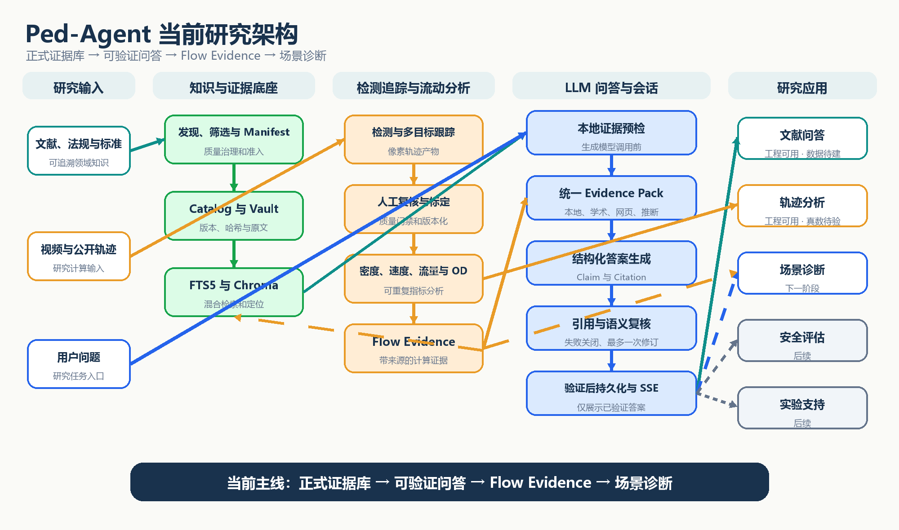
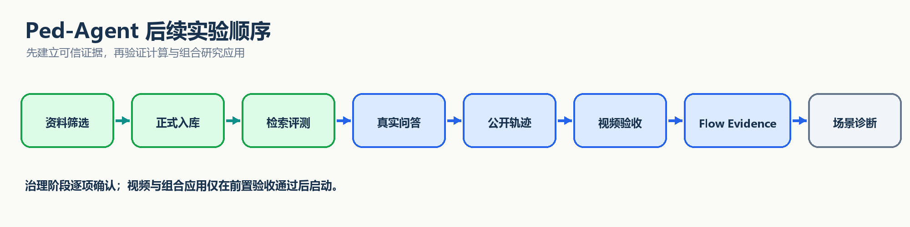

# Ped-Agent 项目阶段总结与实验评估方案

_项目阶段报告 · 基于本地 `main` 分支当前代码与研究资产 · 2026-08-06_

---

## 📋 项目概览

Ped-Agent 已形成一个面向行人流研究的、本地优先且证据约束的研究智能体框架。当前工程主干已经成型，下一阶段重点不是继续堆叠功能，而是完成正式知识资产、真实数据集和真实模型调用的科学验收。

项目研究主线为：

> **正式证据库 → 可验证问答 → Flow Evidence → 场景诊断**

当前状态可以概括为：

- **总体架构已经稳定**：项目统一划分为知识与证据底座、检测追踪与流动分析、LLM 问答与会话三个基础模块
- **工程能力基本成型**：证据问答链和视觉轨迹工作台已具备完整的软件流程
- **科研资产仍待建设**：正式 Catalog、Manifest、Gold Questions 和真实视觉任务仍为空
- **下一关键里程碑明确**：先完成正式证据库和检索验收，再进行真实问答、公开轨迹和场景诊断实验

## 🎯 项目目标与功能

### 总体目标

Ped-Agent 的目标不是成为通用聊天机器人，而是建立一条可追溯、可复查、可重复的行人流研究链。系统需要管理经过筛选的文献、法规和标准，从视频或轨迹中形成可计算证据，并通过受约束的 LLM 生成经过验证的研究回答。

### 三个基础模块

| 模块 | 核心职责 | 已具备功能 | 当前成熟度 |
| --- | --- | --- | --- |
| **知识与证据底座** | 管理系统能够信任、检索和引用的事实 | 质量规则、Manifest 预检、PDF 解析、Catalog/Vault、FTS5、Chroma、检索评测 | 工程基础完成，正式数据建设中 |
| **检测追踪与流动分析** | 将视频或轨迹转化为结构化行人流证据 | 视频上传、模型校验、检测跟踪、人工复核、标定、投影、后处理、指标分析和导出 | 工程闭环可用，真实数据待验收 |
| **LLM 问答与会话** | 调度证据并只展示经过验证的回答 | 会话、Run、SSE、混合检索、条件外搜、结构化生成、引用校验、语义复核、一次修订和持久化 | 工程闭环可用，正式语料与真实服务待验收 |

### 研究应用

| 应用 | 当前状态 | 说明 |
| --- | --- | --- |
| **文献问答** | 工程可用、数据受阻 | 前后端和问答链已具备，但正式知识库当前为空 |
| **轨迹分析** | 工程可用、真数待验 | 视觉轨迹工作台已形成端到端流程 |
| **场景诊断** | 下一阶段 | 需要联合正式证据与 Flow Evidence |
| **安全评估** | 后续 | 应保持为研究辅助，不直接输出合规结论 |
| **实验支持** | 后续 | 需要在知识底座和问答闭环完成验收后建设 |

视觉工作台当前流程为：

`上传 → 预检 → 推理队列 → 检测跟踪 → 人工复核 → 标定 → 世界坐标投影 → 后处理 → 分析 → 渲染与导出`

## 🔗 总体架构

_图 1：Ped-Agent 当前三模块研究架构及研究应用关系。_

```mermaid
flowchart LR
    accTitle: Ped-Agent 当前研究架构
    accDescr: 系统通过知识与证据底座、检测追踪与流动分析、LLM 问答与会话三个基础模块，将文献和轨迹数据转化为可验证研究应用。

    subgraph sources ["研究输入"]
        literature["文献、法规与标准"]
        trajectory["视频与公开轨迹"]
        question(["用户问题"])
    end

    subgraph knowledge ["知识与证据底座"]
        governance["发现、筛选与 Manifest"]
        storage[("Catalog 与 Vault")]
        retrieval["FTS5 与 Chroma"]
    end

    subgraph analysis ["检测追踪与流动分析"]
        inference["检测与多目标跟踪"]
        review["人工复核与标定"]
        metrics["密度、速度、流量与 OD"]
        flow_evidence["Flow Evidence"]
    end

    subgraph qa ["LLM 问答与会话"]
        preflight["本地证据预检"]
        evidence_pack["统一 Evidence Pack"]
        draft["结构化答案生成"]
        verify{"引用与语义通过？"}
        revise["最多一次修订"]
        persist["验证后持久化与 SSE"]
    end

    subgraph apps ["研究应用"]
        literature_qa["文献问答：数据待建"]
        trajectory_app["轨迹分析：真数待验"]
        diagnosis["场景诊断：下一阶段"]
        safety["安全评估：后续"]
        experiment["实验支持：后续"]
    end

    literature --> governance --> storage --> retrieval
    trajectory --> inference --> review --> metrics --> flow_evidence
    flow_evidence -. "审核后沉淀" .-> storage
    question --> preflight
    retrieval --> preflight --> evidence_pack
    flow_evidence --> evidence_pack
    evidence_pack --> draft --> verify
    verify -->|否| revise --> verify
    verify -->|是| persist
    persist --> literature_qa
    metrics --> trajectory_app
    persist -.-> diagnosis
    flow_evidence -.-> diagnosis
    persist -.-> safety
    persist -.-> experiment

    classDef knowledge_style fill:#dcfce7,stroke:#16a34a,stroke-width:2px,color:#14532d
    classDef analysis_style fill:#ffedd5,stroke:#ea580c,stroke-width:2px,color:#7c2d12
    classDef qa_style fill:#dbeafe,stroke:#2563eb,stroke-width:2px,color:#1e3a5f
    classDef app_style fill:#f3f4f6,stroke:#6b7280,stroke-width:2px,color:#1f2937

    class governance,storage,retrieval knowledge_style
    class inference,review,metrics,flow_evidence analysis_style
    class preflight,evidence_pack,draft,verify,revise,persist qa_style
    class literature_qa,trajectory_app,diagnosis,safety,experiment app_style
```

<strong>📋 Mermaid 源码</strong>

---

## 💡 项目创新点

以下创新点目前主要体现为架构和方法创新，仍需通过正式实验验证其有效性和相对优势。

1. **事实、计算和解释分层**：文献事实归知识底座，轨迹计算归分析模块，证据编排和解释归 LLM 模块，避免将原文、计算结果和模型结论混为同一事实层。
2. **治理型知识库**：文献必须依次经过候选发现、筛选、质量核验、合法全文确认、Manifest 和导入，并受 JCI、中科院分区、引用量、哈希和版本规则约束。
3. **先校验、再呈现**：每个事实 Claim 必须绑定 Citation，并由独立模型执行语义复核；二次失败时关闭回答，不展示未验证草稿。
4. **Flow Evidence 桥接机制**：轨迹分析结果携带场景、时间范围、算法版本、输入哈希和质量限制，使 LLM 能够引用可回查的计算证据。
5. **不可变产物与局部重算**：像素轨迹、复核轨迹、标定报告、世界坐标轨迹和分析结果分别版本化，修改标定时无需重新运行检测跟踪。
6. **标定质量门禁**：世界坐标检查点 RMSE 必须不超过 `0.10 m`，否则系统保留像素轨迹，但停止输出正式物理指标。
7. **隐私约束的可观测性**：LangSmith 默认关闭，启用后不上传证据正文、对话历史、未验证草稿和密钥，且观测服务故障不改变本地 Run 结果。

## ✅ 当前验证与资产状态

### 自动化验证

当前代码快照已经通过以下验证：

| 验证范围 | 结果 |
| --- | ---: |
| 核心包测试 | `58 passed, 1 skipped` |
| 后端服务测试 | `59 passed` |
| 前端测试 | `15 passed` |
| 前端生产构建 | 成功 |
| 合计 | `132 passed, 1 skipped` |

这些结果证明工程接口、状态流转和模拟集成路径具备较好的回归基础，但不能替代真实科研数据、真实模型和真实服务的端到端验收。

### 研究资产

| 资产 | 当前数量或状态 |
| --- | ---: |
| 候选文献 | 60 篇，全部为 `unscreened` |
| 本地待治理 PDF | 14 份 |
| 正式筛选记录 | 0 |
| 期刊指标核验记录 | 0 |
| 文献 Manifest | 0 |
| Gold Questions | 0 |
| Catalog 正式资源 | 0 |
| Catalog 正式切块 | 0 |
| 真实视觉任务 | 0 |

## 🚨 主要缺口与风险

| 风险 | 影响 | 应对方式 |
| --- | --- | --- |
| 正式知识库为空 | 文献问答无法形成真实证据闭环 | 优先完成筛选、质量核验和试点入库 |
| 真实服务尚未验证 | 无法确认 DeepSeek、Embedding、外搜和 LangSmith 的实际连通性 | 单独执行受控 Smoke Test 并保留脱敏报告 |
| 视觉模块仅通过模拟数据测试 | 无法证明检测、跟踪和物理量精度 | 先验证公开轨迹，再进行带人工真值的视频实验 |
| Flow Evidence 尚未接入问答链 | 场景诊断不能形成完整跨模块闭环 | 建立版本化契约和只读检索接口 |
| 科研应用边界容易扩张 | 安全评估可能被误解为合规结论 | 保留代理指标、限制说明和人工审核门禁 |
| 前端 Plotly 分块较大 | 首次加载性能可能受到影响 | 使用按需加载和路由级代码分割 |

## 🧪 剩余实验与评估方案

### 阶段一：正式语料与检索验收

| 实验 | 核心任务 | 验收门槛 |
| --- | --- | --- |
| 语料治理 | 依次完成筛选、指标核验、合法全文、Manifest 和批次导入 | 试点 20 篇文献；A 级不少于 8，A+B 不少于 18，例外不超过 2，高影响文献不少于 14 |
| Gold Set | 建立覆盖五类主题、法规、方法和无答案问题的 30 道问题 | 问题、预期资源和页码或条款定位均经过人工审核 |
| 检索对照 | 比较 FTS5、Chroma 和 Hybrid RRF，并进行切块与查询改写消融 | Recall@5 ≥ 0.80，MRR ≥ 0.70，定位命中率 ≥ 0.75，非正式资料泄漏率 = 0 |

### 阶段二：真实问答闭环

执行 DeepSeek、Embedding、学术外搜和脱敏 LangSmith 的真实连通实验，并加入无证据、冲突证据、诱导提问和服务异常样本。

建议采用以下初始门槛：

- Claim 支持率不低于 95%
- 引用准确率不低于 95%
- 无证据幻觉率为 0
- 不受支持的事实比例不高于 2%
- 二次验证失败时未验证草稿展示率为 0

### 阶段三：轨迹和视觉算法验收

首先使用一个带真值的公开轨迹数据集，隔离检测误差，验证密度、速度、流量、OD、停留时间和基本图。轨迹指标通过后，再建立小规模人工标注的混合流视频集，评估行人、撑伞行人、自行车和电动车的检测跟踪能力。

| 指标类型 | 建议评估项 | 建议初始门槛 |
| --- | --- | --- |
| 轨迹指标 | 速度 MAE、密度误差、流量误差、OD 准确率 | 速度 MAE ≤ 0.10 m/s；流量误差 ≤ 5%；OD 准确率 ≥ 90% |
| 检测 | 各类别 Precision、Recall、F1、mAP | 先建立人工基线，再冻结正式门槛 |
| 跟踪 | HOTA、IDF1、ID Switch、轨迹完整率 | 不低于选定公开基线 |
| 接触点 | 脚点或轮胎接地点误差 | 同时报告像素误差和世界坐标误差 |
| 标定 | 独立检查点世界坐标 RMSE | ≤ 0.10 m |
| 重复性 | 同配置重复运行的结果哈希 | 确定性阶段必须一致 |

### 阶段四：Flow Evidence 与场景诊断

建立版本化 `FlowEvidence` 契约，将轨迹指标以只读方式接入问答链，并比较以下三种实验条件：

1. 仅使用文献和法规证据
2. 仅使用 Flow Evidence
3. 联合使用正式证据和 Flow Evidence

验收要求包括：所有数值结论均能回查分析产物，所有规范性结论均引用正式来源，输入哈希、算法版本、单位、时间范围和限制字段完整率达到 100%，不受支持结论数量为 0。

### 阶段五：鲁棒性、隐私和可用性

通过故障注入测试索引过期、Embedding 不可用、外搜限流、SSE 断线、服务重启、LangSmith 故障、模型缺失、上传损坏和标定失败等场景。

核心验收标准为：

- 未验证草稿展示率为 0
- 敏感信息和证据正文外泄率为 0
- 终态 Run 不发生非法变化
- 模块降级状态能够明确展示
- SSE 重连不会重复或丢失终态事件
- 研究人员能够识别输出来源、限制和复查入口

## 📍 推荐执行顺序

_图 2：从正式语料建设到组合研究应用的推荐实验顺序。_

<strong>📋 Mermaid 源码</strong>

---

资料发现、筛选、质量评价、全文确认、Manifest、导入和评测仍应作为独立阶段逐项确认，不应因为完成前一步就自动进入下一步。

## 🔄 实验可重复性要求

每次正式实验应冻结并记录以下内容：

- 数据集、文献库和 Manifest 版本
- 代码提交 SHA 与依赖锁文件
- 检测、跟踪、Embedding 和 LLM 模型标识
- Prompt、切块、检索和分析参数
- 输入文件哈希、标定版本和场景定义
- 原始指标、汇总指标、失败样本和人工复核结论
- 运行环境、耗时、Token、成本和硬件信息

任何改动只有在核心回归、模块验收和跨模块验收均通过后，才能升级为新的正式基线。

## 🔗 项目依据

- [Ped-Agent 三模块总体架构设计](../superpowers/specs/2026-08-06-ped-agent-three-module-architecture-design.md)
- [Ped-Agent 证据问答链](../agent-architecture.md)
- [Vision trajectory workbench](../vision-trajectory-workbench.md)
- [memPed 数据目录](../../memPed/README.md)
- [试点评测配置](../../memPed/knowledge/pilot_config.json)
- [语料配额规则](../../memPed/knowledge/quotas.yaml)

---

_本报告用于当前阶段汇报和实验规划。工程能力、真实运行结果与科研有效性结论必须分别陈述。_
