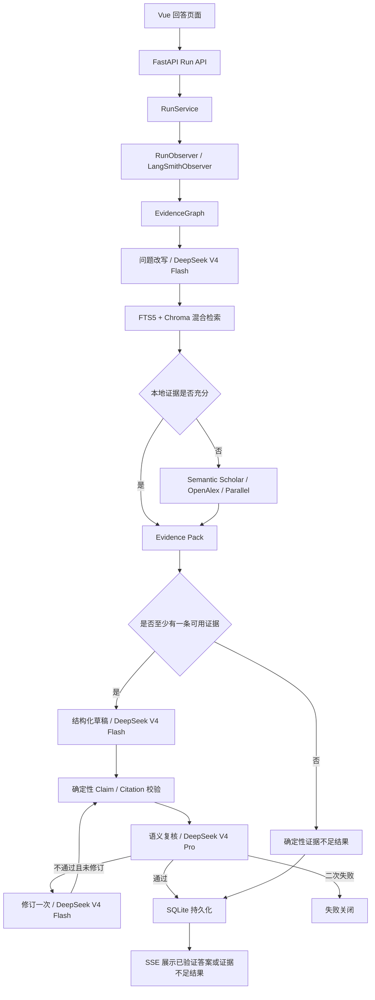

# Ped-Agent 回答流程、DeepSeek 与 LangSmith 详细设计

- 日期：2026-08-03
- 状态：已完成方案确认，等待规格审阅
- 范围：本机单用户证据问答首版
- 权威入口：`ped_agent_server` FastAPI 服务与 `EvidenceGraph`

## 1. 目标与边界

本设计在现有证据问答链上完成以下收敛：

1. 使用 LangChain 接入 DeepSeek OpenAI-compatible API；
2. 使用确定性 LangGraph 编排检索、生成、规则校验、语义复核和一次修订；
3. 使用 LangSmith 监控完整 Run，但不上传证据正文、历史消息和未验证草稿；
4. 保持“先校验，再呈现”，前端只展示已验证答案或确定性的证据不足结果；
5. LangSmith 故障不得阻塞本地回答链；
6. 保持现有知识库、SQLite Run/Event 存储和 HTTP/SSE 接口兼容。

本设计不推进候选文献筛选、质量评估、全文下载、Manifest 或导入，也不改变这些阶段之间的治理边界。

## 2. 已确认决策

| 主题 | 决策 |
|---|---|
| 首版能力 | 证据问答闭环 |
| 运行形态 | 本机单用户，默认监听 `127.0.0.1` |
| 模型接入 | LangChain `ChatOpenAI` 直连 DeepSeek，不引入 LiteLLM Proxy 或 NewAPI |
| 生成模型 | `deepseek-v4-flash` |
| 校验模型 | `deepseek-v4-pro` |
| 结构化输出 | DeepSeek JSON Output，对应 LangChain `json_mode` |
| Agent 编排 | 确定性 LangGraph，不使用自由 ReAct 循环 |
| 证据策略 | 本地正式证据优先，不足时单轮外搜 |
| 输出策略 | 先规则校验和语义复核，再通过 SSE 呈现 |
| 修订策略 | 只允许使用原 Evidence Pack 修订一次 |
| 运行持久化 | 继续使用 `backend/storage/agent/agent.sqlite3` |
| LangGraph Checkpointer | 首版不引入，避免双重运行状态 |
| LangSmith | 服务端 Observer，100% 采样，项目 `ped-agent-local` |
| LangSmith 内容策略 | 允许当前问题和最终答案；禁止证据正文、历史消息和未验证内容 |
| Prompt Hub | 首版不接入，提示词继续随代码版本管理 |

DeepSeek 模型名称依据 2026-08-03 官方文档。模型标识保持可配置，并通过可选真实 Smoke Test 校验账号可用性。

## 3. 当前实现盘点

### 3.1 当前权威链路

- `backend/src/ped_agent_server/api.py`：会话、Run、SSE 和取消接口；
- `backend/src/ped_agent_server/run_service.py`：并发、生命周期、持久化和错误收口；
- `src/ped_agent/agent/evidence_graph.py`：确定性证据问答图；
- `backend/src/ped_agent_server/hybrid_retrieval.py`：FTS5 + Chroma + RRF；
- `backend/src/ped_agent_server/external_search.py`：Semantic Scholar、OpenAlex、可选 Parallel；
- `backend/src/ped_agent_server/model_gateway.py`：LangChain Chat/Embedding 适配；
- `backend/src/ped_agent_server/agent_repository.py`：会话、Run、事件、证据和引用；
- `frontend/src/views/AnswerView.vue`：回答工作区；
- `frontend/src/services/agentStream.ts`：SSE 状态归约。

### 3.2 需要收敛的旧路径

以下内容属于早期脚手架或规划材料，不是首版服务运行真相：

- `src/ped_agent/agent/graph.py` 的通用查询路由；
- `src/ped_agent/main.py` 的 OmegaConf CLI；
- `scripts/evaluate_agent.py` 的旧图 Smoke Test；
- `config/llm.yaml`、`config/langsmith.yaml` 的旧 YAML 配置；
- `docs/development-plan.md` 中与当前运行时不一致的旧描述。

首版回答路径以 `EvidenceGraph + AgentSettings + .env + ped_agent_server` 为唯一权威。旧路径的弃用或迁移在实现计划中单独处理。

## 4. 总体架构



### 4.1 核心包职责

`ped_agent` 负责 LangGraph State、节点、条件边、回答与证据契约、Evidence Pack、引用规则、语义校验路由和一次修订上限。核心包不直接依赖 FastAPI、SQLite 或 LangSmith SDK。

### 4.2 服务包职责

`ped_agent_server` 负责 HTTP/SSE、会话与 Run、DeepSeek/Embedding/检索/外搜适配器、SQLite、LangSmith Client、脱敏、Trace 关联和服务级错误映射。

## 5. 节点数据流

| 节点 | 输出 | 模型 | 失败策略 |
|---|---|---|---|
| `load_conversation` | 上下文准备完成 | 无 | 本地存储失败则 Run 失败 |
| `rewrite_query` | 独立检索问题 | Flash | 调用失败则 Run 失败 |
| `local_retrieval` | 本地证据批次 | Embedding 仅用于向量查询 | 向量失败降级 FTS；FTS 也失败则 Run 失败 |
| `assess_evidence` | 是否需要外搜 | 无 | 确定性规则 |
| `external_search` | 外部证据 | 无 | 各来源独立失败，全部为空仍继续 |
| `normalize_evidence` | Evidence Pack | 无 | 无有效证据时进入确定性证据不足分支 |
| `handle_insufficient_evidence` | 固定的证据不足结果 | 无 | 不调用生成或校验模型 |
| `generate_draft` | `AnswerDraft` | Flash | JSON 修复一次，仍失败则关闭 |
| `validate_rules` | `RuleValidation` | 无 | 首次失败修订，二次失败关闭 |
| `semantic_verify` | `SemanticReview` | Pro | 不可用或二次不通过则关闭 |
| `revise_once` | 修订后的 `AnswerDraft` | Flash | 只执行一次 |
| `final_persist` | `AnswerDocument` | 无 | 持久化失败则不发送答案 |

最近 6 条消息只用于追问改写；上一轮 Evidence ID 不能绕过本轮检索和指纹检查。外部证据只属于当前 Run，不自动进入正式 Catalog。

本地和外部检索都没有返回可用证据时，图进入 `handle_insufficient_evidence`：生成固定提示“当前知识库与外部检索未找到足够的可核验证据，暂时无法给出可靠回答”，不调用 Flash 或 Pro。该结果以 `verification.status=insufficient_evidence` 持久化并展示，不能包含事实性结论。

本地证据满足以下任一条件时不外搜：命中至少两个不同正式资源；或问题与标题、DOI、文号精确匹配。其他情况最多触发一次外搜。

## 6. LangGraph State

```text
请求上下文
- original_query
- recent_messages
- previous_evidence_ids

检索状态
- standalone_query
- local_batch
- external_evidence
- needs_external
- evidence
- evidence_pack

回答状态
- draft
- revision_count

验证状态
- rules
- review
- semantic_passed
- insufficient_evidence

运行控制
- emit
- is_cancelled
- final_answer
```

`emit` 与 `is_cancelled` 由服务层注入。首版不要求 State 跨进程恢复，因此不引入 LangGraph Checkpointer；服务重启后仍把遗留 Run 标记为 `interrupted`。

## 7. DeepSeek 设计

### 7.1 模型角色

| 角色 | 默认模型 | 用途 |
|---|---|---|
| `answer` | `deepseek-v4-flash` | 问题改写、草稿生成、一次修订 |
| `verify` | `deepseek-v4-pro` | Claim 级语义支持度复核 |
| `embedding` | 独立 OpenAI-compatible Embedding | 向量索引与查询 |

生成与校验使用不同模型，降低同一模型对自身答案产生相关性偏差的风险。Embedding 不由 DeepSeek Chat API 承担，也不在本设计中更换供应商。

### 7.2 配置

```dotenv
PED_AGENT_ANSWER__PROTOCOL=openai_compatible
PED_AGENT_ANSWER__MODEL=deepseek-v4-flash
PED_AGENT_ANSWER__API_KEY=
PED_AGENT_ANSWER__BASE_URL=https://api.deepseek.com
PED_AGENT_ANSWER__TEMPERATURE=0.1
PED_AGENT_ANSWER__MAX_TOKENS=4096
PED_AGENT_ANSWER__STRUCTURED_OUTPUT_METHOD=json_mode

PED_AGENT_VERIFY__ENABLED=true
PED_AGENT_VERIFY__PROTOCOL=inherit
PED_AGENT_VERIFY__MODEL=deepseek-v4-pro
```

`inherit` 复用 answer 的协议、Base URL 和 API Key，但允许覆盖模型、温度、Token、超时和重试。

### 7.3 JSON Output

1. 使用 `with_structured_output(schema, method="json_mode", include_raw=True)`；
2. 提示词必须包含 JSON 字样、字段说明和最小示例；
3. 检查空内容、截断、解析错误和 Pydantic 校验错误；
4. 首次失败后由同一角色模型修复一次；
5. 第二次失败则结束 Run；
6. Pro 校验失败时不得降级为 Flash 或仅规则校验。

官方资料：`https://api-docs.deepseek.com/`、`https://api-docs.deepseek.com/guides/json_mode`。

## 8. 回答与证据契约

证据标签保持：`[L]` 本地正式证据、`[A]` 外部学术摘要、`[W]` 已抓取网页、`[I]` 单独展示的分析性推断。

每个事实 Claim 必须绑定存在的 Citation；Citation 必须绑定本 Run 的 Evidence ID，标签前缀必须与来源一致。

`AnswerDraft` 包含 `answer_markdown`、`claims`、`citations`、`inferences` 和 `limitations`。未验证草稿不通过 SSE 展示，也不以原文上传 LangSmith。

只有引用规则通过、Pro 语义复核通过，并且 SQLite 答案、证据和引用持久化成功时，才生成并展示普通 `AnswerDocument`。

`VerificationSummary.status` 扩展为 `verified | rules_only | insufficient_evidence`。零证据分支只能产生固定的 `insufficient_evidence` 文档；它不包含 Claim、Citation 或分析性推断，也不进入语义校验。

## 9. LangSmith Observer

### 9.1 接口

```python
class RunObserver(Protocol):
    async def observe_run(
        self,
        context: RunExecutionContext,
        operation: Callable[[], Awaitable[RunExecutionResult]],
    ) -> RunExecutionResult: ...

    async def record_feedback(
        self,
        run_id: str,
        metrics: RunMetrics,
    ) -> None: ...
```

提供 `LangSmithObserver` 和 `NoOpRunObserver`。RunService 只依赖协议，不散布 LangSmith 条件判断。

### 9.2 Trace 关联

本地 Run ID 直接作为 LangSmith 根 Trace UUID：

```python
RunnableConfig(
    run_id=UUID(context.run_id),
    run_name="ped-agent.evidence-qa",
    tags=[
        "feature:evidence-qa",
        "environment:local",
        "answer-model:deepseek-v4-flash",
        "verify-model:deepseek-v4-pro",
        "graph-version:v1",
    ],
    metadata={
        "run_id": context.run_id,
        "conversation_id": context.conversation_id,
        "graph_version": "v1",
        "answer_model": "deepseek-v4-flash",
        "verify_model": "deepseek-v4-pro",
    },
)
```

LangGraph 节点和 LangChain 模型调用使用自动子 Span；混合检索和外部搜索增加显式子 Span。现有 `_stage()` 继续负责本地 SSE 阶段事件，不重复创建第二套同名 Trace。

### 9.3 配置

```dotenv
PED_AGENT_LANGSMITH__ENABLED=true
PED_AGENT_LANGSMITH__API_KEY=
PED_AGENT_LANGSMITH__PROJECT=ped-agent-local
PED_AGENT_LANGSMITH__SAMPLING_RATE=1.0
PED_AGENT_LANGSMITH__CONTENT_POLICY=redacted
# PED_AGENT_LANGSMITH__ENDPOINT=
```

首版固定使用 `redacted`，不提供通过配置上传完整证据正文的捷径。

### 9.4 允许上传

- 当前用户问题和最终已验证答案或固定的证据不足结果；
- Citation Label；
- Evidence ID、标题、页码或条款、内容 Hash；
- 证据来源与数量；
- 模型名称、角色、Token、延迟和完成原因；
- 节点耗时、Run 状态和脱敏异常类型；
- 是否外搜、是否降级、是否修订；
- 引用规则和语义复核的布尔结果。

### 9.5 禁止上传

- 文献、法规和网页证据正文；
- 完整 Evidence Pack；
- 最近会话消息正文；
- 未验证草稿和修订前答案；
- SemanticReview 的详细修订文本；
- 外部网页原始响应；
- API Key、Authorization Header 和供应商原始错误；
- SQLite 完整证据快照。

### 9.6 脱敏实现

1. 使用 LangSmith Secret Anonymizer 清除通用凭证；
2. 清除 `recent_messages`、`evidence_pack`、`quote`、`draft` 和 `review.revised_text`；
3. 将 Prompt 中 `<evidence>...</evidence>` 区段替换为证据摘要；
4. 模型子 Span 只保留模型元数据、Token、完成原因和解析状态；
5. 根 Trace 输出只保留最终答案和引用摘要；
6. 保留 Evidence ID、标题、定位和 Hash，以便回查本地 SQLite。

### 9.7 Metadata 与 Feedback

初始 Metadata：`run_id`、`conversation_id`、`application_version`、`graph_version`、`answer_model`、`verify_model`、`embedding_model`、`external_search_enabled`、`verification_required`。

完成后 Feedback：`run_success`、`citation_rules_passed`、`semantic_verification_passed`、`insufficient_evidence`、`revision_count`、三类证据数量、`external_search_used`、`retrieval_degraded`、`answer_displayed`。

启用 LangSmith 但缺少 Key 时配置校验失败；运行期间 LangSmith 网络、限流或上传失败只记录本地警告，回答继续。Trace 上传不进入回答关键路径。

## 10. API 与 SSE

保留现有接口：

```text
POST /api/conversations
GET  /api/conversations
GET  /api/conversations/{id}
POST /api/conversations/{id}/runs
GET  /api/runs/{id}/events
POST /api/runs/{id}/cancel
```

SSE 事件保持 `run.started`、`stage.started`、`stage.completed`、`evidence.summary`、`answer.delta`、`run.completed`、`run.failed`、`run.cancelled` 和 `heartbeat`。

- `stage.completed` 只含耗时、模型、证据 ID 或验证摘要；
- `evidence.summary` 不含证据正文；
- `answer.delta` 只能在已验证答案或证据不足结果持久化后发送；
- 首版一次发送完整答案，不直播未验证 Token；
- SSE 断开不取消 Run；
- 失败或取消时前端清除暂存答案。

## 11. 持久化顺序

SQLite 继续作为完整数据的唯一事实来源。完成顺序为：

1. 保存 Evidence 快照；
2. 保存最终 Assistant Message 和 `AnswerDocument`；
3. 保存 Message 与 Evidence 的引用关系；
4. 追加 `answer.delta`；
5. 将 Run 标记为 `completed`；
6. 追加 `run.completed`。

任一步骤失败都不得发送最终答案。

## 12. 错误处理

| 内部类别 | Run 结果 | 用户消息 | LangSmith |
|---|---|---|---|
| DeepSeek 超时、限流、认证失败 | `failed` | 回答服务暂时不可用 | 模型、阶段、脱敏错误类型 |
| JSON 连续解析失败 | `failed` | 回答生成失败 | 解析状态，不上传草稿 |
| 向量索引不可用 | 继续 | 展示检索降级 | `retrieval_degraded=true` |
| FTS 与向量均不可用 | `failed` | 本地知识库不可用 | 检索错误类型 |
| 引用规则二次失败 | `failed` | 证据校验未通过 | 规则反馈为 false |
| 语义复核二次失败 | `failed` | 证据不足，无法生成可靠回答 | 语义反馈为 false |
| 用户取消 | `cancelled` | 已取消 | 取消阶段 |
| 服务重启 | `interrupted` | 服务重启中断 | 不补传旧 Trace |
| LangSmith 上传失败 | 回答不受影响 | 不展示 | 本地日志告警 |

## 13. 测试设计

### 13.1 单元测试

- Flash 与 Pro 的角色分配；
- `json_mode` 参数；
- 空响应、截断、非法 JSON 与 Pydantic 错误的一次修复；
- 二次失败关闭；
- Observer 的 No-op 与 LangSmith 实现；
- 脱敏器清除证据、历史和草稿；
- 根 Trace 保留问题与最终答案；
- 本地 Run ID 与 Trace UUID 一致；
- Feedback 字段和值。

### 13.2 集成测试

- Fake DeepSeek + Fake LangSmith 完整回答链；
- 本地证据充分时不外搜，不足时只外搜一次；
- Pro 不通过后 Flash 修订一次并再次校验；
- 零证据时不调用模型并返回固定的 `insufficient_evidence` 文档；
- 校验失败时没有 `answer.delta`；
- LangSmith Client 抛错时 Run 仍完成；
- FTS 降级同时进入 SSE 和 LangSmith；
- SQLite 与 Trace 使用相同 Run ID；
- 前端只展示完成后的验证答案。

### 13.3 可选真实 Smoke Test

真实测试不进入 CI，需要本地 `.env`：验证两个 DeepSeek 模型、LangSmith Trace、脱敏结果、Token、延迟、模型角色和反馈指标。CI 继续使用 Fake Model 与 Mock HTTP。

## 14. 验收标准

1. 问题可完整经过检索、生成、规则校验、Pro 复核和持久化；
2. Flash 与 Pro 角色正确；
3. DeepSeek 结构化输出使用 `json_mode`；
4. 前端只显示验证并持久化的答案或固定的证据不足结果；
5. 零证据时只显示固定的证据不足结果，不生成事实性内容；
6. LangSmith 可按本地 Run ID 找到完整链路；
7. Trace 不含证据正文、历史消息、草稿或密钥；
8. LangSmith 不可用时回答链仍正常；
9. 检索降级、外搜、修订和验证都有指标；
10. 原有 API、SSE、持久化和前端测试无回归；
11. `agent doctor` 能识别缺失配置，可选真实测试能验证模型与 Trace。

## 15. 非目标

首版不包含：LiteLLM Proxy、NewAPI、多供应商自动切换、回答模型 fallback、LangGraph Checkpointer、跨进程恢复、未验证 Token 流、Prompt Hub、外搜自动入库、LangSmith Dataset 自动回归、远程多租户和用户反馈按钮。

现有 Gold Questions 与检索评测资产继续保留；同步为 LangSmith Dataset 属于后续评估阶段。

## 16. 预期代码影响范围

后续实现计划应覆盖：

- `backend/src/ped_agent_server/settings.py`
- `backend/src/ped_agent_server/model_gateway.py`
- `backend/src/ped_agent_server/agent_runtime.py`
- `backend/src/ped_agent_server/run_service.py`
- 新增服务端 Observer/脱敏模块
- `src/ped_agent/agent/evidence_graph.py`
- `.env.example`
- 回答链、配置、Observer、脱敏和 API 测试
- `docs/agent-architecture.md` 与 README 权威路径说明
- 旧 YAML、旧图和旧评测脚本的弃用或迁移说明

实现必须保持修改边界狭窄，不修改当前未提交的文献候选与搜索日志。
