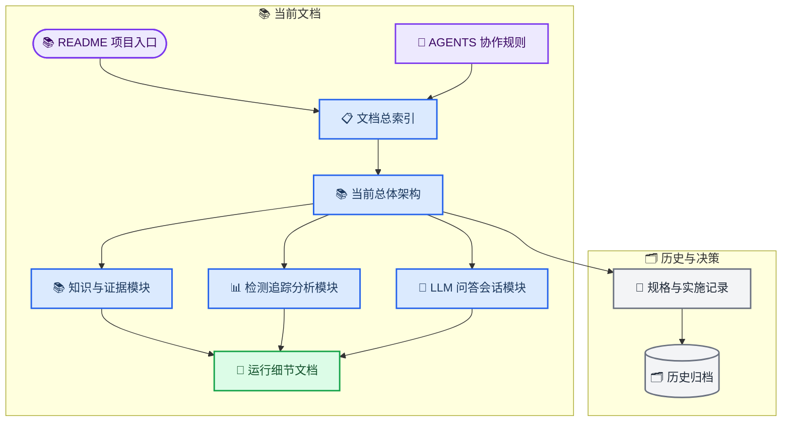

# Ped-Agent 文档体系整理设计

_已确认的文档分层、归档与同步方案 · 2026-08-06_

---

## 📋 设计结论

Ped-Agent 采用“当前说明、运行细节、决策记录、历史归档”四层文档体系。
根目录新增 `AGENTS.md`，用于约束 Agent 和贡献者如何理解、修改、验证项目；
`docs/project-architecture.md` 成为三模块边界与当前成熟度的唯一总览。

旧 RAG、旧开发计划、旧配置设计、视觉与数据分析目标稿、实验评估目标稿统一迁入
`docs/archive/`。这些文件保留 Git 历史和设计背景，但不再指导当前实现。

> 📌 **权威边界：** `README.md` 负责项目入口，`docs/project-architecture.md`
> 负责当前总体架构，`docs/modules/` 负责模块边界，运行细节文档负责具体实现，
> `docs/archive/` 只保留历史参考。

## 🎯 目标与非目标

### 目标

- 让新贡献者从项目入口逐层理解三模块架构和当前能力
- 新建标准根级 `AGENTS.md`，统一协作、验证和安全规则
- 消除当前实现与旧设计文档之间的状态冲突
- 将动态项目状态与历史设计决策分离
- 为知识与证据、检测追踪分析、LLM 问答会话分别提供稳定说明
- 保持所有旧方案可追溯，同时避免其继续被误认为当前实现
- 修复文档迁移产生的内部链接和权威来源引用

### 非目标

- 不修改 Python、TypeScript、Vue、API 或数据库行为
- 不重构现有代码目录或包边界
- 不推进文献筛选、质量评价、Manifest、导入或索引阶段
- 不运行真实 DeepSeek、Embedding、外部搜索、LangSmith、GPU 或视频模型验证
- 不处理当前未跟踪的 `docs/assets/`
- 不删除历史文档或压缩其原始技术内容

## 📚 文档信息架构

文档入口按读者从“了解项目”到“修改实现”的顺序组织。



### 目标目录

```text
Ped-Agent/
├── AGENTS.md
├── README.md
└── docs/
    ├── README.md
    ├── project-architecture.md
    ├── modules/
    │   ├── knowledge-and-evidence.md
    │   ├── detection-tracking-analysis.md
    │   └── llm-qa-conversation.md
    ├── agent-architecture.md
    ├── vision-trajectory-workbench.md
    ├── legacy-scaffold.md
    ├── versioning.md
    ├── superpowers/
    └── archive/
        ├── README.md
        ├── rag-architecture.md
        ├── development-plan.md
        ├── config-system-design.md
        ├── vision-module-design.md
        ├── data-analysis-module-design.md
        └── experiment-evaluation-module-design.md
```

## 🔗 权威来源与文档职责

| 层级 | 文档 | 主要职责 |
| --- | --- | --- |
| 项目入口 | `README.md` | 项目目的、三模块摘要、当前状态、快速启动和文档导航 |
| 协作规则 | `AGENTS.md` | Agent 与贡献者的代码边界、验证要求、资料治理和安全约束 |
| 文档入口 | `docs/README.md` | 当前文档、运行文档、决策记录和历史归档索引 |
| 当前架构 | `docs/project-architecture.md` | 三模块关系、跨模块契约、成熟度和应用边界 |
| 模块说明 | `docs/modules/*.md` | 单模块职责、输入输出、代码映射、入口、限制和验收 |
| 运行细节 | 现有运行文档 | 问答链、视觉工作台、当前与旧代码映射、版本管理 |
| 决策记录 | `docs/superpowers/` | 已批准规格和实施计划，不承载动态项目状态 |
| 历史参考 | `docs/archive/` | 已被替代的提案、脚手架和目标设计 |

`docs/project-architecture.md` 取代三模块规格中的动态成熟度描述。
`docs/superpowers/specs/2026-08-06-ped-agent-three-module-architecture-design.md`
继续保留为三模块决策基线，并链接到当前架构总览。

## 🤖 AGENTS.md 设计

根级文件使用工具通行的标准名称 `AGENTS.md`，不创建并列的 `AGENT.md`。

### 必须包含的规则

- 项目目标和三个基础模块的稳定边界
- 当前权威入口：`ped_agent_server`、`EvidenceGraph`、仓库 `.env`
- 旧 `agent/graph.py`、旧 YAML 配置和脚手架代码的限制
- `src/ped_agent`、`backend/src/ped_agent_server`、`frontend/src`、`research` 的责任映射
- 文献发现、筛选、质量评价、全文确认、Manifest、导入和评测必须分阶段执行
- 未经审核的候选资料和外部搜索结果不得称为正式证据
- 会话、Run、知识资产、视觉任务和原始数据的存储边界
- 修改核心、后端、前端和文档时分别需要执行的验证命令
- 保留无关工作区修改，只暂存任务范围内文件
- 不得把单元测试结果描述为真实模型、GPU 或外部服务连通性证明
- 新增或改变功能时同步更新 README、模块文档、运行文档和 Changelog

### 使用者路径

Agent 或贡献者进入仓库后应先读取 `AGENTS.md`，再通过 `docs/README.md`
定位当前架构和所修改模块。历史文档不能作为实现依据，除非任务明确要求恢复或比较旧方案。

## 📊 当前模块状态表达

当前文档统一使用下列成熟度，不继续沿用旧方案中的静态描述。

| 模块或应用 | 文档状态 | 边界说明 |
| --- | --- | --- |
| 知识与证据底座 | 工程能力可用，正式证据库建设中 | 60 条候选文献和 25 条检索记录仍属于候选发现阶段，不是正式证据 |
| 检测追踪与流动分析 | `/vision` 工作台可用 | 真实处理依赖视觉可选依赖、合法模型权重、场景信息和标定质量 |
| LLM 问答与会话 | 本地工程闭环可用 | 真实模型、Embedding、外部搜索和 LangSmith 连通性必须单独验证 |
| 场景诊断 | 后续组合应用 | 尚无独立可用入口 |
| 安全评估 | 后续组合应用 | 分析指标不能直接包装为安全或合规结论 |
| 实验支持 | 后续组合应用 | 旧实验评估代码和设计不代表当前产品能力 |

状态说明必须区分：

- 已有代码与经过测试的本地工程能力
- 需要可选依赖、模型或数据才能运行的能力
- 需要真实凭据和网络才能验证的外部能力
- 仅存在设计或原型、尚无当前产品入口的能力

## 🗂️ 历史文档迁移

以下文件使用 `git mv` 迁入 `docs/archive/`：

| 当前文件 | 归档原因 |
| --- | --- |
| `docs/rag-architecture.md` | 广泛 RAG 研究提案，已被当前知识底座和证据问答链取代 |
| `docs/development-plan.md` | 空仓库时期的初始开发计划，与当前运行结构不一致 |
| `docs/config-system-design.md` | 旧 YAML/OmegaConf 方案，不是当前服务配置来源 |
| `docs/vision-module-design.md` | 目标设计已被当前 Vision Workbench 实现和运行文档部分取代 |
| `docs/data-analysis-module-design.md` | 独立分析模块目标稿，当前归入检测追踪与流动分析模块 |
| `docs/experiment-evaluation-module-design.md` | 实验支持属于组合应用，不是第四个基础模块 |

### 归档规则

- 新建 `docs/archive/README.md`，解释归档含义并映射到当前文档
- 每份归档文件顶部添加历史状态提示和当前替代文档链接
- 保留原文件名和正文，避免丢失上下文
- 当前文档不得把归档内容作为权威实现说明
- 搜索和修复仓库中指向旧位置的相对链接

## ✍️ 当前文档更新范围

### 新建文件

- `AGENTS.md`
- `docs/README.md`
- `docs/project-architecture.md`
- `docs/modules/knowledge-and-evidence.md`
- `docs/modules/detection-tracking-analysis.md`
- `docs/modules/llm-qa-conversation.md`
- `docs/archive/README.md`

### 更新文件

- `README.md`：改为中文主说明，收敛项目目标、状态、启动方式和导航
- `CONTRIBUTING.md`：补齐核心、后端、前端和文档验证要求
- `CHANGELOG.md`：记录文档体系整理
- `docs/agent-architecture.md`：补充模块归属和真实服务验证边界
- `docs/vision-trajectory-workbench.md`：统一中文标题、模块归属和运行限制
- `docs/legacy-scaffold.md`：补充 Vision Workbench 后端和前端权威路径
- 三模块批准规格：从动态当前说明调整为决策基线，并链接当前架构
- 受迁移影响的规格、计划及其他 Markdown 链接

### 保持不变

- Python、Vue、TypeScript 和配置实现
- API 路径和数据模型
- `research/` 中现有治理记录
- 本地运行资产和 Git 忽略目录
- 当前未跟踪的 `docs/assets/`

## 🔧 链接与维护规则

- 当前文档使用相对链接，不使用机器绝对路径
- `README.md` 只链接当前文档入口，不直接链接归档技术方案
- 模块文档链接对应的运行细节，不复制大段 API 或实现说明
- 规格和计划可以链接归档资料，但必须明确其历史状态
- 未来改变模块边界时先更新 `docs/project-architecture.md`
- 未来改变具体运行流程时更新对应运行细节和模块文档
- 仅状态变化时更新架构状态表，避免重写历史规格

## ✅ 验证与验收

### 文档验证

1. 检查所有 Markdown 相对链接的目标是否存在
2. 搜索迁移前路径，确认不存在失效引用
3. 检查每个当前或历史文档的状态标记
4. 检查每份新文档只有一个 H1，标题层级连续
5. 检查 Mermaid 包含 `accTitle` 和 `accDescr`
6. 执行 `git diff --check`
7. 检查 Git 状态只包含本次文档范围，且不包含 `docs/assets/`

### 内容验收

- `README.md` 能说明项目目的、三模块和当前可用入口
- `AGENTS.md` 能指导 Agent 安全修改和验证项目
- `docs/README.md` 能区分当前文档、运行细节、决策记录和历史归档
- 三份模块文档的职责、输入输出和代码映射互不冲突
- `/`、`/vision`、`/qa` 与前端实际路由一致
- Library、Vision 和 Run API 与当前后端入口一致
- 文献候选不会被描述为正式知识库资产
- 单元测试不会被描述为真实外部服务连通性证明
- 归档文档不会被当前入口误标为权威来源

## 📌 最终决定

Ped-Agent 本次采用分层文档整理方案：

> **项目入口 + Agent 协作规则 + 当前架构 + 三模块说明 + 运行细节 + 决策记录 + 历史归档**

实际实施必须先迁移历史文档，再建立当前文档入口，随后更新链接与状态说明，
最后执行文档范围验证。所有修改保持为文档变更，不扩展到代码或研究治理后续阶段。
