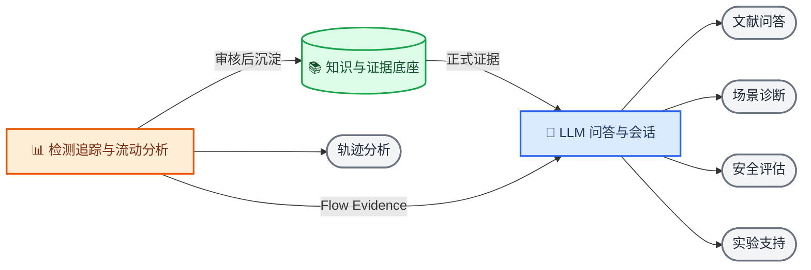

# Ped-Agent 三模块总体架构设计

_2026-08-06 · 已确认架构方案，等待书面规格复核_

---

## 📋 设计结论

Ped-Agent 统一划分为三个基础模块：

1. **知识与证据底座**：管理系统能够信任、检索和引用的事实
2. **检测追踪与流动分析**：把视频或轨迹转换为结构化行人流证据
3. **LLM 问答与会话**：理解问题、编排证据、验证回答并管理会话

文献问答、轨迹分析、场景诊断、安全评估和实验支持不再作为并列基础模块，
而是由上述三个模块单独或组合提供的研究应用。

> 📌 **核心边界：** 事实归知识底座，计算归分析模块，编排与解释归问答模块。

## 🎯 目标与非目标

### 设计目标

- 用三个稳定边界覆盖现有代码和长期研究方向
- 区分已经可运行的能力、工程基础、原型和暂缓内容
- 消除知识记忆、会话记忆和运行状态之间的概念混淆
- 为后续目录整理、接口收敛和阶段规划提供统一依据
- 保持研究资料治理阶段彼此独立，避免候选资料绕过审核进入正式证据库

### 非目标

- 本设计不直接调整目录或删除旧代码
- 本设计不启动候选筛选、质量核验、Manifest 导入等后续治理阶段
- 本设计不把外部搜索结果自动写入正式知识库
- 本设计不承诺检测追踪、场景诊断、安全评估或实验支持已经产品化
- 本设计不引入多用户、云部署或自由 ReAct 多 Agent 架构

## 📚 总体架构

### 架构原则

| 原则 | 含义 |
| --- | --- |
| 本地事实源优先 | 正式证据必须能够回查本地 Catalog、原文和稳定定位 |
| 计算结果不等于事实 | 分析结果先作为 Flow Evidence，经审核后才能长期沉淀 |
| 会话不等于知识 | 对话历史服务当前交互，不自动成为正式领域知识 |
| 外部证据不自动入库 | 外搜结果只属于当前 Run，正式纳入必须经过治理流程 |
| 先校验再呈现 | LLM 草稿完成引用规则和语义复核后才能展示 |
| 模块通过契约协作 | 模块消费稳定数据对象，不直接依赖其他模块的内部存储 |

### 横切工程基础

以下内容服务三个模块，但不构成第四个业务模块：

| 工程能力 | 当前路径 | 作用 |
| --- | --- | --- |
| 共享数据模型 | `src/ped_agent/models/`、`agent/contracts.py` | 统一跨模块数据结构 |
| 配置与日志 | `src/ped_agent/utils/`、`backend/src/ped_agent_server/settings.py` | 提供运行配置、日志和环境边界 |
| 评测工具 | `src/ped_agent/evals/`、`backend/src/ped_agent_server/evaluation.py` | 支持检索和回答质量回归 |
| 自动化测试 | `tests/`、`backend/tests/`、`frontend/tests/` | 验证模块和跨模块契约 |
| Web 工作台外壳 | `frontend/src/App.vue`、`router.ts` | 承载三个模块及组合应用入口 |

这些目录属于共享工程支撑层，不能被解释为独立产品功能。

## 📚 模块一：知识与证据底座

### 一句话职责

管理“系统可以相信、检索、引用和长期复用什么”。

### 输入

- 候选文献、法规和标准题录
- 合法取得的 PDF 或其他原文
- 检索日志、来源核验和期刊指标快照
- 人工筛选、例外审批和正式纳入决定
- 经过审核、允许长期复用的 Flow Evidence

### 核心能力

1. 候选发现与来源记录
2. 标题、摘要、全文和质量筛选
3. Manifest 构建与准入校验
4. 原文哈希、版本和来源管理
5. PDF 解析、切块和页码或条款定位
6. Catalog 与内容 Vault 持久化
7. FTS5 与 Chroma 混合检索
8. Gold Questions 与检索质量评测
9. 资料关系和领域长期记忆预留

### 输出

- 正式资源身份与版本
- 可定位的原文切块
- 检索结果和结构化 Evidence Item
- Catalog 指纹和可重建索引
- 知识库质量、检索质量和治理审计报告

### 不负责

- 不直接生成 LLM 答案
- 不管理当前会话的消息顺序和 Run 状态
- 不执行目标检测、轨迹跟踪和行人流指标计算
- 不把未经治理的候选或外部搜索结果标记为正式证据

### 当前代码映射

| 范围 | 当前路径 |
| --- | --- |
| 治理记录 | `research/` |
| Manifest 与准入 | `backend/src/ped_agent_server/manifest.py` |
| 质量治理 | `backend/src/ped_agent_server/governance.py` |
| 导入与解析 | `backend/src/ped_agent_server/importer.py`、`parsing.py` |
| 事实存储 | `catalog.py`、`vault.py` |
| 检索索引 | `index.py`、`vector_index.py`、`hybrid_retrieval.py` |
| 本地资产 | `backend/storage/library/` |
| 前端入口 | `frontend/src/views/LibraryView.vue` |

### 当前成熟度

工程能力已经具备，但正式知识资产尚未形成。截至 2026-08-06：

| 资产 | 当前数量 |
| --- | ---: |
| 候选文献 | 60 |
| 检索日志 | 25 |
| 本地待处理 PDF | 14 |
| 正式筛选记录 | 0 |
| 期刊指标核验记录 | 0 |
| Manifest 记录 | 0 |
| Gold Questions | 0 |
| Catalog 正式资源 | 0 |

因此，该模块当前应标记为“工程基础完成，正式数据建设中”。

## 📊 模块二：检测追踪与流动分析

### 一句话职责

把视频或公开轨迹数据转换为可计算、可复查、可供研究解释的 Flow Evidence。

### 内部分层

#### 检测追踪层

- 读取视频和帧数据
- 行人目标检测
- ByteTrack 或 DeepSORT 多目标跟踪
- 像素坐标到真实坐标转换
- 轨迹清洗、插值和标准化
- 输出统一 `TrajectoryData`

#### 流动分析层

- 密度序列
- 速度与速度分布
- 流量指标
- OD 矩阵
- 基本图关系
- 瓶颈、拥堵和异常事件
- 结构化 Flow Evidence

### 输入

- 视频文件
- 公开轨迹数据
- ROI、标定矩阵和场景元数据
- 分析配置和指标选择

### 输出

- 标准化轨迹
- 密度、速度、流量和 OD 指标
- 基本图和统计摘要
- 带来源、时间范围和计算方法的 Flow Evidence
- 可选图表或场景事件

### 不负责

- 不判断文献、法规或标准能否正式入库
- 不生成面向用户的最终自然语言答案
- 不自行修改知识库中的正式证据
- 不把未经校验的模型检测结果包装成确定事实

### 当前代码映射

| 范围 | 当前路径 |
| --- | --- |
| 检测与跟踪 | `src/ped_agent/vision/` |
| 指标与分析 | `src/ped_agent/analysis/` |
| 轨迹模型 | `src/ped_agent/models/trajectory.py` |
| 场景模型 | `src/ped_agent/models/scenario_data.py` |
| 独立脚本 | `scripts/run_vision.py` |

### 当前成熟度

- 密度、速度、流量、OD 和基本图已有局部实现
- 视频检测、跟踪、坐标转换和后处理已有工程骨架
- 缺少统一的 Flow Evidence 契约
- 缺少真实数据集验收、可视化产物、服务 API 和前端页面
- 尚未与当前权威问答链形成正式连接

该模块当前应标记为“算法和工程骨架，尚未形成产品闭环”。

## 🧠 模块三：LLM 问答与会话

### 一句话职责

理解用户问题，调度证据和分析能力，并只展示经过验证的回答。

### 输入

- 用户问题
- 最近会话上下文
- 知识底座返回的正式 Evidence Item
- 当前 Run 的临时外部证据
- 检测追踪分析模块返回的 Flow Evidence

### 核心能力

1. 创建和恢复会话
2. 管理用户消息、回答、Run 和 SSE 事件
3. 本地证据预检索
4. 判断是否需要一次外部搜索
5. 改写独立检索问题
6. 组装统一 Evidence Pack
7. LLM 结构化草稿生成
8. Claim 与 Citation 规则校验
9. 独立语义支持度复核
10. 最多一次受限修订
11. 已验证回答持久化和展示
12. 可选脱敏 LangSmith 观测

### 输出

- `AnswerDocument`
- 引用和证据快照
- 限制说明和分析性推断
- 会话消息
- Run 状态和 SSE 事件
- 脱敏运行指标

### 不负责

- 不直接修改正式知识资产
- 不把会话内容自动升级为领域知识
- 不绕过检测追踪模块重新计算轨迹指标
- 不在证据不足时生成事实性结论

### 当前代码映射

| 范围 | 当前路径 |
| --- | --- |
| 证据问答图 | `src/ped_agent/agent/evidence_graph.py` |
| HTTP 与 SSE | `backend/src/ped_agent_server/api.py` |
| Run 生命周期 | `run_service.py`、`agent_repository.py` |
| 模型适配 | `model_gateway.py` |
| 外部搜索 | `external_search.py` |
| 可观测性 | `run_observer.py`、`trace_sanitization.py` |
| 问答前端 | `frontend/src/views/AnswerView.vue` |

### 当前成熟度

该模块是当前工程完成度最高的模块。现有实现包括会话、Run、SSE、混合检索、
条件外搜、结构化生成、引用校验、语义复核、一次修订、持久化和可选脱敏观测。

当前限制是：

- 正式本地知识资产为空
- 真实 DeepSeek、Embedding、外部搜索和 LangSmith 连通性需要独立 Smoke Test
- 检测追踪分析模块尚未向问答链提供正式 Flow Evidence

## 🔗 跨模块契约

模块之间只通过稳定数据对象协作。

| 契约 | 生产者 | 消费者 | 最低要求 |
| --- | --- | --- | --- |
| Evidence Item | 知识与证据底座 | LLM 问答与会话 | 身份、来源、定位、正文、哈希、分数 |
| Retrieval Batch | 知识与证据底座 | LLM 问答与会话 | 证据列表、降级状态、检索指纹 |
| Trajectory Data | 检测追踪层 | 流动分析层 | 坐标系、时间、帧、轨迹 ID、置信度 |
| Flow Evidence | 流动分析层 | LLM 问答与会话、知识底座 | 指标、时间范围、方法、输入指纹、限制 |
| Answer Document | LLM 问答与会话 | 前端、会话存储 | 回答、引用、推断、限制、验证状态 |
| Run Event | LLM 问答与会话 | 前端 | 阶段、状态、脱敏载荷、顺序 ID |

### Flow Evidence 最低边界

后续新增 `FlowEvidence` 时，至少应包含：

- 稳定 Evidence ID
- 场景和数据集身份
- 时间范围和空间范围
- 指标类型、数值和单位
- 计算方法和配置版本
- 输入数据哈希
- 质量状态和限制
- 可回查的轨迹或事件定位

只有通过质量检查并获得明确纳入决定的 Flow Evidence，才能沉淀到知识与证据底座。

## 💾 记忆与存储边界

“记忆”分为两类，不能混用。

| 记忆类型 | 归属 | 示例 |
| --- | --- | --- |
| 领域长期记忆 | 知识与证据底座 | 文献结论、法规条款、审核后的 Flow Evidence |
| 会话短期记忆 | LLM 问答与会话 | 最近消息、上一轮引用、当前问题上下文 |
| Run 运行状态 | LLM 问答与会话 | queued、running、completed、failed |
| 原始视频和轨迹 | 检测追踪与流动分析 | 视频文件、轨迹文件、标定参数 |

当前会话和 Run 数据继续由 `backend/storage/agent/agent.sqlite3` 管理；
正式资料、原文、Catalog 和索引继续位于 `backend/storage/library/`。

## 📋 研究应用映射

| 应用 | 使用的基础模块 | 说明 |
| --- | --- | --- |
| 文献问答 | 知识底座 + LLM 问答 | 从正式资料生成带引用回答 |
| 轨迹分析 | 检测追踪分析 | 直接输出指标、事件和图表 |
| 场景诊断 | 三个模块 | 用 Flow Evidence 对照文献和规范 |
| 安全评估 | 三个模块 | 组合风险指标、法规条款和研究证据 |
| 实验支持 | 知识底座 + LLM 问答 | 评估方案、数据选择和指标设计 |

这些应用不拥有独立事实库。它们消费三大模块提供的稳定契约。

### 当前应用代码归属

| 当前代码 | 归属判断 |
| --- | --- |
| `src/ped_agent/experiment/` | 实验支持原型，未来消费知识底座和 LLM 问答能力 |
| `src/ped_agent/agent/graph.py`、`nodes.py`、`tools.py` | 早期通用应用路由脚手架，不是当前权威问答链 |
| `src/ped_agent/knowledge/` | 早期 RAG 和数据源适配骨架，正式运行能力已转移到服务包 |
| 安全评估 | 当前没有独立实现，未来作为三模块组合应用建设 |

## ⚠️ 错误处理原则

### 知识与证据底座

- 筛选或质量信息不完整时，不生成正式 Manifest
- 哈希、版本、来源或全文校验失败时，不写入正式 Catalog
- 索引失效时，以 Catalog 为准并明确返回降级状态
- 单份资料失败不回滚同批已成功资料

### 检测追踪与流动分析

- 视频、标定或轨迹格式不合法时，停止对应分析任务
- 检测置信度或轨迹质量不足时，输出限制而不是确定性结论
- 指标计算必须保存输入指纹和配置版本
- 分析失败不能污染已审核的长期证据

### LLM 问答与会话

- 无可用证据时返回确定性的 `insufficient_evidence`
- 引用规则或语义复核二次失败时关闭 Run，不展示草稿
- 外部搜索失败时保留本地检索结果和明确限制
- LangSmith 故障不得改变本地 Run 结果

## 🧪 测试与验收原则

### 模块独立验收

| 模块 | 核心验收 |
| --- | --- |
| 知识与证据底座 | Manifest 预检、幂等导入、索引重建、Gold 检索评测 |
| 检测追踪与流动分析 | 标准数据集、坐标精度、轨迹质量、指标正确性 |
| LLM 问答与会话 | 节点路由、引用规则、失败关闭、SSE、持久化、脱敏 |

### 跨模块验收

1. 正式 Evidence Item 能够被问答链引用并回查原文
2. Flow Evidence 能够被问答链消费且保留计算来源
3. 外部证据不会绕过治理流程进入正式知识库
4. 会话历史不会成为未经审核的领域长期记忆
5. 任一模块降级时，其他模块能够给出明确状态和限制

## 🔧 仓库整理影响

本设计后续实施时应完成以下收敛，但本规格不直接执行这些修改：

1. 将 `ped_agent_server + EvidenceGraph + .env` 标记为当前权威问答运行链
2. 将旧 `src/ped_agent/main.py`、`agent/graph.py` 和 `config/*.yaml` 标记为历史脚手架
3. 将 `src/ped_agent/vision/` 和 `analysis/` 统一归入检测追踪与流动分析模块
4. 将 `research/` 和 `backend/storage/library/` 明确归入知识与证据底座
5. 将前端导航与三模块和研究应用建立清晰映射
6. 为每个模块增加成熟度标记和独立验收入口
7. 维护一个当前架构总览，历史方案只保留为参考资料

## 📈 建议推进顺序

每个阶段独立设计、实施和验收。资料发现、筛选、质量评价、全文确认、
Manifest、导入和评测继续作为知识治理中的独立阶段，不自动串行推进。

## ✅ 验收标准

本架构设计通过复核需要满足：

- 三个模块可以覆盖当前全部代码和长期研究应用
- 每个模块的输入、输出、职责和非职责明确
- 知识长期记忆与会话短期记忆边界明确
- 原始数据、计算结果、正式证据和 LLM 回答不会混为同一事实层
- 安全评估和实验支持能够解释为组合应用，而不是新增基础模块
- 现有权威问答链和旧脚手架的边界明确
- 后续可以为三个模块分别编写实施计划和验收方案

## 📌 最终决定

Ped-Agent 的统一项目结构为：

> **知识与证据底座 + 检测追踪与流动分析 + LLM 问答与会话**

项目主线为：

> **正式证据库 → 可验证问答 → Flow Evidence → 场景诊断**

该结构是后续项目整理、文档收敛、目录调整、接口设计和迭代规划的共同依据。
