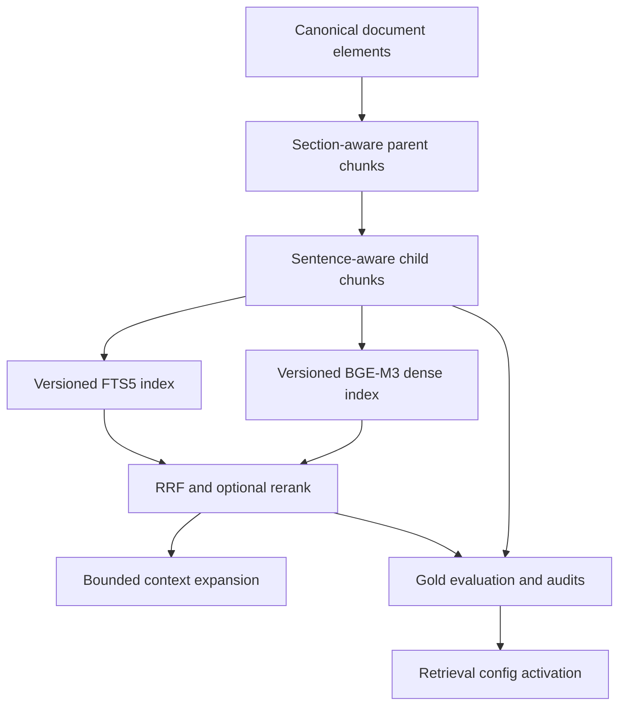

# RAG Tokenization V2 Design

_Knowledge retrieval tokenization, chunking, lexical search, and versioned rollout design · status: plan_

## Goal

Replace heuristic chunk-size accounting with the configured BGE-M3 tokenizer, preserve document
boundaries where possible, improve bilingual lexical recall, and activate the new retrieval behavior
only after a reproducible comparison with the current `parent-child-v1` baseline.

## Scope

The work is divided into three independently reviewable increments:

1. Repair the retrieval evaluation baseline and allow chunk policies to coexist in the Catalog.
2. Add token-aware, boundary-preserving chunking and a versioned lexical analyzer.
3. Add bounded parent-context expansion and evaluate BGE-M3 sparse retrieval separately.

The first implementation plan covers increments 1 and 2. BGE-M3 sparse retrieval remains an
experiment until Dense + BM25 V2 has a measured baseline.

## Current problems

- `ChunkingPolicy` calls regex matches "tokens", but BGE-M3 uses an XLM-R tokenizer.
- Child chunks use a fixed 320-match window and can end at arbitrary sentence boundaries.
- `child_max_tokens=450` is not an elastic limit under the default 320-token window.
- FTS tokenization uses jieba without a tracked domain dictionary or stopword policy.
- FTS queries require every token through `AND`, reducing recall for natural-language questions.
- `replace_chunks()` deletes every policy build for a document version.
- Parent context is returned by `HybridRetriever` but is not bounded by model tokens.
- `pilot_gold.jsonl` does not match `GoldQuestion`, contains 31 questions while the config requires
  exactly 30, and references three resource IDs that no longer exist.

## Architecture



## Tokenization boundary

Add `ped_knowledge.tokenization` with a small `TokenCounter` protocol:

```python
class TokenCounter(Protocol):
    @property
    def fingerprint(self) -> str: ...
    def encode(self, text: str) -> list[int]: ...
    def decode(self, token_ids: list[int]) -> str: ...
    def count(self, text: str) -> int: ...
```

`RegexTokenCounter` preserves V1 reproducibility. `HuggingFaceTokenCounter` loads the local BGE-M3
tokenizer and hashes `tokenizer.json`. Official V2 builds fail if the configured tokenizer is
missing or its SHA-256 differs; they never fall back silently.

## Chunking policy

The initial candidate is:

| Setting | Value |
| --- | ---: |
| Policy | `parent-child-v2` |
| Parent target | 1024 BGE tokens |
| Parent maximum | 1536 BGE tokens |
| Child target | 384 BGE tokens |
| Child maximum | 512 BGE tokens |
| Child overlap | 64 BGE tokens |

Child splitting follows element, paragraph, sentence, punctuation phrase, then tokenizer IDs.
Complete units may extend a child beyond the target but never beyond the maximum. Oversized atomic
units use tokenizer slicing and set `hard_split=true`. Overlap is assembled from trailing complete
units where possible.

Tables remain atomic until they exceed the hard maximum, then repeat the header while splitting by
rows. Formulas stay associated with adjacent explanatory text. Child provenance is calculated from
the elements that actually contribute text instead of inheriting the entire parent page range.

`KnowledgeChunk` adds `token_count`, `tokenizer_fingerprint`, `character_start`, `character_end`,
and `hard_split`. Chunk IDs include the policy and tokenizer fingerprint.

## Policy coexistence

Chunks from V1 and V2 coexist in the same Catalog. `replace_chunks()` deletes rows only for the
specified `(version_id, policy_version)`. Every official chunk listing and fingerprint operation
requires a policy version.

Add a `chunk_builds` table keyed by `(version_id, policy_version)` with tokenizer fingerprint,
source fingerprint, chunk count, build time, and status. Indexes use versioned directories and a
manifest containing the code revision, Gold hash, policy fingerprints, and embedding settings.
No candidate operation overwrites an existing research output or index release.

## Lexical retrieval

Add tracked retrieval configuration under `Knowledge-Base/config/retrieval/`:

- `chunking-v2.yaml`
- `lexical-v1.yaml`
- `pedestrian_terms.txt`
- `stopwords_zh_en.txt`

The same lexical analyzer processes indexed fields and queries. It loads the tracked jieba domain
dictionary, removes stopwords while preserving identifiers, years, model names, and DOI fragments,
and records dictionary and stopword hashes in the lexical fingerprint.

V2 FTS uses `OR` between normalized terms for candidate recall. Existing title, heading, and body
BM25 weights remain 3.0, 1.5, and 1.0. RRF and the optional reranker continue to determine final
ordering. Generated synonyms are excluded from V2 to keep the index and query behavior deterministic.

## Parent context

A later `ContextExpander` centers expansion on the matching child, adds its heading path and nearby
elements, and caps each expanded evidence context at 768 BGE tokens. The original child remains the
quoted and cited unit. Expanded text supplies reading context without changing the citation locator.

## Evaluation repair

Normalize Gold records to `expected_resource_ids` and `expected_locators`. Map legacy IDs as follows:

| Legacy ID | Current resource ID |
| --- | --- |
| `T1-01` | `helbing-1995-social-force` |
| `T2-04` | `nature-2024-stair-deadlock` |
| `T3-04` | `nature-2021-children-bottleneck` |

Other `T*-*` IDs normalize to lowercase. Page numbers become exact `p.N` locators. Replace exact
`question_count` acceptance with `minimum_question_count`, set to 30, and retain all 31 current
questions.

Before evaluation, validate every expected resource against the Catalog. Reports record the Gold
SHA-256, chunk policy, lexical policy, index fingerprints, and code revision.

## Activation gates

A candidate may become active only when all conditions hold:

- at least 30 Gold questions;
- Recall@5 at least 0.80 and no lower than V1;
- MRR at least 0.70 and no lower than V1;
- nDCG@5 no more than 0.02 below V1;
- locator hit rate at least 0.75 and no lower than V1;
- non-official leakage equals zero;
- all child chunks are at most 512 BGE tokens;
- embedding truncation count equals zero;
- locator coverage equals 100%;
- Catalog, FTS, and vector fingerprints agree.

Failure leaves V1 active and preserves the candidate artifacts for diagnosis.

## Error handling

- Missing or mismatched BGE tokenizer: fail the V2 build before writing chunks.
- Oversized atomic element: hard-split it, mark the chunks, and include the count in the audit.
- Empty or punctuation-only unit: exclude it from indexing.
- Stale policy, Catalog, FTS, or vector fingerprint: reject retrieval or degrade only through the
  existing explicit degradation path.
- Missing Gold resource or invalid locator: fail evaluation before calculating metrics.
- Existing candidate or release directory: require a new experiment/config ID.

## Verification

Unit tests use deterministic fake token counters for boundary behavior and a small jieba dictionary
fixture for lexical behavior. A local integration check may use the real BGE tokenizer when present,
but tests must not claim real model validation when the local asset is unavailable.

The implementation runs Knowledge-Base tests first, then the repository test command with all four
`src` directories on `PYTHONPATH`. A candidate index build and Gold evaluation are separate local
research steps and never overwrite the active V1 artifacts.

## Explicit exclusions

- No FastAPI, background queue, UI, or long-running retrieval service.
- No semantic chunker or LLM-generated boundaries in V2.
- No BGE sparse or ColBERT activation in the initial release.
- No modification to PDFs, model weights, or existing index releases.
