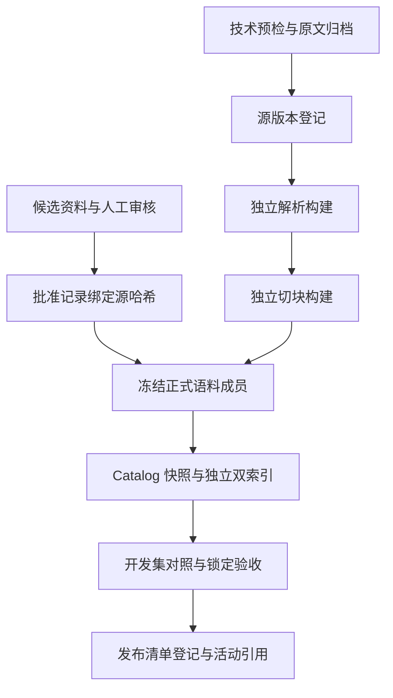

# memPed 与知识库更新设计

_设计基线与变更边界 · status: target · 2026-09-22；供实施计划使用，未表示已实现或已迁移_

## 1. 目标与依据

将当前文献处理能力推进为“可核验治理、不可覆盖构建、可信评测、可回查研究记忆”的科研链路。保留本地文件、SQLite、FTS、BGE-M3/Chroma 和模块化 Python API，以增量改造为主。

依据：[当前上下文](../../memped-knowledge-model-context.md)、[可行性评审](../../memped-knowledge-feasibility-review-2026-09-22.md)、[存储与记忆项目评估](../../memped-storage-memory-project-review-2026-09-22.md)、[当前架构](../../project-architecture.md)。执行任务见[更新计划](../plans/2026-09-22-memped-knowledge-update.md)。

2026-09-22 前轮只读快照为 50 个资源、0 Chunk、无活动索引和检索配置；这是计划起点，执行时重新盘点，不能将快照数字写成固定程序假设。

## 2. 方案选择

| 方案 | 收益 | 代价 | 决定 |
| --- | --- | --- | --- |
| 增量增强现有存储与证据链 | 最小化身份迁移与契约风险，保留现有算法 | 自建必要的构建、研究卡和依赖机制 | 主方案 |
| memU/OpenViking 旁路 | 验证记忆组织、分层阅读的实际收益 | ID 映射、依赖失效与重复索引成本 | 主链通过后可选实验 |
| 全面替换 Catalog/存储 | 部分接口统一 | 仍需重做科研证据约束，迁移范围过大 | 本轮不采用 |

仅借鉴开源设计不新增运行依赖。真实框架接入单列实验环境与固定版本；不安装会话采集、桌面 Agent hook 或自动任务。

## 3. 前后变更对比

| 维度 | 当前 | 修改后目标 | 实施阶段 |
| --- | --- | --- | --- |
| 治理与 official | include 可映射 approved/official | approved record + source hash + rule version 才可进入正式发布 | P1 |
| 原文和构建 | 导入中解析切块；同 SHA 跳过 | 原文幂等导入；派生构建显式触发和校验完整性 | P2 |
| 产物路径 | source version 下固定文件名 | parse build/chunk build/index build 独立目录 | P2 |
| Catalog/索引 | 局部指纹与配置发布 | 不可变发布清单绑定同一 Catalog 快照与索引 | P3 |
| Recall | 命中任意相关资源即 1 | 保留旧口径并显式标注；新增真正 Recall 与完整证据指标 | P3 |
| locator | 字符串与子串判断 | resource/version 绑定的 page/element/span；旧 locator 继续显示 | P3—P4 |
| 证据权威 | 本地收录证据统一 authority=official | 收录资格、出版来源类型与法律权威分开 | P4 |
| 多附件/多版本 | 主要是单 PDF + 源 SHA version | 文献修订、主附件、补充附件、文件身份分别登记 | P5 |
| 知识表达 | 原文及 parent/child | 新增版本化阅读卡、方法卡、发现卡和主题视图 | P6 |
| 更新影响 | 没有研究卡依赖链 | 源变更使相关卡/主题视图 stale；历史版本保留 | P6 |
| Agent 充分性 | 两资源或精确标题等简单规则 | 按问题证据槽位与引用支持度判断；规则可评测 | P7 |
| memU | 未集成 | 仅可选旁路；最终引用仍回查 memPed | P8 |

P0 是所有阶段前的只读盘点与可恢复副本；阶段编号与实施计划一致。

## 4. 目标流程

### 4.1 导入、构建和发布

原流程：人工选择 → 技术 Manifest → 导入/解析/切块 → 激活文档 → 构建索引 → Gold → 配置发布。

目标将“文档存在”“派生完成”“正式批准”“检索发布”分开：



未审核资料可归档和在实验快照中解析，但不能通过技术导入自动获得正式发布资格。质量规则仍由离线治理执行，导入/发布只校验批准凭据及其版本绑定。

重复导入相同源不自动重跑模型；显式 derive/rechunk 检查 build key、状态与产物哈希后决定复用或新建。构建写临时的新目录，文件和登记全部一致后标 complete；中断构建不能进入发布。

### 4.2 查询与研究记忆

查询 → 可选主题/研究卡导航 + 直接原文证据召回 → 合并去重 → 精确来源回查 → EvidenceItem → Agent 断言/引用校验 → 回答或证据不足。

导航不能成为唯一召回入口。研究卡文字与模型摘要不能自动充当 quote；原文之外的推导放入 Answer 的 inference，并附依据。发现卡之间的矛盾保留各自来源与条件，不按日期简单覆盖。

## 5. 项目边界

| 区域 | 本轮职责 | 明确边界 |
| --- | --- | --- |
| Knowledge-Base | 治理引用校验、构建、存储、检索、评测、研究卡登记及校验 | 不生成最终回答，不依赖 Agent |
| memPed/knowledge | 原文、附件、Catalog、构建、卡、导航、发布资产 | data-only；不放 Python 脚本 |
| Contracts | 最小共享 EvidenceLocator/Provenance 与可选 EvidenceItem 扩展 | 不放数据库/研究卡完整 schema 或算法 |
| Agent | 证据槽位、上下文预算、断言支持、引用与拒答 | 不打开 Catalog；通过检索端口获取证据 |
| experiments | 重建、迁移演练、消融及研究卡生成的组合入口 | 可复用算法下沉 Knowledge-Base；输出写 outputs |
| outputs | 每次候选运行及报告 | 新 run id，禁止覆盖旧运行 |
| docs | current、target、plan 分开维护 | 未验收设计不能升级为 current |
| Video-Analysis / Agent-Harness / paper | 不需业务改动 | 不扩展视频推理、Harness 或论文结论 |
| conversations / methods | 保持 reserved | 本轮方法卡保存“论文中的方法”；不自动成为可执行技能或 approved 方法 |

不引入 FastAPI、Vue、SSE、队列、会话数据库、图数据库或产品级监控；不进行模型微调。复杂解析器、新 embedding、Late Chunking 作为后续单因素实验，不与本轮存储迁移一起替换。

## 6. 数据身份与兼容策略

### 6.1 先保持旧 ID，再增加附件模型

P0—P4 保留已有 resource_id、version_id、chunk_id 和旧路径读取，不重写历史引用。新增构建 ID 与 locator/provenance 均为增量数据。

P5 引入逻辑 revision_id（UUID）、asset_id（文件 SHA-256）以及 revision_assets(role, ordinal) 关联：一个资料修订可有正文和多个补充附件，同一字节资产可由多个资料引用。旧 version_id 通过显式 legacy_version_alias 映射到 revision_id；禁止用 DOI 或标题直接当唯一文件 ID。

迁移在新 schema 副本完成，不将旧 resource_versions 主键原地批量改写。旧证据仍按 legacy resolver 读取原 release；新证据内部用 revision/asset/build 身份，跨模块新增字段稳定后再启用。未建立映射时返回明确不可解析状态，不能猜测“最新版本”。

### 6.2 构建身份

- parse_build_id：源资产哈希、解析器/模型版本、参数、canonical schema 和代码指纹的规范序列化 SHA-256。
- chunk_build_id：parse build、完整 chunk policy、tokenizer fingerprint、chunk schema 和代码指纹。
- index_build_id：有序成员与内容指纹、切块构建、词法或 embedding 模型/权重/参数、索引版本。
- release_id：不可变发布清单的内容哈希；run_id 用于每次实际执行的唯一目录，和构建身份分开。

相同配置只能说明构建输入身份相同；复用前还要验证 complete 状态及输出哈希。模型生成产物按当次结果保存，不承诺再次调用逐字一致。

## 7. 新增逻辑记录

| 记录 | 必要字段 | 写入/变更规则 |
| --- | --- | --- |
| ApprovalRecord | approval_id、resource_id、source_sha256、decision、rules_version、reviewer、reviewed_at、record_hash、reason | 追加记录；unknown 不自动变 approved |
| BuildManifest | build_id、kind、inputs、config/code/model fingerprints、artifacts(path/hash)、status | complete 后不原地修改；重试产生新 run |
| ReleaseManifest | release_id、scope、成员版本、Catalog 快照、FTS/Dense build、Gold/metric schema/config/report hashes、实际检索模式 | scope=experimental 或 official；正式模式不接受未声明降级 |
| EvidenceLocator | resource/version、page_index、printed_page_label、element_id、可选 bbox/char span/table cell | page_index 统一从 0 开始，显示页码独立；范围边界明确 |
| ResearchCard | id、revision、kind、content、conditions、evidence_refs、authorship、generation、review、depends_on、supersedes | JSON 规范内容；新 revision 追加 |
| ViewManifest | view_build_id、成员卡版本、生成配置、来源依赖、输出哈希 | Markdown 是派生视图，不与 JSON 双向自由编辑 |

ResearchCard 的 kind 初期限定 reading/method/finding；状态 candidate/reviewed/stale/withdrawn。人工笔记另存 authored Markdown，通过导入成为新卡，不由生成器覆盖。

批准记录使用规范 JSON 内容校验；哈希只证明记录未变，不证明审批正确或具备密码学身份认证。单人科研环境不扩展签名基础设施。

## 8. 文件与资产布局目标

```text
memPed/knowledge/
  literature/files/                       # 既有原文保留
  regulations/files/                      # 既有原文保留
  approvals/                             # 精简批准记录，按内容敏感性选择是否追踪
  assets/<sha-prefix>/<sha>               # P5 新附件字节
  catalogs/<snapshot-id>/knowledge.sqlite3
  derived/<resource-id>/<source-sha>/
    parses/<parse-build-id>/              # document/elements/report/图表
    chunks/<chunk-build-id>/              # chunks + manifest
  research/cards/<card-id>/<revision>.json
  research/notes/<note-id>/<revision>.md
  research/views/<view-build-id>/
  indexes/<index-build-id>/
  releases/<release-id>/manifest.json

outputs/memped-upgrade/<run-id>/           # 演练副本、中间结果、报告
```

新增目录不会由计划自动创建。正式产物需显式 promote-copy 到新路径，重新核验哈希后才登记；不移动或覆盖原始输出。初期用构建文件和 SQLite 登记，无需对象存储服务。

原文/人工原稿/生成快照是各自内容权威；Catalog 是状态与关系权威；manifest 是构建/发布成员权威；索引与 Markdown 视图是投影。数据库记录引用内容路径与哈希，恢复时检查一致性。

## 9. 发布、更新与回滚

正式发布清单同时冻结 Catalog 快照、语料成员、索引与评测。先写新资产再校验，最后在发布登记库的单个 SQLite 事务中切换活动 release 引用；检索请求读取一次 release 并在该请求内固定。现有 retrieval_configs 可作为兼容登记入口，但不得再隐式混用当前活动 Catalog。

回滚只切回完整旧 release，不能只退 Chroma 或只退 FTS。法规撤回/论文撤稿属于当前资格变更，旧 release 也不能借回滚绕过；当前资格检查不通过则停止官方查询并要求重建。historical replay 显式标记“按旧快照复现”，不得冒充当前正式答案。

源更新追加版本；依赖卡/主题视图标 stale；正式发布过滤 stale 记忆。旧 release 和旧卡保留用于复现。文件物理清理与检索排除分开，本轮不自动删除研究资产。

备份保存原文、附件、人工记录、使用过的模型输出、Catalog 一致性快照和发布清单。数据库备份使用 SQLite backup 或暂停写入，恢复到独立目录并验证哈希、悬空引用与固定查询。

## 10. 评测与验收设计

保留 metric-schema-v1 的 recall_at_k 字段语义并明确显示为 Hit@K；metric-schema-v2 新增 resource_recall_at_k、complete_evidence_at_k 与结构化 locator 命中。禁止把两个 schema 的同名/近似字段直接画成连续提升曲线。

Gold v2 支持 answerable=false、证据组以及组内可替代证据。不可回答题从资源召回分母中分离，单独统计正确拒答与误拒答。定位命中要求匹配资源/版本和精确 page/element 范围，缺标注题单列覆盖率。

原 31 题保存为 Pilot v1；v2 创建新文件并人工校验页码，不能把 p.N 不经复核转换成 page_index=N-1。先建立开发集与锁定集，再固定指标阈值；100 题是扩展目标，不等同于统计充分性。

首个双路基线沿用 Pilot 配置门槛；若官方批准语料不覆盖全部 Gold，正式完整验收应阻止并报告缺项。允许运行明确命名的实验子集报告，但不能删掉不可评题后冒充全量成绩。

系统不变量：原文覆盖 0；跨策略混用 0；失败构建发布 0；非批准资料官方泄漏 0；测试中的悬空证据引用 0；更新失效与备份恢复用固定样例验证。真实 GPU/OCR/Rerank 单列验证记录。

## 11. 文档生效规则

本文件与计划保持 target/plan。每个阶段代码、测试与真实数据验收完成后，只把已实现部分同步至模块 README、memPed README 和当前架构；旧资产快照保留日期或新增快照，不覆盖历史记录。设计调整先改本设计与计划，再实施，避免从开源主分支隐式带入架构变化。
