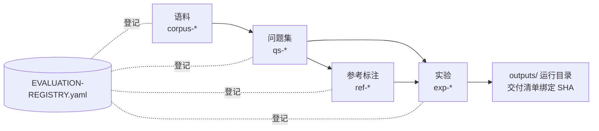

# PedRAGent 评测问题集与实验规范

*问题集、参考标注与实验设置的统一规则及扩充计划 · status: current（第 7 节为 plan） · 2026-10-07*

本规范管理 PedRAGent 全部 RAG / Agentic RAG 评测的**问题集身份、存放、使用和实验设置**。评价指标与分层定义由
[PEARL 框架](../paper/pearl-framework/README.md)负责；本规范不改协议，只规定协议落地时的数据与实验管理。
逐项身份登记在 [`EVALUATION-REGISTRY.yaml`](EVALUATION-REGISTRY.yaml)，两者冲突时以登记表的路径与 SHA-256 为准。

## 1. 现行问题集

> 2026-10-10：下表是已经登记的 80/200 题及参考资产，身份不变。新题集按 [Gold 问题规范 v1.2](../docs/rag/gold-question-standard-v1.2.md)构建，目标为 50 开发＋200 新独立测试；目前云端同步试标为 39 ACCEPT、1 未决，尚未冻结或登记为替代题集。v1.2 管理新题的任务分类、证据与 QA，本文件继续管理存放、封存访问和实验身份。历史执行规范保留原阶段效力。

| 登记号 | 角色 | 规模 | 状态 | 已用于 |
| --- | --- | --- | --- | --- |
| `qs-dev80-r02` | 开发 | 80 题，四类各 20 | **current** | Layer 1–4 开发评价、切片研究 E0–E5 |
| `qs-eval200-r01` | 封存评估 | 200 题，四类各 50 | **current，封存** | 仅 Layer 1 阶段 D 独立评价 |
| `qs-dev80-r01` | 开发 | 80 题 | superseded（由 r02 取代） | Layer 1 开发、难例复核 |
| `qs-pilot8` | 开发 | 8 题 | superseded（并入 dev80） | 流程试跑 |
| `ref-dev80-answer-r01` | Layer 3 答案参考 | 80 题 | current | Layer 3、Layer 4、E5/6B |
| `ref-dev80-facts-r03` | Layer 4 事实标注 | 80 题 | current | Layer 4、6B |

全部题目由子 Agent 依据 106 篇 Adobe 英文文献出题并交叉复核，`human_verified=false`。四类题型及其诊断目的：

| 题型 | 主要考察 |
| --- | --- |
| 单源 `single_source` | 基本检索与阅读，作为对照基线 |
| 数值/表格 `numeric_table` | 数字、单位、条件精度与表格解析 |
| 同篇多证据 `within_paper_multi` | 同一文献内分散证据的凑齐 |
| 跨论文 `cross_paper` | 跨文献取证、比较与整合 |

已退出的 `pilot_gold`、`core_gold`、Gold v5 与 Stage 2 见登记表 `legacy_question_sets`，不得进入 PEARL 的题集、基线、分母或评分。

## 2. 存放规则

| 规则 | 内容 |
| --- | --- |
| 规范位置 | `memPed/knowledge/gold/<语料登记名>/`，按 `retrieval/`、`answer-references/`、`facts/` 及 `<集合>/rNN/` 分层；现行目录为 [`pearl-adobe106/`](../memPed/knowledge/gold/pearl-adobe106/README.md) |
| 只读 | 冻结后文件设为只读，任何修订产生新 `rNN` 子目录和新登记号，旧版本保留 |
| 出处保留 | 2026-10-07 之前冻结的文件是从 `outputs/`、`paper/` 原件复制而来；原件被已完成实验的交付清单和 6B 脚本按原路径绑定，**不得移动或修改** |
| 新实验读取 | 一律从规范位置读取，并在 README 记录登记号与 SHA-256 |
| 版本控制 | 当前只在本地保存，不提交 Git（用户 2026-10-07 决定）；因此需定期做本地备份 |

## 3. 问题集构建与修订

### 3.1 新建

1. 冻结语料并登记 `corpus-*`（来源清单、解析器、切块策略、索引 SHA）。
2. 新题出题与取证分离，按 [v1.2](../docs/rag/gold-question-standard-v1.2.md)的输入隔离、任务分类和字段契约执行；Author 不看目标答案和系统排名，Solver 独立查原文。证据要求有充分支持束，行为与已核验缺口按专门规则记录，不以空束自动得分。旧 80/200 的 [authoring-spec](pearl-dataset-80-200-20261003/authoring-spec.md)保留为历史构建依据，不直接套用于新任务类型。
3. 复核：由不同于出题者的 Agent 按 v1.2 逐题核查 PDF、必要要点、支持路径、缺口和版本，记录是否独立/盲审；争议修复后再次核验。单 Agent 自复核如实记录，不能替代所要求的独立复核。旧 [review-spec](pearl-dataset-80-200-20261003/review-spec.md)保留原实验身份。人工审查仅在用户明确指定时成为门槛。
4. 全局扫描：另一 Agent 检查题族重复、近重复和跨集泄漏；机器审计核对哈希、结构、配额和锚点（机器零标记不代表语义去重完成）。
5. 冻结：写入规范位置、设只读、生成 SHA-256 与封存清单，然后在登记表登记，状态 `agent_reviewed_preliminary`。
6. 开发集与评估集的出题及已核验有效支持来源文献必须互斥（包括合法替代路径），但可以同属一个检索语料；不能删证据制造互斥。新独立测试不从旧封存题中筛选或改写，来源/题族划分不可行时停止冻结并报告。

### 3.2 修订

- 只因原文事实、条件或证据定位错误修订；不得因方法得分不利而修订。
- 修订必须保留原题、修订理由、原文页依据和独立复核记录，产生 `gold-diff`。
- 修订后受影响的已有实验按新版本**重新计分**并单独报告，原分数保留，不覆盖。
- 封存评估集在独立评价完成前不得修订；评价后发现的错误只记录为已知问题，修订进入下一个评估版本。

### 3.3 封存评估集的访问

| 允许 | 禁止 |
| --- | --- |
| 登记表 `eval200_access` 明确列出的独立评价；运行者只接触 query-only 导出 | 开发、调参、提示设计、难例分析、阈值选择 |
| 评价完成后的统计与失败分析 | 看过评估结果后回到开发阶段修改方法再报告同一评估集 |

每次使用都要在登记表 `uses_so_far` 追加。若评估结果被用于选择方法或配置，该集合即降为开发用途，需要新建 `qs-eval*-r02`。

## 4. 实验设置规范

### 4.1 启动前

- 目录：`experiments/<pearl|benchmark|exploration>-<主题>-<dev80|eval200|...>-<YYYYMMDD>/`，README 第一行写 H1，第二行写斜体背景与 `status`。
- **先登记后运行**：在登记表 `experiments` 中新增条目，写明 `question_sets`、`references`、`layer`、`eval200_access`。
- README 必填：研究问题与假设；输入的登记号与 SHA-256；语料与索引；方法配置；模型与权重 SHA；随机种子；预算；指标与预设比较；停止条件；授权的外部调用上限。
- **索引与主库指纹核验（2026-10-08 起必做）**：主库已移除两篇 PyMuPDF 文献（106 篇，全部 Adobe），`outputs/` 中现有索引的指纹均与当前 Catalog 不一致。启动依赖主库检索的实验前，按[移除记录](../memPed/knowledge/reports/pymupdf-two-papers-removal-2026-10-08.md)的“后续实验前检查”核对 `Catalog.official_fingerprint` 与所用索引指纹；不一致时新建索引目录并登记，不覆盖旧索引。

### 4.2 运行

- 输出写入新的 `outputs/<实验名>-<YYYYMMDD>-<NN>/`，目录必须不存在；不覆盖已有结果。
- 失败或中断的尝试保留目录与失败记录，编号不重用；成功尝试用新编号。
- 每个阶段交付 `handoff.md` 与 `delivery-manifest.json`（产物路径与 SHA-256），并做独立核验。
- 被交付清单绑定的文件（包括写在 `outputs/` 根目录的命令记录）交付后不得移动；新实验应把命令记录写进本次 run 目录。

### 4.3 报告

- 开发集结果写“开发选择”，不写“显著优于”；独立结论只来自封存评估集。
- 按四类题型分别报告，并给出每格 N；配对比较报告检验方法与多重比较校正。
- 中英查询分开报告，不合并。
- 如实记录 `review_status`、`human_verified`、裁判模型与偏差；Agent 评审完成验证即为正式内容（见[研究评审标准](../docs/research-review-standard.md)）。

## 5. 维护

| 事件 | 动作 |
| --- | --- |
| 新建/修订问题集或参考 | 写入规范位置 → 登记表新增条目 → 旧条目 `superseded_by` → 更新本规范第 1 节 |
| 新实验 | 登记表新增 `exp-*` → 实验 README 写登记号 → 完成后改 `status` 并补 `outputs` |
| 使用封存评估集 | 登记表 `uses_so_far` 追加 |
| 发现文档与产物不一致 | 先修文档并记录，见 [RAG 资产审计](../docs/rag-asset-audit-2026-10-07.md) |

当前没有自动核对脚本；手工核对方法是对登记表中每个 `canonical_path` 与 `frozen_source_path` 计算 SHA-256 并与 `sha256` 比较。

## 6. 已知局限

1. Layer 2–4 与切片研究只在开发集上做过，没有独立评价。
2. 没有专门的拒答集；拒答能力只在开发题的上下文不足情况下间接评估。
3. 只有英文查询，没有中文变体。
4. 全部为 Agent 标注，没有人工 Gold。
5. 开发与评估的出题来源互斥，但同属一个 106 篇检索语料，不构成未见文献测试。

## 7. 扩充计划（plan，未执行）

| 优先级 | 项目 | 目的 | 前提 | 产出 |
| --- | --- | --- | --- | --- |
| P1 | 拒答集 `qs-refusal-*` | 评估证据不足时能否拒答或受限回答 | 定义“不可回答”的类型（语料外、条件不满足、证据矛盾）；与开发/评估集分别构建 | 开发与封存两部分，按 3.1 流程 |
| P1 | Layer 2–4 在 `qs-eval200-r01` 上独立评价 | 让证据、答案、有据性结论获得独立支持 | 6B 完成并冻结最终配置；为 200 题构建答案参考与事实标注（`ref-eval200-*`），参考构建者不得接触方法输出 | 独立评价报告 |
| P2 | 中文查询变体 | 衡量跨语言检索与查询改写 | 中英成对；两种语言分开报告；中文变体不改变证据组 | `qs-dev80-zh-*`、`qs-eval200-zh-*` |
| P2 | 语料扩充后的增量问题集 | 覆盖新文献、法规（当前 0 篇）与中文文献 | 新语料版本 `corpus-*` 冻结；新题只从新增文献出，老题按新语料重新核定支持 | 新语料登记号下的新问题集版本 |
| P2 | Layer 5 Agentic 问题集 | 评估迭代取证、充分性判断与停止决策 | Layer 5 协议定稿；题目需要多步补证才能完整回答 | `qs-agentic-*` |
| P3 | 人工抽检 | 估计 Agent 标注的错误率 | 用户指定为验收环节时才执行 | 抽检报告，不改变既有标签 |
| P3 | 新封存评估集 `qs-eval200-r02` | 在 r01 被多次使用后恢复独立性 | r01 使用次数或用途触发 3.3 的降级条件 | 新封存集 |

每项启动前需单独计划，写明授权范围与外部调用预算，并先在登记表登记。
