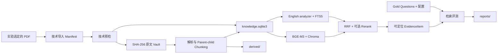

# memPed 数据根目录

_PedRAGent 本地研究数据、治理记录与可重建资产说明 · status: current_

`memPed/` 是 PedRAGent 的统一数据根目录，只保存研究数据及其治理记录，不保存 Python、前端或脚本业务代码。知识处理逻辑位于 [`Knowledge-Base/`](../Knowledge-Base/README.md)；实验定义和本地运行结果分别位于 [`experiments/`](../experiments/README.md) 与 `outputs/`。

## 当前边界

| 组件 | 状态 | 用途 |
| --- | --- | --- |
| `knowledge/` | current | 文献、法规和标准的治理记录、原文 Vault、Catalog、派生文档、检索索引与评测数据 |
| `conversations/` | reserved | 按 `session_id` 保存会话和小型附件；当前未实现稳定存储契约 |
| `methods/` | reserved | 预留候选与采用的方法记录；当前没有正式表结构 |

`reserved` 表示目录边界已约定，但不能据此推断功能已经实现。

## 目录结构

```text
memPed/
├─ knowledge/
│  ├─ literature/{files,records}/
│  ├─ regulations/{files,records}/
│  ├─ derived/<resource-id>/<sha>/  # 解析文档、元素、Chunk、可选 Adobe 资产；不提交 Git
│  ├─ models/bge-m3/                # 本地 BGE-M3 权重；不提交 Git
│  ├─ gold/2026-09-23-rebuild/      # Gold Questions v5 候选：280 queries, 120+20 intents
│  ├─ knowledge.sqlite3             # 权威 Catalog；不提交 Git
│  ├─ taxonomy.yaml, quotas.yaml, literature_quality_rules.yaml
│  ├─ pilot_gold.jsonl, core_gold.jsonl  # 历史 Gold 问题；不再用于当前评测
│  └─ pilot_config.json, core_config.json
├─ conversations/                  # 预留；运行数据不提交 Git
└─ methods/{candidates,approved}/
```

实际目录按需创建；空的预留目录不构成功能完成证明。

## `knowledge/` 数据流



资料选择以 RAG 研究问题和可定位证据为中心；期刊、引用与主题元数据可用于语料分层。导入链检查文件、PDF 可读性、SHA-256、重复项、元数据及解析能力。实验语料与评测约定见 [`knowledge/collection_standard.md`](knowledge/collection_standard.md)。

当前程序使用 `IngestionManifest`、`preflight_manifest` 和 `ImportService` 完成技术预检与导入。`include=true` 激活后推导出 Catalog 的 `approved/official` 检索状态。旧质量规则用于离线语料统计；Gold Questions 评价检索配置与索引。

PDF 默认由 Adobe PDF Extract API 解析，所选原文会上传到 Adobe；需要本地解析时显式选择 PyMuPDF。两条路径的结果进入相同的规范文档、Chunk 和 Catalog 流程。原始 Adobe ZIP 及图表附件位于 `knowledge/derived/<resource-id>/<sha>/adobe/`，属于本地派生资产，不提交 Git。Catalog 记录原文哈希、解析器版本和派生资产哈希；同一 SHA-256 的活动版本按现有规则跳过。对照实验写入单独命名的 `outputs/` 目录，不改动这里的 Catalog 与索引。调用方式见 [`Knowledge-Base/README.md`](../Knowledge-Base/README.md)。

Catalog 按 `policy_version` 保存可并存的 Chunk，并记录 tokenizer、输入来源和 chunk build
provenance。`parent-child-v1` 是默认策略；`parent-child-v2` 已实现但仍是 candidate。

当前 PEARL 评价使用 106 篇 Adobe-only 语料上的 80 题开发 Gold 与 200 题封存评估 Gold，规范位置为 [`knowledge/gold/pearl-adobe106/`](knowledge/gold/pearl-adobe106/README.md)（含 80 题 r01/r02、200 题封存集、8 题试点、Layer 3 答案参考与 Layer 4 事实标注的只读副本），登记见 [`EVALUATION-REGISTRY.yaml`](../experiments/EVALUATION-REGISTRY.yaml)。`outputs/` 与 `paper/` 中的原件按原路径保留，供已完成实验复现。

`knowledge/gold/2026-09-23-rebuild/` 的 v5 是 historical，不进入 PEARL 的题集、基线或评分，包含：
- **280 query variants**：120 可回答意图 + 20 拒答意图，各含中英双语
- **划分策略**：20 development intents（已评测）、100 test intents（封存）、20 refusal intents
- **证据标注**：页级定位，支持 AND/OR 证据组，记录 PDF SHA-256 和资源映射
- **评测状态**：开发集 BM25/BGE-M3/RRF 评测已迁至 `failed/outputs-void-scores/gold-v5-dev-exploratory-20260924-01/`，旧评分口径已作废

历史的 `pilot_gold.jsonl`（31题）和 `core_gold.jsonl` 不再用于当前 104 资源语料的评测。

## 权威资产与可重建资产

| 类别 | 路径 | 说明 |
| --- | --- | --- |
| 治理与评测输入 | `knowledge/**/*.csv`、`*.jsonl`、`*.yaml`、`*_config.json` | 可提交 Git，保留来源和变更记录 |
| 原始内容 Vault | `knowledge/{literature,regulations}/files/` | 本地权威原文，按 SHA-256 寻址，不提交 Git |
| Catalog | `knowledge/knowledge.sqlite3` | 活动版本、分策略 Chunk 和 build provenance 的运行时目录，不提交 Git |
| 派生文档 | `knowledge/derived/` | 由原文、解析器版本和 Chunk 策略重建；可包含 Adobe 原始 ZIP、图表附件及其哈希 |
| 检索索引 | `outputs/knowledge-index-<corpus>-<version>-<date>-<seq>/` | 实验索引独立命名并保存在 `outputs/`，不在 `knowledge/` 下常驻 |
| 模型权重 | `knowledge/models/` | 配置与权重 SHA-256 应在 Git 中记录，权重本身不提交 |
| 运行报告 | `knowledge/reports/` | 单独命名，不覆盖既有研究输出 |

## BGE-M3 本地资产与索引位置

BGE-M3 的受版本控制配置位于 [`Knowledge-Base/config/embeddings/bge-m3/`](../Knowledge-Base/config/embeddings/bge-m3/README.md)：
- **模型权重**：`memPed/knowledge/models/bge-m3/` ✅
- **PEARL 当前冻结索引**：`outputs/pearl-index-106-adobe-20260929-01/`（106 篇 Adobe-only、6,433 child）
- **旧 V1 历史索引**：`outputs/knowledge-index-104-v1-20260924-01/`，不进入 PEARL（不在 `memPed/knowledge/indexes/` 下）
  - FTS5/BM25：`fts.sqlite3` (19MB)
  - BGE-M3/Chroma：`chroma/chroma.sqlite3`
- **向量维度**：1024，目标设备 CUDA/FP16

**索引策略变更**：实验索引现独立命名并保存在 `outputs/` 目录，格式为 `knowledge-index-<corpus>-<version>-<date>-<seq>/`，避免与 `memPed/knowledge/` 的权威数据混淆，便于多版本索引并存和实验可复现性。

V2 切块和词法配置位于 `Knowledge-Base/config/retrieval/`。新实验必须构建独立命名的索引与报告目录，记录 policy、tokenizer、词法分析器、embedding、Gold 和代码版本指纹。

## 本地资产边界

提交 Git：本文件；`knowledge/` 下的分类、配额、质量规则、治理记录、Manifest、Gold Questions 和评测配置；`methods/approved/` 下经明确采用且不含隐私的方法；模型与索引的配置、版本和必要校验值。

不提交 Git：文献、法规和标准原文；SQLite、FTS、Chroma、派生文档、模型权重和缓存；会话内容、附件和候选方法；API key、Cookie、受限来源文件和本地运行报告。

## 验证入口

当前仓库没有面向 `memPed` 的稳定命令行入口；不要使用旧的 `backend` 或 `ped-agent library` 命令。知识数据行为由 `Knowledge-Base` 的 Python API 和测试定义：

```powershell
$env:PYTHONPATH = "Contracts/src;Agent/src;Knowledge-Base/src;Video-Analysis/src"
.\.venv\Scripts\python -m pytest Knowledge-Base/tests -q
```

完整验证命令见 [`../README.md`](../README.md)；模块边界见 [`../Knowledge-Base/README.md`](../Knowledge-Base/README.md) 与 [`../docs/project-architecture.md`](../docs/project-architecture.md)。
