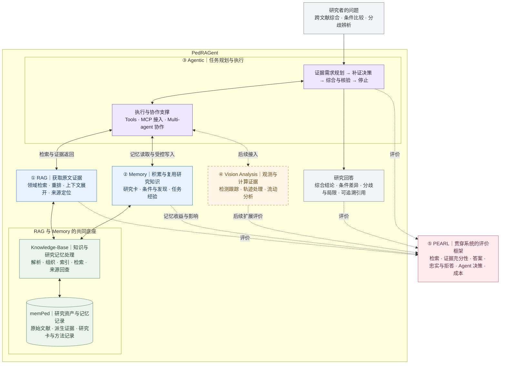

# PedRAGent：总体设计与研究框架

*系统定位、功能预设与研究主线 · status: target · 更新于 2026-09-29。*

本目录汇总 PedRAGent 的总体框架，不维护模块实现细节。本文描述目标设计，不表示所有能力均已实现；实现状态以代码、模块 README 和[当前项目架构](../../docs/project-architecture.md)为准。现存成果及复用边界见[既有产物盘点](existing-assets-inventory-2026-09-29.md)。

## 1. 系统定位与研究目的

**PedRAGent 是面向行人流与疏散交通研究的证据驱动科研助手。** 总体能力由 RAG、Memory、Agentic、Vision Analysis 和 PEARL 评价框架组成。

当前主线是：以 memPed 和 Knowledge-Base 提供的领域知识与研究记忆为基础，通过 Agentic 编排，在固定文献库中完成跨文献综合、研究条件比较和结论分歧辨析，并使用 PEARL 评价回答可靠性、决策过程与成本。

系统帮助研究者回答：

- 不同研究对同一问题有哪些共同发现？
- 研究对象、场景、指标定义和测量方法有哪些差异，结论能否直接比较？
- 哪些结论有充分依据，哪些问题仍存在分歧或缺失证据？

回答应保留来源、适用条件和局限，让研究者能够返回原文核查。视频与轨迹联合分析、研究方法建议和更完整的科研任务协作是后续发展方向。项目保持科研工程边界，不因工具接入和记忆建设引入 Web 产品或长期运行服务。

## 2. 五部分能力框架

| 部分 | 核心职责 | 与其他部分的关系 | 研究定位 |
| --- | --- | --- | --- |
| RAG | 从领域文献中获取可定位、可引用的证据 | 为 Agent 提供知识依据，支持 Memory 回查原文 | 基础与核心研究支撑 |
| Memory | 积累和复用研究知识、上下文及研究经验 | 保存可复用成果，辅助后续检索与决策 | 核心支撑，分阶段建设 |
| Agentic | 分解任务、规划证据需求、调用工具、补证、综合与停止 | 调度 RAG、Memory 和分析工具 | 当前方法研究主线 |
| Vision Analysis | 从视频和轨迹中提取可复查的观测与计算结果 | 提供文献之外的实测证据 | 后续扩展方向 |
| PEARL | 评价检索、证据、回答、决策过程及成本 | 横向评价各环节与端到端效果 | 当前评价框架 |

五部分是总体能力视图，不是五个同级代码模块，也不代表五项都要成为当前论文的独立贡献。Contracts 是共享基础设施；experiments 组织跨模块实验；outputs 保存独立命名的实验产物。

## 3. 总体框架图

图中实线表示目标框架中的调用或数据关系，不表示已经实现；虚线标注后续接入及横向评价关系。

图聚焦职责与主要交互，未展开所有存储和契约依赖。Memory 中可持久化的研究知识通过共同底座管理，当前任务的临时状态由 Agent 管理。PEARL 的记忆专项和 Vision 评价仍需后续扩展，不能视为现有指标已覆盖。

## 4. 核心职责边界

### 4.1 RAG 与 Memory：共同底座，不同用途

RAG 获取当前问题所需的原文证据；Memory 保存和复用研究积累。两者的核心共同依托 memPed 与 Knowledge-Base：

- **memPed 保存资产与记录**：原文、派生证据以及未来的研究卡、方法记录等；不存放业务代码。
- **Knowledge-Base 提供处理能力**：解析、组织、索引、检索，以及未来研究记忆的登记、检索和来源回查。
- **Agent 决定何时读取和使用这些信息**，维护当前任务中的证据需求、缺口与执行状态。

Memory 优先建设有来源的研究记忆，包括阅读卡、方法卡、研究发现和条件比较记录；跨任务经验复用逐步扩展。生成的摘要和研究卡应保留原文依据，不能作为脱离来源的独立证据。

现有 memPed 的知识资产已具备实现基础，会话和方法记录仍有预留部分。目录存在、保存历史结果和具备记忆读写决策能力是不同状态，详见模块文档。

### 4.2 Agentic：决策职责与执行手段

Agentic 以证据需求规划、动态补证、综合核验和停止决策为核心。其内部包括以下支撑：

| 内容 | 作用 |
| --- | --- |
| Tools | 执行检索、文献读取、记忆访问及计算等具体动作 |
| MCP | 接入工具与资源的一种接口方式 |
| Multi-agent | 将任务分配给不同角色的一种协作方式 |
| Harness | 支撑工具调用、执行、状态及追踪的运行基础 |

上述手段纳入总体设计，是否引入具体实现由任务需求与实验收益决定。Agent 负责领域证据逻辑，Agent-Harness 负责通用执行能力；不重复建设检索与视频算法。多 Agent 的效果、记忆复用的收益和工具补证的效果应分别评价。

### 4.3 Vision Analysis 与 PEARL

Vision Analysis 保持独立的视频、轨迹和流动分析能力，后续通过明确契约为 Agent 提供可追溯的观测与计算证据。当前固定文献库实验不依赖其接入。

PEARL 是 PedRAGent 的评价框架。沿用其检索、充分性、答案、忠实与拒答、Agent 决策及成本维度，具体口径在 PEARL 文档中讨论。Memory 与 Vision 的专项评价按研究进度扩展，不在本目录另建平行指标体系。

## 5. 功能预设与发展阶段

| 功能 | 用户获得的能力 | 阶段 |
| --- | --- | --- |
| 文献检索与原文定位 | 找到相关研究及支持片段 | 当前主线的基础 |
| 事实与概念问答 | 理解定义、模型、指标与单篇研究发现 | 支撑功能及基础对照 |
| 跨文献综合 | 汇总共同发现并保留来源与适用范围 | 当前核心 |
| 研究条件比较 | 对比对象、场景、指标与方法，判断可比性 | 当前核心 |
| 分歧辨析 | 呈现不同结论，区分原文解释与系统推测 | 当前核心 |
| 研究记忆复用 | 复用已有阅读与比较积累，并回查来源 | 当前主线内分阶段验证 |
| 按需补证 | 围绕证据缺口继续检索和阅读 | 当前 Agent 方法核心 |
| 引用、限定回答与拒答 | 核查依据；证据不足时缩小结论范围或说明无法回答 | 当前可靠性要求 |
| 文献与视频证据联合分析 | 结合领域文献解释观测与计算结果 | 后续补充 |
| 研究方法建议与科研任务协作 | 辅助方法选择、实验组织、分析和报告 | 长期发展 |

“当前核心”表示研究范围，不是实现完成标签。

## 6. 主要研究方向与实验边界

核心研究问题：

> 在固定领域文献库中，利用可追溯的研究记忆，并根据研究条件与证据缺口进行动态补证，能否提高跨文献综合回答的完整性、正确性与忠实性，同时保持合理的额外成本？

| 方向 | 研究重点 |
| --- | --- |
| 条件感知的证据组织 | 保留指标定义、研究条件与适用边界，减少不当合并 |
| 研究记忆的有效复用 | 检查研究积累是否减少重复工作、改善证据获取，以及是否传播过时或错误总结 |
| 证据缺口驱动的 Agent 决策 | 判断缺失信息、选择补证动作和停止时机，验证工具与协作方式的实际收益 |
| 可靠性与成本评价 | 通过 PEARL 检查答案支持、条件与分歧处理、决策质量及额外成本 |

当前实验固定文献库，并固定语料、解析、切块、索引和模型配置。Memory 还需固定初始状态、内容来源和读写规则：分别研究固定研究记忆的辅助作用与任务序列中记忆积累的作用，避免题目答案或评价标注进入可读取记忆而污染比较。

静态 RAG、既有固定工作流与 Agentic 方案的对照，应衔接 PEARL 已有消融设计，在相同知识来源下报告检索量、上下文预算和成本。外部学术搜索另作扩展实验。解析与检索优化服务于主线，不必将每项底层技术都作为独立论文贡献。

预期产出包括系统方法、可追溯的跨文献任务与评价材料，以及说明收益来源、适用条件和成本的实证结论。上述收益均是待验证的研究假设。

## 7. 详细设计入口与维护约定

| 主题 | 维护入口 |
| --- | --- |
| 当前架构与工程边界 | [project-architecture.md](../../docs/project-architecture.md) |
| RAG 实现与实验底座 | [Knowledge-Base](../../Knowledge-Base/README.md) |
| 资产与研究记忆存储边界 | [memPed](../../memPed/README.md) |
| 研究卡与证据槽位既有目标设计 | [知识库更新设计](../../docs/superpowers/specs/2026-09-22-memped-knowledge-update-design.md) |
| 证据充分性与比较问答既有计划 | [P7 所在实施计划](../../docs/superpowers/plans/2026-09-22-memped-knowledge-update.md) |
| 领域证据编排与问答 | [Agent](../../Agent/README.md) |
| Tools、运行与协作支撑 | [Agent-Harness](../../Agent-Harness/README.md) |
| 视频与轨迹分析 | [Video-Analysis](../../Video-Analysis/README.md) |
| 共享数据契约 | [Contracts](../../Contracts/README.md) |
| 评价框架 | [PEARL](../pearl-framework/README.md) |
| 跨模块可复现实验 | [experiments](../../experiments/README.md) |
| 现有成果与缺口核查 | [既有产物盘点](existing-assets-inventory-2026-09-29.md) |

本目录只更新系统定位、功能边界、总体关系和研究主线。字段、算法、提示词、动作规范、预算阈值、测试与指标公式在对应模块或评价文档中讨论和修正；涉及总体职责变化时，再同步本 README。优先沿用已存在的契约、P7 设计与 PEARL 框架，避免平行维护重复方案。
