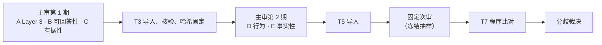

# PEARL 6B 研究评审期次计划

*6B T1 产物：研究评审的依赖确认与期次划分；第 1 期已完成，引用部分将重做 · status: plan · 2026-10-07*

本文是计划。`research-primary-1` 已评审完成；其中有据性的引用标签按上下文分化（[D4](incidents-and-deviations.md)），引用部分将在统一条件下重做（`research-citation-r03/`，计划 F1–F7）。后续各期按 [6b-work-plan.md](6b-work-plan.md) 执行。

## 依赖确认

| 任务 | 包内输入 | 对其他任务标签的依赖 | 依据 |
| --- | --- | --- | --- |
| Layer 3 | query、匿名回答、冻结语义参考 | 无 | 只对照独立参考，与 Layer 4 无关 |
| 可回答性 | query、实际 4K context、必要结论 | 无。包内没有回答 | Layer 4 protocol：“answerability 仅接收 query/context/必要结论” |
| 有据性与引用 | query、context、raw_answer、候选 claims | 无。不接触独立事实 | protocol：grounding“不接收独立事实” |
| 行为 | query、context、raw_answer、必要结论 | **只有顺序依赖**：可回答性主审标签必须先导入并哈希固定；包内**不放**可回答性标签 | protocol：“行为在 answerability 独立固定之后评价”；judge prompt：“behavior 包：在 answerability 已固定后输出”；历史 `review.py` 把 `answerability_label` 列为禁止字段；校准行为包同样不带该标签 |
| 事实性 | 主审有据性选定的 claims、独立事实源 facts-r03 | **内容依赖**：claims 来自主审有据性回答 | protocol：“factuality 接收 claims 与独立事实定位，不用 context 推导真值”；历史 factuality 包字段为 `claims`、`facts`；`e6b_packets` 也写明事实性包等有据性选定 claims 后再导出 |

## 期次划分

| 期次 | 目录 | 任务（对话） | 单元数 | 状态 |
| --- | --- | --- | --- | --- |
| 主审第 1 期 | `research-primary-1/` | Layer 3（A）、可回答性（B）、有据性与引用（C） | 704 + 240 + 704 = 1,648 | **已导出**（T1） |
| 主审第 2 期 | `research-primary-2/` | 行为（D）、事实性（E） | 704 + 698 = 1,402 | **已导出**（T3b）。有 claims 的有据性包 703 个；按 5B 精确重复规则，输入逐字节相同的 5 个事实性包不再重复出包，其 cell 绑定到同组首包（3 组：0228、0307、0344），共 698 包、719 格。grounding-0406 没有 claims，1 格记 NA，不出包 |
| 固定次审 | `research-secondary/` | 五个任务，按冻结抽样 | 144 + 117 + 144 + 144 + 至多 144 ≤ 693 | T5 导出 |
| 分歧裁决 | `research-adjudication/` | 主审与次审不一致的单元 | 冻结上限 L3 72、L4 288 | T7 导出 |

合计至多 3,056 + 693 + 360 = 4,109 个单元，低于冻结的裁判上限 4,680。可回答性的次审只有 117 个唯一包，因为同一（配置，意图）的 3 次重复共用一个可回答性包。

## 期次规则

- **一个任务一个对话。** 同一回答会同时出现在 Layer 3、有据性、行为、事实性包里。Layer 3 包带冻结参考答案，事实性包带独立事实；如果放在同一个对话里，参考或事实就可能渗入有据性判断（规则要求“正确事实也可 unsupported”）。可回答性也不能看回答。所以 A–E 必须各自使用独立的新对话；同一期内的不同任务可以并行。
- 同一任务可以分成先后几个对话完成，但每个对话只处理这一个任务，并在 run-notes 里写明各对话处理的包。
- 次审对话不得与主审对话共享上下文；裁决同理。
- 规则：所有系统提示都与通过校准的 cgpt-r02 逐字一致（导出时按 SHA 核对）；只有行为规则带 r02 澄清条款。
- 盲化：工作包里没有 cell、配置、意图、重复编号；身份映射只放在评价侧（`outputs/pearl-chunking-dev80-20261007-16/research/research-identity-map-r01.json`）。同一回答在不同任务中的盲化编号相同（例如 `answer-0042`、`grounding-0042`），所以各对话不得打开其他任务目录。

## 已冻结的评价侧记录（第 1 期导出时写入，早于任何研究标签）

| 记录 | 位置 |
| --- | --- |
| 身份映射与精确重复绑定（seed 20261005） | `outputs/pearl-chunking-dev80-20261007-16/research/research-identity-map-r01.json` |
| 固定次审抽样（洗牌后 720 格每 5 取 1，每任务 144 格） | `outputs/pearl-chunking-dev80-20261007-16/research/secondary-sample-r01.json` |
| 第 1 期导出记录（代码、输入、清单哈希） | `outputs/pearl-chunking-dev80-20261007-16/research/export-research-primary-1.json` |

之后每一期导出都会重新构建，并要求与这两份冻结记录完全一致，否则中止。

## 留给后续任务的事项

| 事项 | 何时处理 |
| --- | --- |
| 研究期次的导入：校验、绑定 blind_id→cells、用 `locate_grounding` 定位偏移、记录裁判身份（研究期是多个对话，导入记录不能沿用校准的 `single_thread: true`） | T3 |
| 事实性包构建：claims 取自主审有据性回答（保留 claim_id 与原文），事实取自 facts-r03 对应意图；包内不带 context | T3 |
| facts-r03：已在 T3a 核查，用户批准使用；5B 没有冻结事实版本，登记为 [D7](incidents-and-deviations.md)；009、034/035/044 的事实性敏感性分析单独报告 | 已决定；报告 T12/T14 |
| 次审事实性用哪一组 claims（主审选定的 claims，还是次审有据性重新抽取的 claims）。冻结抽样只写了“primary grounding selection 之后，同一批固定 cell” | T5 之前确定，并写进次审导出记录 |
