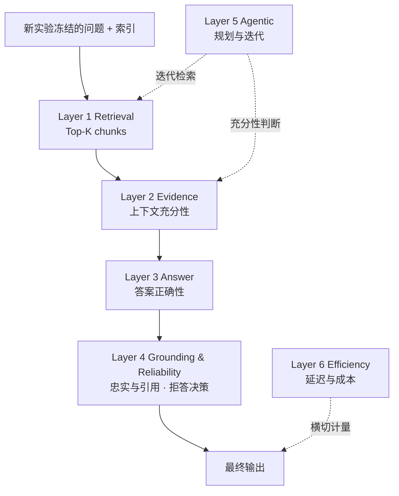

# PEARL 分层评价框架

*Pedestrian Evidence-based Assessment of Retrieval-augmented Language Systems · status: target · 2026-09-28；执行状态同步至 2026-10-07*

> **PedRAGent 是本项目研究和构建的系统；PEARL 是用于评价 PedRAGent 的方法框架，不是另一个系统。** 本文是 PEARL 的主索引：它规定评价链条、层间接口和报告口径，各层的指标定义、实验设计与失败分析收录在对应子目录。使用 PEARL 名称不表示各层实验已经完成——各层状态见 §7。
>
> **v1.1 编号变更**：层编号改为无小数的 1–6，目录名同步对齐。原 Layer 1.5 → Layer 2，原 Layer 2 → Layer 3，原 Layer 3 与 Layer 4 合并为 Layer 4。对外不报"N 层"这一单一数字，改用结构表述：**四层顺序链条 + 一个控制器 + 一个横切维度**。层与目录见 §0.3，变更理由见 §8.4。

## 0. 框架定位

### 0.1 评价对象与边界

| 项目 | 内容 |
| --- | --- |
| 评价对象 | PedRAGent 的检索、证据整合、有依据问答与 Agent 决策 |
| 研究领域 | 行人交通流与疏散科学文献 |
| PEARL 职责 | 规定标注口径、指标定义、对照实验与报告方式 |
| PEARL 不负责 | 系统实现、检索器选型本身、生成模型训练 |

### 0.2 设计原则

1. **分层归因**：每层对应一种可定位的失败（漏检、证据不够、读错证据、无依据推断、错误停止、代价过高），失败归因到层而不是归因到"系统整体表现不好"。
2. **证据可追溯**：每个指标值都能回溯到标注证据和检索记录；不使用无法定位来源的总评分。
3. **口径先于结果**：指标定义、标注版本和输入哈希固定后，实验结果才能声明为 PEARL 对照结果。
4. **框架与算法分离**：PEARL 固定评价对象、层间契约、指标和比较规则；解析、切块、检索、融合及重排的改进作为具体实验的配置变量记录。算法变化本身不修改评价体系。

**评估资产边界**：旧评估题集、标签、索引快照、排名和结果全部退出 PEARL。新实验从 PEARL 的数据与标注要求出发，独立定义、构建、版本化和冻结评估输入；不得用旧结果重算或改名替代新实验。

**当前 Retrieval 主实验范围**：英文文献语料、英文查询；中英差异不作为本轮研究问题或主要实验因素。这是当前实验的范围选择，不改变 PEARL 对证据、指标和层间归因的定义。

### 0.3 层与目录

目录名与层编号一致。

| 层 | 名称 | 角色 | 目录 | 状态 |
| --- | --- | --- | --- | --- |
| 1 | Retrieval | 链条 | [layer-1-retrieval/](layer-1-retrieval/) | retrieval-v0.2 已定义；80 题开发与 200 题独立评价已执行（见 §7） |
| 2 | Evidence | 链条 | [layer-2-evidence/](layer-2-evidence/) | 执行协议在[实验目录](../../experiments/pearl-evidence-dev80-20261004/protocol.md)；80 题开发评价已执行 |
| 3 | Answer | 链条 | [layer-3-answer/](layer-3-answer/) | 执行协议在[实验目录](../../experiments/pearl-answer-dev80-20261004/protocol.md)；80 题开发评价已执行 |
| 4 | Grounding & Reliability | 链条 | [layer-4-grounding/](layer-4-grounding/)、[layer-4-reliability/](layer-4-reliability/) | 执行协议在[实验目录](../../experiments/pearl-layer4-dev80-20261004/protocol.md)；80 题开发评价已执行 |
| 5 | Agentic | 控制器 | [layer-5-agentic/](layer-5-agentic/) | 待设计 |
| 6 | Efficiency | 横切维度 | [layer-6-efficiency/](layer-6-efficiency/) | 待设计 |

Layer 4 由两个目录承载：`layer-4-grounding/` 对应其 Grounding 部分（忠实性与引用），`layer-4-reliability/` 对应其 Reliability 部分（拒答决策）。两部分指标不合并计算，只合并编号，理由见 §8.4。

跨层与支撑目录：

| 目录 | 内容 | 状态 |
| --- | --- | --- |
| [cross-layer/](cross-layer/) | 跨层实验与错误传播 | 待设计 |
| [annotation/](annotation/) | 标注规范与质量分级 | 部分定义 |
| [datasets/](datasets/) | 数据集与题型体系 | 部分定义 |
| [reporting/](reporting/) | 报告与统计规范 | 部分定义 |
| [references/](references/) | 参考框架与文献 | 部分完成 |

原始框架定义保留在 [framework.md](framework.md)（2026-09-27，用旧项目名 Ped-Agent 与旧编号），本文在其基础上补充层间接口和子文档索引；两者冲突时以本文为准，并在 §8 记录差异。

## 1. 评价链条结构

PEARL 的结构是**四层顺序链条 + 一个控制器 + 一个横切维度**，共 6 层。不使用"N 层"作为对外标签——层数不是设计主张，三种角色的区分才是。

**顺序链条**：Layer 1 → 2 → 3 → 4。上游输出是下游输入，上游失败会传播到下游；各层分别评价自己的输出状态，并区分本层新增失败与上游传播失败，避免重复归因（§2 的层间契约）。

**控制器**：Layer 5 不是链条中的一环，而是控制 Layer 1 / Layer 2 反复执行的决策器。它的指标衡量"何时检索、何时停止"，不衡量单轮检索质量。

**横切维度**：Layer 6 不占链条位置，对所有层分阶段计量代价再累计。

| 层 | 失败模式 | 主指标 | 详细设计 |
| --- | --- | --- | --- |
| 1 Retrieval | 漏检 | CEGR@10；BestGroupCov 与 CompleteMRR 辅助解释 | [指标协议](layer-1-retrieval/metrics.md) |
| 2 Evidence | 证据不够 | Evidence Coverage、Sufficiency Accuracy | [Layer 2 开发协议](../../experiments/pearl-evidence-dev80-20261004/protocol.md) |
| 3 Answer | 读错证据 | Answer Correctness | [Layer 3 开发协议](../../experiments/pearl-answer-dev80-20261004/protocol.md) |
| 4 Grounding & Reliability | 无依据推断；该拒答却作答 | Faithfulness、Unsupported Claim Rate；Abstention F1、False Answer Rate | [Layer 4 开发协议](../../experiments/pearl-layer4-dev80-20261004/protocol.md) |
| 5 Agentic | 错误停止或过度检索 | Requirement Coverage、Hop Success | 待设计 |
| 6 Efficiency | 代价过高 | Latency、Tokens、Calls、Rounds | 待设计 |

Layer 4 含两个失败模式，是全框架唯一的一层多模式。合并的代价与边界见 §2.4。

## 2. 层间接口约定

层间契约是 PEARL 能分层归因的前提。每层只消费上游声明的输出字段，不读取上游内部状态。

### 2.1 Layer 1 → Layer 2

Layer 1 输出最终排序的 Top-K child chunks，每条含排名、chunk ID、文本、来源文档、页码、检索分数和 parent ID。**进入 Top-K 只是进入评价范围，不自动算命中。**Layer 1 只看这些 child 的实际文本：一个或多个返回片段须明确承载预先标注的必要证据及其适用条件，才能记相应证据内容命中。只命中正确资源或证据所在页、但返回文本不含目标信息时，内容命中为 0；资源和页定位可另作诊断。CEGR 按组内 AND、组间 OR 判断至少一组完整；公式与固定算例见 [指标协议](layer-1-retrieval/metrics.md)。

Layer 2 按实验前固定的规则展开 parent、去重、截断与组装，评价**实际送入生成器的上下文**是否足以支持答案。Layer 1 的观察对象是原始 Top-K child 文本，Layer 2 的观察对象是组装后的上下文；两层不得对同一份文本的同一种充分性重复计分。

| Top-K child 的必要证据 | 组装后上下文 | 归因记录 |
| --- | --- | --- |
| 完整 | 充分 | 两阶段均成功 |
| 完整 | 不足 | Layer 2 新增的组装或充分性失败，不回溯修改 Layer 1 |
| 不完整 | 充分 | parent 展开等带来的补证，单列为挽回案例；不追改 Layer 1 的原始检索观察 |
| 不完整 | 不足 | Layer 1 漏检或定位不足；Layer 2 不重复计为新增失败 |

表中的「完整」指原始 Top-K child 文本满足至少一组完整证据。本轮 Retrieval 主报 CEGR@10，补报 K=1/5/20，诊断排名保存到 100；具体取值属于 [实验协议](layer-1-retrieval/experiments.md)。Layer 2 充分性判断器尚待设计。两层总体状态可以分别报告，不重复计数约束针对新增失败归因，不能因此将下游实际不足改记成功。文献依据与自行制定的边界见 [references/](references/)。

### 2.2 Layer 2 → Layer 3

Layer 2 输出送入生成器的完整上下文，以及该上下文对必要证据的覆盖情况。Layer 3 在这一上下文上评价答案正确性，不追问上下文是怎么来的。

### 2.3 Layer 3/4 的对照基准区分

四个指标的对照基准互不相同，不能互相替代。合并编号不改变这一区分：

| 指标 | 所属 | 对照对象 |
| --- | --- | --- |
| Answer Correctness | Layer 3 | 参考答案 |
| Factuality | Layer 4 · Grounding | Gold 事实 |
| Faithfulness | Layer 4 · Grounding | 系统本次实际看到的证据 |
| Citation Precision | Layer 4 · Grounding | 所标来源是否真正支持对应 claim |

### 2.4 Layer 4 内部：Grounding 与 Reliability 的分工

两部分合并为一层，因为它们回答同一个问题的两面：**答案是否只说证据支持的内容**。Grounding 评价已作答内容的证据支持；Reliability 评价"是否应当作答"这一决策。

| 项目 | 归属 |
| --- | --- |
| 可核查 claim 是否被本次证据支持 | Grounding |
| 引文与 claim 的配对是否成立 | Grounding |
| 应拒答题上是否拒答 | Reliability |
| 可回答题上是否误拒 | Reliability |

**合并不等于混算**：两部分的指标分别汇总，主表分别出现，不构造合成分数。拒答输出没有实质回答 claim 时，不把 Faithfulness 人为记为满分——拒答走 Reliability 计分，Grounding 报告其适用样本数。

四象限报告（正确回答 / 有证据但答错 / 正确拒答 / 证据不足却编造）须与 Layer 3 的正确性结果联合呈现，不单独给出 Abstention F1。

### 2.5 Layer 5 的输出口径

Agent 多轮检索必须先固定评测口径：明确是单轮还是最终合并的 Top-K，不能把多轮累计的全部证据直接与静态 Top-K 比较。逐轮记录 query、新覆盖证据、充分性结论和停止理由。

### 2.6 Layer 6 的归属

延迟、token、调用次数和检索轮数按阶段分别记录再累计，使 Agent 的额外开销能归因到具体模块。

## 3. 数据与标注

每个 underlying intent 至少记录：`intent_id`、题型、推理深度、答案类型、英文查询、参考答案及必要 atomic claims、可回答性、条件依赖、冲突状态、Gold evidence groups、等价证据、来源文档及页码。数值题另记单位、合理容差和实验条件；拒答题注明缺失的证据以及为何不足。

检索证据标注锚定版本化来源中的事实、原文片段及必要条件，不以某一算法生成的 chunk ID 作为唯一 Gold。每个实验将来源锚点映射到其返回的 child 文本，并保存支持该判断的 chunk ID 与核验依据；切块或解析策略变化时须重新核验映射，但不因算法变化改写 PEARL 的命中定义。

**Evidence group 语义**：一个 evidence group 是足以独立支持答案的一组必要证据；组内为 AND，多个可替代组之间为 OR。标注应允许不同论文提供同一 atomic fact，不把唯一指定的页当作唯一正确证据。

**统计单位**：underlying intent。当前主实验对每个 intent 使用英文查询；若存在英文改写，应同组划分，不作为独立样本。

标注细则、质量分级和一致性验证方法收录在 [annotation/](annotation/)；开发集与封存测试集的划分原则收录在 [datasets/](datasets/)。

## 4. 实验设计总览

| 阶段 | 对比与控制 | 主要目的 |
| --- | --- | --- |
| 0 Gold 冻结 | 完成参考答案、证据组、等价证据和 claim 标注；按 intent 分割开发/封存测试 | 保证后续测量有效 |
| 1 Static RAG | 解析 × 切块 × 检索方法 × 有无重排 | 选定并冻结 Best Static RAG |
| 2 端到端 | No-RAG、Long-Context、Dense/Naive RAG、Best Static RAG、Agentic RAG | 各层指标分题型报告 |
| 3 Agent 消融 | A0 No-RAG；A1 Static；A2 +规划与迭代；A3 +充分性判断；A4 +claim 验证与拒答 | 定位每一步的收益与成本 |
| 4 Hop 诊断 | 多证据、跨论文和冲突题逐轮记录 | Hop Success、Premature Stop、Over-retrieval |
| 5 压力测试 | 逐级加噪；移除关键证据；条件错配与冲突 | 噪声下跌幅、条件感知、冗余鲁棒性 |
| 6 专项与成本 | 表格/数值子集；复杂度分层 | 单位归一化误差、质量–成本曲线 |

**流程约束**：先在开发集选定 Best Static RAG，再固定其底层检索器进行 Agent 消融。封存测试集不参与选择模型、阈值或提示。

表中的解析、切块、检索器及重排仅是实验因素；每个具体实验另行声明对照组、控制变量和算法版本。PEARL 的指标及层间接口不随候选算法的改进而改变。

跨层实验设计、整体消融策略和错误传播分析收录在 [cross-layer/](cross-layer/)。

## 5. 报告规范

### 5.1 主表六项

主表是**报告模板**，不是结果表。“当前状态”列只说明各项是否已有执行结果及其范围，数值以对应实验报告为准；仍未执行的项填表时写"—（未执行）"。开发集结果不得填入独立评价主表。

| # | 指标 | 方向 | 层 | 当前状态 |
| --- | --- | --- | --- | --- |
| 1 | CEGR@10 a | ↑ | 1 Retrieval | 200 题独立评价已执行：R1–R4 为 116/118/126/139（[阶段 D 分析](../../experiments/pearl-retrieval-eval200-20261003/evaluation-analysis-2026-10-03.md)） |
| 2 | Answer Correctness | ↑ | 3 Answer | 仅 80 题开发评价（[Layer 3 分析](../../experiments/pearl-answer-dev80-20261004/answer-analysis-2026-10-04.md)）；200 题未执行 |
| 3 | Faithfulness | ↑ | 4 · Grounding | 仅 80 题开发评价（[Layer 4 分析](../../experiments/pearl-layer4-dev80-20261004/grounding-reliability-analysis-2026-10-04.md)）；200 题未执行 |
| 4 | Unsupported Claim Rate | ↓ | 4 · Grounding | 同上 |
| 5 | Abstention F1 | ↑ | 4 · Reliability | 同上 |
| 6 | Latency | ↓ | 6 Efficiency | —（未执行；Layer 6 待设计） |

a CEGR 是原始 Top-K child 完整覆盖至少一组证据的 intent 比例，不是页命中或检回全部替代组的比例。BestGroupCov 与 CompleteMRR 在 Retrieval 详细表报告；定义见 [指标协议](layer-1-retrieval/metrics.md)。

资源受限场景可用 Tokens 替换 Latency，但须在实验前选定并对所有方法保持一致，不能按结果择优。

### 5.2 诊断表与附录

MRR、nDCG、Citation P/R、hop 指标、数值误差与题型细分放诊断表或附录。不使用 BLEU/ROUGE 或单一 LLM 总评分替代主表指标。

BestGroupCov 衡量最接近齐备的一组证据的覆盖比例；若与 CEGR 在实际样本上恒等，应说明原因，不作为第二项独立证据。资源／页定位只进诊断表。

### 5.3 统计与可复现

- 报告总体均值、每题型结果、样本数和置信区间；成对比较与 bootstrap 以 underlying intent 聚类。
- 同时报告 answerable 与 insufficient-evidence 子集，区分"正确回答""正确拒答""有证据但答错""证据不足却编造"。
- 固定 corpus/index 版本、解析器、chunk 配置、嵌入模型、reranker、生成模型、提示、top-k、token 预算及随机种子。
- 所有阈值、rubric 和缺失值规则在封存测试前写定。

模板与统计方法规约收录在 [reporting/](reporting/)。

## 6. 领域特异性

行人交通领域须核对 density、speed、specific flow、evacuation time、瓶颈宽度、样本规模、测量方法与场景条件；条件不一致时不得直接合并结论。

建议题型：单来源事实、数值/表格、多证据综合、跨论文比较、机制解释、条件推理、冲突证据、证据不足。

题型体系与领域要求收录在 [datasets/](datasets/)。

## 7. 当前状态

| 项目 | 状态 |
| --- | --- |
| 框架定义 | 本文件为现行目标框架；[framework.md](framework.md) 仅保留历史沿革 |
| Layer 1 设计方案 | retrieval-v0.2：英文四方法（R1 BM25、R2 BGE-M3、R3 RRF、R4 RRF＋重排），80 个开发／200 个独立评估 intent |
| Layer 1 指标形式化 | CEGR、BestGroupCov、CompleteMRR 已定义，评分器已在实验目录实现并独立复算 |
| 新评估标注与质量验证 | [80 开发／200 评估题集](../../experiments/pearl-dataset-80-200-20261003/README.md)已构建并冻结；开发 Gold 修订至 r02；Agent 复核，`human_verified=false` |
| Layer 1 实验 | 80 题开发对照与 200 题独立评价均已完成；R4 CEGR@10 为 139/200（[阶段 D 分析](../../experiments/pearl-retrieval-eval200-20261003/evaluation-analysis-2026-10-03.md)） |
| Layer 2 实验 | 80 题开发评价已完成（[实验入口](../../experiments/pearl-evidence-dev80-20261004/README.md)）；200 题未执行 |
| Layer 3 实验 | 80 题开发评价已完成，四实际臂 Strict 60/58/57/61（[分析](../../experiments/pearl-answer-dev80-20261004/answer-analysis-2026-10-04.md)）；200 题未执行 |
| Layer 4 实验 | 80 题开发评价已完成（[分析](../../experiments/pearl-layer4-dev80-20261004/grounding-reliability-analysis-2026-10-04.md)）；200 题未执行 |
| Layer 5、Layer 6、跨层评价 | 待设计，未执行 |
| 切片与上下文恢复研究 | E0–E4 完成，E5 答案已生成，6B 评价进行中（[实验入口](../../experiments/pearl-chunking-dev80-20261005/README.md)） |

Layer 2–4 的开发结果汇总见 [Layer 1–4 结果与架构问题分析](reporting/layer1-4-results-and-architecture-review-2026-10-05.md)。本节只记录执行状态；层定义和指标口径仍以 §1–§5 为准。

旧评估资产只保留历史溯源价值，不是本框架的输入或基线。新实验的资产清单与复现信息将在具体实验协议中冻结。

## 8. 旧方案与新实验的隔离

旧评估方案与 PEARL 的证据组语义、截断深度和层间归因并不一致。它们的题集、标签、索引和结果全部不用于新实验，也不通过映射或离线重算转成 PEARL 成绩。Layer 1 细化文档已重写为 retrieval-v0.2，具体资产版本与哈希须在新运行前实际构建和冻结。

### 8.4 编号变更（v1.1）

变更前存在三处不一致：framework.md §1 把 Grounding 与 Reliability 合并叙述为 6 个环节，同文件 §3 的指标表把两者分开列为 7 类；本文 v1.0 §1 标题写"六层"而表内有 7 行，"六层"仅因 1.5 这个半编号才成立。按行数或目录数计数都会得到 7。

变更内容：

| 变更 | 前 | 后 |
| --- | --- | --- |
| Evidence 编号 | Layer 1.5 | Layer 2 |
| Answer 编号 | Layer 2 | Layer 3 |
| Grounding + Reliability | Layer 3、Layer 4 | 合并为 Layer 4 的两个部分 |
| 对外标签 | "六层评价链条" | "四层顺序链条 + 一个控制器 + 一个横切维度" |

两条理由：小数编号在论文里读作补丁，而 Evidence 是链条正式一环，不是插入的修补步骤；Grounding 与 Reliability 共享同一失败根源（说了证据不支持的话），合并后编号无小数且链条长度与角色划分对齐。

**合并的代价**：Layer 4 是唯一含两个失败模式的层。为不损失归因粒度，§2.4 规定两部分指标分别汇总、主表分别出现、不构造合成分数。若后续拒答子集标注完成并形成独立实验，可再拆分为两层，届时对外标签改为"五层顺序链条 + 一个控制器 + 一个横切维度"。

**目录同步改名**：`layer-1.5-evidence/` → `layer-2-evidence/`，`layer-2-answer/` → `layer-3-answer/`，`layer-3-grounding/` → `layer-4-grounding/`。`layer-4-reliability/` 路径不变，但其含义由独立的 Layer 4 变为 Layer 4 的 Reliability 部分。改名在设计阶段完成，各层实验与代码尚未引用这些路径。

## 9. 术语表

| 术语 | 定义 |
| --- | --- |
| Underlying intent | 问题的本质意图；同一问题的改写属同一 intent |
| Evidence group | 足以独立支持答案的一组必要证据；组内 AND，组间 OR |
| Atomic claim | 不可再分的最小可核查事实单元 |
| Complete Evidence Group Recall（CEGR） | Top-K 原始 child 完整覆盖至少一组证据的 intent 比例；见 Layer 1 指标协议 |
| BestGroupCov | 单个允许完整组内已满足 requirement 比例的最大值，再按 intent 汇总 |
| CompleteMRR | 首次完成任一完整组的排名前缀长度倒数，再按 intent 汇总 |
| Page-Hit@10 | 已弃用的旧页级代理主指标；页定位在新协议中仅作诊断 |
| Best Static RAG | 在开发集上选定并冻结的最优静态检索配置 |
| 顺序链条 | Layer 1–4：上游输出是下游输入；各层状态分别计分，新增与传播失败分别归因 |
| 控制器 | Layer 5：控制 Layer 1 / Layer 2 反复执行的决策器，不占链条位置 |
| 横切维度 | Layer 6：对所有层分阶段计量代价再累计 |

## 10. 版本历史

| 版本 | 日期 | 变更 |
| --- | --- | --- |
| v1.2-draft（状态同步） | 2026-10-07 | 仅同步 §0.3、§1 表的状态与协议链接、§5.1 主表状态列和 §7 执行状态；框架定义、层间契约和指标口径未改 |
| v1.2-draft | 2026-09-29 | 明确旧资产退出和英文单语范围；Layer 1 重写为 retrieval-v0.2，定义证据组指标、80/200 新数据计划、四组对照及统计／失败归因 |
| v1.1-draft | 2026-09-28 | 层编号改为无小数 1–6（1.5→2、2→3、3+4→4）；对外标签改为结构表述；主表列名改用 Page-Hit@10 并加状态列；补 §2.4 Layer 4 内部分工与 §8.4 变更记录 |
| v1.0-draft | 2026-09-28 | 建立主索引与分层目录；补充层间接口约定；迁移 Retrieval 设计到 layer-1 |
| v0.1 | 2026-09-27 | 框架原始定义（framework.md，旧项目名 Ped-Agent） |
