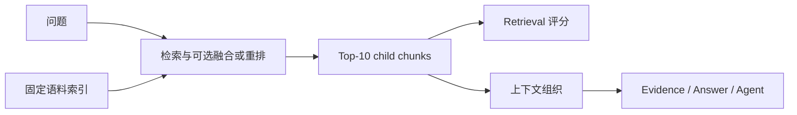

# PEARL Retrieval 层设计方案

*基于既有 RAG 研究的轻量检索评价设计，支持替换检索模型 · status: plan · 2026-09-28*

## 1. 目标与范围

Retrieval 层接收问题和固定的语料索引，输出有序、可定位的证据片段，供 Evidence、Answer 和 Agent 层使用。核心问题是：必要信息找到了多少、是否找全、首个相关结果是否靠前。

首轮沿用当前检索底座，仅比较 BM25、BGE-M3 dense 和 RRF 融合。主指标采用 RARE 的 Coverage@10、PerfRecall@10，辅助指标采用标准截断排序指标 MRR@10。不合成新的加权总分。

本方案控制在标签映射、三组检索对照和必要的计算检查范围内。人工复核不作为启动条件，不开展大规模标签重建、人工仲裁、评审一致性实验或组合压力测试。

本文是已讨论方案的设计记录，不表示评分器和实验已经实现或运行。当前实现以 [Knowledge-Base README](../../../Knowledge-Base/README.md) 为准。

## 2. 层级位置与输入输出

| 项目 | 约定 |
| --- | --- |
| 输入 | 原始问题、固定索引和检索配置 |
| 检索单元 | 当前索引中的 child chunk |
| 输出 | 排名、chunk ID、文本、来源文档、页码、检索分数和 parent ID |
| 评分对象 | 最终返回的 Top-10 child chunks |
| 下游衔接 | 利用 parent ID 按固定规则展开上下文 |

Retrieval 指标只计算实际返回的 child chunk。父上下文额外补充的信息由后续 Evidence 层处理。命中正确论文但返回片段不包含目标信息，不算该必要信息命中。

首轮固定当前 `parent-child-v1`、语料和解析版本，使三组差异主要来自检索方法。

## 3. 指标来源与公式

### 3.1 文献依据

| 文献 | 定位 | 本方案采用内容 |
| --- | --- | --- |
| [RARE: Redundancy-Aware Retrieval Evaluation Framework for High-Similarity Corpora](../references/RAG-Paper/2026.acl-long.923.pdf)，ACL 2026 | §5.1，PDF 第 6–7 页；§3.6 | Coverage@10、PerfRecall@10；必要信息按 chunk 层级定义，允许语义等价证据 |
| [OmniEval: An Omnidirectional and Automatic RAG Evaluation Benchmark in Financial Domain](../references/RAG-Paper/2025.emnlp-main.292.pdf)，EMNLP 2025 | §3.3；附录 B，式（9）—（10），PDF 第 12 页 | RAG 检索器的 MRR 评价；首个相关结果排名倒数及其平均 |

RARE 以文字定义 Coverage 和 PerfRecall。下面使用统一符号表达其定义，不声称这些是原文逐字列出的公式。必要信息的划分应锚定参考证据 chunk，不能任意拆分答案事实、改变分母后仍称为同口径复现。

OmniEval 提供 MRR 的依据；本方案明确采用截断到 10 的标准版本 MRR@10，不声称与其未注明相同截断深度的 MRR 完全同口径。

采用这些指标不等于复现论文完整的数据构建、人工验证或实验流程。本项目保留自动／Agent 辅助标签的来源说明。

### 3.2 符号与命中定义

- $Q$：具有可用检索标签的可回答问题集合。
- $T_q^K$：问题 $q$ 返回的前 $K$ 个 chunk。
- $m_q$：问题 $q$ 的必要信息单元数，按参考证据 chunk 所承载的必要信息确定。
- $A_{q,j}$：能够提供第 $j$ 个必要信息单元的 chunk 集合，包含原始证据及已识别的等价来源。

命中指示量为：

$$
h_{q,j}(K)=\mathbf{1}\left[T_q^K\cap A_{q,j}\ne\varnothing\right].
$$

这是计算中间量，不是新增指标。命中任意一个等价来源即可满足对应信息单元；重复命中同一信息不重复计分。等价性须包含必要的场景、条件、单位和对象，不能仅凭主题相似认定。

### 3.3 Coverage@10

单题必要信息覆盖比例：

$$
\mathrm{Coverage}_q@K=\frac{1}{m_q}\sum_{j=1}^{m_q}h_{q,j}(K).
$$

题集宏平均：

$$
\mathrm{Coverage}@K=\frac{1}{|Q|}\sum_{q\in Q}\mathrm{Coverage}_q@K.
$$

需要三个证据单元、找到两个时，单题得分为 $2/3$。该指标用于解释部分命中程度。主报 $K=10$。

### 3.4 PerfRecall@10

单题完整成功指示：

$$
\mathrm{PerfRecall}_q@K=\mathbf{1}\left[\sum_{j=1}^{m_q}h_{q,j}(K)=m_q\right].
$$

题集宏平均：

$$
\mathrm{PerfRecall}@K=\frac{1}{|Q|}\sum_{q\in Q}\mathrm{PerfRecall}_q@K.
$$

需要三个证据单元时，找到两个得 0，全部找到得 1。汇总值表示完整取得标注所需信息的问题比例。本指标是首要比较指标，Coverage@10 辅助解释未找全的程度；完整检索不保证生成答案正确。

### 3.5 MRR@10

令 $r_q$ 为第一个相关 chunk 的排名。相关 chunk 指能够满足至少一个已标注必要信息单元的片段。

$$
\mathrm{RR}_q@K=
\begin{cases}
1/r_q,&r_q\le K,\\
0,&\text{前 }K\text{ 个结果无相关 chunk}.
\end{cases}
$$

$$
\mathrm{MRR}@K=\frac{1}{|Q|}\sum_{q\in Q}\mathrm{RR}_q@K.
$$

首个相关结果排第一得 1，排第二得 0.5。MRR@10 仅用于观察首个相关结果的位置，不能替代多证据完整性评价。

### 3.6 指标使用边界

| 指标 | 用途 | 地位 |
| --- | --- | --- |
| PerfRecall@10 ↑ | 完整取得必要信息的题目比例 | 首要指标 |
| Coverage@10 ↑ | 必要信息的平均覆盖程度 | 主指标 |
| MRR@10 ↑ | 首个相关片段的排序质量 | 辅助指标 |

本轮不加入 MAP、nDCG，避免额外准备完整相关性标签和等级标签；不扩展多个 K 的主报告。不可回答题不进入上述必要信息召回的汇总，拒答评价留给后续层级。

## 4. 复用已有标签

沿用开发集和 [Stage 2 材料](../../../experiments/stage2-annotation/README.md)，做一次参考证据到当前 chunk 的自动映射，形成固定标签文件。

| 最小字段 | 用途 |
| --- | --- |
| intent ID、问题、语言 | 对齐双语变体 |
| 必要信息单元 ID | 固定分母 |
| 参考证据文本 | 说明目标信息 |
| 可接受 chunk ID 集合 | 判断原始和等价证据命中 |
| 来源文档、页码、版本 | 保留可追溯性 |

利用已有页码、引用文本和必要信息说明定位 chunk，已有替代来源一并映射。需要语义确认时，可参考 RARE 的相似度候选检索与 LLM 验证思路，一次性形成并缓存映射；记录所用模型和提示版本。此过程是项目标签适配，不宣称完整复现 RARE 数据构建。

所有检索方法使用同一版本标签，不为不同方法分别生成评分标准。不开展全语料逐事实重标注，不设人工复核前置阶段。未识别的等价来源可能造成低估，结果须注明标签覆盖范围。

缺失与争议的处理：

- 标签缺失或无法确定必要信息的问题不可计分，报告其数量，不记作检索失败或满分。
- 原文确有目标证据，但解析或切块丢失内容时，保留必要信息单元；当前索引没有可命中 chunk，该单元计未命中，不通过删题提高分数。
- 现有争议题仍可运行检索；是否进入汇总取决于必要信息是否能确定，不取决于是否经过人工复核。
- 空标签不触发“全部命中”；可计分问题必须具有非空、确定的必要信息定义。

## 5. 与 PEARL 原设计的关系

[原框架](../framework.md)包含“一个完整证据组内 AND、多个完整证据组间 OR”的定义，现有 Gold 评分器又有自身组语义，不能直接把已有分数改名为本方案指标。

只有不同来源确实表达相同必要信息时，才能映射为上述 $A_{q,j}$ 中的等价来源。如果多个完整证据组代表不同推理路径，则不能随意拼接各路径的信息来认定完整命中；本轮记录其适用限制，不新增组间聚合公式。

本方案提出以 RARE 的两个指标替换 Retrieval 主报告中的项目自定义指标名称。原框架中其他层级和更广泛实验仍属于后续设计；本文不表示它们已实施。

## 6. 最小实验安排

| 配置 | 方法 | 最终输出 |
| --- | --- | --- |
| A | BM25 | Top-10 |
| B | BGE-M3 dense | Top-10 |
| C | BM25 + BGE-M3，沿用现有 RRF | Top-10 |

固定语料、解析、切块、问题集和标签。RRF 候选深度和融合参数沿用现有配置并记录，不开展参数搜索。三种方法共享相同检索资格范围。

中英文分别汇总。需要总分时，先对同一 intent 的语言变体取均值，再对 intent 取均值；这是本项目的汇总约定，不是新增指标，也不将双语查询视为独立意图。报告可计分 intent 和查询数量。

主表只需三行：

| 方法 | PerfRecall@10 | Coverage@10 | MRR@10 |
| --- | --- | --- | --- |
| BM25 | 待运行 | 待运行 | 待运行 |
| BGE-M3 | 待运行 | 待运行 | 待运行 |
| RRF | 待运行 | 待运行 | 待运行 |

比较时优先查看 PerfRecall@10，以 Coverage@10 和 MRR@10 解释差异，不设置无研究依据的通过阈值。开发集结果用于选择后续候选底座，不声称封存测试结论。

本轮不加入解析×切块×模型组合、干扰注入、生成器对照、多轮 Agent 消融。重排确有需要且模型资产可用时，再追加一组。

## 7. 更换或增加检索模块

BM25、BGE-M3 和 RRF 是首轮实验配置，不是评分框架的固定依赖。检索器通过配置接入；评分器只消费统一的排序结果和标签，不读取某种模型专属分数来计算指标。

| 变化 | 指标是否继续适用 | 必要处理 |
| --- | --- | --- |
| 更换稀疏检索算法 | 是 | 使用同一 chunks、标签和 Top-10，记录配置 |
| 更换 embedding 模型 | 是 | 重建相应向量索引，保留 chunk ID 与标签，记录模型版本 |
| 增加融合或 reranker | 是 | 对最终排序后的 Top-10 评分，记录候选深度与排序配置 |
| 改变解析或切块 | 是 | 重新映射证据标签并版本化；变化归因于整个底座 |
| 扩充或更换语料 | 是 | 更新索引、证据可用性与标签版本；不同语料结果不可视为纯模型对照 |
| Agent 多轮检索 | 需先固定输出口径 | 明确单轮或最终合并 Top-10；不能把多轮全部累计证据直接与静态 Top-10 比较 |

仅更换检索或排序方法时，无需新增指标、人工流程或评测体系。

## 8. 实现与交付边界

后续实现集中在三个部分：

1. 标签适配：保存参考证据到当前 chunks 的固定映射。
2. 评分计算：对统一排名计算三个既定指标。
3. 实验汇总：输出三方法主表、逐题命中记录和复现信息。

复用 `Knowledge-Base` 的检索能力；可复用评分逻辑归入该模块，实验定义归入 `experiments/`，结果使用 `outputs/` 下独立命名目录。保留输入哈希、代码与标签版本、模型和索引指纹、配置及适用随机种子，不覆盖已有研究输出。

验证仅保留一个涵盖部分命中、全部命中、等价替代、重复证据和无命中的固定算例，以及相关模块的必要检查。实际跨越共享契约时，遵循仓库要求执行完整测试；不额外建设高覆盖率测试体系。

预期交付是固定标签映射、配置、逐题结果和一张对照表。首轮无需增加人工复核报告、LLM 评审器训练或端到端生成实验。
