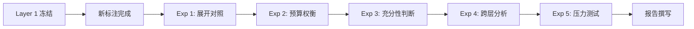

# Layer 2: Evidence Sufficiency

*上下文充分性评价 · status: current · 2026-09-29*

> **执行状态（2026-10-07 同步）**：本页是协议说明；80 题开发评价已执行，结果与限制见[Layer 2 实验入口](../../../experiments/pearl-evidence-dev80-20261004/README.md)。下文中“待定义”“尚未执行”等表述保留为协议起草时的状态。

> **编号**：本层原编号为 Layer 1.5（目录 `layer-1.5-evidence/`），v1.1 起为 Layer 2。变更理由见 [PEARL-framework.md](../PEARL-framework.md) §8.4。

Layer 2 接收 Layer 1 的 Top-K child chunks，按实验前固定的规则展开、去重并在 token 预算内组装上下文，评价**实际送入生成器的文本**是否足以支持答案。评价的失败模式是组装后证据仍不足，须结合 Layer 1 状态归因。

本层是顺序链条的正式一环，不是 Layer 1 的子步骤：它有独立失败模式、独立指标和与上下游的不重复计分契约。但它**不含新的检索调用**——展开规则固定，只消费 Layer 1 输出的 parent ID。

## 核心文档

### 设计与规范（P0）

| 文档 | 内容 | 状态 |
|---|---|---|
| **[design.md](design.md)** | 设计方案：职责边界、组装流程、研究问题与假设 | ✓ 已完成 |
| **[metrics.md](metrics.md)** | 指标形式化：Evidence Coverage、Sufficiency Accuracy、Context Relevance、Noise Ratio | ✓ 已完成 |

### 标注与实现（P1）

| 文档 | 内容 | 状态 |
|---|---|---|
| **[annotation-guidelines.md](annotation-guidelines.md)** | 标注指南：充分性判断、证据覆盖、相关性标注的操作手册 | ✓ 已完成 |
| **[expansion-strategies.md](expansion-strategies.md)** | 展开规则：Parent-child 策略的形式化定义与实现细节 | ✓ 已完成 |

### 实验设计（P2）

| 文档 | 内容 | 状态 |
|---|---|---|
| **[experiments.md](experiments.md)** | 实验协议：5 个实验的对照组、控制变量、统计方法和报告模板 | ✓ 已完成 |

## 快速导航

### 我想了解...

**Layer 2 的职责和边界** → [design.md](design.md) §1-2

**与 Layer 1 的不重复计分规则** → [design.md](design.md) §2.3，[metrics.md](metrics.md) §1.2

**四个指标的数学定义** → [metrics.md](metrics.md) §1-4

**如何标注充分性** → [annotation-guidelines.md](annotation-guidelines.md) §3

**Parent 展开的策略选项** → [expansion-strategies.md](expansion-strategies.md) §2

**实验对照组设计** → [experiments.md](experiments.md) §3-7

## 职责边界

| 项目 | 归属 |
|---|---|
| 原始 Top-K child 文本是否承载必要证据 | Layer 1 |
| 父上下文展开规则 | 本层 |
| 展开后上下文是否充分 | 本层 |
| 系统对"充分/不足"的自我判断准确性 | 本层 |
| 上下文噪声比例 | 本层 |
| 基于上下文的答案正确性 | Layer 3 |

**不重复计分契约**：Layer 1 的 child 内容完整而组装后仍不足，算本层新增失败；Layer 1 内容不完整且组装后仍不足，不再算一次新的本层失败。若 parent 展开补出缺失证据，使组装后上下文充分，记录为挽回案例，但不追改 Layer 1 对原始 Top-K child 的观察。四种状态见 [主框架 §2.1](../PEARL-framework.md)，形式化见 [metrics.md](metrics.md) §7.2。

## 四个评价指标

| 指标 | 定义 | 详细 |
|---|---|---|
| **Evidence Coverage** | 最终上下文覆盖的必要证据需求比例 | [metrics.md](metrics.md) §1 |
| **Sufficiency Accuracy** | 系统判断"充分/不足"与人工 Gold 的一致性 | [metrics.md](metrics.md) §2 |
| **Context Relevance** | 最终上下文中相关内容的比例 | [metrics.md](metrics.md) §3 |
| **Noise Ratio** | 最终上下文中无关内容的占比 | [metrics.md](metrics.md) §4 |

**主报告指标**：Evidence Coverage、Sufficiency Accuracy（关键指标）

**辅助诊断**：Context Relevance、Noise Ratio、四态分析、挽回率

## 研究问题

| ID | 问题 | 对应实验 |
|---|---|---|
| **RQ2.1** | Parent 展开对证据充分性的影响有多大？ | [Exp 1](experiments.md#3-experiment-1-展开规则对照) |
| **RQ2.2** | 上下文组装策略如何影响噪声与充分性的权衡？ | [Exp 2](experiments.md#4-experiment-2-token-预算权衡) |
| **RQ2.3** | 系统能否准确判断上下文充分性？ | [Exp 3](experiments.md#5-experiment-3-充分性判断评测) |
| **RQ2.4** | Layer 2 改进能否传递到 Layer 3 的答案正确性？ | [Exp 4](experiments.md#6-experiment-4-跨层联合分析) |
| **RQ2.5** | 组装策略在困难情况下的鲁棒性如何？ | [Exp 5](experiments.md#7-experiment-5-压力测试) |

## 前置依赖

**实验执行前必须完成**：

1. **Layer 1 冻结**：Best Static RAG 配置已选定（[experiments.md](experiments.md) §2）
2. **新 PEARL 数据**：开发集和测试集已构建（[datasets/](../datasets/)）
3. **充分性标注**：人工 Gold 标签已完成，Kappa > 0.75（[annotation-guidelines.md](annotation-guidelines.md)）
4. **相关性标注**：Chunk 级相关性已标注（[annotation-guidelines.md](annotation-guidelines.md) §4）
5. **展开规则实现**：组装管道代码已实现并通过测试（[expansion-strategies.md](expansion-strategies.md) §6）

## 实验流程

**预计时长**：约 2 周（不含标注时间）

详见 [experiments.md](experiments.md) §11。

## 关键设计决策

### 1. 展开策略（已明确）

**推荐主配置**：Direct Parent（[expansion-strategies.md](expansion-strategies.md) §2.1.2）
- 用每个 child 的直接 parent 替换该 child
- 保持排名信息，按文档位置排序
- Exact 去重，Token Budget = 8K

**对照基线**：None（无展开）、Parent+Siblings（高覆盖高噪声）、Selective（自适应）

### 2. 不重复计分规则（已明确）

**四态归因**（[design.md](design.md) §2.3）：

| Layer 1 | Layer 2 | 归因 | Layer 2 计分 |
|---|---|---|---|
| 完整 | 充分 | 两阶段成功 | — |
| 完整 | 不足 | **Layer 2 新增失败** | ✗ |
| 不完整 | 充分 | **Parent 挽回** | ✓（单列）|
| 不完整 | 不足 | Layer 1 漏检 | — |

### 3. 充分性判断（已明确）

**Gold 标签**：二分类（Sufficient / Insufficient），阈值保守（[annotation-guidelines.md](annotation-guidelines.md) §3）

**系统判断方法**（[experiments.md](experiments.md) §5）：
- J1: Coverage ≥ θ（阈值法）
- J2: GPT-4 Judge
- J3: Claude Judge（推荐，预期 Accuracy 88%）
- J4: Hybrid

### 4. Token 预算（待实验确定）

**候选**：2K / 4K / **8K（推荐）** / 16K / 32K

**预期最优**：8K（Coverage 与 Noise 平衡点，[experiments.md](experiments.md) §4）

## 当前状态

| 项目 | 状态 |
|---|---|
| **设计方案** | ✓ 已完成（5 个文档）|
| **指标形式化** | ✓ 已完成 |
| **标注指南** | ✓ 已完成 |
| **实验协议** | ✓ 已完成 |
| **代码实现** | 待开始 |
| **新标注** | 待开始（依赖新 PEARL 数据）|
| **实验运行** | 待开始（依赖标注完成）|

## 与其他层的关系

**从 Layer 1 接收**：
- Top-K child chunks（含 parent ID、rank、score）
- Layer 1 的证据覆盖情况

**传递给 Layer 3**：
- 最终组装的上下文文本
- Layer 2 的证据覆盖情况
- 充分性判断结果
- 组装日志（用于分析）

**与 Layer 5 (Agentic) 交互**：
- Layer 2 的 Sufficiency Accuracy 是 Agent 停止决策的质量指标
- Agent 使用本层的充分性判断方法决定是否继续检索

详见 [design.md](design.md) §5。

## 文献支持

| 文献 | 引用点 | 用途 |
|---|---|---|
| **RARE (ACL 2026)** | Coverage@K 定义 | Evidence Coverage 的理论基础 |
| **S2G-RAG (ACL 2026)** | 充分性显式判断 | Sufficiency Accuracy 的动机 |
| **ARES (NAACL 2024)** | 上下文相关性 | Context Relevance 的命名来源 |
| **KILT (NAACL 2021)** | 证据锚点分离 | 支持来源与检索输出分开保存 |

完整文献引用见 [references/README.md](../references/README.md)。

## 常见问题

**Q1: Layer 2 与 Layer 1 的区别是什么？**

A: Layer 1 评估原始 Top-K child 的证据内容命中；Layer 2 评估展开、组装后的最终上下文的充分性。两者观察对象不同，不重复计分。详见 [design.md](design.md) §2。

**Q2: 为什么需要独立的 Layer 2？**

A: 因为 Parent-child chunking 广泛使用但收益难量化；上下文组装策略直接影响生成质量；充分性自我判断是 Agentic RAG 的关键决策点。详见 [design.md](design.md) §1.2。

**Q3: Coverage 和 Sufficiency 有什么区别？**

A: Coverage 是客观度量（覆盖了多少必要证据）；Sufficiency 是系统判断（系统认为是否充分）。Sufficiency Accuracy 评估后者的准确性。详见 [metrics.md](metrics.md) §1-2。

**Q4: Parent 挽回是什么意思？**

A: Layer 1 的 child 不完整（未覆盖全部证据），但展开 parent 后，最终上下文变得充分。这种情况不追改 Layer 1 分数，单独记为挽回案例。详见 [design.md](design.md) §2.3。

**Q5: 实验什么时候开始？**

A: 需要等待 (1) Layer 1 冻结，(2) 新 PEARL 数据构建完成，(3) 充分性和相关性标注完成。预计总时长约 2 周（不含标注）。详见 [experiments.md](experiments.md) §11。

## 下一步行动

**短期（P0）**：
1. 等待 Layer 1 Best Static RAG 选定
2. 等待新 PEARL 数据与标注完成

**中期（P1）**：
3. 实现组装管道代码（按 [expansion-strategies.md](expansion-strategies.md)）
4. 单元测试与集成测试
5. Pilot run（10 个 intents）

**长期（P2）**：
6. 运行 Exp 1-5（按 [experiments.md](experiments.md)）
7. 分析结果，填写主表与诊断表
8. 撰写 Layer 2 实验报告

---

**文档版本**：v1.0
**最后更新**：2026-09-29
**维护者**：Layer 2 设计与实验团队
