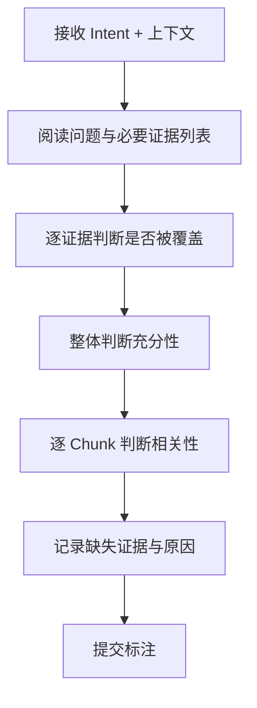

# Layer 2: Annotation Guidelines

*充分性与相关性标注指南 · status: plan · 2026-09-29*

> **本文档面向标注员**：定义如何判断上下文充分性、证据覆盖和内容相关性。标注流程、质量控制和一致性要求供标注管理员参考。

## 1. 标注概览

### 1.1 标注目标

Layer 2 需要三类标注：

| 标注类型 | 目标 | 标注单位 | 估计时长/题 |
|---|---|---|---|
| **证据覆盖** | 判断每个必要证据是否在上下文中 | 证据需求级 | 3-5 分钟 |
| **充分性判断** | 判断上下文整体是否足以回答问题 | Intent 级 | 2-3 分钟 |
| **内容相关性** | 判断每个 chunk 与问题的相关程度 | Chunk 级 | 5-8 分钟 |

### 1.2 标注流程



### 1.3 标注前提

**标注员资格**：
- 具备行人交通领域基础知识（或通过培训）
- 能够阅读英文科学文献
- 理解科学证据的完整性要求（条件、单位、样本规模等）

**提供材料**：
- Intent 问题文本（英文）
- 必要证据需求列表（预先标注的 required evidence）
- 最终上下文（Layer 2 组装后的完整文本）
- Chunk 分割边界（保留组装痕迹）

**隐藏信息**：
- 原始 Top-K child 的检索排名（避免锚定偏差）
- 系统的充分性判断结果（避免标注员受影响）
- 其他标注员的标注结果（独立标注阶段）

## 2. 证据覆盖标注

### 2.1 判断标准

**定义**：必要证据 $f$ 在上下文中**被覆盖**，当且仅当：

1. **事实内容存在**：上下文明确陈述了 $f$ 所要求的事实
2. **条件完整**：适用条件（对象、场景、测量方法）被说明
3. **单位明确**：数值证据包含单位或可推断单位
4. **无歧义**：陈述清晰，不存在多种解释

**示例 1（覆盖）**：

- **必要证据**：密度达到 5 人/m² 时行人速度显著下降
- **上下文片段**："At densities exceeding 5 persons/m², walking speed decreased from 1.2 m/s to 0.8 m/s (p < 0.01)"
- **判断**：✓ 覆盖（事实、条件、单位、显著性都明确）

**示例 2（未覆盖）**：

- **必要证据**：特定瓶颈宽度下的疏散时间
- **上下文片段**："Evacuation time varies with bottleneck width"
- **判断**：✗ 未覆盖（只有定性描述，无具体宽度和时间数据）

**示例 3（部分覆盖→判为未覆盖）**：

- **必要证据**：实验条件为单向流
- **上下文片段**："Walking speed was measured as 1.34 m/s"
- **判断**：✗ 未覆盖（缺少流向条件）

### 2.2 边界情况

#### 2.2.1 改写与同义表达

**问题**：上下文使用不同措辞表达同一事实

**原则**：**语义等价即为覆盖**，不要求字面一致

**示例**：
- 必要证据："specific flow 随密度增加先升后降"
- 上下文："flow rate per unit width initially rises with density, then decreases"
- 判断：✓ 覆盖（"specific flow" = "flow rate per unit width"，"先升后降"语义等价）

#### 2.2.2 跨 Chunk 拼接

**问题**：一个必要证据的不同部分分散在多个 chunks

**原则**：**只要都在最终上下文中，视为覆盖**

**示例**：
- Chunk 1："The corridor width was set to 1.2 m"
- Chunk 5："Mean evacuation time was 87 seconds"
- 必要证据："1.2m 宽走廊的疏散时间为 87 秒"
- 判断：✓ 覆盖（两个事实都存在，可拼接）

**注意**：若 Chunk 5 被截断未进入最终上下文，则判为未覆盖

#### 2.2.3 隐含与推导

**问题**：事实未明说，但可通过上下文推导

**原则**：**只认可直接陈述，不认可需要推理的隐含**

**示例**：
- 必要证据："双向流的冲突影响通行效率"
- 上下文："In bi-directional flow, average speed was 0.9 m/s, compared to 1.3 m/s in uni-directional flow"
- 判断：✓ 覆盖（虽未说"冲突影响效率"，但数据直接支持该结论）

**反例**：
- 必要证据："老年人疏散速度慢于年轻人"
- 上下文："Participant age ranged from 20 to 75 years. Mean speed was 1.1 m/s"
- 判断：✗ 未覆盖（未分年龄段报告速度，不能推断）

#### 2.2.4 冲突证据

**问题**：上下文中有矛盾陈述

**原则**：**若存在冲突，标注为"证据冲突"，不算覆盖**

**示例**：
- Chunk 1："Optimal density is 2 persons/m² (Smith 2020)"
- Chunk 3："Optimal density is 3.5 persons/m² (Lee 2021)"
- 必要证据："最优密度的数值"
- 判断：冲突（两个不一致的值）
- 特殊标记：`evidence_conflict: true`

### 2.3 标注界面

**字段**：

```json
{
  "intent_id": "Q001",
  "required_evidence": [
    {
      "evidence_id": "f1",
      "description": "密度 5 人/m² 时速度显著下降",
      "covered": true,  // 标注员填写
      "supporting_chunks": ["chunk_2", "chunk_5"],  // 可选，辅助核验
      "note": ""  // 可选，解释或争议说明
    },
    {
      "evidence_id": "f2",
      "description": "实验样本规模 > 50 人",
      "covered": false,
      "supporting_chunks": [],
      "note": "上下文未提及样本量"
    }
  ]
}
```

### 2.4 质量检查

**自检清单**（标注员提交前）：

- [ ] 每个必要证据都已判断（无遗漏）
- [ ] 标记为"覆盖"的证据，在上下文中找到了明确片段
- [ ] 标记为"未覆盖"的证据，确认不是被改写或分散表达
- [ ] 冲突情况已标记 `evidence_conflict`
- [ ] 复杂案例已在 `note` 中说明

## 3. 充分性判断标注

### 3.1 判断标准

**定义**：上下文**充分**，当且仅当：

1. **全部必要证据被覆盖**（或至少一个完整证据组被覆盖，若有多组）
2. **条件与限制清楚**：能识别答案的适用范围
3. **无关键缺失**：不存在回答问题所需但未提供的关键信息

**三级判断**：

| 标签 | 定义 | 编码 |
|---|---|---|
| **Sufficient** | 完全足以回答，无关键缺失 | 2 |
| **Partially Sufficient** | 提供了主要信息，但有次要缺失 | 1 |
| **Insufficient** | 缺少关键信息，无法完整回答 | 0 |

**主实验使用二分类**：Partially 归入 Insufficient（保守标准）

### 3.2 判断流程

**步骤 1**：核对证据覆盖清单
- 若所有必要证据都覆盖 → 初步判为 Sufficient
- 若存在未覆盖的必要证据 → 初步判为 Insufficient

**步骤 2**：评估上下文完整性
- 问自己："仅基于这段上下文，我能否完整、准确地回答问题？"
- 若需要额外查找其他文献 → Insufficient
- 若能给出答案但缺少某些细节 → Partially Sufficient

**步骤 3**：检查条件依赖
- 问题是否有隐含的适用条件？（如场景、人群、测量方法）
- 上下文是否说明了这些条件？
- 若条件不明，可能导致答案不准确 → 降级判断

### 3.3 示例

**示例 1（Sufficient）**：

- **问题**："宽度从 1m 增加到 2m 时，specific flow 如何变化？"
- **必要证据**：
  1. 1m 宽度的 specific flow 数值
  2. 2m 宽度的 specific flow 数值
  3. 实验条件（密度、人群类型）
- **上下文**：
  > "In a controlled experiment with density of 3 persons/m², specific flow increased from 1.2 persons/(m·s) at 1m width to 1.8 persons/(m·s) at 2m width."
- **证据覆盖**：全部覆盖（3/3）
- **充分性判断**：**Sufficient**
- **理由**：全部必要证据齐全，条件明确

**示例 2（Insufficient）**：

- **问题**："疏散时间是否受瓶颈位置影响？"
- **必要证据**：
  1. 不同瓶颈位置的疏散时间对比
  2. 实验设置（人数、空间尺寸）
- **上下文**：
  > "Bottleneck location affects evacuation dynamics. Different configurations were tested."
- **证据覆盖**：0/2
- **充分性判断**：**Insufficient**
- **理由**：只有定性描述，无具体数据

**示例 3（Partially Sufficient → 判为 Insufficient）**：

- **问题**："单向流中行人速度的典型值是多少？"
- **必要证据**：
  1. 单向流中的速度测量值
  2. 测量条件（密度、空间类型）
- **上下文**：
  > "Walking speed in uni-directional flow was measured as 1.34 m/s in our experiments."
- **证据覆盖**：1/2（有速度值，但密度等条件未说明）
- **充分性判断**：**Partially Sufficient** → 二分类下判为 **Insufficient**
- **理由**：缺少适用条件，答案不够准确

### 3.4 边界情况

#### 3.4.1 证据充分但表述模糊

**问题**：所有事实都在，但表述不清晰

**原则**：**充分性看内容而非表述质量**

**示例**：
- 上下文："The speed, it was like, decreasing when density goes up, you know, from maybe 1.5 to around 0.8 m/s at 5 persons/m²"
- 判断：Sufficient（虽然表述口语化，但数据完整）

#### 3.4.2 超额证据

**问题**：上下文提供了远超问题所需的信息

**原则**：**不因多余信息而降低充分性判断**

**示例**：
- 问题只问 "specific flow 的峰值"
- 上下文提供了完整的 flow-density 曲线、拟合公式和多个实验条件
- 判断：Sufficient（有多余内容不影响充分性）

#### 3.4.3 证据来自不同论文

**问题**：上下文混合了多篇论文的证据

**原则**：**只要能拼成完整答案，视为充分**

**注意**：若不同论文的条件不一致（如一个是实验，一个是模拟），需在 `note` 中标记

### 3.5 标注界面

**字段**：

```json
{
  "intent_id": "Q001",
  "sufficiency": {
    "label": "sufficient",  // sufficient | insufficient
    "confidence": "high",  // high | medium | low
    "missing_evidence": [],  // 若 insufficient,列出缺失的证据
    "note": ""
  }
}
```

**confidence 判断**：
- **High**：非常确定，无争议
- **Medium**：基本确定，但存在可争议的边界
- **Low**：不确定，建议专家复核

## 4. 内容相关性标注

### 4.1 判断标准

**三级相关性**：

| 标签 | 定义 | 示例 | 编码 |
|---|---|---|---|
| **Necessary** | 回答问题必须有，缺失则无法回答 | 必要证据所在的 chunk | 2 |
| **Helpful** | 提供支持或背景，有助于理解但非必需 | 方法说明、相关背景 | 1 |
| **Irrelevant** | 与问题无关，对回答无帮助 | 其他主题的内容 | 0 |

**主实验使用二分类**：Necessary + Helpful = Relevant (1)，Irrelevant = 0

### 4.2 判断流程

**步骤 1**：阅读问题，明确回答所需

**步骤 2**：逐 chunk 判断
- 问："去掉这段，能否完整回答问题？"
  - 不能 → Necessary
  - 能，但理解会受影响 → Helpful
  - 能,且无任何影响 → Irrelevant

**步骤 3**：重新审视 Necessary 的判断
- 是否真的不可或缺？
- 是否可被其他 chunk 替代？

### 4.3 示例

**问题**："密度对行人速度的影响是什么？"

**Chunk 1**（Necessary）：
> "Walking speed decreases linearly with density from 1.5 m/s at 1 person/m² to 0.6 m/s at 6 persons/m²."

**Chunk 2**（Helpful）：
> "The experiments were conducted in a 10m × 2m corridor with 50 participants aged 20-30."

**Chunk 3**（Irrelevant）：
> "Previous studies on crowd turbulence have shown complex patterns in high-density scenarios."

**Chunk 4**（Helpful）：
> "Speed was measured using overhead cameras at 30 fps with tracking accuracy of ±0.05 m/s."

### 4.4 边界情况

#### 4.4.1 背景信息

**问题**：chunk 提供了问题的背景，但不直接回答

**原则**：判为 **Helpful**（除非问题明确要求背景）

**示例**：
- 问题："疏散时间是多少？"
- Chunk："Evacuation time is a critical safety metric in building design."
- 判断：Helpful（背景知识，但未回答具体时间）

#### 4.4.2 方法描述

**问题**：chunk 描述了实验方法

**原则**：
- 若问题关注方法 → Necessary
- 若问题只关注结果，但方法影响结果可信度 → Helpful
- 若方法与问题主题无关 → Irrelevant

#### 4.4.3 重复内容

**问题**：多个 chunks 说同一件事

**原则**：**每个 chunk 独立判断**，不因重复而改变相关性

**示例**：
- Chunk 1 和 Chunk 5 都说"速度 1.34 m/s"
- 两者都判为 Necessary（虽然冗余）

### 4.5 标注界面

**字段**：

```json
{
  "intent_id": "Q001",
  "chunks": [
    {
      "chunk_id": "chunk_1",
      "text": "...",
      "relevance": 2,  // 0=irrelevant, 1=helpful, 2=necessary
      "note": ""
    }
  ]
}
```

## 5. 质量控制

### 5.1 多标注员设计

**标注分配**：
- **核心集**（20%）：3 名标注员独立标注
- **常规集**（80%）：2 名标注员独立标注

**仲裁规则**：
- 一致 → 采纳
- 不一致 → 专家第三方仲裁

### 5.2 一致性度量

**Fleiss' Kappa**（多标注员）：

$$
\kappa = \frac{\bar{P} - \bar{P}_e}{1 - \bar{P}_e}
$$

**目标**：
- 充分性判断：$\kappa > 0.75$（实质性一致）
- 证据覆盖：$\kappa > 0.80$（高度一致）
- 相关性判断：$\kappa > 0.70$（可接受）

**Cohen's Kappa**（两标注员）：

$$
\kappa = \frac{p_o - p_e}{1 - p_e}
$$

### 5.3 标注质量抽查

**抽查方案**：
- 随机抽取 10% 已标注样本
- 由高级标注员或领域专家重新标注
- 计算与原标注的一致率

**质量阈值**：
- 一致率 > 90% → 通过
- 80-90% → 需要再培训
- < 80% → 该标注员的全部结果重新标注

### 5.4 争议案例处理

**记录争议**：
```json
{
  "intent_id": "Q001",
  "dispute": {
    "annotator_1": "insufficient",
    "annotator_2": "sufficient",
    "reason": "Annotator 1 要求明确样本量，Annotator 2 认为可推断",
    "resolution": "insufficient",
    "resolver": "expert_A",
    "rationale": "样本量是科学证据的必要条件，不可推断"
  }
}
```

**争议率监控**：
- 若争议率 > 20%，重新审查标注指南是否清晰
- 定期召开标注员会议，讨论典型争议案例

## 6. 标注员培训

### 6.1 培训内容

**阶段 1：理论培训（2 小时）**
- Layer 2 的评价目标
- 四个指标的定义
- 判断标准与边界情况
- 行人交通领域知识补充

**阶段 2：实操训练（2 小时）**
- 标注 10 个示例 intent
- 与标准答案对比
- 讨论错误与分歧

**阶段 3：考核（1 小时）**
- 独立标注 5 个 intent
- 与专家标注的一致性 > 80% 方可上岗

### 6.2 培训材料

**标注手册**：本文档

**示例集**：
- 10 个已标注的典型案例（覆盖各种边界情况）
- 5 个争议案例及仲裁理由

**快速参考卡**：
```
证据覆盖判断：
✓ 事实内容 + 条件 + 单位 + 无歧义
✗ 仅定性描述，无具体数据

充分性判断：
✓ 全部必要证据 + 条件清楚 + 无关键缺失
✗ 存在未覆盖的必要证据

相关性判断：
2 = Necessary（不可或缺）
1 = Helpful（有助于理解）
0 = Irrelevant（无关）
```

## 7. 标注输出格式

### 7.1 标准 JSON 格式

```json
{
  "annotation_version": "v1.0",
  "annotator_id": "annotator_001",
  "timestamp": "2026-09-29T10:30:00Z",
  "intent_id": "Q001",
  "question": "What is the impact of density on walking speed?",
  "final_context": "...",
  "evidence_coverage": {
    "required_evidence": [
      {
        "evidence_id": "f1",
        "description": "Speed values at different densities",
        "covered": true,
        "supporting_chunks": ["chunk_2"],
        "note": ""
      },
      {
        "evidence_id": "f2",
        "description": "Sample size > 50",
        "covered": false,
        "supporting_chunks": [],
        "note": "Sample size not mentioned in context"
      }
    ],
    "coverage_ratio": 0.5
  },
  "sufficiency": {
    "label": "insufficient",
    "confidence": "high",
    "missing_evidence": ["f2"],
    "note": "Lacks sample size information"
  },
  "relevance": {
    "chunks": [
      {"chunk_id": "chunk_1", "relevance": 2, "note": ""},
      {"chunk_id": "chunk_2", "relevance": 2, "note": ""},
      {"chunk_id": "chunk_3", "relevance": 1, "note": "Background info"},
      {"chunk_id": "chunk_4", "relevance": 0, "note": "Off-topic"}
    ],
    "necessary_ratio": 0.5,
    "helpful_ratio": 0.25,
    "irrelevant_ratio": 0.25
  },
  "time_spent_minutes": 8
}
```

### 7.2 批量导出

**CSV 格式**（用于快速统计）：

```csv
intent_id,annotator_id,evidence_coverage,sufficiency,confidence,necessary_ratio,irrelevant_ratio
Q001,annotator_001,0.50,insufficient,high,0.50,0.25
Q002,annotator_001,1.00,sufficient,high,0.80,0.10
```

## 8. 常见问题（FAQ）

**Q1：证据被改写怎么判断？**
A：语义等价即视为覆盖，不要求字面一致。

**Q2：证据分散在多个 chunk 怎么判断？**
A：只要都在最终上下文中，视为覆盖。

**Q3：上下文很长，是否需要全部阅读？**
A：是。充分性判断需要了解全部内容。

**Q4：Partially Sufficient 如何判断？**
A：主实验不使用三级标签，Partially 归入 Insufficient。

**Q5：相关性判断中，Necessary 和 Helpful 界限模糊怎么办？**
A：问自己"去掉这段能否回答"，不能则 Necessary。若不确定，选 Helpful（保守）。

**Q6：标注时长超过预期怎么办？**
A：记录实际时长，第一周允许超时，之后应逐渐提速。

**Q7：遇到不懂的领域术语怎么办？**
A：查阅术语表（附录 A），仍不确定则标记 `note` 并跳过，由专家处理。

**Q8：标注界面出现技术问题怎么办？**
A：联系技术支持，暂时保存草稿（Ctrl+S）。

## 9. 标注进度与反馈

### 9.1 进度跟踪

**每日目标**：
- 新手：5-8 intents/天
- 熟练：10-15 intents/天

**周报内容**：
- 已完成数量
- 平均标注时长
- 遇到的典型争议
- 建议改进事项

### 9.2 反馈机制

**双向反馈**：
- 标注员 → 管理员：报告标注指南不清晰的地方
- 管理员 → 标注员：反馈质量问题和改进建议

**指南迭代**：
- 根据标注实践中的问题，更新本文档
- 版本号递增（v1.0 → v1.1）
- 通知所有标注员阅读变更

## 10. 附录

### 附录 A：行人交通术语表

| 术语 | 定义 | 单位 |
|---|---|---|
| Density | 单位面积内的行人数 | persons/m² |
| Speed | 行人移动速度 | m/s |
| Flow | 单位时间通过某截面的行人数 | persons/s |
| Specific Flow | 单位时间、单位宽度的通行人数 | persons/(m·s) |
| Evacuation Time | 从开始到全部人员撤离的时间 | s 或 min |
| Bottleneck | 通道中宽度收窄的位置 | — |
| Uni-directional Flow | 单向行人流 | — |
| Bi-directional Flow | 双向行人流（对向） | — |

### 附录 B：标注示例

**完整标注示例见**：`layer-2-evidence/annotation-examples/`（待创建）

### 附录 C：联系方式

- **技术支持**：tech-support@example.com
- **标注管理**：annotation-lead@example.com
- **领域专家**：domain-expert@example.com

---

**文档版本**：v1.0\
**生效日期**：待定\
**下次审查**：标注完成 20% 样本后
