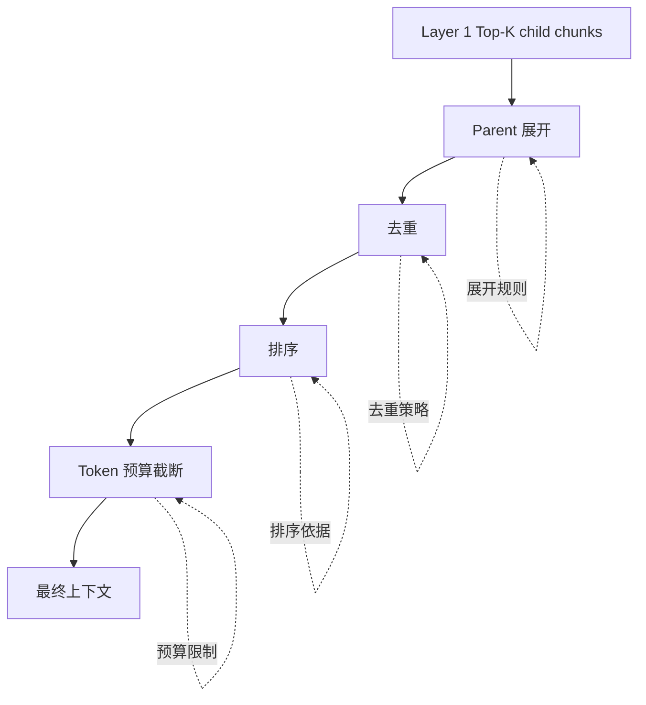

# Layer 2: Evidence Sufficiency Design

*上下文充分性评价的设计方案 · status: plan · 2026-09-29*

> **Layer 2 职责**：评价从 Layer 1 检索结果组装后、实际送入生成器的上下文是否足以支持答案生成。本层不执行新的检索调用，只按固定规则展开、去重和截断，并评估最终上下文的证据充分性。

## 1. 设计定位

### 1.1 核心问题

**检索命中不等于证据充分。** Layer 1 评估原始 Top-K child chunks 是否包含必要证据；Layer 2 评估展开、组装后的完整上下文是否足以支持答案。两者的失败模式不同：

- **Layer 1 失败**：必要证据未进入 Top-K，或定位到正确页但返回片段不含目标信息
- **Layer 2 失败**：Top-K child 已含必要证据，但展开、去重或截断后最终上下文仍不充分；或系统误判上下文充分性

### 1.2 为什么需要独立的 Layer 2

**研究动机**：
1. **Parent-child chunking** 广泛用于 RAG 系统，但其收益难以量化
2. **上下文组装策略**（去重、截断、排序）直接影响生成质量
3. **充分性自我判断**是 Agentic RAG 停止迭代的关键，需要独立评估
4. **噪声与冗余**会干扰上下文学习，需要与检索召回分开测量

**文献支持**：
- **S2G-RAG (ACL 2026)**：将检索证据的充分性及信息缺口作为显式判断对象
- **ARES (NAACL 2024)**：分别评价检索上下文相关性、答案忠实性与答案相关性，支持分层评价
- **RARE (ACL 2026)**：区分部分覆盖与完整覆盖，Coverage@K 测量"检索到的必要信息比例"

### 1.3 Layer 2 在评价链条中的位置


**接口约定**：
- **输入**：Layer 1 的 Top-K child chunks（含 parent ID、排名、分数）
- **处理**：展开 parent、去重、在 token 预算内截断
- **输出**：最终上下文文本、证据覆盖情况、充分性判断
- **评估**：测量最终上下文的证据完整性与系统自我判断准确性

## 2. 职责边界

### 2.1 Layer 2 的职责

| 职责 | 具体内容 |
|---|---|
| **展开规则设计** | 定义 parent 展开策略（direct parent / with siblings / none）|
| **去重与截断** | 在 token 预算内去除重复、排序并截断 |
| **充分性评估** | 测量最终上下文是否覆盖必要证据 |
| **系统判断评估** | 评估系统自我判断"充分/不足"的准确性 |
| **噪声测量** | 量化无关内容占比 |

### 2.2 不属于 Layer 2 的职责

| 项目 | 归属 |
|---|---|
| 原始 Top-K child 的证据内容命中 | Layer 1 |
| 新的检索调用或 query 改写 | Layer 5 (Agentic) |
| 基于上下文的答案正确性 | Layer 3 |
| 答案与证据的忠实性 | Layer 4 (Grounding) |

### 2.3 与 Layer 1 的不重复计分契约

这是 Layer 2 设计的**核心约束**。依据 [PEARL-framework.md](../PEARL-framework.md) §2.1：

| Top-K child 证据 | 组装后上下文 | 归因记录 | Layer 1 分数 | Layer 2 分数 |
|---|---|---|---|---|
| 完整 | 充分 | 两阶段均成功 | ✓ | ✓ |
| 完整 | 不足 | **Layer 2 新增失败** | ✓ | ✗ |
| 不完整 | 充分 | **parent 补证挽回** | ✗ | ✓ |
| 不完整 | 不足 | Layer 1 漏检 | ✗ | — |

**关键规则**：
1. **第 4 行（不完整→不足）不算 Layer 2 新增失败**：Layer 1 已经失败，Layer 2 不重复计分
2. **第 3 行（不完整→充分）单列为挽回案例**：parent 展开补出了 child 缺失的证据，但**不追溯修改 Layer 1 的原始观察**
3. **同一文本的同一种充分性不得重复计分**：Layer 1 观察原始 child 文本，Layer 2 观察组装后上下文

**操作化**：
- 每个 intent 保存三份记录：
  1. `layer1_child_evidence`：原始 Top-K child 的证据覆盖
  2. `layer2_expanded_context`：展开后的完整上下文
  3. `layer2_evidence_coverage`：最终上下文的证据覆盖
- Layer 2 指标只对"Layer 1 完整 → Layer 2 不足"和"Layer 1 不完整 → Layer 2 充分"的增量负责

## 3. 上下文组装流程

### 3.1 组装管道



### 3.2 展开规则（Expansion Strategy）

**设计空间**：

| 策略 | 描述 | 优点 | 缺点 |
|---|---|---|---|
| **None** | 不展开，仅用 Top-K child | 精准、低噪声 | 可能缺失上下文 |
| **Direct Parent** | 展开每个 child 的直接父节点 | 补全上下文 | 可能重复 |
| **Parent + Siblings** | 展开父节点及其所有子节点 | 覆盖连续文本 | 高冗余 |
| **Selective Parent** | 仅当 child 不完整时展开 | 平衡精准与覆盖 | 需要完整性判断 |

**推荐配置**（待实验验证）：
```yaml
expansion:
  strategy: direct_parent
  conditions:
    - child_rank <= 10  # 只展开 Top-10 的 child
    - parent_exists: true
  merge_mode: replace_child  # 用 parent 替换 child，或 append_parent
```

**形式化定义**：

设 Top-K child chunks 为 $C = \{c_1, c_2, \ldots, c_K\}$，每个 $c_i$ 有父节点 $p_i$。

- **None**: $E(C) = C$
- **Direct Parent**: $E(C) = \{p_i \mid c_i \in C, p_i \text{ exists}\} \cup \{c_i \mid p_i \text{ not exists}\}$
- **Parent + Siblings**: $E(C) = \{s \mid s \in \text{siblings}(p_i), c_i \in C\}$

### 3.3 去重策略（Deduplication）

**问题**：展开后可能多个 child 共享同一 parent，或 parent 之间有重叠

**方法**：

| 方法 | 实现 | 适用场景 |
|---|---|---|
| **Exact Match** | 完全相同的文本只保留一份 | 确定性去重 |
| **Semantic Dedup** | 嵌入相似度 > threshold 视为重复 | 处理改写和冗余 |
| **Span-based** | 重叠 token 超过 N% 视为重复 | 处理部分重叠 |

**推荐**：先 Exact Match，再可选 Semantic（threshold=0.95）

**形式化**：
$$
D(E(C)) = \{e \in E(C) \mid \forall e' \in E(C), e' \ne e \implies \text{sim}(e, e') < \theta\}
$$

### 3.4 排序（Ordering）

**问题**：展开后的 chunks 如何排序？

**选项**：
1. **保持原始排名**：按 child 的检索排名
2. **按父节点分组**：同一 parent 的内容相邻
3. **按文档位置**：恢复原文顺序
4. **按相关性分数**：重新排序

**推荐**：按文档位置排序（有利于保持上下文连贯性）

### 3.5 截断（Truncation）

**Token 预算**：设定最大上下文长度 $B$（如 4K, 8K, 16K tokens）

**截断策略**：

| 策略 | 实现 | 优点 | 缺点 |
|---|---|---|---|
| **By Rank** | 按原始检索排名，前 $B$ tokens | 简单 | 可能截断重要证据 |
| **By Score** | 按相关性分数，前 $B$ tokens | 保留高相关内容 | 分数可能不准 |
| **By Coverage** | 优先保留覆盖更多必要证据的 chunks | 最优覆盖 | 需要证据检测 |

**推荐**：主实验用 By Rank，诊断实验对比 By Coverage

**形式化**：
$$
T(D(E(C)), B) = \{e \in D(E(C)) \mid \sum_{e' \preceq e} |e'| \le B\}
$$
其中 $\preceq$ 是排序关系，$|e'|$ 是 token 数。

## 4. 研究问题与假设

### 4.1 研究问题

**RQ2.1**：Parent 展开对证据充分性的影响有多大？

- **假设 H2.1a**：Direct parent 展开可使 Evidence Coverage 提升 10-20%
- **假设 H2.1b**：挽回率（Layer 1 不完整 → Layer 2 充分）在多证据题上更高

**RQ2.2**：上下文组装策略如何影响噪声与充分性的权衡？

- **假设 H2.2a**：Parent + siblings 策略 Coverage 最高，但 Noise Ratio 也最高
- **假设 H2.2b**：存在最优 token 预算 $B^*$，使 Coverage 与 Noise 的加权收益最大

**RQ2.3**：系统能否准确判断上下文充分性？

- **假设 H2.3a**：LLM-based judge 的 Sufficiency Accuracy > 0.80
- **假设 H2.3b**：假阴性率（不足误判为充分）< 10%

**RQ2.4**：Layer 2 改进能否传递到 Layer 3 的答案正确性？

- **假设 H2.4**：Evidence Coverage 与 Answer Correctness 正相关（$r > 0.6$）

### 4.2 对照基线

**静态方法对比**：
1. **Baseline**: 仅用 Top-K child，无展开
2. **Parent**: Direct parent 展开
3. **Parent+Sib**: Parent + siblings 展开
4. **Adaptive**: 根据 child 完整性选择性展开

**动态方法**（与 Layer 5 联合）：
5. **Agentic**: 系统自我判断充分性，不足时触发新检索

## 5. 与其他层的接口

### 5.1 从 Layer 1 接收

**必需字段**：
```json
{
  "intent_id": "Q001",
  "top_k_children": [
    {
      "chunk_id": "doc1_page3_child2",
      "rank": 1,
      "score": 0.89,
      "text": "...",
      "parent_id": "doc1_page3_parent1",
      "source": {"doc_id": "doc1", "page": 3}
    }
  ],
  "layer1_evidence_coverage": {
    "covered_requirements": ["req1", "req2"],
    "total_requirements": 3,
    "coverage": 0.67
  }
}
```

### 5.2 传递给 Layer 3

**必需字段**：
```json
{
  "intent_id": "Q001",
  "final_context": "...",  // 组装后的完整文本
  "layer2_evidence_coverage": {
    "covered_requirements": ["req1", "req2", "req3"],
    "total_requirements": 3,
    "coverage": 1.0
  },
  "sufficiency_judgment": {
    "system_prediction": "sufficient",
    "confidence": 0.92
  },
  "assembly_log": {
    "expansion_strategy": "direct_parent",
    "num_children": 10,
    "num_parents": 8,
    "num_after_dedup": 12,
    "num_after_truncation": 10,
    "final_tokens": 3847
  }
}
```

### 5.3 与 Layer 5 (Agentic) 的交互

**充分性判断触发迭代**：
- Layer 2 的 Sufficiency Accuracy 是 Agent 停止策略的质量指标
- Agent 使用 Layer 2 的判断方法决定是否继续检索
- 迭代检索的新证据重新经过 Layer 2 评估

## 6. 边界情况与处理规则

### 6.1 计分资格

| 情形 | 处理 |
|---|---|
| Layer 1 已不可计分（标签缺失） | Layer 2 也不可计分 |
| Parent 不存在或无法展开 | 等同于 None 策略，正常计分 |
| Token 预算不足以容纳任何 parent | 降级为仅用 child，记录并报告 |
| 去重后上下文为空 | 标记为异常，单独报告 |

### 6.2 争议案例

**部分充分**：上下文提供了大部分但非全部必要证据

**处理**：
- Evidence Coverage 按比例计分（如 2/3）
- Sufficiency 二分类判断：设定阈值（如 0.9），超过则视为充分
- 报告中单列部分充分案例

**条件依赖**：答案依赖特定条件，上下文只提供一般结论

**处理**：
- 必要证据标注须包含适用条件
- 缺失条件视为证据不完整
- 报告中分析条件感知能力

## 7. 实现注意事项

### 7.1 配置版本化

每个实验须冻结：
```yaml
layer2_config:
  version: "v1.0"
  expansion:
    strategy: "direct_parent"
    max_parents_per_child: 1
  deduplication:
    method: "exact"
    semantic_threshold: null
  ordering: "by_document_position"
  truncation:
    token_budget: 8192
    strategy: "by_rank"
    tokenizer: "cl100k_base"
```

### 7.2 可复现性要求

**保存内容**：
1. 原始 Top-K child chunks（Layer 1 输出）
2. 展开后的 parent chunks
3. 去重后的 chunks
4. 截断后的最终上下文
5. 每一步的 token 统计

**版本控制**：
- 展开规则变化 → 新版本
- Token 预算变化 → 同版本不同配置
- 去重策略变化 → 新版本

### 7.3 与旧评估的隔离

旧评估方案没有明确区分 Layer 1 和 Layer 2，其页级 Page-Hit@10 混合了检索召回和展开效果。新 PEARL 实验须：

1. **不沿用旧指标名称**：旧 "Context Relevance" 可能含义不同
2. **不重算旧结果**：展开规则、token 预算均未记录
3. **独立构建新标注**：充分性 Gold 标签需要新的标注流程

## 8. 下一步设计任务

1. **形式化指标**：编写 `metrics.md`，给出四个指标的数学定义
2. **标注指南**：编写 `annotation-guidelines.md`，定义充分性 Gold 标签
3. **展开规则详述**：编写 `expansion-strategies.md`，固化展开算法
4. **实验协议**：编写 `experiments.md`，冻结对照组和测量方案

## 9. 参考文献

| 文献 | 引用点 | 备注 |
|---|---|---|
| RARE (ACL 2026) | Coverage@K 定义，§5.1 | `references/README.md` |
| S2G-RAG (ACL 2026) | 充分性判断，信息缺口 | `references/README.md` |
| ARES (NAACL 2024) | 分层评价，上下文相关性 | `references/README.md` |
| KILT (NAACL 2021) | 证据锚点与检索输出分离 | `references/README.md` |

完整文献引用见 [references/README.md](../references/README.md) 和 [references/related-frameworks.md](../references/related-frameworks.md)（待编写）。
