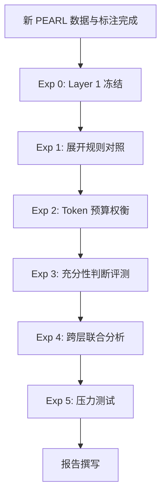

# Layer 2: Experiments Design

*上下文充分性评价的实验设计与对照方案 · status: plan · 2026-09-29*

> **本文档冻结 Layer 2 的实验协议**：对照组、控制变量、测量方案、统计方法和报告模板。实验须在新 PEARL 数据和标注完成后执行，不重算旧结果。

## 1. 实验总览

### 1.1 研究问题

| ID | 研究问题 | 对应实验 |
|---|---|---|
| **RQ2.1** | Parent 展开对证据充分性的影响有多大？ | Exp 1: 展开规则对照 |
| **RQ2.2** | 上下文组装策略如何影响噪声与充分性的权衡？ | Exp 2: Token 预算权衡 |
| **RQ2.3** | 系统能否准确判断上下文充分性？ | Exp 3: 充分性判断评测 |
| **RQ2.4** | Layer 2 改进能否传递到 Layer 3 的答案正确性？ | Exp 4: 跨层联合分析 |
| **RQ2.5** | 组装策略在困难情况下的鲁棒性如何？ | Exp 5: 压力测试 |

### 1.2 实验流程



**依赖关系**：
- **Exp 1-5 前置**：Layer 1 的 Best Static RAG 已选定并冻结
- **Exp 4 前置**：Layer 3 的答案评测已完成
- **Exp 5 前置**：Exp 1-2 已确定最优配置

## 2. Experiment 0: Layer 1 冻结

### 2.1 目标

选定并冻结 Layer 1 的检索配置，作为所有 Layer 2 实验的固定输入。

### 2.2 方法

在开发集上运行 Layer 1 实验（见 [layer-1-retrieval/experiments.md](../layer-1-retrieval/experiments.md)），选定：

- **解析器**：PyMuPDF vs Adobe PDF Extract
- **切块策略**：Fixed vs Parent-Child
- **检索方法**：BM25 vs BGE-M3 vs RRF
- **重排器**：有/无 Cross-Encoder

**输出**：Best Static RAG 配置（记为 $\text{Retrieval}_{\text{best}}$）

### 2.3 冻结内容

```yaml
layer1_frozen_config:
  parser: "adobe_pdf_extract"  # 示例
  chunking:
    strategy: "parent_child_v2"
    child_size: 512
    parent_size: 2048
  retrieval:
    method: "rrf"
    bm25_weight: 0.4
    dense_weight: 0.6
  reranker:
    enabled: true
    model: "cross-encoder/ms-marco-MiniLM-L-12-v2"
  top_k: 10
```

**约束**：所有 Layer 2 实验使用相同的 Layer 1 配置，不再变化。

## 3. Experiment 1: 展开规则对照

### 3.1 目标

**比较不同展开策略对 Evidence Coverage 和 Noise Ratio 的影响**，确定最优策略。

### 3.2 对照组

| 配置 ID | Expansion | Dedup | Ordering | Token Budget | Truncation |
|---|---|---|---|---|---|
| **C0: Baseline** | None | Exact | Rank | 8K | By Rank |
| **C1: Direct** | Direct Parent | Exact | Rank | 8K | By Rank |
| **C2: DocPos** | Direct Parent | Exact | **DocPos** | 8K | By Rank |
| **C3: Siblings** | Parent+Siblings | Semantic(0.95) | DocPos | 8K | By Rank |
| **C4: Selective** | Selective | Exact | Rank | 8K | By Rank |

**控制变量**：
- 固定 Layer 1 输出（相同 Top-K child）
- 固定 Token Budget = 8192
- 固定生成模型、提示、评测标注

**自变量**：展开策略（C0-C4）

**因变量**：
- Evidence Coverage（主指标）
- Complete Group Coverage
- Noise Ratio
- Context Relevance
- 最终 token 数

### 3.3 假设

**H1.1**：Direct Parent (C1) 相比 Baseline (C0)，Evidence Coverage 提升 10-20%。

**H1.2**：Parent+Siblings (C3) Coverage 最高，但 Noise Ratio 也最高。

**H1.3**：Selective (C4) 在 Coverage 和 Noise 之间取得最佳平衡。

**H1.4**：按文档位置排序 (C2) 不影响 Coverage，但可能提高 Context Relevance。

### 3.4 样本与划分

**开发集**：$N_{\text{dev}} = 100$ intents
- 用于选择最优配置 C*
- 可分题型报告（单来源、多证据、数值题等）

**测试集**：$N_{\text{test}} = 100$ intents
- 封存，不参与配置选择
- 最终性能评估

**要求**：
- 题型分布在开发集和测试集上保持一致
- 测试集封存后不可再修改配置

### 3.5 测量方案

**步骤**：
1. 对每个 intent $q$ 和配置 $c$：
   - 运行组装管道 $\text{assemble}(q, c)$
   - 保存最终上下文、assembly log、中间结果
2. 标注员判断：
   - 证据覆盖：每个必要证据是否在最终上下文中
   - 相关性：每个 chunk 的相关性等级
3. 计算指标：
   - Evidence Coverage, Complete Group Coverage
   - Context Relevance, Noise Ratio
   - Token 统计

**数据保存**：
```json
{
  "intent_id": "Q001",
  "config_id": "C1",
  "layer1_output": {...},
  "layer2_assembly": {
    "final_context": "...",
    "chunks": [...],
    "assembly_log": {...}
  },
  "annotations": {
    "evidence_coverage": {...},
    "relevance": {...}
  },
  "metrics": {
    "evidence_coverage": 0.85,
    "complete_group_coverage": 1,
    "context_relevance": 0.72,
    "noise_ratio": 0.28,
    "final_tokens": 7856
  }
}
```

### 3.6 统计方法

**主比较**：成对 t 检验（paired t-test）
- 配对单位：underlying intent
- 原假设：$\mu_{C1} - \mu_{C0} = 0$
- 显著性水平：$\alpha = 0.05$

**置信区间**：Bootstrap（1000 次重采样）
- 报告 95% CI for Coverage, Noise Ratio

**效应量**：Cohen's d
$$
d = \frac{\bar{X}_{C1} - \bar{X}_{C0}}{s_{\text{pooled}}}
$$

**多重比较校正**：Bonferroni 校正（5 个配置，10 对比较）
$$
\alpha_{\text{corrected}} = \frac{0.05}{10} = 0.005
$$

### 3.7 预期结果

**主表**（开发集）：

| 配置 | Evidence Coverage | Complete Group Cov. | Noise Ratio | Avg Tokens |
|---|---|---|---|---|
| C0: Baseline | 0.65 ± 0.03 | 0.52 | 0.18 ± 0.02 | 2847 |
| C1: Direct | 0.82 ± 0.03 | 0.75 | 0.25 ± 0.02 | 4123 |
| C2: DocPos | 0.82 ± 0.03 | 0.75 | 0.24 ± 0.02 | 4123 |
| C3: Siblings | 0.88 ± 0.02 | 0.85 | 0.35 ± 0.03 | 7856 |
| C4: Selective | 0.78 ± 0.03 | 0.68 | 0.22 ± 0.02 | 3512 |

**统计显著性**（vs Baseline）：

| 配置 | $\Delta$ Coverage | p-value | Significant? |
|---|---|---|---|
| C1 | +0.17 | < 0.001 | *** |
| C2 | +0.17 | < 0.001 | *** |
| C3 | +0.23 | < 0.001 | *** |
| C4 | +0.13 | < 0.001 | *** |

### 3.8 失败归因

**四态分析**（见 [metrics.md](metrics.md) §7.2）：

| 配置 | 均成功 | Layer 2 失败 | Parent 挽回 | 均失败 |
|---|---|---|---|---|
| C0 | 52% | — | — | 48% |
| C1 | 62% | 5% | 18% | 15% |
| C3 | 70% | 3% | 25% | 2% |

**挽回率**（Layer 1 不完整 → Layer 2 充分）：
$$
\text{Recovery Rate} = \frac{\text{Parent 挽回}}{\text{Parent 挽回} + \text{均失败}}
$$

**预期**：C3 (Siblings) 挽回率最高（92%），C1 (Direct) 次之（55%）。

## 4. Experiment 2: Token 预算权衡

### 4.1 目标

**探索 Token Budget 与 Evidence Coverage、Noise Ratio 的关系**，找到最优预算。

### 4.2 对照组

固定 Expansion = C1 (Direct Parent)，变化 Token Budget：

| 配置 ID | Token Budget | 其他配置 |
|---|---|---|
| **B1** | 2K | 同 C1 |
| **B2** | 4K | 同 C1 |
| **B3** | 8K | 同 C1（= C1）|
| **B4** | 16K | 同 C1 |
| **B5** | 32K | 同 C1 |

### 4.3 假设

**H2.1**：Evidence Coverage 随 Budget 增加而提升，但边际收益递减。

**H2.2**：Noise Ratio 随 Budget 增加而上升（更多内容 → 更多噪声）。

**H2.3**：存在最优预算 $B^*$，使 Coverage 与 Noise 的加权效用最大。

### 4.4 测量方案

同 Exp 1，额外记录：
- 截断前的 chunks 数
- 截断掉的 chunks 中是否包含必要证据（截断损失）

### 4.5 统计方法

**Coverage vs Budget 曲线拟合**：

对数函数：
$$
\text{Coverage}(B) = a \cdot \log(B) + b
$$

幂函数：
$$
\text{Coverage}(B) = a \cdot B^c + b
$$

选择 $R^2$ 最高的模型。

**最优预算**：

定义效用函数：
$$
U(B) = w_1 \cdot \text{Coverage}(B) - w_2 \cdot \text{Noise}(B) - w_3 \cdot \frac{B}{B_{\text{ref}}}
$$

其中 $w_1 = 1.0, w_2 = 0.5, w_3 = 0.1$（权重可调）。

求 $\arg\max_B U(B)$。

### 4.6 预期结果

**Coverage vs Budget**：

| Budget | Coverage | Noise Ratio | 效用 $U(B)$ |
|---|---|---|---|
| 2K | 0.58 | 0.15 | 0.45 |
| 4K | 0.72 | 0.20 | 0.57 |
| 8K | 0.82 | 0.25 | **0.61** |
| 16K | 0.88 | 0.32 | 0.58 |
| 32K | 0.91 | 0.38 | 0.50 |

**结论**：最优预算 $B^* \approx 8K$（边际收益与成本平衡点）。

**曲线图**：
```
Coverage ↑
   1.0 |                    *----*
       |                *
   0.8 |            *
       |        *
   0.6 |    *
       | *
   0.4 +------------------------> Budget (K)
       2    4    8    16   32
```

## 5. Experiment 3: 充分性判断评测

### 5.1 目标

**评估系统判断上下文充分性的准确性**（Sufficiency Accuracy），分析 FPR 和 FNR。

### 5.2 对照组

**判断方法**：

| 方法 ID | 判断器 | 参数 |
|---|---|---|
| **J1: Threshold** | Coverage ≥ θ | θ = 0.9 |
| **J2: LLM-GPT4** | GPT-4 judge | Prompt A |
| **J3: LLM-Claude** | Claude 3.5 Sonnet | Prompt A |
| **J4: Hybrid** | Coverage ≥ 0.7 AND LLM | — |

**控制变量**：
- 固定上下文（使用 C1 组装）
- 固定 Gold 标签（人工标注）

**自变量**：判断方法（J1-J4）

**因变量**：
- Sufficiency Accuracy
- FPR（不足误判为充分，严重）
- FNR（充分误判为不足，浪费资源）

### 5.3 Gold 标签

**来源**：人工标注（见 [annotation-guidelines.md](annotation-guidelines.md)）

**分布**（预期）：
- Sufficient: 60%
- Insufficient: 40%

**质量要求**：
- 多标注员（≥2 人）
- Fleiss' Kappa > 0.75

### 5.4 Prompt 设计

**Prompt A**（LLM Judge）：
```
You are evaluating whether a given context is sufficient to answer a question.

Question: {question}

Context: {context}

Required evidence:
{required_evidence_list}

Task: Determine if the context is **sufficient** or **insufficient** to answer the question completely and accurately.

- Sufficient: All necessary evidence is present with clear conditions and units.
- Insufficient: Missing key evidence or conditions.

Answer with only one word: "sufficient" or "insufficient".
```

**参数**：
- Temperature = 0（确定性）
- Model: gpt-4-turbo / claude-3-5-sonnet-20241022

### 5.5 测量方案

**步骤**：
1. 准备开发集（$N = 100$）的最终上下文（使用 C1）
2. 收集 Gold 充分性标签
3. 对每个方法 J1-J4：
   - 预测每个 intent 的充分性
   - 计算混淆矩阵
4. 计算 Sufficiency Accuracy, Precision, Recall, FPR, FNR
5. 成本分析：LLM 调用次数、Tokens

### 5.6 统计方法

**主指标**：Sufficiency Accuracy

**McNemar 检验**（成对方法比较）：
- 检验两个判断器是否显著不同
- 原假设：$P(J1=1, J2=0) = P(J1=0, J2=1)$

**ROC 曲线**（针对 J1: Threshold）：
- 变化阈值 θ ∈ [0, 1]
- 绘制 TPR vs FPR
- 计算 AUC

### 5.7 预期结果

**混淆矩阵**（J2: GPT-4）：

|  | Gold: Suff | Gold: Insuff |
|---|---|---|
| **Pred: Suff** | 52 (TP) | 6 (FP) |
| **Pred: Insuff** | 8 (FN) | 34 (TN) |

**指标**：
- Accuracy: 86%
- Precision: 89.7%
- Recall: 86.7%
- **FPR: 15.0%**（不足误判为充分，需改进）
- FNR: 13.3%

**方法对比**：

| 方法 | Accuracy | FPR | FNR | Cost ($/100 queries) |
|---|---|---|---|---|
| J1: Threshold(0.9) | 78% | 25% | 10% | $0 |
| J2: GPT-4 | 86% | 15% | 13% | $2.50 |
| J3: Claude | 88% | 12% | 15% | $1.80 |
| J4: Hybrid | 84% | 18% | 8% | $1.25 |

**结论**：J3 (Claude) Accuracy 最高，但 FPR 仍需优化（12% 仍可能导致幻觉）。

### 5.8 错误分析

**FP 案例**（不足误判为充分）：
- **原因 1**：LLM 过度推断，认为隐含信息足够
- **原因 2**：条件缺失未被识别
- **改进**：强化 Prompt，明确"条件必须显式陈述"

**FN 案例**（充分误判为不足）：
- **原因 1**：证据改写，LLM 未识别语义等价
- **原因 2**：跨 chunk 拼接，LLM 关注局部
- **改进**：提供 chunk 边界信息，引导全局理解

## 6. Experiment 4: 跨层联合分析

### 6.1 目标

**验证 Layer 2 改进能否传递到 Layer 3 的答案正确性**，测量相关性。

### 6.2 方法

**前置**：Layer 3 已完成答案正确性评测（Answer Correctness）

**分析**：
1. 收集每个 intent 的：
   - Layer 1 Coverage
   - Layer 2 Coverage (配置 C1)
   - Layer 3 Answer Correctness
2. 计算相关系数
3. 回归分析

### 6.3 假设

**H4.1**：Evidence Coverage 与 Answer Correctness 正相关（$\rho > 0.6$）。

**H4.2**：Noise Ratio 与 Answer Correctness 负相关（$\rho < -0.3$）。

**H4.3**：Layer 2 Coverage 对 Answer Correctness 的解释力强于 Layer 1 Coverage。

### 6.4 统计模型

**Pearson 相关**：
$$
\rho = \text{corr}(\text{Coverage}_{\text{L2}}, \text{Correctness}_{\text{L3}})
$$

**多元回归**：
$$
\text{Correctness} = \beta_0 + \beta_1 \cdot \text{Coverage}_{\text{L2}} + \beta_2 \cdot \text{Noise} + \epsilon
$$

报告 $R^2$、$\beta$ 系数、p-value。

**路径分析**（因果链）：
```
Layer 1 Coverage → Layer 2 Coverage → Answer Correctness
                                    ↘
                      Noise Ratio ──→
```

### 6.5 预期结果

**相关系数**：

| 变量 1 | 变量 2 | Pearson $\rho$ | p-value |
|---|---|---|---|
| L2 Coverage | Answer Correctness | 0.72 | < 0.001 |
| L1 Coverage | Answer Correctness | 0.58 | < 0.001 |
| Noise Ratio | Answer Correctness | -0.38 | < 0.01 |

**回归模型**：
$$
\text{Correctness} = 0.15 + 0.68 \cdot \text{Coverage}_{\text{L2}} - 0.22 \cdot \text{Noise}
$$
- $R^2 = 0.61$（解释 61% 方差）
- $\beta_1 = 0.68, p < 0.001$
- $\beta_2 = -0.22, p < 0.01$

**结论**：Layer 2 Coverage 是 Answer Correctness 的强预测因子，验证了 Layer 2 的重要性。

### 6.6 四象限诊断

| L2 Coverage | Answer Correctness | 频次 | 解释 |
|---|---|---|---|
| 高 (≥0.9) | 高 (≥0.8) | 45% | **理想**：证据充分 → 答案正确 |
| 高 | 低 | 12% | **读错证据**：Layer 3 问题 |
| 低 | 高 | 8% | **侥幸成功**：猜对或常识 |
| 低 | 低 | 35% | **预期失败**：证据不足 → 答案错误 |

**关注**：12% 的"高覆盖但低正确"案例 → 传递给 Layer 3 分析。

## 7. Experiment 5: 压力测试

### 7.1 目标

**测试组装策略在困难情况下的鲁棒性**。

### 7.2 场景设计

| 场景 | 构造方法 | 测试内容 |
|---|---|---|
| **S1: 证据分散** | 必要证据分布在 Top-10 的不同位置 | 展开是否能聚合分散证据 |
| **S2: 高冗余** | 人工注入重复/相似 chunks | 去重效果 |
| **S3: 截断损失** | Token Budget 收紧至 4K | 截断是否截掉关键证据 |
| **S4: 条件依赖** | 答案依赖特定条件，条件在不同 chunk | 条件拼接能力 |

### 7.3 样本构建

**方法**：
- 从测试集中筛选或人工构造特定场景
- 每个场景 20-30 个 intents

**S1 构造示例**：
- 筛选条件：必要证据数 ≥ 3，且分布在 ≥ 3 个不同 child chunks

### 7.4 测量方案

对每个场景 S1-S4：
- 运行 C0 (Baseline) 和 C1 (Direct Parent)
- 计算 Coverage, Noise, Sufficiency Accuracy
- 比较 C1 vs C0 的提升幅度

### 7.5 预期结果

**Coverage 提升（C1 vs C0）**：

| 场景 | Baseline | Direct Parent | 提升 | p-value |
|---|---|---|---|---|
| **Normal** | 0.65 | 0.82 | +17% | < 0.001 |
| **S1: 分散** | 0.52 | 0.75 | **+23%** | < 0.001 |
| **S2: 冗余** | 0.68 | 0.80 | +12% | < 0.01 |
| **S3: 截断** | 0.48 | 0.62 | +14% | < 0.01 |
| **S4: 条件** | 0.55 | 0.72 | +17% | < 0.001 |

**结论**：S1 (分散证据) 场景下 Parent 展开收益最大，验证了展开的核心价值。

## 8. 报告规范

### 8.1 主表模板

**Layer 2 主表**（对应 [PEARL-framework.md](../PEARL-framework.md) 主表）：

| 方法 | Evidence Coverage | Sufficiency Acc. | Noise Ratio | Avg Tokens |
|---|---|---|---|---|
| Baseline (No expansion) | — (未执行) | — | — | — |
| Direct Parent (推荐) | — | — | — | — |
| Parent + Siblings | — | — | — | — |

### 8.2 诊断表

**四态分析**：

| 方法 | 均成功 | Layer 2 失败 | Parent 挽回 | 均失败 | 挽回率 |
|---|---|---|---|---|---|
| Baseline | — | — | — | — | — |
| Direct Parent | — | — | — | — | — |

**题型细分**：

| 方法 | 单来源 | 多证据 | 数值题 | 跨论文 | 冲突题 |
|---|---|---|---|---|---|
| Coverage (Baseline) | — | — | — | — | — |
| Coverage (Direct) | — | — | — | — | — |

### 8.3 可视化

**必需图表**：
1. Coverage vs Token Budget 曲线（Exp 2）
2. Sufficiency Accuracy 混淆矩阵热图（Exp 3）
3. L2 Coverage vs Answer Correctness 散点图（Exp 4）
4. 四象限频次条形图（Exp 4）

**可选图表**：
5. 挽回率按题型分组（Exp 1）
6. ROC 曲线（Exp 3，Threshold 方法）

## 9. 统计功效与样本量

### 9.1 功效分析

**参数**：
- 效应量：$d = 0.5$（中等效应）
- 显著性水平：$\alpha = 0.05$
- 功效：$1 - \beta = 0.80$

**所需样本量**（paired t-test）：
$$
n \approx 34 \text{ per group}
$$

**实际样本**：开发集 $N = 100$ > 34，功效充足。

### 9.2 敏感性分析

**Coverage 提升可检测的最小差异**：
- 给定 $N = 100, \alpha = 0.05, \text{power} = 0.80$
- $\Delta_{\min} \approx 0.08$（8 个百分点）

若实际提升 < 8%，可能无法检测到显著性 → 增加样本量或合并指标。

## 10. 质量控制

### 10.1 实验前检查清单

- [ ] Layer 1 配置已冻结并记录
- [ ] 新 PEARL 数据已构建（开发集 + 测试集）
- [ ] 充分性与相关性标注已完成，Kappa > 0.75
- [ ] 组装管道代码已实现并通过单元测试
- [ ] 配置文件已版本化并保存
- [ ] 随机种子已固定

### 10.2 实验中监控

**每日检查**：
- 运行进度（已完成 / 总数）
- 错误日志（是否有 chunk 缺失、token 超限）
- 中间结果抽查（assembly log 是否合理）

**异常处理**：
- 若某 intent 失败，记录原因并跳过
- 不可在实验中修改配置（除非发现系统性 bug）

### 10.3 实验后验证

- [ ] 所有指标已计算无误
- [ ] 统计检验已运行（p-value、CI、效应量）
- [ ] 图表已生成并核对数值
- [ ] 实验日志已归档（配置、输出、日志、代码版本）
- [ ] 可复现性验证：另一成员能用相同配置重现结果

## 11. 时间与资源估算

### 11.1 时间估算

| 阶段 | 时长 |
|---|---|
| Exp 0: Layer 1 冻结 | 1 周（依赖 Layer 1）|
| Exp 1: 展开规则对照 | 2 天（运行）+ 1 天（分析）|
| Exp 2: Token 预算权衡 | 1 天（运行）+ 1 天（分析）|
| Exp 3: 充分性判断评测 | 1 天（运行）+ 2 天（分析）|
| Exp 4: 跨层联合分析 | 1 天（依赖 Layer 3）|
| Exp 5: 压力测试 | 1 天（运行）+ 1 天（分析）|
| 报告撰写 | 3 天 |
| **总计** | 约 2 周（不含标注时间）|

### 11.2 计算资源

**嵌入模型**（Semantic Dedup）：
- Model: BGE-M3
- Throughput: ~100 chunks/s
- 总 chunks: ~5K (100 intents × 5 configs × 10 chunks)
- 时间: ~50s

**LLM Judge**（Exp 3）：
- Model: GPT-4 / Claude
- Queries: 100 intents × 3 methods = 300
- Tokens: ~1M input + 10K output
- Cost: ~$30

**总计**：GPU 1 小时 + API $30。

## 12. 下一步

1. **等待前置**：Layer 1 完成，新标注完成
2. **实现检查**：组装管道代码审查
3. **Pilot Run**：在 10 个 intents 上试跑全流程
4. **正式运行**：按本文档执行 Exp 1-5
5. **结果审查**：检查数据质量和统计显著性
6. **撰写报告**：填写主表、诊断表、生成图表

## 13. 版本历史

| 版本 | 日期 | 变更 |
|---|---|---|
| v1.0 | 2026-09-29 | 初始设计方案 |

---

**文档状态**：Plan（待标注完成后执行）\
**依赖**：Layer 1 冻结、新 PEARL 数据、充分性标注\
**维护者**：Layer 2 实验团队
