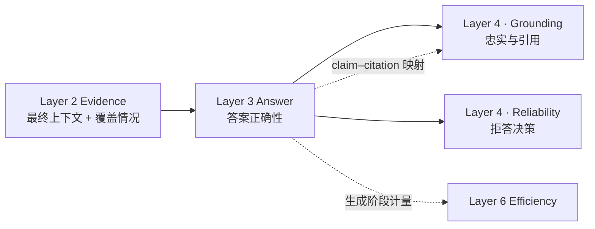

# Layer 3: Answer Correctness Design

*答案正确性评价的设计方案 · status: plan · 2026-09-29*

> **Layer 3 职责**：在 Layer 2 冻结的上下文上评价生成答案与参考答案是否一致。本层不评价上下文的来源与充分性（Layer 2），不评价答案内容是否被本次证据支持（Layer 4 · Grounding），不评价是否应当作答（Layer 4 · Reliability）。

## 1. 设计定位

### 1.1 核心问题

**上下文正确不等于答案正确。** Layer 2 评价送入生成器的上下文是否覆盖必要证据；Layer 3 评价生成器在该上下文上是否得出了参考答案。两者失败模式不同：

- **Layer 2 失败**：上下文缺失必要证据，或系统误判充分性
- **Layer 3 失败**：上下文已含必要证据，但答案与参考答案不符

这一失败模式在 [PEARL-framework.md](../PEARL-framework.md) §1 中记为**读错证据**。

### 1.2 三种可分辨的失败

Layer 3 的失败不是单一现象。三个指标各对应一种，互不替代：

| 失败 | 表现 | 对应指标 |
| --- | --- | --- |
| 结论错误 | 给出与参考答案冲突的结论、数值或方向 | Answer Correctness |
| 遗漏 | 结论方向不错，但必要 claims 未全部给出 | Claim Coverage |
| 整合失败 | 各方证据都提到，但未正确建立它们之间的关系 | Integration Success |

一个答案可以 claims 覆盖完整而结论错误（把两项证据的关系说反），也可以结论正确而 claims 不全（只给数值不给适用条件）。因此三项分别报告，不合成单一分数。

### 1.3 为什么与 Layer 4 分开

两层对照基准不同（[PEARL-framework.md](../PEARL-framework.md) §2.3），因此以下两种组合都会实际出现：

| 情形 | Layer 3 | Layer 4 · Grounding |
| --- | --- | --- |
| 答案与参考答案一致，但所据事实本次未被检索到 | 正确 | 不忠实 |
| 答案忠实复述了本次证据，但该证据不支持参考答案 | 错误 | 忠实 |

两个分数分离不是矛盾，是设计意图。合成单一"答案质量"分会同时掩盖检索失败和生成失败。

### 1.4 在评价链条中的位置

**接口约定**：

- **输入**：Layer 2 的最终上下文、证据覆盖情况、充分性 Gold 标签
- **处理**：固定生成器在该上下文上产生答案
- **输出**：答案文本、claim–citation 映射、三项指标的单题记录
- **评估**：答案对参考答案的一致性；不回溯评价上下文质量

## 2. 职责边界

### 2.1 Layer 3 的职责

| 职责 | 具体内容 |
| --- | --- |
| **结论一致性** | 答案结论是否与参考答案一致 |
| **claims 覆盖** | 冻结 Gold 的必要 atomic claims 是否被给出 |
| **整合判定** | 多证据题是否正确建立了证据间关系 |
| **量表映射** | 各 rubric 的评分结果映射到统一 0–1 量表 |
| **可回答题上的拒答标记** | 记录并单列，不与错答混为一类 |

### 2.2 不属于 Layer 3 的职责

| 项目 | 归属 |
| --- | --- |
| 上下文如何组装、是否充分 | Layer 2 |
| claim 是否被本次证据支持 | Layer 4 · Grounding |
| claim 是否与客观事实一致 | Layer 4 · Grounding（Factuality） |
| 引文与 claim 的配对是否成立 | Layer 4 · Grounding |
| 拒答题上是否正确拒答 | Layer 4 · Reliability |
| 多轮检索的停止时机 | Layer 5 |

### 2.3 与 Layer 2 的不重复计分契约

依据 [PEARL-framework.md](../PEARL-framework.md) §2.2，并与 [layer-2-evidence/design.md](../layer-2-evidence/design.md) §2.3 的四态表对称：

| L2 上下文 | L3 答案 | 归因记录 | L3 计分 |
| --- | --- | --- | --- |
| 充分 | 正确 | 两阶段均成功 | ✓ |
| 充分 | 错误 | **L3 新增失败（读错证据）** | ✗ |
| 不足 | 正确 | **可疑案例**，见下 | 标记并交叉核验 |
| 不足 | 错误 | 上游传播 | 不计为 L3 新增失败 |

**关键规则**：

1. **第 2 行是 Layer 3 唯一的自有失败**：证据齐备而答案错误，责任在生成环节。
2. **第 3 行不是合法挽回机制**。Layer 2 的"parent 补证"是合法的（展开确实引入了证据）；Layer 3 的"上下文不足却答对"只有两种解释：生成器使用了参数化知识，或充分性 Gold 标错。两者都须查证，不得直接记为成功。核验方式是调取该题的 Layer 4 Faithfulness 结果：若答案 claims 无本次证据支持，判为参数化知识补答；若证据实际支持，判为 Layer 2 标签错误并按版本化规则修订。
3. **第 4 行不重复计为 L3 失败**，但其 Answer Correctness 单题值仍是 0，不改记成功。总体正确率与新增失败率是两个不同的报告项。

**充分性标签来源**：本矩阵使用**已审定的充分性 Gold 标签** $y_q$，不使用系统的充分性预测 $\hat{y}_q$。用预测值会把 Layer 2 的判断误差混入 Layer 3 的归因。

**适用范围**：No-RAG 臂没有 Layer 1/Layer 2 阶段，其全部 intent 在形式上都属"上下文不足"，归因矩阵对它不适用。它只进入端到端主表，作为参数化知识的地板线。

### 2.4 派生统计量

令四态计数为 $n_{11}$（充分·正确）、$n_{10}$（充分·错误）、$n_{01}$（不足·正确）、$n_{00}$（不足·错误）：

$$
\mathrm{L3\,New\,Failure\,Rate}=\frac{n_{10}}{n_{11}+n_{10}},\qquad
\mathrm{Suspicious\,Rate}=\frac{n_{01}}{n_{01}+n_{00}}.
$$

前者是 Layer 3 的自有失败率，分母只含上下文充分的题；后者是需要交叉核验的比例。两者都须与总体 Answer Correctness 同时报告，单独给出任何一个都会误导。

<!-- CHUNK-4 -->
