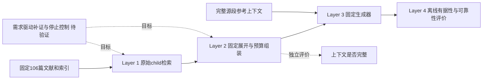

# PEARL Layer 1至4结果汇总与架构问题分析

*固定文献语料上的检索、证据、答案与可靠性评价汇总 · status: current · 2026-10-05 · 正式 Agent 评估*

## 总体判断

PEARL 已形成能够分别观察“找证据、组装证据、回答问题、核查回答”的四层评价链。当前静态 RAG 对单来源事实和数值表格题表现较好，主要缺口集中在跨文献完整取证、关系整合和必要条件保留。重排及较大预算下的 parent 展开能改善上游证据，但证据改善没有等量转化为完整答案。回答已说出的内容大多有据，系统却仍经常没有识别出必要结论尚不能补全。

**因此，当前架构已能支持有来源的领域问答；对于需要同时满足多个来源、条件和关系的科研综合问题，其完整性与缺口控制仍不足。** 这是对已完成实验的综合判断，不表示已证明某一种新架构能够解决这些问题。

需要区分两个评价范围：Layer 1 有独立200题固定评价；Layer 2–4使用同一80题开发集，并未完成200题全链评价。后者是正式 Agent 开发结果，不能升级为独立测试结论。全部 `human_verified=false` 如实保留；按[现行研究审查标准](../../../docs/research-review-standard.md)，人工审查不是默认验收门槛。

## 评价对象与完成状态

| 层 | 实际评价对象 | 样本与完成范围 | 能支持的判断 |
| --- | --- | --- | --- |
| Layer 1 Retrieval | 原始 Top-K child 的完整证据组命中 | 80题开发；另有200题独立评价，R1–R4三遍运行，首遍800题×方法单元评分 | 固定检索方法的效果、题型差异、排序与成本 |
| Layer 2 Evidence | 展开、去重、截断后实际序列化的上下文 | 80题×四配置＝320份最终上下文，步骤支持审查与独立复算完成 | 上下文完整性、展开收益及预算损失 |
| Layer 3 Answer | 基于实际上下文或完整参考上下文的生成答案 | 80题×五臂＝400份真实生成，固定生成器、参考与评分规则 | 完整答对、必要声明覆盖和关系整合 |
| Layer 4 Grounding与Reliability | 同400份回答的声明、引用、可回答性和行为 | 最终r03，5530个原子声明、5676个引用对；没有新增生成 | 有据性、有限源侧事实核查、引用及拒绝补全表现 |

语料固定为106篇 Adobe-only 文献、6433个 child；主查询为英语。开发与独立评价的出题来源分开，但检索全集相同，不能称未见文献泛化。各开发实验中的20题阶段均包含在80题之内，不增加独立样本数。400份回答也只有80个配对意图，不能按400个独立问题推断。

PEARL 是评价框架；被测对象是具体实验链。本次 Layer 3 的[生成入口](../../../experiments/pearl-answer-dev80-20261004/generate.py)直接调用冻结生成器，没有运行 Agent 模块 EvidenceGraph 的查询改写、语义验证和一次修订。因此下列成绩不能直接表述为完整 EvidenceGraph 或动态 Agentic 系统的表现。

实线表示本轮实际实验关系；虚线的控制器是后续研究方向。离线评价标签没有注入生成器，也没有在本轮形成在线补证或停止决策。

## Layer 1 检索表现

R1为正文BM25，R2为BGE-M3 dense，R3为等权RRF，R4为固定R3 Top-100重排。主指标 CEGR@10 表示前10个原始 child 是否完成至少一组完整证据需求，不能用页命中或 parent 补文替代。

| 方法 | CEGR@10，N＝200 | 95%意图配对分层区间 | BestGroupCov@10 | CompleteMRR@10 |
| --- | --- | --- | --- | --- |
| R1 BM25 | 116/200，58.00% | 53.00%–63.00% | 0.6750 | 0.3180 |
| R2 Dense | 118/200，59.00% | 54.49%–63.50% | 0.7075 | 0.2937 |
| R3 RRF | 126/200，63.00% | 58.50%–67.50% | 0.7525 | 0.3512 |
| R4 RRF加重排 | 139/200，69.50% | 65.00%–74.00% | 0.7975 | 0.4875 |

R4相对R3净增6.5个百分点，19题收益、6题退步，三项预设比较的Holm调整p＝0.04390；差值区间为2.00–11.50个百分点。R2相对R1及R3相对R2没有达到该检验族的校正显著性。重排是本轮具有统计支持的改善，但仍有61/200题在Top-10内不完整；Top-20也只有153/200完整。

| 题型，每类50题 | R1 | R2 | R3 | R4 |
| --- | --- | --- | --- | --- |
| 单来源事实 | 47/50 | 48/50 | 49/50 | 50/50 |
| 数值表格 | 43/50 | 43/50 | 47/50 | 48/50 |
| 同篇多证据 | 23/50 | 23/50 | 26/50 | 31/50 |
| 跨文献 | 3/50 | 4/50 | 4/50 | 10/50 |

**最明确的结构性薄弱点是跨文献整组完成，而非简单事实定位。** R4的跨文献完整率仅20%，同篇多证据为62%。从算法结构看，按query–child相关性排序没有显式保证多项需求共同覆盖；这与结果吻合，但“缺少需求覆盖目标导致全部失败”仍是待验证的机制解释。

深层诊断中R3/R4 Top-100各有181题已知完整、19题未决；R4只重排同一候选集，不能新增来源。未决不是候选内确实无证据，不能自动归因于解析、切块或索引丢失。重排平均方法总时延估计1.179秒，R3约0.0815秒，约14.47倍；这是扣审计开销的估计，完整adapter wall另报，不是端到端问答时间。

依据：[200题固定评价分析](../../../experiments/pearl-retrieval-eval200-20261003/evaluation-analysis-2026-10-03.md)、[保存评分](../../../outputs/pearl-retrieval-eval200-20261003-01/score-details.json)、[统计](../../../outputs/pearl-retrieval-eval200-20261003-01/statistics.json)。

## Layer 2 证据组装表现

本层固定开发集R4 Top-10，仅比较child直接组装C0与直接parent展开C1，各设4096/8192 BGE token预算。完整组覆盖CGC评价实际保留正文，Evidence Coverage评价最佳允许组的需求覆盖。

| 配置，N＝80 | 完整组覆盖CGC | 需求覆盖 | 跨文献完整，N＝20 | 平均上下文tokens |
| --- | --- | --- | --- | --- |
| child 4K | 63/80，78.75% | 88.125% | 6/20 | 4000.89 |
| child 8K | 64/80，80.00% | 88.750% | 7/20 | 4133.44 |
| parent 4K | 62/80，77.50% | 85.000% | 4/20 | 4093.70 |
| parent 8K | 71/80，88.75% | 93.125% | 12/20 | 7308.85 |

Parent 8K比child 8K增加7题完整组，净增8.75个百分点，Holm p＝0.046875；比parent 4K增加9题，Holm p＝0.015625。这是开发集上的支持证据。单源与数值类四配置均20/20完整；parent 8K剩余9题不足，其中8题跨文献、1题同篇多证据。

步骤审查给出了更直接的机制证据：未预算raw为64题完整，展开后71题完整；parent 4K截断又丢失9个完整组，最终只有62题。8K没有完整组截断损失，但仍有一题部分需求丢失。当前[组装实现](../../../experiments/pearl-evidence-dev80-20261004/assemble.py)按顺序保留单元，在首次预算不足时截取文本前缀并停止保留后续单元。这个规则透明可复现，却没有显式按需求或来源分配预算，已观察到后置关键条件被挤出。

本轮raw新裁决64/80与原Layer 1开发R4 CEGR@10的58/80不相同；支持映射和观察视图不同。不能拿58→71的13题差量全部归于parent展开，实际同口径raw→expanded完整组收益是7题，原检索成绩保持不变。

Parent 8K正文长度约为child 8K的1.77倍。报告中的Noise约86.78%–94.00%指“含无关内容的单元比例”，mixed同时计入相关性和噪声，且parent改变单元粒度；不能解读为94%的token无用。当前没有独立系统充分性预测器，也没有测量Sufficiency Accuracy。这是在线控制尚需补足的能力，Agent参考裁决不能冒充系统预测。

依据：[Layer 2分析](../../../experiments/pearl-evidence-dev80-20261004/evidence-analysis-2026-10-04.md)、[保存评分](../../../outputs/pearl-evidence-dev80-20261004-01/stage80/scores-r01.json)。

## Layer 3 答案表现

生成器固定为本轮记录的DeepSeek V4.1 Flash，thinking关闭、temperature＝0、输出上限2048；单遍生成，没有seed确定性保证。A0对应child，A1对应parent，Aref为独立构建并复核的完整源段上下文。AC为0/0.5/1评分宏平均，Strict为完整答对比例，两者不互换。

| 臂，各N＝80 | AC均值 | Strict完整正确 | Claim Coverage | Integration，N＝40 |
| --- | --- | --- | --- | --- |
| A0 child 4K | 0.76875 | 60/80，75.00% | 85.94% | 26/40，65.00% |
| A0 child 8K | 0.75000 | 58/80，72.50% | 86.98% | 23/40，57.50% |
| A1 parent 4K | 0.73750 | 57/80，71.25% | 82.71% | 22/40，55.00% |
| A1 parent 8K | 0.77500 | 61/80，76.25% | 87.50% | 24/40，60.00% |
| Aref完整参考 | 0.95000 | 73/80，91.25% | 99.27% | 34/40，85.00% |

四个实际配置的预设Strict比较均未达到Holm校正显著性。Parent 8K的61题是观察最高值，不能称已证明的最优配置；child 4K也有60题，且整合成功数更高。跨文献Strict分别9、8、4、7题，完整参考为16题，说明展开对同篇多证据与跨篇任务的表现不同。

**已有足够证据仍未答完整，是独立的下游问题。** Parent 8K的71个充分上下文中，61题完整答对、10题未完整答对，新增语义失败率14.08%；另9题上下文不足且未完整答对。因而该配置19个Strict失败可以在同一开发面板上拆成“9个上游不足＋10个充分但未答完整”，不能把全部失败归于检索。

完整参考比parent 8K净增12题、15个百分点，Holm p＝0.009155，但仍有7题失败。五题未建立指定关系，一题遗漏数据集分辨率限制，一题未保留running条件。单纯列出正确发现不能替代比较关系；必要claims覆盖高也不保证复合target满足。另有child 4K将线密度表达为面密度的实际错误，数值相同不能消除量纲错误。

Oracle平均正文约940 BGE tokens，而parent 8K约7309；参考臂同时改变完整性、片段选择、长度和干扰内容。它显示当前条件下的答案缺口及残余生成问题，不是新检索方法成绩，也不能单独证明“更短上下文”或“更完整证据”的因果收益。Child 4K/8K有35题完整请求SHA相同，其中2题Strict仍不同；现有单遍差异包含生成波动。

依据：[Layer 3分析](../../../experiments/pearl-answer-dev80-20261004/answer-analysis-2026-10-04.md)、[保存评分](../../../outputs/pearl-answer-dev80-20261004-01/stage80/scores-r01.json)。

## Layer 4 有据性与可靠性表现

有据性判断答案声明是否被实际context支持；事实性对照冻结源侧片段；可靠性判断必要结论不能补全时是否采取合宜受限回答。三者分别报告，不能合成一个总分。

| 臂 | Faithfulness逐题宏平均 | 事实解析覆盖，声明微平均 | 引用Precision宏平均 | 引用Recall宏平均 |
| --- | --- | --- | --- | --- |
| child 4K | 96.68%–96.74% | 38.95% | 87.26%–93.40% | 83.80%–84.74% |
| child 8K | 97.98%–98.12% | 40.52% | 90.67%–94.83% | 83.76%–84.53% |
| parent 4K | 96.83%–97.57% | 38.03% | 93.34%–96.87% | 82.18%–82.98% |
| parent 8K | 96.49% | 33.48% | 90.07%–94.31% | 81.60%–82.79% |
| 完整参考 | 98.30%–98.72% | 85.57% | 95.49%–97.50% | 78.79%–79.30% |

区间为unknown导致的指标上下界，不是95%置信区间。高有据性说明已说出的声明多数受支持，不覆盖被遗漏的必要内容，因此可与Layer 3完整率不足同时存在。实际臂的源侧事实解析覆盖仅33.48%–40.52%，已解析部分均true不能推出全部事实100%正确；事实宏平均上下界仍很宽。范围外或缺证声明保持unknown，未完成全域事实查证。

引用Recall显示仍有声明没有被充分引用覆盖。完整参考的Recall更低，不意味着其完整答案更差：原子数量、回答长度和所选来源均不同，需要分别评价声明完整性与引用支持。四个实际配置间有据性差的上下界95%区间均跨零，不能宣称parent或大预算显著提高有据性。

| 臂 | 拒绝补全Recall确定子集 | Recall可能界 | F1可能界 | False Answer可能界 | 确定行为覆盖 |
| --- | --- | --- | --- | --- | --- |
| child 4K | 26.67% | 25.00%–31.25% | 38.10%–45.45% | 68.75%–75.00% | 79/80 |
| child 8K | 37.50% | 37.50% | 52.17% | 62.50% | 80/80 |
| parent 4K | 47.37% | 47.37% | 64.29% | 52.63% | 80/80 |
| parent 8K | 50.00% | 50.00% | 58.82%–62.50% | 50.00% | 79/80 |
| 完整参考 | 0.00% | 0.00% | 0.00% | 100.00%，仅2/2 | 80/80 |

正类为partial/none，即当前证据不能补全必要结论。这里的False Answer是该子集继续完整作答的行为指标，不等于所有声明虚假，更不是总体错误率。Parent 8K在10个partial样本中仍有5个FN；有据性高并未带来稳定的缺口识别。完整参考只有2个partial样本，不能据2/2推断其总体可靠性最差。

本轮400回答无pure_abstain，受限回答bounded_partial另列。天然样本不能证明纯拒答能力已经验证；两条行为类别ambiguous仍保留未知。本层可回答性与L2组覆盖分别定义和复核，因此parent 8K的L2充分为71题、L4 complete为70题；不能将差1题当作管线丢证，或悄悄改写旧标签。

依据：[Layer 4分析](../../../experiments/pearl-layer4-dev80-20261004/grounding-reliability-analysis-2026-10-04.md)、[最终r03评分](../../../outputs/pearl-layer4-dev80-20261004-01/scores-r03.json)。

## 当前架构问题及证据强度

| 问题 | 已观察到的证据 | 架构解释与尚需验证之处 |
| --- | --- | --- |
| 检索未显式优化多需求共同覆盖 | 独立200题R4跨篇仅10/50；Top-10仍61题不完整 | 单段相关性排序缺少需求分解、来源互补及完整组目标；这是机制假设，需与固定R4做消融验证 |
| parent展开依赖已有命中，不能主动找到缺失来源 | 本轮L2没有新增检索，parent 8K仍9题不足 | 展开适合补邻近条件；缺少另一来源时没有定向补证动作。不能把所有残余失败都归于来源缺失 |
| 预算按序截断，没有保护后置必要条件 | parent 4K实际截断丢9个完整组；8K也有部分需求损失 | 截断损失已有步骤证据；按来源/需求分配预算及选择性展开仍是待实施方案 |
| 生成没有稳定完成关系与范围约束 | parent 8K充分子集10/71未完整答对；oracle仍7/80失败 | 需要验证条件、单位和关系的结构化检查是否改善输出，不能单靠扩大context解决 |
| 缺口判断尚未形成经过测量的在线控制 | L2没有系统充分性预测器；L4拒补召回仅约27%–50% | 离线判断不自动提供可靠停止策略，应分别测量需求预测、补证与受限回答行为 |
| 引用身份有效不等于语义支持或完整覆盖 | 有据性很高但Citation Recall不足；实际存在partial/unsupported引用 | 应同时检查每个已说claim的引用支持及必要结论是否遗漏，不能只核查ID或页码存在 |
| 实验链与模块Agent运行链尚未完成同口径评价 | Layer 3直接生成；Agent README描述固定EvidenceGraph | 不应把本轮分数赋给已有验证/修订链。需要明确适配接口及单独对照，保留静态基线 |

模块层面，[Agent README](../../../Agent/README.md)及[接入评估](../../../Agent/docs/harness-integration-assessment.md)还指出：Knowledge-Base返回的检索结果与Agent所需的 `RetrievalBatch.sufficient` 之间需要适配；已有“两份不同资源或标题精确匹配”等启发式不能等同于PEARL需求完整性。固定EvidenceGraph具有验证和一次修订，但不具有通用的需求驱动工具循环。这里是源码与接口边界分析，不是本轮已测性能。

PEARL四层拆分本身有助于定位问题，值得保留。当前主要问题在被测检索与生成策略，以及评价结果向运行时控制的连接。评价框架也有待补足之处：跨层支持定义并非完全相同，不能直接构造单一成功漏斗；事实核查范围有限；纯拒答样本不足；L2–4没有独立全链测试；评审角色与来源依赖限制了外推。

## 性能与成本的综合取舍

R4提高完整检索，但增加重排开销；parent 8K提高证据完整性，正文约增长77%，答案完整率只比child 8K高3.75个百分点且未显著。Parent 8K生成API平均2.447秒，child 4K为2.133秒，完整参考为1.582秒；这些是本轮调用观测，不能与200题检索时延相加成为已测端到端成本。

400次研究生成全部首次成功、finish_reason为stop；没有技术失败不代表科学任务完整。记录的生成usage为1619528 provider tokens，历史来源绑定费用估算约USD0.27049，实际扣费不可获取；Agent参考构建与审查成本也未知。此处只引用本轮保存的历史估算，不提供当前价格判断，也不宣称Layer 6全框架效率评价完成。

当前可保留R4＋parent 8K作为“证据覆盖优先”的待验证候选，并保留child 4K/8K对照。现有结果不足以选出同时在完整答案、有据性、可靠性与成本上全面最优的配置。

## 建议的后续研究顺序

以下是依据当前诊断提出的计划，不表示已经实施或启动新实验。

1. **先修证据选择与预算分配。** 保持语料、索引、R4排名和生成器固定，比较直接parent与选择性片段保留，优先检查跨篇来源是否被预算挤出、数值单位及条件是否随片段保存。分别报告完整组挽回与新增损失。
2. **再验证完整答案约束。** 在固定context上单独比较条件、单位、关系检查或一次修订策略；同时检查Strict、Integration与Faithfulness，避免只增加回答长度或声明数量。
3. **单独建立可回答性与受限回答评价。** 系统只能从query和实际context判断缺口，不能访问Gold；补充独立的不足、冲突、无证据样本，报告拒补召回、误拒、unknown与真实pure_abstain。
4. **在静态基线冻结后研究需求驱动补证。** 保留静态R4对照，明确缺失需求、检索动作、预算和停止条件，评价收益是否超过成本与新增错误；不能把增加工具循环本身视为质量改善。
5. **完成独立全链评价。** 先冻结L2–4规则、模型和统计方案，再按授权范围运行独立评价；开发失败可用于形成假设，已看过的200题检索结果不能被当作完全未知数据来调参后再宣称确认性优势。

## 结果可信度与本报告核查范围

各实验已有独立算术与文件绑定核验。Layer 2记录320上下文及1173必需文件SHA绑定；Layer 3记录400单元及413绑定；Layer 4最终r03记录400行、5530声明、5676引用对、6130绑定及1600任务链。工程校验保障保存结果与输入、评分和版本关系一致，不替代语义判断。

Layer 3/4的C阶段100份全量次审，D新增300份中固定60份次审，其余240份不能称双审。评审角色复用、先前暴露、Layer 4错误裁决包修正及后续QA版本均由原报告披露；不能称外部全程双盲。Layer 4原r01/r02是QA快照，本报告采用r03。

本报告基于当前四层分析、保存评分、验证记录和相关入口源码整理，并核对主表计数。它没有重新检索、生成、语义裁决或修改旧Gold、排名和研究输出；不宣称完成全仓测试、新模型实测或新的独立实验。新增核查结果另存[汇总核查目录](../../../outputs/pearl-layer1-4-summary-check-20261005-01/)。

部分框架README和报告模板仍保留2026-09-29的“未执行”快照；当前实验状态以本报告链接的实际实验和交付为准。这是导航与状态同步问题，不能据旧快照否定已完成实验，也不能把旧目标文档写成已实现能力。
