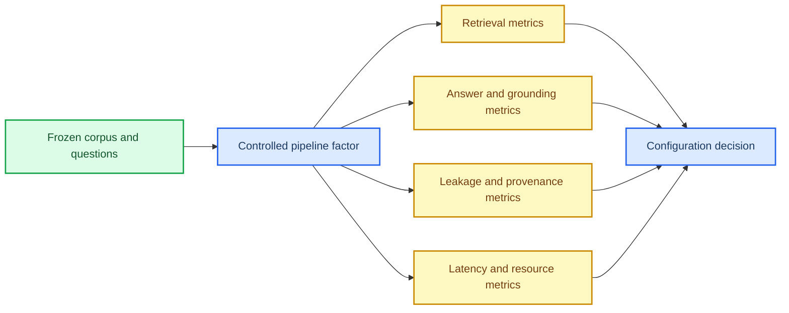

# Knowledge retrieval ablation literature

*Literature review for validating ingestion, chunking, retrieval, reranking, and RAG evaluation in Ped-Agent · collected 2026-08-19 · status: current*

---

## 📋 Review scope

This review focuses on papers that explain how to compare retrieval or RAG system variants: what
to hold fixed, which parameters to vary, what baselines to include, how to measure retrieval and
answer quality, and how to report uncertainty. It is not a claim that every method should be added
to Ped-Agent.

The most transferable pattern is to freeze a corpus and query set, change one pipeline component
at a time, report both quality and cost, and retain per-query results rather than only averages.

## 📚 Evidence inventory

| Source | What it compares | Experimental lesson for Ped-Agent |
| --- | --- | --- |
| [DPR, Karpukhin et al. 2020][dpr] | BM25, dense passage retrieval, and BM25+dense score fusion across several open-domain QA datasets | Use a sparse baseline, a dense variant, and a fixed development set for fusion-weight selection. Report multiple cutoffs rather than one top-k. |
| [RocketQAv2, Ren et al. 2021][rocketqav2] | Sparse/dense retrievers, candidate pool sizes, dynamic vs. static distillation, listwise vs. pointwise training, and hard-negative counts | Treat reranking and candidate depth as separate factors; report MRR and Recall@k; include parameter-sensitive ablations. |
| [BEIR, Thakur et al. 2021][beir] | Zero-shot retrieval across heterogeneous datasets and retrieval families | A single benchmark can hide domain drift; evaluate by topic/domain and report aggregate plus per-domain results. |
| [MTEB, Muennighoff et al. 2023][mteb] | Text embedding models across retrieval and other task families | Embedding choice should be evaluated on the actual task family, not inferred from a general model leaderboard. |
| [Searching for Best Practices in RAG, Wang et al. 2024][best-practices] | Query classification, original/dense/hybrid/HyDE retrieval, reranking, repacking, summarization, and module removal | Sequentially optimize one module while holding the remaining pipeline fixed; report quality and latency together. |
| [RAGAS, Es and James 2024][ragas] | Reference-free faithfulness, answer relevance, and context relevance against GPT-score and GPT-ranking baselines | Add answer/context quality only after retrieval is measured; test evaluator agreement and repeated-run consistency. |
| [ARES, Saad-Falcon et al. 2024][ares] | Automated judges against human preferences, with prediction-powered confidence intervals | Use a small human validation set to calibrate automated evaluation and report confidence intervals when comparing close systems. |
| [Lost in the Middle, Liu et al. 2024][lost-middle] | The effect of evidence position inside long contexts | Context order and repacking deserve an explicit ablation; a higher recall score alone does not guarantee better use of evidence. |
| [RAG survey, Gao et al. 2023][rag-survey] | Taxonomy of retrieval, augmentation, generation, and evaluation choices | Use the survey as a vocabulary map, not as evidence that a proposed component is effective on Ped-Agent. |

## 🔬 Reported experimental patterns

### Sparse, dense, and hybrid retrieval

DPR compares BM25, a dense retriever, and a linear BM25+dense fusion. The reported setup tunes
BM25 `b=0.4` and `k1=0.9` on development data, combines the top-2000 candidates from both
retrievers, and selects the fusion weight (`λ=1.1`) on the development set.[^1] The paper also
varies training-example count and hard negatives, showing why a retrieval experiment should not
only compare model names.[^1]

For Ped-Agent, the direct analogue is:

1. BM25-only;
2. Dense-only;
3. BM25 + Dense with RRF or a tuned linear fusion;
4. the same three settings at identical candidate depths and query sets.

### Candidate depth and reranking

RocketQAv2 reports retrieval and reranking separately, including candidate counts of 50 and 1000
for different reranking baselines.[^2] Its analysis varies the number of instances/hard negatives
and compares dynamic against static distillation and listwise against pointwise training.[^2]

This supports two independent Ped-Agent factors:

- `initial_k`: how many chunks enter the reranker;
- `reranker`: disabled, cross-encoder, or another fixed reranker configuration.

Do not interpret a reranker result without stating the first-stage candidate depth.

### Chunking and context order

The RAG best-practices study treats query classification, retrieval, reranking, repacking, and
summarization as separate modules. It first selects a default for each module, then changes one
module at a time while retaining the current best choices for the other modules.[^5] Its reported
results include both quality and latency: the query-classification variant improved the average
score from 0.428 to 0.443 while reducing latency from 16.41 to 11.58 seconds per query; hybrid
retrieval with HyDE achieved the highest reported RAG score in that comparison but with materially
higher latency.[^5]

The study therefore gives Ped-Agent a defensible design for comparing:

- structure-aware Parent/Child chunks vs. flat chunks;
- different target sizes and overlaps;
- BM25 vs. hybrid retrieval;
- reranking on/off;
- original vs. relevance-first context ordering.

The latter is also motivated by the long-context position study, which shows that evidence position
within a long prompt can affect model use of that evidence.[^8]

### Retrieval metrics and benchmark heterogeneity

RocketQAv2 uses MRR and Recall@k for passage retrieval.[^2] DPR reports top-20 and top-100 passage
accuracy and also studies sample efficiency and negative construction.[^1] BEIR demonstrates the
importance of heterogeneous zero-shot evaluation rather than relying on one dataset or one query
distribution.[^3]

For Ped-Agent, the minimum retrieval report should contain:

| Metric | Why it matters |
| --- | --- |
| Recall@5 and Recall@20 | Whether a relevant resource appears in the candidate set |
| MRR | Whether the first relevant result is near the top |
| nDCG@k | Graded ranking quality when several resources are relevant |
| Locator hit rate | Whether the returned page/section/clause is usable as evidence |
| Per-topic metrics | Whether one research theme is masking another |

### Automated answer and context evaluation

RAGAS defines faithfulness, answer relevance, and context relevance, and evaluates whether its
preferences agree with human pairwise judgments on a small WikiEval set.[^6] It compares against
simple GPT scoring and GPT ranking baselines rather than assuming an automated evaluator is correct.
It also checks repeated-run consistency and finds structured JSON outputs more consistent than
unstructured outputs in its reported setup.[^6]

ARES uses a different strategy: synthetic examples are calibrated with a human preference
validation set of approximately 150 annotated datapoints, and prediction-powered inference is used
to produce confidence intervals.[^7] Its evaluation is explicitly designed to distinguish systems
that are only a few points apart.

For the current knowledge-base phase, these methods should be used selectively:

- use human-annotated Gold Questions for retrieval and locator metrics;
- add RAGAS-style context/faithfulness checks only when an answer-generation layer is being tested;
- use an ARES-like calibration set if automated judging is needed for close configuration choices;
- never replace the official-source and locator checks with an LLM judge.

## 🧭 Transferable design rules

| Rule | Evidence basis | Ped-Agent implication |
| --- | --- | --- |
| Freeze inputs before comparing systems | DPR, BEIR, RocketQAv2 | Freeze Manifest, source hashes, active versions, Gold Questions, and query order. |
| Change one module at a time first | RAG best-practices study | Start with parser/chunker, then retrieval, then reranking; use factorial tests only for suspected interactions. |
| Tune parameters on development data only | DPR and standard retrieval practice | Do not tune RRF weights, BM25 parameters, or chunk size on the final Gold test set. |
| Report multiple cutoffs | DPR and RocketQAv2 | Keep Recall@5/20 and MRR, not only one score. |
| Pair quality with cost | RAG best-practices study | Record import time, index build time, query p50/p95, memory, and index size. |
| Validate automated judges | RAGAS and ARES | Preserve a human validation subset and report agreement or confidence intervals. |
| Test context order | Lost in the Middle and RAG best practices | Compare original order, relevance-first order, and page-preserving order. |
| Report domain slices | BEIR | Show flow fundamentals, measurement, evacuation, and safety separately. |

## 📌 What these papers do not establish

The papers do not establish that a particular chunk size, embedding model, reranker, or RRF
constant is optimal for Ped-Agent. Their settings are evidence for experimental design, not values
to copy blindly. The current project still needs a frozen pedestrian-flow corpus, domain Gold
Questions, and a reproducible local run before making scientific claims.

## References

[^1]: Karpukhin, V. et al. (2020). “Dense Passage Retrieval for Open-Domain Question Answering.” *EMNLP*. https://doi.org/10.18653/v1/2020.emnlp-main.550
[^2]: Ren, L. et al. (2021). “RocketQAv2: A Joint Training Method for Dense Passage Retrieval and Passage Re-ranking.” *EMNLP*. https://doi.org/10.18653/v1/2021.emnlp-main.224
[^3]: Thakur, N. et al. (2021). “BEIR: A Heterogeneous Benchmark for Zero-shot Evaluation of Information Retrieval Models.” *arXiv*. https://doi.org/10.48550/arxiv.2104.08663
[^4]: Muennighoff, N. et al. (2023). “MTEB: Massive Text Embedding Benchmark.” *EACL*. https://doi.org/10.18653/v1/2023.eacl-main.148
[^5]: Wang, X. et al. (2024). “Searching for Best Practices in Retrieval-Augmented Generation.” *EMNLP*. https://doi.org/10.18653/v1/2024.emnlp-main.981
[^6]: Es, S. and James, J. (2024). “RAGAs: Automated Evaluation of Retrieval Augmented Generation.” *EACL Demo*. https://doi.org/10.18653/v1/2024.eacl-demo.16
[^7]: Saad-Falcon, J. et al. (2024). “ARES: An Automated Evaluation Framework for Retrieval-Augmented Generation Systems.” *NAACL*. https://doi.org/10.18653/v1/2024.naacl-long.20
[^8]: Liu, N. F. et al. (2024). “Lost in the Middle: How Language Models Use Long Contexts.” *TACL*. https://doi.org/10.1162/tacl_a_00638
[^9]: Gao, Y. et al. (2023). “Retrieval-Augmented Generation for Large Language Models: A Survey.” *arXiv*. https://doi.org/10.48550/arxiv.2312.10997

[dpr]: https://doi.org/10.18653/v1/2020.emnlp-main.550
[rocketqav2]: https://doi.org/10.18653/v1/2021.emnlp-main.224
[beir]: https://doi.org/10.48550/arxiv.2104.08663
[mteb]: https://doi.org/10.18653/v1/2023.eacl-main.148
[best-practices]: https://doi.org/10.18653/v1/2024.emnlp-main.981
[ragas]: https://doi.org/10.18653/v1/2024.eacl-demo.16
[ares]: https://doi.org/10.18653/v1/2024.naacl-long.20
[lost-middle]: https://doi.org/10.1162/tacl_a_00638
[rag-survey]: https://doi.org/10.48550/arxiv.2312.10997
