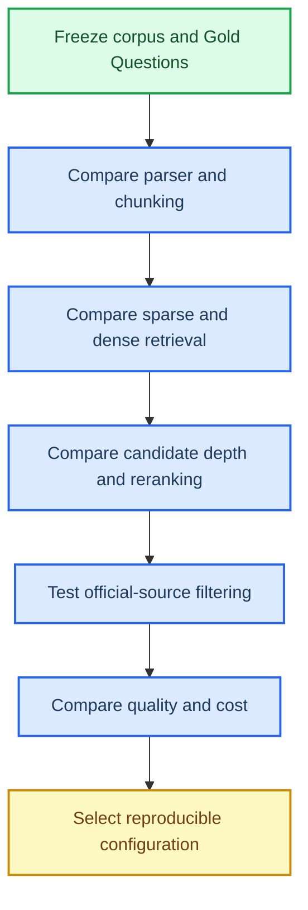

# Knowledge retrieval ablation experiment plan

*Ped-Agent paper preparation · protocol for comparing ingestion and retrieval configurations · status: plan*

---

## 📋 Study objective and questions

Determine which parts of the Ped-Agent knowledge pipeline improve evidence retrieval and locator
quality enough to justify their storage, model, and latency cost. The experiment is about the
knowledge module, not a claim about an eventual answer-generation product.

The study should answer five questions:

| ID | Research question | Primary evidence |
| --- | --- | --- |
| RQ1 | Does structure-aware PDF parsing improve retrievability and evidence locators? | Recall/MRR, locator hit rate, parse diagnostics |
| RQ2 | Does Parent/Child Chunking outperform flat chunks at the same corpus and query set? | Recall/MRR, context coverage, chunk statistics |
| RQ3 | Do Dense and hybrid retrieval add value over BM25 for bilingual pedestrian-flow queries? | Recall@k, MRR, nDCG, per-topic slices |
| RQ4 | Does reranking improve top-rank evidence enough to justify candidate and latency cost? | MRR, locator hit rate, p50/p95 latency |
| RQ5 | Do official-version and provenance filters prevent unsafe evidence leakage? | Leakage rate, superseded-hit rate, locator coverage |

The literature review in [knowledge-retrieval-ablation-literature.md](knowledge-retrieval-ablation-literature.md)
provides the external rationale. Values below are the Ped-Agent protocol, not claimed universal optima.

## 🧩 Hypotheses and variables

| Hypothesis | Expected direction | Independent variable | Dependent variables |
| --- | --- | --- | --- |
| H1 | Structured parsing improves evidence usability | parser path | Recall, MRR, locator hit rate |
| H2 | Parent/Child chunks improve context without reducing first-hit quality | chunk structure | Recall, MRR, parent-context coverage |
| H3 | Hybrid retrieval is more robust than either single signal | retrieval mode | Recall@5/20, MRR, nDCG |
| H4 | Reranking helps top ranks but increases latency | reranker and initial candidate depth | MRR, locator hit rate, p50/p95 |
| H5 | Governance filtering reduces unsafe hits | eligibility/version filter | official leakage, superseded-hit rate |

The main pilot uses one-factor-at-a-time comparisons. A small factorial follow-up is allowed only
when the pilot shows a plausible interaction, such as `chunk_size × retrieval_mode`.

## 🧪 Frozen experiment boundary

Before running any comparison, freeze:

| Item | Required record |
| --- | --- |
| Corpus | Resource IDs, resource types, versions, and SHA-256 values |
| Governance | The exact selection/screening snapshot and official/staging policy |
| Questions | Gold Question IDs, expected resources, and expected locators |
| Software | Git commit, Python version, package lock, parser version |
| Randomness | Random seed and query/order seed |
| Hardware | CPU/GPU, memory, and model cache identifiers |
| Outputs | Per-question rankings, metrics, timings, and configuration JSON |

No experiment should write into the formal `memPed/knowledge/` runtime assets. Use an isolated
directory such as:

```text
outputs/knowledge-ablation/<run-id>/
├── experiment.json
├── input_manifest.jsonl
├── config.json
├── catalog.sqlite3
├── fts.sqlite3
├── vectors/
├── per_question.jsonl
├── results.json
└── report.md
```

## 🗃️ Corpus and question protocol

The corpus must be frozen before any parameter selection:

| Phase | Corpus target | Question target | Purpose |
| --- | ---: | ---: | --- |
| Engineering smoke | 1–3 verified PDFs | 5–10 manually checked queries | Detect broken imports, index builds, or locators |
| Pilot paper experiment | About 20 official resources, including literature and regulations where available | At least 30 Gold Questions | Compare major pipeline variants; report as preliminary |
| Core experiment | Expanded official corpus | 100 or more Gold Questions | Confirm the selected configuration and topic coverage |

If parameters must be tuned, split Gold Questions into `dev` and `test` before tuning. The test
set must remain untouched until the candidate configuration is frozen. With only the 30-question
pilot, use the pilot for preliminary comparison and avoid presenting a small score difference as
final evidence.

Every Gold Question should include:

- `question_id` and query text;
- expected `resource_id` values;
- expected page/section/clause locators when applicable;
- topic label (`flow_fundamentals`, `experiment_measurement`, `facility_scenario_flow`,
  `evacuation_behavior_modeling`, or `safety_risk_intervention`);
- query language and query type (definition, method, comparison, metric, regulation clause, or
  cross-document).

## 🔬 Recommended stages



## 🧱 Minimal ablation matrix

Run these in order. Each row changes one primary factor relative to the nearest baseline.

| ID | Primary change | Suggested settings | Main question |
| --- | --- | --- | --- |
| B0 | Baseline | Structured PDF parser, Parent/Child chunks, BM25, official active child chunks | What does the current intended pipeline achieve? |
| A1 | Parser | Structured parser vs. legacy compatibility parser | Does structure-aware parsing improve retrieval and locators? |
| A2 | Chunk structure | Parent/Child vs. flat chunks | Does parent context improve evidence usefulness without hurting ranking? |
| A3 | Chunk parameters | Target 256/320/512 tokens; overlap 0/48/96 | Which size/overlap is stable on the domain corpus? |
| A4 | Provenance fields | Title/heading/locator fields on vs. body-only | Does provenance-aware indexing improve exact evidence location? |
| B1 | First-stage retrieval | BM25 vs. Dense vs. BM25+Dense/RRF | Are sparse and semantic signals complementary? |
| B2 | RRF parameter | `rrf_k` 20/60/100 | Is fusion sensitive to the constant? |
| B3 | Candidate depth | Initial `k` 20/50/100 | How many candidates are needed before reranking? |
| B4 | Reranking | Off vs. Cross-Encoder on top 20/50/100 | Does reranking improve MRR and locator hit rate enough to justify latency? |
| C1 | Governance filter | Official active only vs. include staging/superseded as negative control | Does the governance boundary prevent leakage? |
| C2 | Context order | Page-preserving vs. relevance-first vs. reverse order | Does evidence placement affect answer/context use? |

The values in this table are a project proposal, not copied optimal values from the papers. Keep
the grid small in the pilot and expand only when a factor shows a meaningful effect.

## ⚙️ Fixed settings and parameter grids

The following settings are fixed across a comparison unless the row explicitly studies that
factor:

| Component | Fixed baseline |
| --- | --- |
| Resource eligibility | `official` and current `active` version only |
| Parser | `pymupdf-structured-v2` |
| Chunk policy | `parent-child-v1` |
| Sparse index | SQLite FTS5/BM25 with the same tokenizer and field weights |
| Query set | Same ordered Gold Question file for every run |
| Evidence output | Same resource metadata, page/section/clause locator, and version fields |
| Hardware/model cache | Same machine and local model cache per comparison block |

Parameter sweeps should be small and predeclared:

| Factor | Pilot values | Selection rule |
| --- | --- | --- |
| Parent target tokens | 256, 320, 512 | Select on dev metrics, then freeze |
| Child target tokens | 192, 320, 448 | Select jointly with parent policy only if corpus size allows |
| Child overlap tokens | 0, 48, 96 | Prefer the smallest value that avoids locator/recall regression |
| First-stage candidate depth | 20, 50, 100 | Report quality-cost curve, not only best score |
| RRF constant | 20, 60, 100 | Select on dev queries; keep the value in run metadata |
| Reranker | off, fixed Cross-Encoder | Compare at each candidate depth, not in isolation |

BM25 `k1`, `b`, embedding model, and reranker model are additional sensitivity studies. They
should not be mixed into the first parser/chunk ablation, otherwise the causal interpretation is
lost.

## 📏 Metrics

### Retrieval and evidence

- Recall@5 and Recall@20;
- MRR;
- nDCG@5 or nDCG@10 when graded relevance is available;
- locator hit rate for page, section, or clause;
- official-source leakage rate;
- duplicate or superseded hit rate.

### Ingestion quality

- technical preflight pass rate;
- parse success rate;
- empty-page and manual-review rate;
- table/image/OCR extraction counts;
- locator coverage;
- active-version correctness;
- duplicate SHA-256 count.

### Cost and reproducibility

- import time per document;
- derived-asset size;
- FTS build time and size;
- dense-index build time and size;
- query p50/p95 latency;
- peak memory or GPU memory;
- repeated-run metric variance.

Each metric must be reported globally and by topic. The primary paper table should contain B0 and
the selected candidate for each factor; the appendix-style per-question file should contain every
run.

## 🧾 Execution protocol

For every run:

1. Copy the frozen Manifest and Gold Questions into the run directory.
2. Record the Git commit, package lock, parser/chunk/index fingerprints, model IDs, and seed.
3. Build an isolated Catalog and derived assets.
4. Build only the index specified by the run configuration.
5. Execute all Gold Questions in the same order.
6. Save ranked candidates, locators, scores, errors, and timings per question.
7. Compute aggregate metrics, topic slices, leakage checks, and cost summaries.
8. Compare against B0 with paired differences and confidence intervals.
9. Write a short decision record: retain, reject, or defer the factor.

The run is invalid if the input hash, active resource set, query set, or index fingerprint differs
without being recorded as a new experiment.

## 🧮 Statistical comparison

Use the same questions in every run and retain per-question results. For each ablation, report:

1. absolute difference from B0;
2. relative difference where meaningful;
3. paired bootstrap 95% confidence intervals;
4. a paired permutation or Wilcoxon test for per-question metric differences when the sample is large enough;
5. Holm correction when testing multiple ablations;
6. topic-level slices, not only the global mean.

For a 30-question pilot, call the findings preliminary. A configuration should not be selected only
because of a small change in one aggregate metric.

Use the following reporting table for every comparison block:

| Run | Recall@5 | Recall@20 | MRR | nDCG@5 | Locator hit | Leakage | Query p95 | Decision |
| --- | ---: | ---: | ---: | ---: | ---: | ---: | ---: | --- |
| B0 |  |  |  |  |  |  |  | baseline |
| candidate |  |  |  |  |  |  |  | retain/reject/defer |

The paper should report the absolute difference from B0, a paired 95% interval, and the number of
questions improved, unchanged, and regressed. If several alternatives are tested, apply a multiple
comparison correction and disclose the number of comparisons.

## ✅ Acceptance rule for a candidate configuration

Promote a candidate only when all of the following hold:

- Recall@5, MRR, and locator hit rate meet the pilot thresholds in `memPed/knowledge/pilot_config.json`;
- official-source leakage remains zero;
- no topic slice has an unexplained severe regression;
- the candidate does not exceed the agreed latency or storage budget;
- the run is reproducible from the frozen Manifest, configuration, and commit;
- the improvement is supported by per-question evidence, not only one mean score.

## 🗂️ Result record template

Each run should include a compact record like:

```json
{
  "run_id": "B0-2026-08-19",
  "baseline_id": null,
  "corpus_manifest_sha256": "...",
  "question_set_sha256": "...",
  "git_commit": "...",
  "parser_version": "pymupdf-structured-v2",
  "chunk_policy": "parent-child-v1",
  "retrieval": {"sparse": "fts5-bm25", "dense": null, "rrf_k": null},
  "reranker": null,
  "metrics": {"recall_at_5": 0.0, "mrr": 0.0, "locator_hit_rate": 0.0},
  "cost": {"query_p50_ms": 0, "query_p95_ms": 0},
  "status": "pilot"
}
```

## 🔜 Recommended execution order

1. Freeze a small official corpus and at least 30 Gold Questions.
2. Run B0, A1, A2, and A3 to isolate parsing and Chunking effects.
3. Run B1 and B2 only if the corpus and questions are large enough to expose semantic/sparse differences.
4. Run B3 and B4 with latency measurement.
5. Run C1 as a negative-control governance experiment.
6. Run C2 only when an answer/context consumer exists; it is not a substitute for locator evaluation.
7. Publish one active retrieval configuration only after the acceptance gates pass.
